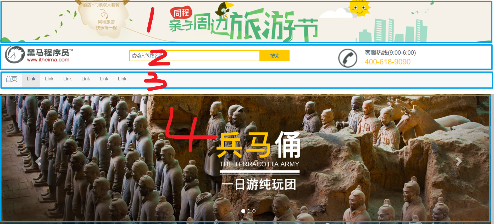
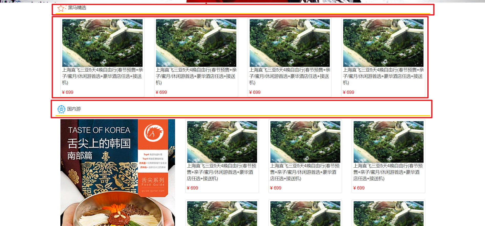
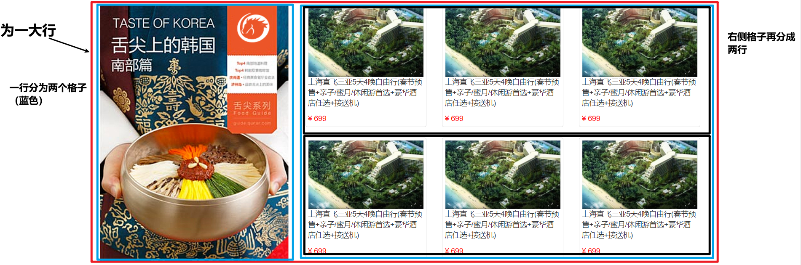

# BootStrap

>   Bootstrap是一组用于网站和网络应用程序开发的开源前端框架，包括HTML、CSS及JavaScript的框架，提供字体排印、窗体、按钮、导航及其他各种组件及Javascript扩展，旨在使动态网页和Web应用的开发更加容易。

会用即可

特点：

*   定义了很多得 CSS样式和 JS插件，可以直接使用这些样式和插件得到丰富得页面效果

*   响应式布局

    依赖于栅格系统：将一行平均分成12个格子，可以指定元素占几个格子

* 步骤：
	1. 定义容器。相当于之前的table、
		* 容器分类：
			1. container：两边留白
			2. container-fluid：每一种设备都是100%宽度
	2. 定义行。相当于之前的tr   样式：row
	3. 定义元素。指定该元素在不同的设备上，所占的格子数目。样式：col-设备代号-格子数目
		* 设备代号：
			1. xs：超小屏幕 手机 (<768px)：col-xs-12
			2. sm：小屏幕 平板 (≥768px)
			3. md：中等屏幕 桌面显示器 (≥992px)
			4. lg：大屏幕 大桌面显示器 (≥1200px)

	* 注意：
		1. 一行中如果格子数目超过12，则超出部分自动换行。
		2. 栅格类属性可以向上兼容。栅格类适用于与屏幕宽度大于或等于分界点大小的设备。
		3. 如果真实设备宽度小于了设置栅格类属性的设备代码的最小值，会一个元素沾满一整行。

### CSS样式和JS插件

1. 全局CSS样式：
  * 按钮：class="btn btn-default"
  * 图片：
    *  class="img-responsive"：图片在任意尺寸都占100%
    *  图片形状

      ：方形

       ： 圆形

       ：相框
  * 表格
  	* table
  	* table-bordered
  	* table-hover
  * 表单, 给表单项添加：class="form-control" 
2. 组件：
	* 导航条
	* 分页条
3. 插件：
	
	* 轮播图

## 案例分析

网页分析

第一部分，由4个100%宽度布局组成，4行   第4行为轮播图

第二部分

第三部分

利用栅格

最后一部分

为2行100%宽度布局

