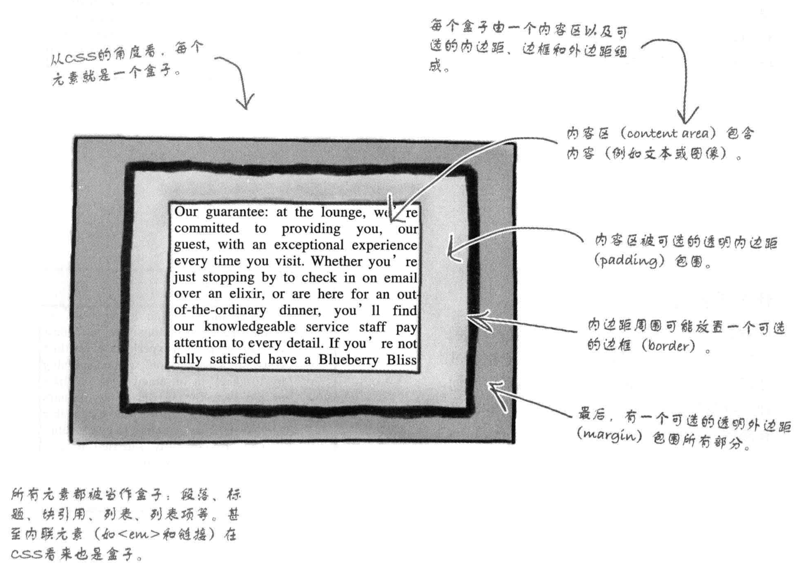
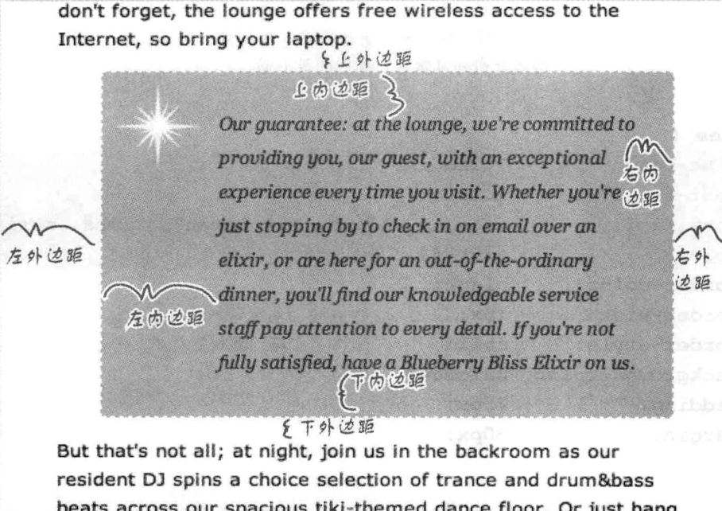

1.  HTML为一种标记语言，而HTTP为超文本传输协议

2.  typora中<html></html>前后不可有空格，缩写必须规范

3.  注意单词拼写

4.  href 超链接

5.  img src 链接图片

6.  美女图片可以提高生产力

7.  web为服务器，实际上也是计算机

8.  <a href =“object">  object可以是单词，图片，一段话，任意对象

9.    . 表示当前目录    ../  表示上一级目录     ../../ 表示上上级目录    

10.    page--90

       ​                                                                                                                  ——2020.02.21
       

Day02
       
1.  target属性

2.  《a target = "_ blank" href = "beverages/elixir.html"》显示文本《/a》

3.  2中链接点击后可在新窗口显示内容，注意空格

4.  《a》这里可以为任意对象</a>

5.  通过id 来链接跳转到指定位置

    《a href = "../Starbuzz.html#chai"》See Chai Tea</a>链接

    《h2 id = "chai"》cappuccino《/h2》转到指定位置

6.  img 图片处理

7.  jpg照片和复杂图片使用，有损

8.  PNG GIF 单色图像，logo，几何图形使用，无损，可建立透明，简单图像

9.  颜色丰富的照片通过jpg，png

10.  img元素

11.  src 指定了图像在web页面上的位置

12.  

13.  alt 为候选格式(必须有)，当图片无法显示时，出现后面文本（用于说明替代图像）

14.  img指向的内容可以是url地址

15.  浏览器像素一般为800宽，图像宽最好小于800，logo最好在100到200

16.  可以通过<a>与用缩略图来链接原图

17.  《a target ="_blank" href = "picture.html"》《img src = "tomato_little.jpg" alt = "An iPod in downtown  Seattle, WA"》《/a》

18.  为内联元素，前后无需换行

19.  page—202

        																															——2020.02.22
     
     

Day--03

1.  <a target = "_blank"href = "beverages/elixir.html">elixirs</a>

2.   target ,href两者属性间不可有空格，逗号

3.  html规范

4.  一定一<!doctype> 开头

5.  《!doctype html》为<>

6.  所有元素都在《head》与《body》中

7.  《meta charset =“utf_8”》必须有，在《head》属性中

8.  《head》元素必须有《title》元素，只能有《meta》《title》《style》三种元素

9.  嵌套时要当心

10.  CSS

11.  格式

12.  元素名{样式}

13.  p{  background-color: red}

14.  将CSS 放在《style》之间

15.  外部样式链接 .css文件

16.  CSS文件不可与渲染文件同名

17.  在《head》中添加《link type=“text/css” rel="stylesheet"herf="文件名.css"》

18.  改变字体关键字font-family

19.  推荐标题使用font-family: sans-serif;

20.  class 装饰

21.  元素名.class名｛  : ;}

22.  p.greentea{color:green;}

23.  《p class="greentea"》

24.  .class名可以选中所有属于类的元素

25.  对《em》的装饰

26.  《em》｛｝

27.  CSS中的一些属性操作

28.  font-weight 文本粗细

29.  left 指定元素左边所在位置

30.  line-height 行间距

31.  fone-size 文本大小(14px)

32.  top 元素顶部位置

33.  font-style 

34.  list-style列表外貌

35.  background-image 在元素后面放个图像

36.  color文本颜色

37.  text-decoration: underline;文本风格

38.  有5个字体系列

39.  Sans-serif系列

40.  Verdana, Arial Black, Trebuchet MS, Arial, Geneva(无衬线，易识读)

41.  Serif系列

42.  Times, Times New Roman, Georgia(有衬线)

43.  Monospace系列(用于显示代码)

44.  Courier， Courier New， Andale Mono

45.  Cursive系列(类似手写)

46.  Cominc Sans，Apple Chancery

47.  Fantasy系列(独特风格)

48.  LAST NINJA, Impact

49.  指定字体

50.  font-family: Verdana, Geneva,sans-serif;

51.  这里指定了2种字体：Verdana，Geneva

52.  若Verdana不可用，则用Geneva

53.  若均无，则用 sans-self

54.  font-family:后有多词字体时，用引号“Time New Roman”

55.  最后的字体系列最好为 Sans-serif(浏览器默认字体)

56.  page --329

     ​																																——2020.02.24

Day04

1.   font-size: 1,2em

2.  表示字体大小比例

3.  h2{font-size: 1.2em;}		

4.  表示h2是父类元素的1.2倍大

5.  关键字指定大小

6.  xx-small  x-smal  small medium large  x-large xx-large

7.  通常为small （12像素）

8.  普遍方法：

9.  选择关键字作为body 的大小， 再用em 或是百分数 确定其他元素的大小

10.  改变字体粗细

11.  font-weight

12.  设置为粗体

13.  fon-weight: bold;

14.  解除继承父类的粗体

15.  font-weight: normal;

16.  斜体

17.  font-style: italic ,oblique;

18.  字体颜色设置

19.    十六进制码为最常用

20.   boby{background-color: silver;}

21.   指定比例

22.   body{background-color: rgb(80%, 40%, 0%); }

23.   指定数值

24.   body{background-color: rgb(204, 102, 0);}

25.   十六进制表示

26.   由#红绿蓝分量组成

27.   #cc6600

28.   cc = 12*10 + 12  (十六进制)

29.   表示0到255

30.   若两位数相同，可缩写

31.   如： #cc6600  为  #c60

32.   文本装饰

33.   为文本添加一些特色效果

34.   在em 元素上加划线

35.   em{text-decoration: line-through; }

36.   使em元素有一个下划线，一个上划线

37.   em{text-decoration: underline overline

38.   去除装饰

39.   em{text-decoration: none;}

40.   page–367

      ​			  																												——2020.02.24

Day—05

1.  每个元素均为一个盒子
<!doctype html>
<html>
	<head>
	<meta charset="utf-8">
	</head>
	<body>
	<p>
	</p>
	</body>
</html>


1.  内容区， 内边距， 边框， 外边框
2.  可以决定边框的有无，颜色，是否透明，虚实线，圆边角
3.  边框距离，形状
4.  border 边界
5. 
<!doctype html>
<html>
	<head>
	<meta charset="utf-8">
	</head>
	<body>
	<p> 
	</p>
	</body>
</html>

6.  border-color width style
7.  padding内容
8.  padding  25px像素的内边距  left只在左边加边距
9.  margin 外边距  
10.  背景图像 background-image: url(image/background.gif)
11.  与img 单独显示不同
12.  修正背景图像
13.  background-repeat: no-repeat  背景图像不重复
14.  background-position: top left  图像靠左
15.  border-style
16.  控制边框的效果
17.  solid实线    double双线   outset外凸  dotted虚线   dashed 破折线  inset 内凹 ridge 脊线
18.  边框宽度border-width: thin medium thick 5px
19.  边框颜色border-color: red      rgb(100%, 0%, 0%)      #ff0000
20.  border-top|bottom|right|left-color|style|width
21.  指定边框圆角
22.  border-radius: 15px;   值越大，曲度越大
23.  border-(top-left|top-right|bottom-right|bottom-left)-radius:3em;（相对于字体大小）
24.  class与id 的区别
25.  id只能选择页面中的一个元素匹配
26.  能用id 最好用id
27.  使用多个样式表时，顺序决定优先级，在后面的优先级大
28.  让页面适应多个终端（phone，ipad，pc，TV）
29.  添加media属性
30.  在《head》中加入
31.  《link href=“lounge-mobile.css” rel=”stylesheet” media=”screen and (max-device-width: 480px)”》
32.  max-device-width屏幕的最大宽度
33.  min-device-width屏幕的最小宽度
34.  media=“print” 匹配打印机
35.  显示方向orientation（ipad）
36.  横向landscape    纵向portrait
37.  media=“screen and (max-device-width:1024px) and (orientation.portrait)”纵向
38.  media=“screen and (max-device-width:1024px) and (orientation.landscape)”横向
39.  还可在样式表中加入@media规则
40.  @media  screen and (min-device-width:  482px) {#guarantee{margin-right: 350px;}}
41.  page----412


1.  伪类 div（容器）
2.  封装元素，封装逻辑区，逻辑块（有联系的元素）
3.  让有联系的元素作为一个整体，来附加样式
4.  为div 元素添加 id 来控制样式
5.  div 可以嵌套
6.  div 会使页面更加简洁，而不是复杂
7.  简写
8.  内边距padding: 0px 20px 30px 10px;   上 右  下 左
9.  边距相同 padding: 30px;
10.  外边距margin: 0px 20px 30px 10px;   上  右   下 左
11.  上下相同  左右相同 margin: 0px 20px;  上下  左右
12.  边框属性  border:  thin solid #007e7e; 顺序可变
13.  background: white url(images/photo.jpg)  repeat-x;
14.  font: style variant weight size/height font-family(前三个值可选)
1.  span
2.  创建内联字符和元素的逻辑分组
3.  特点：不用换行，改变格式，不是强调
4.  span的样式可以指定
19.  链接的文字在未点击，点击后，触碰时的颜色可以指定


1.  层叠（作者，读者，浏览器的样式表层叠在网页上，对元素的属性争夺决定权

2.  浏览器通过筛选样式，按作者，读者，浏览器的顺序排，特定值大的胜出

3.  若未找到匹配属性，则用继承，浏览器的默认值

4.  流

5.  元素流(元素如同液体一样，在彼此之间滑动，当float出一个元素时，其他的流动并环绕它)

6.  当浏览器并排放两个元素时，图像会被当做内联元素

7.  上下放时，会折叠他们的外边框，以大的为准

8.  内联元素通常为图像设置外边距

9.  float

10.  是尽可能的向远地左右浮动元素

11.  clear

12.  解决元素重叠问题

13.  clear:right;右边不允许有浮动内容

14.  在页面上绝对定位元素

15.  ```
     #sidebar {
     		position: absolute;   #指定元素为绝对定位
     		#一般的，position 的默认值为static（静态）
     		top:	100px;		#距离页面上边100px（可用百分数指定）
     		right:	200px;		#距离页面右边200px（800px的浏览器，10%代表距离80px；
     		width:	280px;
     }
     ```

16.  不对其他元素流造成影响

17.  绝对元素的z-index 属性决定谁显示在上面

### 

### 为表格显示增加HTML结构

-   将表格包含的内容放入一个div中

-   创建一个div，将逻辑分割

-   div中的每个div都是一行

#### display属性

>   display: table;     div元素为表格
>
>   display: table-row； 元素为表格的第一行
>
>   元素位于第几列由出现的先后顺序决定

#### bordeer-spacing属性

指定与其他单元格的边距（为外边距）

#### vertical-align:属性

vertical-align: top/  与上边，中间，下边，左边，右边对齐

#### 修正边距

margin 属性

### CSS布局工具箱

#### 浮动布局

float浮动元素，扩展浏览器窗口时，页面中的内容会扩展以适应页面。

必须指定宽度，不可为auto

#### 凝胶布局

通过一个固定大小的div ，利用auto属性允许外边距扩展。

内容在中央

#### 冻结布局

其中内容宽度固定，不会随着浏览器窗口

#### 表哥显示布局

-   将表格包含的内容放入一个div中
-   创建一个div，将逻辑分割
-   div中的每个div都是一行

### 定位方式

#### 静态定位

默认的定位方式，将元素放在页面的正常流中。

#### 绝对定位

将元素放在任意位置，如果嵌套在另一个定位元素中，则会相对于外包元素定位

#### 固定定位

相对于浏览器窗口定位，页面滚动，元素不会动，其他内容会正常滚动。

#### 相对定位

正常的流入页面，然后按指定的量偏移，从而流出他们所在的空间。

left, right , top, bottom  是指距离正常流中的该元素位置的偏移量。

>   使用绝对，固定，相对定位时，
>
>   属性top  right  bottom  left  可以用来指定元素位置的


## HTML5

>   作为HTML的最终版本，简化了规则，增加了新元素新属性

新元素

-   《header》页眉，首部区域
-   《aside》主内容的旁边的内容，边栏，引用
-   《mark》突出显示文本
-   《article》新闻报道，博客帖子，独立内容
-   《section》定义文档的主要区块
-   《nav》将用于导航的链接组织到一起
-   《progress》显示任务完成进度
-   《footer》 底部，页脚
-   《meter》显示某个范围的度量，温度计的数值，速度的数值
-   《audio》包含声音内容
-   《time》 显示时间
-   《canvas》显示用javaScript绘制的图像和动画
-   《figure》定义照片，图表，代码，独立的内容
-   《video》视频


#### 元素video

《video controls autoplay width="521" height="288" src="douyin.ogv"》《/video》

与链接类似

视频格式问题

>   Safari     .mp4
>
>   Google  Chrome		.webm		src属性替换为src=“douyin.webm”
>
>   Firfox		Opera		..ogv

##### video的属性

-   controls  提供播放控件（声音大小，进度条，全屏）
-   autoplay  自动播放
-   以上两个属性为布尔属性，无值
-   width height 宽度，高度
-   src  视频的源位置
-   poster=“.jpg”     提供视频封面
-   preload    为none时，在播放之前不下载视频，为metadata下载视频元数据，不是内容，为auto，浏览器决定

若宽度高度与视频的大小不合适，会出现黑边

##### 视频格式

-   WebM容器： Vp8视频编码，Vorbis音频编码        .webm
-   MP4容器：   H.264 视频编码，AAC音频编码    .mp4
-   Ogg容器：    Theora，  Vorbis        .ogv

为了适应不同的浏览器，最好为

>   《video controls autoplay width="521" height="288" 
>
>   ```css
>   				《source src=“video/douyin.mp4”》
>   
>   				《source src=“video/douyin.webm”》
>   
>   				《source src=“video/douyin.ogv”》
>   ```
>
>   《p》若浏览器不支持上面的格式，则显示此行文字《/p》
>
>   《/video》

为了具体指定视频格式

>   《source src=“video/douyin.mp4”  type= ’ video/mp4;  codecs=“theora, vorbis”  ’ 》

type包含  MIME类型（容器格式）  ，参数

type为浏览器提供提示，指定类型

codecs为浏览器提供视频的视频编码音频编码

## 建立表格

### 表格的组成

>   表头       列  行     单元格
>
>   《caption》定义一个标题
>
>   《table》 定义一个表格
>
>   《tr》定义行
>
>   《th》定义某一列的表头
>
>   《td》定义单元格   若无内容 仍需要占一个空格

### table表格元素

-   border-collapse: collapse    使表格窗格变为一个
-   nth-child 伪类    nth-child(even) 偶数行上色， nth-child(odd)奇数行上色
-   也可以用表达式，(2n)  (2n+1)
-   只能在《style》渲染？

#### rowspan属性，让单元格跨越多行

-   《td  rowspan=”2“》。。。。。《/td》

#### colspan属性，让单元格跨越多列

-   《td colspan=“2”》。。。。。《/td》

#### 表格可以嵌套

```css
<td>
	<table class="t_first">
		<tr>
			<th>Tess</th>
			<td>4/5</td>
		</tr>
		<tr>
			<th>Tony</th>
			<td>5/5</td>
		</tr>
	</table>
</td>
```

### li元素

#### 关于列表标记

```
li{
	list-style-type: disc;      #disc是默认的列表标记
}
li{
	list-style-type;		#提供圆形标记
}
li{
	list-style-type:square;		#提供一个方块标记
}
li{
	list-style-type:none;		#去除所有列表标记
}
```

#### 定制标记

```
li{
	list-style-image: url(photo/dream.jpg);
	padding-top: 5px;
	margin-left: 20px;
}
```

**有序列表的样式控制与无序相同**

#### 

#### position属性

**list-style-positon:inside;  文字在标记下回绕**

-   list-style-positon:inside;  文字在标记下回绕list-style-positon:inside;  文字在标记

list-style-positon:inside;  文字在标记下回绕

**list-style-positon:outside;  文字在文字下回绕**

-   **list-style-positon:outside;  文字在文字下回绕****list-style-positon:outside;  文字在文字下回绕****list-style-positon:outside;  文字在文字下回绕**

## HTML表单，实现交互

### form元素

```
<form action="http://.com/脚本所在文件夹/服务器脚本" method="POST">
</form>
```

### 表单里的内容

```
<form action=".php" method="POST">
		<p> Just in your name (and click Submit) to enter the contest;</br>
			#text<input>用于输入一行文本
			First name:<input type="text" name="firstname" value=""></br>
			Last name:<input type="text" name="lastname" value=""></br>
			#submit<input>元素创建一个按钮，进行表单交互
			<input type="submit">
			
			#radio<input>元素创建了多个按钮的控件，单选
			<input type="radio" name="hotrnot" value="hot">
			<input type="radio" name="hotrnot" value="not">
			
			#checkbox<input>创建一个多选按钮的控件
			<input type="checkbox" name="spice" value="Salt">
			<input type="checkbox" name="spice" value="Pepper">
            <input type="checkbox" name="spice" value="Garlic">
            
            #<textarea>创建一个多行文本区（带滚动条）
            <textarea name="comments" rows="10" cols="48">
            </textarea>
            
            #<select>元素创建菜单控件
            #<option>元素便是各个菜单项
            <select name="菜单名字">
            	<option value="red">apple</option>
            	<option value="yellow">banana</option>
            	<option value="green">peach</option>
            </select>
            #number<input>只能输入数字,使用min,max限制范围
            <input type="number" min="0" max="20">
            
            #range 创建一个滑动条
            <input type="range" min="0" max="20" step="5">
            
            #color颜色选择器
            <input type="color">
            
            #date日期输入,选择器
            <input type="date">
            
            #email,tel,url输入器
            <input type="email">
            <input type="teil">
            <input type="url">
		</p>
		</form>	
```

### 两种不同的交互方法：GET     POST

POST 打包表单变量，发送给服务器

-   处理订单之类无需重复操作的页面
-   数据私有，保密
-   若输入数据过大过多，必须用POST

GET打包表单变量，将数据追加到URL最后，然后向服务器发送请求

-   用户可以为页面添加书签
-   输入数据以明文在url后面出现（不安全）