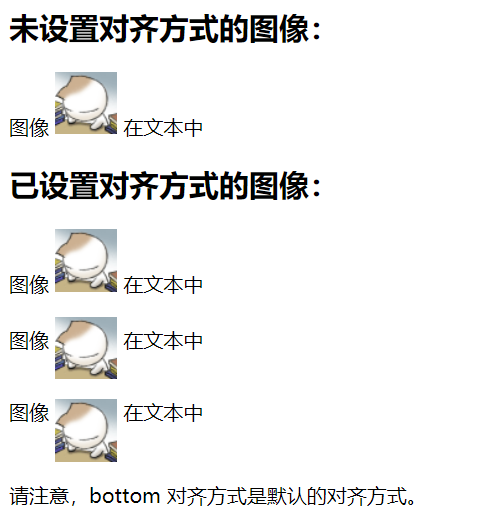
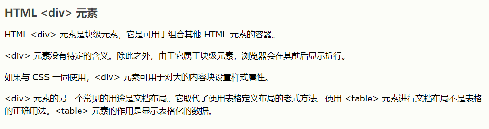
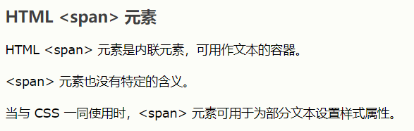

# HTML

>   HTML为一种标记语言，而HTTP为超文本传输协议
>
>   HTML5 为HTML系列的最终版本
>
>   需要声明<!doctype html>
>
>   对大小写不敏感

## 主体

```HTML
<!doctype html>
<html>
	<head>
		<meta charset = "utf-8">
		<title></title>
	</head>
	<body>
	</body>
</html>

<head>
    之中必须有编码声明，标题
</head>
```


## 基本元素

```html
标题
通过<h1> 到 <h6>来定义
<h1>This is a heading</h1>

段落通过<p></p>来定义
连接通过<a>来定义
<a href="http://www.w3school.com.cn">This is a link</a>
图像通过来定义

. 表示当前目录    ../  表示上一级目录     ../../ 表示上上级目录   
```

## HTML 元素

HTML 元素指的是从开始标签（start tag）到结束标签（end tag）的所有代码。

| 开始标签                | 元素内容            | 结束标签 |
| :---------------------- | :------------------ | :------- |
| <p>                     | This is a paragraph | </p>     |
| <a href="default.htm" > | This is a link      | </a>     |
| <br />                  |                     |          |

**注释：**开始标签常被称为开放标签（opening tag），结束标签常称为闭合标签（closing tag）。

## 空的 HTML 元素

没有内容的 HTML 元素被称为空元素。空元素是在开始标签中关闭的。

《br> 就是没有关闭标签的空元素（《br> 标签定义换行）。

在 XHTML、XML 以及未来版本的 HTML 中，所有元素都必须被关闭。

在开始标签中添加斜杠，比如 《br />，是关闭空元素的正确方法，HTML、XHTML 和 XML 都接受这种方式。

即使 《br> 在所有浏览器中都是有效的，但使用 《br /> 其实是更长远的保障。


## HTML 属性

HTML 标签可以拥有*属性*。属性提供了有关 HTML 元素的*更多的信息*。

属性值应该始终被包括在引号内。双引号是最常用的，不过使用单引号也没有问题

```html
<h1 align="center">
<body bgcolor="yellow"> 
<table border="1">
```

## HTML 水平线

《hr /》 标签在 HTML 页面中创建水平线。

<hr/>

hr 元素可用于分隔内容。

## HTML 注释

可以将注释插入 HTML 代码中，这样可以提高其可读性，使代码更易被人理解。浏览器会忽略注释，也不会显示它们。

注释是这样写的：

### 实例

```html
<!-- This is a comment -->
<!-->定义注释
```

## HTML 的 style 属性

style 属性的作用：

**提供了一种改变所有 HTML 元素的样式的通用方法。**

## HTML 样式实例 - 字体、颜色和尺寸

font-family、color 以及 font-size 属性分别定义元素中文本的字体系列、颜色和字体尺寸：

```html
<html>

<body>
<!--font-family、color 以及 font-size 属性分别定义元素中文本的字体系列、颜色和字体尺寸-->
<h1 style="font-family:verdana">A heading</h1>
<!--text-align 属性规定了元素中文本的水平对齐方式-->
<h1 style="text-align:center">This is a heading</h1>
<p style="font-family:arial;color:red;font-size:20px;">A paragraph.</p>
</body>

</html>
```

## 文本格式化标签

| 标签     | 描述           |
| :------- | :------------- |
| <b>      | 定义粗体文本。 |
| <big>    | 定义大号字。   |
| <em>     | 定义着重文字。 |
| <i>      | 定义斜体字。   |
| <small>  | 定义小号字。   |
| <strong> | 定义加重语气。 |
| <sub>    | 定义下标字。   |
| <sup>    | 定义上标字。   |
| <ins>    | 定义插入字。   |
| <del>    | 定义删除字。   |

## 引用、引用和术语定义

| 标签         | 描述               |
| :----------- | :----------------- |
| <abbr>       | 定义缩写。         |
| <acronym>    | 定义首字母缩写。   |
| <address>    | 定义地址。         |
| <bdo>        | 定义文字方向。     |
| <blockquote> | 定义长的引用。     |
| <q>          | 定义短的引用语。   |
| <cite>       | 定义引用、引证。   |
| <dfn>        | 定义一个定义项目。 |

## HTML 引用

```html
HTML <q> 用于短的引用
HTML <blockquote> 元素定义被引用的节。
浏览器通常会对 <blockquote> 元素进行缩进处理。

HTML <abbr> 元素定义缩写或首字母缩略语。
对缩写进行标记能够为浏览器、翻译系统以及搜索引擎提供有用的信息。
<abbr title="World Health Organization">WHO</abbr>
    
用于定义的 HTML <dfn>
HTML <dfn> 元素定义项目或缩写的定义。
<dfn> 的用法，按照 HTML5 标准中的描述，有点复杂：
<dfn title="World Health Organization">WHO</dfn> 
    
HTML <cite> 元素定义著作的标题。
浏览器通常会以斜体显示 <cite> 元素。

用于双向重写的 HTML <bdo>
HTML <bdo> 元素定义双流向覆盖（bi-directional override）。
<bdo> 元素用于覆盖当前文本方向：
```


### HTML ** 元素定义*数学变量*：

```html
<p>Einstein wrote:</p>
<p><var>E = m c<sup>2</sup></var></p>
```

<p>Einstein wrote:</p>
<p><var>E = m c<sup>2</sup></var></p>


## HTML中的CSS

### 外部样式表

当样式需要被应用到很多页面的时候，外部样式表将是理想的选择。使用外部样式表，你就可以通过更改一个文件来改变整个站点的外观。

```HTML
<head>
<link rel="stylesheet" type="text/css" href="mystyle.css">
</head>
```

### 内部样式表

当单个文件需要特别样式时，就可以使用内部样式表。你可以在 head 部分通过 <style> 标签定义内部样式表。

```HTML
<head>
<style type="text/css">
body {background-color: red}
p {margin-left: 20px}
</style>
</head>
```

| 标签       | 描述                                                         |
| :--------- | :----------------------------------------------------------- |
| <style>    | 定义样式定义。                                               |
| <link>     | 定义资源引用。                                               |
| <div>      | 定义文档中的节或区域（块级）。                               |
| <span>     | 定义文档中的行内的小块或区域。                               |
| <font>     | 规定文本的字体、字体尺寸、字体颜色。不赞成使用。请使用<style> |
| <basefont> | 定义基准字体。不赞成使用。请使用<style>                      |
| <center>   | 对文本进行水平居中。不赞成使用。请使用<style>                |


## HTML 链接语法

链接的 HTML 代码很简单。它类似这样：

```html
<a href="url">Link text</a>
href 属性规定链接的目标。
开始标签和结束标签之间的文字被作为超级链接来显示。
<a href="http://www.w3school.com.cn/">Visit W3School</a>
"链接文本" 不必一定是文本。图片或其他 HTML 元素都可以成为链接

使用 Target 属性，你可以定义被链接的文档在何处显示。
下面的这行会在新窗口打开文档：
<a href="http://www.w3school.com.cn/" target="_blank">Visit W3School!</a>
```

## HTML 链接 - name 属性

name 属性规定锚（anchor）的名称。

您可以使用 name 属性创建 HTML 页面中的书签。

书签不会以任何特殊方式显示，它对读者是不可见的。

当使用命名锚（named anchors）时，我们可以创建直接跳至该命名锚（比如页面中某个小节）的链接，这样使用者就无需不停地滚动页面来寻找他们需要的信息了。

### 命名锚的语法：

```html
<a name="label">锚（显示在页面上的文本）</a>
```

**提示：**锚的名称可以是任何你喜欢的名字。

**提示：**您可以使用 id 属性来替代 name 属性，命名锚同样有效。

```html
首先，我们在 HTML 文档中对锚进行命名（创建一个书签）：
<a name="tips">基本的注意事项 - 有用的提示</a>
然后，我们在同一个文档中创建指向该锚的链接：
<a href="#tips">有用的提示</a>
您也可以在其他页面中创建指向该锚的链接：
<a href="http://www.w3school.com.cn/html/html_links.asp#tips">有用的提示</a>
```

<!doctype html>
<html>
	<head>
		<meta charset = "utf-8">
		<title></title>
	</head>
	<body><a href="http://www.w3school.com.cn/html/html_links.asp#tips">有用的提示</a>
	</body>
</html>
## HTML图像

>   **gif 和 jpg 文件均可用作 HTML 背景**
>
>   **如果图像小于页面，图像会进行重复**

在 HTML 中，图像由  标签定义。

 是空标签，意思是说，它只包含属性，并且没有闭合标签。

要在页面上显示图像，你需要使用源属性（src）。src 指 "source"源。源属性的值是图像的 URL 地址。

定义图像的语法是：

```html

alt 属性用来为图像定义一串预备的可替换的文本。替换文本属性的值是用户定义的

```

```html
<html>

<body>

<h2>未设置对齐方式的图像：</h2>

<p>图像  在文本中</p>

<h2>已设置对齐方式的图像：</h2>

<p>图像  在文本中</p>

<p>图像  在文本中</p>

<p>图像  在文本中</p>

<p>请注意，bottom 对齐方式是默认的对齐方式。</p>

    图像浮动在文字两侧
<p>
 
带有图像的一个段落。图像的 align 属性设置为 "left"。图像将浮动到文本的左侧。
</p>

<p>
 
带有图像的一个段落。图像的 align 属性设置为 "right"。图像将浮动到文本的右侧。
</p>

</body>
</html>
```




### 图像标签

| 标签     | 描述                         |
| :------- | :--------------------------- |
| 《img》  | 定义图像。                   |
| 《map》  | 定义图像地图。               |
| 《area》 | 定义图像地图中的可点击区域。 |


## HTML 表格

表格由 <table> 标签来定义。每个表格均有若干行（由 <tr> 标签定义），每行被分割为若干单元格（由 <td> 标签定义）。字母 td 指表格数据（table data）

```html
<table border="1">
<tr>
<td>row 1, cell 1</td>
<td>row 1, cell 2</td>
</tr>
<tr>
<td>row 2, cell 1</td>
<td>row 2, cell 2</td>
</tr>
</table>
```

<!doctype html>
<html>
	<head>
		<meta charset = "utf-8">
		<title></title>
	</head>
	<body>
		<table border="1">
<tr>
<td>row 1, cell 1</td>
<td>row 1, cell 2</td>
</tr>
<tr>
<td>row 2, cell 1</td>
<td>row 2, cell 2</td>
</tr>
</table>
	</body>
</html>

### 表格和边框属性

```html
表格的表头使用 <th> 标签进行定义
border 定义一个边框
<table border="1">
<tr>
<th>Heading</th>
<th>Another Heading</th>
</tr>
<tr>
<td>Row 1, cell 1</td>
<td>Row 1, cell 2</td>
</tr>
</table>
```

### 表格中的空单元格

在一些浏览器中，没有内容的表格单元显示得不太好。如果某个单元格是空的（没有内容），浏览器可能无法显示出这个单元格的边框。

```html
<table border="1">
<tr>
<td>row 1, cell 1</td>
<td>row 1, cell 2</td>
</tr>
<tr>
<td></td>
<td>row 2, cell 2</td>
</tr>
</table>
```

浏览器可能会这样显示：


**注意：**这个空的单元格的边框没有被显示出来。为了避免这种情况，在空单元格中添加一个**空格占位符**，就可以将边框显示出来。

```html
<table border="1">
<tr>
<td>row 1, cell 1</td>
<td>row 1, cell 2</td>
</tr>
<tr>
<td>&nbsp;</td>
<td>row 2, cell 2</td>
</tr>
</table>
```

在浏览器中显示如下：

| row 1, cell 1 | row 1, cell 2 |
| ------------- | ------------- |
|               | row 2, cell 2 |

## 表格标签

| 表格         | 描述                   |
| :----------- | :--------------------- |
| 《table》    | 定义表格               |
| 《caption》  | 定义表格标题。         |
| 《th》       | 定义表格的表头。       |
| 《tr》       | 定义表格的行。         |
| 《td》       | 定义表格单元。         |
| 《thead》    | 定义表格的页眉。       |
| 《tbody》    | 定义表格的主体。       |
| 《tfoot》    | 定义表格的页脚。       |
| 《col》      | 定义用于表格列的属性。 |
| 《colgroup》 | 定义表格列的组。       |

## HTML 列表

**HTML 支持有序、无序和定义列表**

```html
无序列表是一个项目的列表，此列项目使用粗体圆点（典型的小黑圆圈）进行标记
<ul>
<li>Coffee</li>
<li>Milk</li>
</ul>

有序列表也是一列项目，列表项目使用数字进行标记
<ol>
<li>Coffee</li>
<li>Milk</li>
</ol>
```

### 定义列表

自定义列表不仅仅是一列项目，而是项目及其注释的组合。

自定义列表以 <dl> 标签开始。每个自定义列表项以 <dt> 开始。每个自定义列表项的定义以 <dd> 开始。

```html
<dl>
<dt>Coffee</dt>
<dd>Black hot drink</dd>
<dt>Milk</dt>
<dd>White cold drink</dd>
</dl>
```
<!doctype html>
<html>
	<head>
		<meta charset = "utf-8">
		<title></title>
	</head>
	<body>
	<dl>
<dt>Coffee</dt>
<dd>Black hot drink</dd>
<dt>Milk</dt>
<dd>White cold drink</dd>
</dl>
	</body>
</html>


## HTML 块元素

大多数 HTML 元素被定义为块级元素或内联元素。

“块级元素”译为 block level element，“内联元素”译为 inline element。

块级元素在浏览器显示时，通常会以新行来开始（和结束）。

例子：

```
<h1>, <p>, <ul>, <table>
```


### 内联元素

```
例子：<b>, <td>, <a>, 
```

### 《div》《span》


			**定义文档中的分区或节**



**定义 span，用来组合文档中的行内元素**


## HTML 类

>   对 HTML 进行分类（设置类），使我们能够为元素的类定义 CSS 样式。

```html
<!DOCTYPE html>
<html>
<head>
<style>
.cities {
    background-color:black;
    color:white;
    margin:20px;
    padding:20px;
} 
</style>
</head>
<body>
<div class="cities">
<h2>London</h2>
<p>
London is the capital city of England. 
It is the most populous city in the United Kingdom, 
with a metropolitan area of over 13 million inhabitants.
</p>
</div> 
</body>
</html>
```

<!DOCTYPE html>
<html>
<head>
<style>
.cities {
    background-color:black;
    color:white;
    margin:20px;
    padding:20px;
} 
</style>
</head>
<body>
<div class="cities">
<h2>London</h2>
<p>
London is the capital city of England. 
It is the most populous city in the United Kingdom, 
with a metropolitan area of over 13 million inhabitants.
</p>
</div> 
</body>
</html>

## HTML5 的网站布局

>   HTML5 提供的新语义元素定义了网页的不同部分
>

### HTML5 语义元素

| header  | 定义文档或节的页眉             |
| ------- | ------------------------------ |
| nav     | 定义导航链接的容器             |
| section | 定义文档中的节                 |
| article | 定义独立的自包含文章           |
| aside   | 定义内容之外的内容（比如侧栏） |
| footer  | 定义文档或节的页脚             |
| details | 定义额外的细节                 |
| summary | 定义 details 元素的标题        |

<!DOCTYPE html>
<html>
<head>
<style>
.cities {
    background-color:black;
    color:white;
    margin:20px;
    padding:20px;
} 
</style>
</head>
<body>
<div class="cities">
<h2>London</h2>
<p>London is the capital city of England. 
It is the most populous city in the United Kingdom, 
with a metropolitan area of over 13 million inhabitants.</p>
</div>
<div class="cities">
<h2>Paris</h2>
<p>Paris is the capital and most populous city of France.</p>
</div>
<div class="cities">
<h2>Tokyo</h2>
<p>Tokyo is the capital of Japan, the center of the Greater Tokyo Area,
and the most populous metropolitan area in the world.</p>
</div>
</body>
</html>


## 使用表格的 HTML 布局

**注释：**<table> 元素不是作为布局工具而设计的。

<table》元素的作用是显示表格化的数据。

使用 <table》元素能够取得布局效果，因为能够通过 CSS 设置表格元素的样式：

<!DOCTYPE html>
<html>
<head>
<style>
table.lamp {
    width:100%;
    border:1px solid #d4d4d4;
}
table.lamp th, td { 
    padding:10px;
}
table.lamp th {
    width:40px;
}
</style>
</head>
<body>
<table class="lamp">
<tr>
  <th>
    
  </th>
  <td>
    The table element was not designed to be a layout tool.
  </td>
</tr>
</table>
</body>
</html>

## HTML 响应式 Web 设计

>   所谓响应式Web设计，就是网页内容会随着访问它的视口及设备的不同而呈现不同的样式。
>
>   不管你用什么终端访问网页，URL都是一个

-   RWD 指的是响应式 Web 设计（Responsive Web Design）
-   RWD 能够以可变尺寸传递网页
-   RWD 对于平板和移动设备是必需的

在做响应式Web设计的时候采用逐步增强的模式进行开发，先让你的移动网站支持手机竖屏→支持用户横屏行为→支持各种屏幕大小的手机→支持不同系统版本的手机（主要是android设备和ios设备）→支持pad平板→……

-   其实响应式Web设计的方法很简单，就是利用CSS3的媒体查询Media Queries和Viewport来解决问题的

通过媒体查询的设置，我们可以根据屏幕宽度、屏幕方向等各个属性来加载不同场景下不同的CSS文件来渲染页面的视觉风格。具体的使用方法有以下两种：

1.  通过link标签：

```html
<link rel="stylesheet" type="text/css" media="screen and (max-width: 479px)" href="testcssbywidth1.css" />
```

2.  示例代码代表当当前屏幕宽度小于479px的时候，加载testcssbywidth1.css文件来渲染页面。

CSS中直接设置：

```css
@media screen and (max-width:479px) {
    　　/* 具体的CSS属性设置 */
}

```

### Media Queries的一些常用属性

-   width：描述终端设备显示区域的宽度，接受max/min的前缀；

-   height：描述终端设备显示区域的高度，接受max/min的前缀；

-   device-width：描述终端设备屏幕的宽度，接受max/min的前缀；

-   device-height：描述终端设备屏幕的高度，接受max/min的前缀；

-   orientation：描述终端设备处于横屏还是竖屏的状态，取值分别为：landscape/portrait。


当我们调整浏览器大小的时候，上面通过媒体查询属性的操作就可以完成响应式Web设计的工作，但是这却不能满足移动终端的浏览器，因为移动浏览器默认页面是为宽屏幕设计的，所以会把他缩小来适应小屏幕，但是终端设备却无法识别正确的宽度，所以光靠媒体查询是解决不了移动终端设备的响应式Web设计的。这个时候就必须使用viewport的meta标签来做一系列的设置

需要响应式Web设计的页面，在页面中都要加上viewport的设置：

```html
<meta name="viewport" content="width=device-width, initial-scale=1.0, 		maximum-scale=1.0, minimum-scale=1.0, user-scalable=no, target-densitydpi=device-dpi">
```


-   `width=device-width`：控制viewport的宽度，可以指定固定的值或者特殊的值，如device-width（设备宽度）。但是这个么设置有一个弊端，因为这个设置只有在竖屏状态下有效，横屏状态下，返回的却还是和竖屏状态下一样的宽度。

-   `initial-scale=1.0`：告诉浏览器初始化页面时不要对页面进行任何缩放的操作。

-   `maximum-scale=1.0`：告诉浏览器阻止页面放大，但是这样一来也禁止了用户手动放大或缩小页面，怎么说呢，美好的东西也会存在缺陷吧。

-   `minimum-scale=1.0`：告诉浏览器阻止页面缩小，同样带来上面的问题。

-   `user-scalable=no`：告诉浏览器禁止页面缩放。

-   `target-densitydpi=device-dpi`：分辨率的设置，通常可以取值：device-dpi（使用设备自身的dpi作为目标dp，不发生缩放）、high-dpi（使用高分辨率，中低分辨率场景下会相应缩小）、medium-dpi（使用中等分辨率，高低分辨率分别进行相应的放大和缩小，缺省值）、low-dpi（使用低等分辨率，中高分辨率相应放大）。


**通过对viewport的设置，利用Media Queries的属性设置，你就可以做出响应式的Web页面。下面开始一步一步告诉你响应式Web设计怎么开始的：**

1.  允许网页宽度自动调整：

    ​	就是在网页的中追加viewport meta的定义。

2.  选取一个标准开发出具体页面：

    比如一个页面被要求对屏幕宽度为320px、480px、640px的三种场景下进行响应式设计，这个时候正常会选取320px下的标准先进行页面开发。

3.  抽取最低标准下的CSS样式独立成外链样式文件：

    将320px下的CSS样式全部抽取成外链样式文件，响应式设计的页面HTML代码中，不要有任何CSS定义的代码。

4.  根据UEDMMs的视觉稿进行其他标准的CSS样式文件开发。

5.  通过Media Queries属性设置来定义不同场景下加载不同的CSS样式文件。


### HTML响应式Web设计

1、  轻量级的Javascript库：

针对PC端网页当然会首选jQuery来作为前端javascript库，但是针对移动端来说，jQuery太重，而现在针对移动端来说，有很多优秀的框架可供使用，jQuery Mobile、YUI、XUI等是不错的框架，但是个人比较倾向于zepto。不过zepto预定义的一些事件，比如触屏滑动的swipe事件，在ios上完美支持，但是在android上，有些浏览器确实不支持的，这时候就需要寻求与一些第三方的javascript插件库，好在现在网上有很多优秀的第三方javascript插件库可供使用，所以各位按需索取吧。

 

2、  减少HTTP请求次数：

一个页面的初始加载使用HTTP请求来操作，没有任何问题，但是页面中比如翻页、筛选之类的操作，如果再使用完整的HTTP请求来处理的话，会加大网络传输的数据量，因为移动端有一个特殊的限制，就是用户的网络流量是有限的，超过之后会要交钱的。这时候针对这些页面内部的部分操作，可以使用Ajax异步请求来完成，针对短期内不会变化的一些数据，可以使用服务器端缓存、前端缓存等机制来保存这些数据，这样可以减少用户一定的数据请求量。

 

3、  压缩Javascript和CSS：

把页面中使用的Javascript代码和CSS代码进行压缩之后会有效地减少页面大小。

在线的Javascript代码压缩工具和在线CSS代码压缩工具有很多，而我在开发中会使用下面这两个：

Javascript压缩：http://www.jscompress.com/

CSS压缩：http://www.csscompressor.com/

 

4、  使用CDN来管理页面资源：

CDN的全称是Content Delivery Network，即内容分发网络。其基本思想是尽可能避开互联网上有可能影响数据传输速度和稳定性的瓶颈和环节，使内容传输的更快、更稳定。

我们可以把一个页面上使用的外链的Javascript文件、CSS文件、固定的ICON图标和图片放在CDN上，这样在访问网页的时候可以使用户可就近取得这些资源，解决网络拥挤的状况，提高用户访问网页的相应速度。

 

5、  列表图片实现“懒”加载：

移动终端设备因为屏幕大小有限，没有必要将全屏中的图片一次性加载进来，在网页加载的时候，我们可以选择只加载一个可视屏幕中的图片，当用户进行滑动页面的时候，再加载后续剩下的图片。

这个方案其实就是现在大家都说的图片延迟加载技术，只是我们同事在开发的过程中戏称为图片的“懒”加载，其实说到底是按需加载。比如你用淘宝搜索产品，你的移动设备一屏其实只能显示5张图片，那在页面初始加载的时候只加载5张图片，用户滑动页面的时候再加载5张图片，依此类推，这样用户滑到哪里就显示到哪里。

目前网上有一些优秀的延迟加载插件，不过我在具体开发过程中没有使用第三方插件，而是自己开发的一个插件来实现这种图片的“懒”加载，后续我单独介绍我开发的这个插件。

 

6、  图片显示的优化处理：

首先先说为什么响应式Web设计的时候我们要对图片的显示进行优化处理呢？比如说现在有一张图片，如果你用低分辨率的图片，在低分辨率上显示没有问题，但是在高分辨率机器上图片就会模糊不清，影响用户视觉体验。但是如果你一开始选用一张高分辨率的图片，这样虽然可以兼顾所有机器上的视觉体验，但是针对低端机器来说是很不公平的，因为这样会白白浪费用户的网络数据流量。

那我们应该如何处理呢？解决方法就是根据用户设备的分辨率来加载不同分辨率下的不同图片，这样既能给不同终端的用户一个很好的视觉体验，又不会白白浪费用户的网络数据流量。

 

①     针对分辨率、屏幕大小来优化图片的显示，这里介绍两种方法：

第一种，将页面<image>标签的src属性中使用适用于低分辨率的图片地址，而将其他中、高分辨率的图片地址使用HTML5的data-自定义属性来隐藏；然后通过Javascript来获取浏览器窗口的大小决定加载哪一张图片，用Javascript把<image>标签的src属性替换成所需要的data-自定义属性中的图片。

第二种：将加载的图片地址使用CSS样式来定义，然后通过Media Queries媒体查询机制来决定加载哪一张图片。

②     针对Retina屏幕做专门的图片优化，同样介绍两种方法：

第一种，将页面<image>标签的src属性中使用普通图片的地址，而将Retina屏幕使用的图片地址使用HTML5的data-自定义属性来隐藏；然后通过Javascript来判断Ratio大小决定是否加载Retina图片，如需加载使用Javascript把<image>标签的src属性替换成所需要的data-自定义属性中的Retina图片。

第二种：将加载的图片地址使用CSS样式来定义，然后通过Media Queries媒体查询机制来决定加载Retina图片，判断Retina屏幕的媒体查询机制代码如下：

@media only screen and (-webkit-device-pixel-ratio: 2) {

   // 设置Retina显示图片

}

 

7、  使用对SEO友好的标签：

为了让我们的网页能够让搜索引擎更好的收录，我们需要在我们的页面中尽可能低使用对SEO友好的标签，比如<h1>、<strong>、…等


## HTML框架

>   **通过使用框架，你可以在同一个浏览器窗口中显示不止一个页面**

通过使用框架，你可以在同一个浏览器窗口中显示不止一个页面。每份HTML文档称为一个框架，并且每个框架都独立于其他的框架。

使用框架的坏处：

-   开发人员必须同时跟踪更多的HTML文档
-   很难打印整张页面

框架结构标签`<frameset>`

-   框架结构标签（<frameset>）定义如何将窗口分割为框架
-   每个 frameset 定义了一系列行*或*列
-   rows/columns 的值规定了每行或每列占据屏幕的面积

### 框架标签（Frame）

Frame 标签定义了放置在每个框架中的 HTML 文档。

在下面的这个例子中，我们设置了一个两列的框架集。第一列被设置为占据浏览器窗口的 25%。第二列被设置为占据浏览器窗口的 75%。HTML 文档 "frame_a.htm" 被置于第一个列中，而 HTML 文档 "frame_b.htm" 被置于第二个列中：

```html
<frameset cols="25%,75%">
   <frame src="frame_a.htm">
   <frame src="frame_b.htm">
</frameset>
```

<!Doctype html>
<html>
<frameset cols="25%,75%">
   <frame src="frame_a.htm">
   <frame src="frame_b.htm">
</frameset>
</html>

### 注意事项 ：

假如一个框架有可见边框，用户可以拖动边框来改变它的大小。为了避免这种情况发生，可以在 <frame> 标签中加入：noresize="noresize"。

为不支持框架的浏览器添加 <noframes> 标签。

**重要提示：**不能将 <body></body> 标签与 <frameset></frameset> 标签同时使用！不过，假如你添加包含一段文本的 <noframes> 标签，就必须将这段文字嵌套于 <body></body> 标签内。

```html
<html>

<frameset cols="25%,50%,25%">
  <frame src="/example/html/frame_a.html">
  <frame src="/example/html/frame_b.html">
  <frame src="/example/html/frame_c.html">

<noframes>
<body>您的浏览器无法处理框架！</body>
</noframes>

</frameset>

</html>
```


## HTML Iframe

>   **iframe 用于在网页内显示网页**
>
>   定义内联的子窗口（框架）

```html
添加 iframe 的语法
<iframe src="URL"></iframe>
URL 指向隔离页面的位置。

Iframe - 设置高度和宽度
height 和 width 属性用于规定 iframe 的高度和宽度。
属性值的默认单位是像素，但也可以用百分比来设定（比如 "80%"）。
<iframe src="demo_iframe.htm" width="200" height="200"></iframe>

Iframe - 删除边框
frameborder 属性规定是否显示 iframe 周围的边框。
设置属性值为 "0" 就可以移除边框：
<iframe src="demo_iframe.htm" frameborder="0"></iframe>

使用 iframe 作为链接的目标
iframe 可用作链接的目标（target）。
链接的 target 属性必须引用 iframe 的 name 属性：
<iframe src="demo_iframe.htm" name="iframe_a"></iframe>
<p><a href="http://www.w3school.com.cn" target="iframe_a">W3School.com.cn</a></p>
```


## HTML 背景

<body> 标签中的背景颜色（bgcolor）、背景（background）和文本（text）属性在最新的 HTML 标准（HTML4 和 XHTML）中已被废弃。W3C 在他们的推荐标准中已删除这些属性。

应该使用层叠样式表（CSS）来定义 HTML 元素的布局和显示属性。


## HTML 脚本

>   **JavaScript 使 HTML 页面具有更强的动态和交互性**

```html
<html>
<body>
<script type="text/javascript">
document.write("<h1>Hello World!</h1>")
</script> 
</body>
</html>
```

### HTML script 元素

**<script> 标签用于定义客户端脚本，比如 JavaScript。**

script 元素既可包含脚本语句，也可通过 src 属性指向外部脚本文件。

必需的 type 属性规定脚本的 MIME 类型。

JavaScript 最常用于图片操作、表单验证以及内容动态更新。

### **<noscript>** 标签

**<noscript>** 标签提供无法使用脚本时的替代内容，比方在浏览器禁用脚本时，或浏览器不支持客户端脚本时。

**noscript** 元素可包含普通 HTML 页面的 body 元素中能够找到的所有元素。

只有在浏览器不支持脚本或者禁用脚本时，才会显示 noscript 元素中的内容：

```html
<script type="text/javascript">
document.write("Hello World!")
</script>
<noscript>Your browser does not support JavaScript!</noscript>
```

## HTML 文件路径

>   **尽量使用相对路径**
>
>   如果使用了相对路径，那么您的网页就不会与当前的基准 URL 进行绑定。所有链接在您的电脑上 (localhost) 或未来的公共域中均可正常工作。

文件路径描述了网站文件夹结构中某个文件的位置。

文件路径会在链接外部文件时被用到：

-   网页
-   图像
-   样式表
-   JavaScript

### 绝对文件路径

绝对文件路径是指向一个因特网文件的完整 URL：

### 

```html

```

 标签以及 src 和 alt 属性在 HTML 图像这一章做了讲解。


## HTML 头部元素

### HTML <head> 元素

<head> 元素是所有头部元素的容器。<head> 内的元素可包含脚本，指示浏览器在何处可以找到样式表，提供元信息，等等。

以下标签都可以添加到 head 部分：<title>、<base>、<link>、<meta>、<script> 以及 <style>。

### HTML <base> 元素

<base> 标签为页面上的所有链接规定默认地址或默认目标（target）：

```html
<head>
<base href="http://www.w3school.com.cn/images/" />
<base target="_blank" />
</head>
```

### HTML <link> 元素

<link> 标签定义文档与外部资源之间的关系。

<link> 标签最常用于连接样式表：

```html
<head>
<link rel="stylesheet" type="text/css" href="mystyle.css" />
</head>
```

### HTML <style> 元素

<style> 标签用于为 HTML 文档定义样式信息。

您可以在 style 元素内规定 HTML 元素在浏览器中呈现的样式：

```html
<head>
<style type="text/css">
body {background-color:yellow}
p {color:blue}
</style>
</head>
```

### HTML <meta> 元素

元数据（metadata）是关于数据的信息。

**<meta>** 标签提供关于 HTML 文档的元数据。元数据不会显示在页面上，但是对于机器是可读的。

典型的情况是，meta 元素被用于规定页面的描述、关键词、文档的作者、最后修改时间以及其他元数据。

**<meta>** 标签始终位于 head 元素中。

元数据可用于浏览器（如何显示内容或重新加载页面），搜索引擎（关键词），或其他 web 服务。

**针对搜索引擎的关键词**

一些搜索引擎会利用 meta 元素的 name 和 content 属性来索引您的页面。

下面的 meta 元素定义页面的描述：

```html
<meta name="description" content="Free Web tutorials on HTML, CSS, XML" />
```

下面的 meta 元素定义页面的关键词：

```html
<meta name="keywords" content="HTML, CSS, XML" />
```

name 和 content 属性的作用是描述页面的内容。


## HTML 字符实体

### HTML 实体

在 HTML 中，某些字符是预留的。

在 HTML 中不能使用小于号（<）和大于号（>），这是因为浏览器会误认为它们是标签。

如果希望正确地显示预留字符，我们必须在 HTML 源代码中使用字符实体（character entities）。

字符实体类似这样：

```css
&entity_name;
或者
&#entity_number;
```

如需显示小于号，我们必须这样写：&lt; 或 &#60;

**提示：**使用实体名而不是数字的好处是，名称易于记忆。不过坏处是，浏览器也许并不支持所有实体名称（对实体数字的支持却很好）。

### 不间断空格（non-breaking space）

HTML 中的常用字符实体是不间断空格(&nbsp;)。

浏览器总是会截短 HTML 页面中的空格。如果您在文本中写 10 个空格，在显示该页面之前，浏览器会删除它们中的 9 个。如需在页面中增加空格的数量，您需要使用 &nbsp; 字符实体。

### HTML 中有用的字符实体

**注释：**实体名称对大小写敏感！

| 显示结果 | 描述              | 实体名称          | 实体编号 |
| :------- | :---------------- | :---------------- | :------- |
|          | 空格              | &nbsp;            | &#160;   |
| <        | 小于号            | &lt;              | &#60;    |
| >        | 大于号            | &gt;              | &#62;    |
| &        | 和号              | &amp;             | &#38;    |
| "        | 引号              | &quot;            | &#34;    |
| '        | 撇号              | &apos; (IE不支持) | &#39;    |
| ￠       | 分（cent）        | &cent;            | &#162;   |
| £        | 镑（pound）       | &pound;           | &#163;   |
| ¥        | 元（yen）         | &yen;             | &#165;   |
| €        | 欧元（euro）      | &euro;            | &#8364;  |
| §        | 小节              | &sect;            | &#167;   |
| ©        | 版权（copyright） | &copy;            | &#169;   |
| ®        | 注册商标          | &reg;             | &#174;   |
| ™        | 商标              | &trade;           | &#8482;  |
| ×        | 乘号              | &times;           | &#215;   |
| ÷        | 除号              | &divide;          | &#247;   |

如需完整的实体符号参考，请访问我们的 [HTML 实体符号参考手册](https://www.w3school.com.cn/tags/html_ref_entities.html)。


## HTML 统一资源定位器

### URL - Uniform Resource Locator

当您点击 HTML 页面中的某个链接时，对应的 <a> 标签指向万维网上的一个地址。

统一资源定位器（URL）用于定位万维网上的文档（或其他数据）。

网址，比如 http://www.w3school.com.cn/html/index.asp，遵守以下的语法规则：

```
scheme://host.domain:port/path/filename
```

解释：

-   scheme - 定义因特网服务的类型。最常见的类型是 http
-   host - 定义域主机（http 的默认主机是 www）
-   domain - 定义因特网域名，比如 w3school.com.cn
-   :port - 定义主机上的端口号（http 的默认端口号是 80）
-   path - 定义服务器上的路径（如果省略，则文档必须位于网站的根目录中）。
-   filename - 定义文档/资源的名称

**编者注：**URL 的英文全称是 Uniform Resource Locator，中文也译为“统一资源定位符”。

### URL Schemes

以下是其中一些最流行的 scheme：

| Scheme | 访问               | 用于...                             |
| :----- | :----------------- | :---------------------------------- |
| http   | 超文本传输协议     | 以 http:// 开头的普通网页。不加密。 |
| https  | 安全超文本传输协议 | 安全网页。加密所有信息交换。        |
| ftp    | 文件传输协议       | 用于将文件下载或上传至网站。        |
| file   |                    | 您计算机上的文件。                  |

### URL 编码

URL 只能使用 [ASCII 字符集](https://www.w3school.com.cn/tags/html_ref_ascii.asp)来通过因特网进行发送。

由于 URL 常常会包含 ASCII 集合之外的字符，URL 必须转换为有效的 ASCII 格式。

URL 编码使用 "%" 其后跟随两位的十六进制数来替换非 ASCII 字符。

URL 不能包含空格。URL 编码通常使用 + 来替换空格。

### URL 编码示例？

| 字符 | URL 编码 |
| :--- | :------- |
| €    | %80      |
| £    | %A3      |
| ©    | %A9      |
| ®    | %AE      |
| À    | %C0      |
| Á    | %C1      |
| Â    | %C2      |
| Ã    | %C3      |
| Ä    | %C4      |
| Å    | %C5      |

如需完整的 URL 编码参考，请访问我们的 [URL 编码参考手册](https://www.w3school.com.cn/tags/html_ref_urlencode.html)。

## HTML Web Server

https://www.w3school.com.cn/html/html_webserver.asp

## 颜色16进制对照表

https://www.w3school.com.cn/html/html_colornames.asp


## HTML表单

>   **HTML 表单用于搜集不同类型的用户输入**
>
>   表单本身并不可见

<form> 元素定义 HTML 表单：

### 

```html
<form>
 .
form elements
 .
</form>
```

### HTML 表单包含表单元素

表单元素指的是不同类型的 input 元素、复选框、单选按钮、提交按钮等等

### **<input>** 元素

**<input>**元素是最重要的表单元素

**<input>** 元素有很多形态，根据不同的 *type* 属性。

这是本章中使用的类型：

| 类型   | 描述                                 |
| :----- | :----------------------------------- |
| text   | 定义常规文本输入。                   |
| radio  | 定义单选按钮输入（选择多个选择之一） |
| submit | 定义提交按钮（提交表单）             |

### 文本输入

定义文本输入的单行输入字段：

文本字段的默认宽度是 20 个字符

```html
<form>
 First name:<br>
<input type="text" name="firstname">
<br>
 Last name:<br>
<input type="text" name="lastname">
</form> 
```

<form>
 First name:<br>
<input type="text" name="firstname">
<br>
 Last name:<br>
<input type="text" name="lastname">
</form> 

### 单选按钮输入

单选按钮

单选按钮允许用户在有限数量的选项中选择其中之一：

### 

```html
<form>
<input type="radio" name="sex" value="male" checked>Male
<br>
<input type="radio" name="sex" value="female">Female
</form> 
```

<form>
<input type="radio" name="sex" value="male" checked>Male
<br>
<input type="radio" name="sex" value="female">Female
</form> 

### 提交按钮

定义用于向表单处理程序（form-handler）提交表单的按钮。

表单处理程序通常是包含用来处理输入数据的脚本的服务器页面。

表单处理程序在表单的 *action* 属性中指定：

### 

```html
<form action="action_page.php">
First name:<br>
<input type="text" name="firstname" value="Mickey">
<br>
Last name:<br>
<input type="text" name="lastname" value="Mouse">
<br><br>
<input type="submit" value="Submit">
</form> 
```

<form action="action_page.php">
First name:<br>
<input type="text" name="firstname" value="Mickey">
<br>
Last name:<br>
<input type="text" name="lastname" value="Mouse">
<br><br>
<input type="submit" value="Submit">
</form> 

### Action 属性

*action 属性*定义在提交表单时执行的动作。

向服务器提交表单的通常做法是使用提交按钮。

通常，表单会被提交到 web 服务器上的网页。

在上面的例子中，指定了某个服务器脚本来处理被提交表单：

```html
<form action="action_page.php">
```

如果省略 action 属性，则 action 会被设置为当前页面。

### Method 属性

method 属性规定在提交表单时所用的 HTTP 方法（GET 或 *POST*）：

```
<form action="action_page.php" method="GET">
```

或：

```
<form action="action_page.php" method="POST">
```

### 何时使用 GET？

您能够使用 GET（默认方法）：

如果表单提交是被动的（比如搜索引擎查询），并且没有敏感信息。

当您使用 GET 时，表单数据在页面地址栏中是可见的：

```
action_page.php?firstname=Mickey&lastname=Mouse
```

**注释：**GET 最适合少量数据的提交。浏览器会设定容量限制。

### 何时使用 POST？

您应该使用 POST：

如果表单正在更新数据，或者包含敏感信息（例如密码）。

POST 的安全性更加，因为在页面地址栏中被提交的数据是不可见的。

### Name 属性

如果要正确地被提交，每个输入字段必须设置一个 name 属性。

本例只会提交 "Last name" 输入字段：

### 

```html
<form action="action_page.php">
First name:<br>
<input type="text" value="Mickey">
<br>
Last name:<br>
<input type="text" name="lastname" value="Mouse">
<br><br>
<input type="submit" value="Submit">
</form> 
```

### 用 `<fieldset>` 组合表单数据

**<fieldset>**元素组合表单中的相关数据

**<legend>**元素为 <fieldset> 元素定义标题。


```html
<form action="action_page.php">
<fieldset>
<legend>Personal information:</legend>
First name:<br>
<input type="text" name="firstname" value="Mickey">
<br>
Last name:<br>
<input type="text" name="lastname" value="Mouse">
<br><br>
<input type="submit" value="Submit"></fieldset>
</form> 
```

<form action="action_page.php">
<fieldset>
<legend>Personal information:</legend>
First name:<br>
<input type="text" name="firstname" value="Mickey">
<br>
Last name:<br>
<input type="text" name="lastname" value="Mouse">
<br><br>
<input type="submit" value="Submit"></fieldset>
</form> 

### HTML Form 属性

HTML <form> 元素，已设置所有可能的属性，是这样的：

```
<form action="action_page.php" method="GET" target="_blank" accept-charset="UTF-8"
ectype="application/x-www-form-urlencoded" autocomplete="off" novalidate>
.
form elements
 .
</form> 
```

下面是 <form> 属性的列表：

| 属性           | 描述                                                       |
| :------------- | :--------------------------------------------------------- |
| accept-charset | 规定在被提交表单中使用的字符集（默认：页面字符集）。       |
| action         | 规定向何处提交表单的地址（URL）（提交页面）。              |
| autocomplete   | 规定浏览器应该自动完成表单（默认：开启）。                 |
| enctype        | 规定被提交数据的编码（默认：url-encoded）。                |
| method         | 规定在提交表单时所用的 HTTP 方法（默认：GET）。            |
| name           | 规定识别表单的名称（对于 DOM 使用：document.forms.name）。 |
| novalidate     | 规定浏览器不验证表单。                                     |
| target         | 规定 action 属性中地址的目标（默认：_self）。              |


## HTML 表单元素

### `<input>` 元素

最重要的表单元素是<input>元素。

<input> 元素根据不同的 *type* 属性，可以变化为多种形态。

### <select> 元素（下拉列表）

元素定义下拉列表：

### 

```html
<select name="cars">
<option value="volvo">Volvo</option>
<option value="saab">Saab</option>
<option value="fiat">Fiat</option>
<option value="audi">Audi</option>
</select>
```

<select name="cars">
<option value="volvo">Volvo</option>
<option value="saab">Saab</option>
<option value="fiat">Fiat</option>
<option value="audi">Audi</option>
</select>

https://www.w3school.com.cn/tiy/t.asp?f=html_elements_select


`<option>`元素定义待选择的选项。

列表通常会把首个选项显示为被选选项。

您能够通过添加 selected 属性来定义预定义选项。

### 实例

```
<option value="fiat" selected>Fiat</option>
```

```html
<p>您可以通过 selected 属性预选择某些选项。</p>

<form action="/demo/demo_form.asp">
<select name="cars">
<option value="volvo">Volvo</option>
<option value="saab">Saab</option>
    #默认为Fiat
<option value="fiat" selected>Fiat</option>
<option value="audi">Audi</option>
</select>
<br><br>
<input type="submit">
</form>
```

<form action="/demo/demo_form.asp">
<select name="cars">
<option value="volvo">Volvo</option>
<option value="saab">Saab</option>
<option value="fiat" selected>Fiat</option>
<option value="audi">Audi</option>
</select>
<br><br>
<input type="submit">
</form>

### `<textarea>` 元素

元素定义多行输入字段（文本域）：

### 

```html
<textarea name="message" rows="10" cols="30">
The cat was playing in the garden.
</textarea>
```

<textarea name="message" rows="10" cols="30">
The cat was playing in the garden.
</textarea>

### <button> 元素

元素定义可点击的按钮：

```html
<button type="button" onclick="alert('Hello World!')">Click Me!</button>
```

<button type="button" onclick="alert('Hello World!')">Click Me!</button>

## HTML5 表单元素

HTML5 增加了如下表单元素：

-   ·<datalist>·
-   ·<keygen>·
-   ·<output>·

**注释：**默认地，浏览器不会显示未知元素。新元素不会破坏您的页面。

### HTML5 `<datalist>` 元素

《datalist》元素为 <input> 元素规定预定义选项列表。

用户会在他们输入数据时看到预定义选项的下拉列表。

<input> 元素的 *list* 属性必须引用 <datalist> 元素的 *id* 属性。

### 

通过 <datalist> 设置预定义值的 <input> 元素：

```html
<form action="action_page.php">
<input list="browsers">
<datalist id="browsers">
   <option value="Internet Explorer">
   <option value="Firefox">
   <option value="Chrome">
   <option value="Opera">
   <option value="Safari">
</datalist> 
</form>
```

<form action="action_page.php">
<input list="browsers">
<datalist id="browsers">
   <option value="Internet Explorer">
   <option value="Firefox">
   <option value="Chrome">
   <option value="Opera">
   <option value="Safari">
</datalist> 
</form>

https://www.w3school.com.cn/tiy/t.asp?f=html_elements_datalist

## HTML 输入类型

### 输入类型：text

定义供文本输入的单行输入字段：

```html
<form>
 First name:<br>
<input type="text" name="firstname">
<br>
 Last name:<br>
<input type="text" name="lastname">
</form> 
```

### 输入类型：password

定义密码字段：

password 字段中的字符会被做掩码处理（显示为星号或实心圆）

### 

```html
<form>
 User name:<br>
<input type="text" name="username">
<br>
 User password:<br>
<input type="password" name="psw">
</form> 
```

<form>
 User name:<br>
<input type="text" name="username">
<br>
 User password:<br>
<input type="password" name="psw">
</form> 

### 输入类型：submit

定义提交表单数据至表单处理程序的按钮。

表单处理程序（form-handler）通常是包含处理输入数据的脚本的服务器页面。

在表单的 action 属性中规定表单处理程序（form-handler）：

### 

```html
<form action="action_page.php">
First name:<br>
<input type="text" name="firstname" value="Mickey">
<br>
Last name:<br>
<input type="text" name="lastname" value="Mouse">
<br><br>
<input type="submit" value="Submit">
</form> 
```

<form action="action_page.php">
First name:<br>
<input type="text" name="firstname" value="Mickey">
<br>
Last name:<br>
<input type="text" name="lastname" value="Mouse">
<br><br>
<input type="submit" value="Submit">
</form> 

### Input Type: radio

`<input type="radio">` 定义单选按钮。

Radio buttons let a user select ONLY ONE of a limited number of choices:

### 

```html
<form>
<input type="radio" name="sex" value="male" checked>Male
<br>
<input type="radio" name="sex" value="female">Female
</form> 
```

<form>
<input type="radio" name="sex" value="male" checked>Male
<br>
<input type="radio" name="sex" value="female">Female
</form> 

### Input Type: checkbox

<input type="checkbox"> 定义复选框。

复选框允许用户在有限数量的选项中选择零个或多个选项。

### 

```html
<form>
<input type="checkbox" name="vehicle" value="Bike">I have a bike
<br>
<input type="checkbox" name="vehicle" value="Car">I have a car 
</form> 
```

<form>
<input type="checkbox" name="vehicle" value="Bike">I have a bike
<br>
<input type="checkbox" name="vehicle" value="Car">I have a car 
</form> 

### Input Type: button

`<input type="button>`定义按钮。

### 

```html
<input type="button" onclick="alert('Hello World!')" value="Click Me!">
```

<!doctype html>
<html>
	<head>
		<meta charset = "utf-8">
		<title></title>
	</head>
	<body>
	<input type="button" onclick="alert('Hello World!')" value="Click Me!">
	</body>
</html>

https://www.w3school.com.cn/tiy/t.asp?f=html_input_button

### HTML5 输入类型

HTML5 增加了多个新的输入类型：

-   color
-   date
-   datetime
-   datetime-local
-   email
-   month
-   number
-   range
-   search
-   tel
-   time
-   url
-   week

**注释：**老式 web 浏览器不支持的输入类型，会被视为输入类型 text。

### 输入类型：number

<input type="number">用于应该包含数字值的输入字段。

您能够对数字做出限制。

根据浏览器支持，限制可应用到输入字段。

```html
<form>
  Quantity (between 1 and 5):
  <input type="number" name="quantity" min="1" max="5">
</form>
```

<form>
  Quantity (between 1 and 5):
  <input type="number" name="quantity" min="1" max="5">
</form>

https://www.w3school.com.cn/tiy/t.asp?f=html_input_number

### 输入限制

这里列出了一些常用的输入限制（其中一些是 HTML5 中新增的）：

| 属性      | 描述                               |
| :-------- | :--------------------------------- |
| disabled  | 规定输入字段应该被禁用。           |
| max       | 规定输入字段的最大值。             |
| maxlength | 规定输入字段的最大字符数。         |
| min       | 规定输入字段的最小值。             |
| pattern   | 规定通过其检查输入值的正则表达式。 |
| readonly  | 规定输入字段为只读（无法修改）。   |
| required  | 规定输入字段是必需的（必需填写）。 |
| size      | 规定输入字段的宽度（以字符计）。   |
| step      | 规定输入字段的合法数字间隔。       |
| value     | 规定输入字段的默认值。             |

您将在下一章学到更多有关输入限制的知识。

```html
<form>
  Quantity:
  <input type="number" name="points" min="0" max="100" step="10" value="30">
</form>
```

### 输入类型：date

<input type="date"> 用于应该包含日期的输入字段。

根据浏览器支持，日期选择器会出现输入字段中。

```html
<form>
  Birthday:
  <input type="date" name="bday">
</form>
```

<form>
  Birthday:
  <input type="date" name="bday">
</form>


**您可以向输入添加限制：**

```html
<form>
  Enter a date before 1980-01-01:
  <input type="date" name="bday" max="1979-12-31"><br>
  Enter a date after 2000-01-01:
  <input type="date" name="bday" min="2000-01-02"><br>
</form>
```

<form>
  Enter a date before 1980-01-01:
  <input type="date" name="bday" max="1979-12-31"><br>
  Enter a date after 2000-01-01:
  <input type="date" name="bday" min="2000-01-02"><br>
</form>

### 输入类型：color

<input type="color"> 用于应该包含颜色的输入字段。

根据浏览器支持，颜色选择器会出现输入字段中。

```html
<form>
  Select your favorite color:
  <input type="color" name="favcolor">
</form>
```

### 输入类型：range

<input type="range">  用于应该包含一定范围内的值的输入字段。

根据浏览器支持，输入字段能够显示为滑块控件。

能够使用如下属性来规定限制：min、max、step、value

```html
<form>
  <input type="range" name="points" min="0" max="10">
</form>
```

<form>
  <input type="range" name="points" min="0" max="10">
</form>

### 输入类型：month

<input type="month"> 允许用户选择月份和年份。

根据浏览器支持，日期选择器会出现输入字段中。

```html
<form>
  Birthday (month and year):
  <input type="month" name="bdaymonth">
</form>
```

<form>
  Birthday (month and year):
  <input type="month" name="bdaymonth">
</form>


### 输入类型：week

<input type="week">允许用户选择周和年。

根据浏览器支持，日期选择器会出现输入字段中。

```html
<form>
  Select a week:
  <input type="week" name="week_year">
</form>
```

<form>
  Select a week:
  <input type="week" name="week_year">
</form>


### 输入类型：time

<input type="time">允许用户选择时间（无时区）。

根据浏览器支持，时间选择器会出现输入字段中。

```html
<form>
  Select a time:
  <input type="time" name="usr_time">
</form>
```

<form>
  Select a time:
  <input type="time" name="usr_time">
</form>

### 输入类型：datetime

<input type="datetime">允许用户选择日期和时间（有时区）。

根据浏览器支持，日期选择器会出现输入字段中。

```html
<form>
  Birthday (date and time):
  <input type="datetime" name="bdaytime">
</form>
```

<form>
  Birthday (date and time):
  <input type="datetime" name="bdaytime">
</form>

### 输入类型：datetime-local

<input type="datetime-local">允许用户选择日期和时间（无时区）。

根据浏览器支持，日期选择器会出现输入字段中。

```html
<form>
  Birthday (date and time):
  <input type="datetime-local" name="bdaytime">
</form>
```

<form>
  Birthday (date and time):
  <input type="datetime-local" name="bdaytime">
</form>


### 输入类型：email

<input type="email">  用于应该包含电子邮件地址的输入字段。

根据浏览器支持，能够在被提交时自动对电子邮件地址进行验证。

某些智能手机会识别 email 类型，并在键盘增加 ".com" 以匹配电子邮件输入。

```html
<form>
  E-mail:
  <input type="email" name="email">
</form>
```

<form>
  E-mail:
  <input type="email" name="email">
</form>


### 输入类型：search

<input type="search">用于搜索字段（搜索字段的表现类似常规文本字段）。

```html
<form>
  Search Google:
  <input type="search" name="googlesearch">
</form>
```


### 输入类型：tel

<input type="tel"> 用于应该包含电话号码的输入字段。

目前只有 Safari 8 支持 tel 类型。

```html
<form>
  Telephone:
  <input type="tel" name="usrtel">
</form>
```


### 输入类型：url

<input type="url">用于应该包含 URL 地址的输入字段。

根据浏览器支持，在提交时能够自动验证 url 字段。

某些智能手机识别 url 类型，并向键盘添加 ".com" 以匹配 url 输入。

```html
<form>
  Add your homepage:
  <input type="url" name="homepage">
</form>
```

### 输入属性

https://www.w3school.com.cn/html/html_form_attributes.asp


# HTML5

HTML5 是最新的 HTML 标准。

HTML5 是专门为承载丰富的 web 内容而设计的，并且无需额外插件。

HTML5 拥有新的语义、图形以及多媒体元素。

HTML5 提供的新元素和新的 API 简化了 web 应用程序的搭建。

HTML5 是跨平台的，被设计为在不同类型的硬件（PC、平板、手机、电视机等等）之上运行。

## HTML5 - 被删元素

以下 HTML 4.01 元素已从 HTML5 中删除：

-   <acronym>
-   <applet>
-   <basefont>
-   <big>
-   <center>
-   <dir>
-   <font>
-   <frame>
-   <frameset>
-   <noframes>
-   <strike>
-   <tt>

## 新的语义/结构元素

HTML5 提供的新元素可以构建更好的文档结构：

| 标签         | 描述                                                 |
| :----------- | :--------------------------------------------------- |
| <article>    | 定义文档内的文章。                                   |
| <aside>      | 定义页面内容之外的内容。                             |
| <bdi>        | 定义与其他文本不同的文本方向。                       |
| <details>    | 定义用户可查看或隐藏的额外细节。                     |
| <dialog>     | 定义对话框或窗口。                                   |
| <figcaption> | 定义 <figure> 元素的标题。                           |
| <figure>     | 定义自包含内容，比如图示、图表、照片、代码清单等等。 |
| <footer>     | 定义文档或节的页脚。                                 |
| <header>     | 定义文档或节的页眉。                                 |
| <main>       | 定义文档的主内容。                                   |
| <mark>       | 定义重要或强调的内容。                               |
| <menuitem>   | 定义用户能够从弹出菜单调用的命令/菜单项目。          |
| <meter>      | 定义已知范围（尺度）内的标量测量。                   |
| <nav>        | 定义文档内的导航链接。                               |
| <progress>   | 定义任务进度。                                       |
| <rp>         | 定义在不支持 ruby 注释的浏览器中显示什么。           |
| <rt>         | 定义关于字符的解释/发音（用于东亚字体）。            |
| <ruby>       | 定义 ruby 注释（用于东亚字体）。                     |
| <section>    | 定义文档中的节。                                     |
| <summary>    | 定义 <details> 元素的可见标题。                      |
| <time>       | 定义日期/时间。                                      |
| <wbr>        | 定义可能的折行（line-break）。                       |

### 新的表单元素

| 标签       | 描述                             |
| :--------- | :------------------------------- |
| <datalist> | 定义输入控件的预定义选项。       |
| <keygen>   | 定义键对生成器字段（用于表单）。 |
| <output>   | 定义计算结果。                   |

### 新的输入类型

| 新的输入类型                                                 | 新的输入属性                                                 |
| :----------------------------------------------------------- | :----------------------------------------------------------- |
| colordatedatetimedatetime-localemailmonthnumberrangesearchteltimeurlweek | autocompleteautofocusformformactionformenctypeformmethodformnovalidateformtargetheight 和 widthlistmin 和 maxmultiplepattern (regexp)placeholderrequiredstep |

### HTML5 图像

| 标签     | 描述                             |
| :------- | :------------------------------- |
| <canvas> | 定义使用 JavaScript 的图像绘制。 |
| <svg>    | 定义使用 SVG 的图像绘制。        |

### 新的媒介元素

| 标签     | 描述                                 |
| :------- | :----------------------------------- |
| <audio>  | 定义声音或音乐内容。                 |
| <embed>  | 定义外部应用程序的容器（比如插件）。 |
| <source> | 定义 <video> 和 <audio> 的来源。     |
| <track>  | 定义 <video> 和 <audio> 的轨道。     |
| <video>  | 定义视频或影片内容。                 |


## HTML5 语义元素

语义元素清楚地向浏览器和开发者描述其意义。

非语义元素的例子：<div> 和 <span> - 无法提供关于其内容的信息。

语义元素的例子：<form>、<table> 以及  - 清晰地定义其内容。

### HTML5 中新的语义元素

许多网站包含了指示导航、页眉以及页脚的 HTML 代码，例如这些：<div id="nav"> <div class="header"> <div id="footer">。

HTML5 提供了定义页面不同部分的新语义元素：

-   ·<article>·
-   ·<aside>·
-   ·<details>·
-   ·<figcaption>·
-   ·<figure>·
-   ·<footer>·
-   ·<header>·
-   ·<main>·
-   ·<mark>·
-   ·<nav>·
-   ·<section>·
-   ·<summary>·
-   ·<time>·

### HTML5 语义元素


### HTML5 <section> 元素

<section> 元素定义文档中的节。

根据 W3C 的 HTML 文献：“节（section）是有主题的内容组，通常具有标题”。

可以将网站首页划分为简介、内容、联系信息等节。

```HTML
<section>
   <h1>WWF</h1>
   <p>The World Wide Fund for Nature (WWF) is....</p>
</section> 
```

### HTML5 <article> 元素

<article> 元素规定独立的自包含内容。

文档有其自身的意义，并且可以独立于网站其他内容进行阅读。

<article> 元素的应用场景：

-   论坛
-   博客
-   新闻

### 

```
<article>
   <h1>What Does WWF Do?</h1>
   <p>WWF's mission is to stop the degradation of our planet's natural environment,
  and build a future in which humans live in harmony with nature.</p>
</article> 
```


### 嵌套语义元素

在 HTML5 标准中，<article> 元素定义完整的相关元素自包含块。

<section> 元素被定义为相关元素块。

我们能够使用该定义来决定如何嵌套元素吗？不，我们不能！

### HTML5 <header> 元素

`<header>` 元素为文档或节规定页眉。

`<header> `元素应该被用作介绍性内容的容器。

一个文档中可以有多个 <header> 元素。

下例为一篇文章定义了页眉：

```
<article>
   <header>
     <h1>What Does WWF Do?</h1>
     <p>WWF's mission:</p>
   </header>
   <p>WWF's mission is to stop the degradation of our planet's natural environment,
  and build a future in which humans live in harmony with nature.</p>
</article> 
```

### HTML5 <footer> 元素

<footer> 元素为文档或节规定页脚。

<footer> 元素应该提供有关其包含元素的信息。

页脚通常包含文档的作者、版权信息、使用条款链接、联系信息等等。

您可以在一个文档中使用多个 <footer> 元素。

```
<footer>
   <p>Posted by: Hege Refsnes</p>
   <p>Contact information: <a href="mailto:someone@example.com">
  someone@example.com</a>.</p>
</footer> 
```

### HTML5 <nav> 元素

<nav> 元素定义导航链接集合。

<nav> 元素旨在定义大型的导航链接块。不过，并非文档中所有链接都应该位于 <nav> 元素中！

```
<nav>
<a href="/html/">HTML</a> |
<a href="/css/">CSS</a> |
<a href="/js/">JavaScript</a> |
<a href="/jquery/">jQuery</a>
</nav> 
```

<nav>
<a href="/html/">HTML</a> |
<a href="/css/">CSS</a> |
<a href="/js/">JavaScript</a> |
<a href="/jquery/">jQuery</a>
</nav> 

### HTML5 <aside> 元素

<aside> 元素页面主内容之外的某些内容（比如侧栏）。

aside 内容应该与周围内容相关。

### 实例

```
<p>My family and I visited The Epcot center this summer.</p>

<aside>
   <h4>Epcot Center</h4>
   <p>The Epcot Center is a theme park in Disney World, Florida.</p>
</aside> 
```

### HTML5 <figure> 和 <figcaption> 元素

在书籍和报纸中，与图片搭配的标题很常见。

标题（caption）的作用是为图片添加可见的解释。

通过 HTML5，图片和标题能够被组合在 ** 元素中：

```
<figure>
   
   <figcaption>Fig1. - The Pulpit Pock, Norway.</figcaption>
</figure> 
```


### HTML5 中的语义元素

下面列出了以字母顺序排列的 HTML5 新语义元素。

这些链接指向完整的 HTML 参考手册。

| 标签         | 描述                                               |
| :----------- | :------------------------------------------------- |
| <article>    | 定义文章。                                         |
| <aside>      | 定义页面内容以外的内容。                           |
| <details>    | 定义用户能够查看或隐藏的额外细节。                 |
| <figcaption> | 定义 <figure> 元素的标题。                         |
| <figure>     | 规定自包含内容，比如图示、图表、照片、代码清单等。 |
| <footer>     | 定义文档或节的页脚。                               |
| <header>     | 规定文档或节的页眉。                               |
| <main>       | 规定文档的主内容。                                 |
| <mark>       | 定义重要的或强调的文本。                           |
| <nav>        | 定义导航链接。                                     |
| <section>    | 定义文档中的节。                                   |
| <summary>    | 定义 <details> 元素的可见标题。                    |
| <time>       | 定义日期/时间。                                    |


## 从 HTML4 迁移至 HTML5

https://www.w3school.com.cn/html/html5_migration.asp

## HTML(5) 样式指南和代码约定

https://www.w3school.com.cn/html/html5_syntax.asp

## HTML与Javascript

>   **canvas 元素用于在网页上绘制图形**

HTML5 的 canvas 元素使用 JavaScript 在网页上绘制图像。

画布是一个矩形区域，您可以控制其每一像素。

canvas 拥有多种绘制路径、矩形、圆形、字符以及添加图像的方法

### 创建 Canvas 元素

向 HTML5 页面添加 canvas 元素。

通过javascript来进行其他操作

规定元素的 id、宽度和高度：

```html
<canvas id="myCanvas" width="200" height="100"></canvas>
```

https://www.w3school.com.cn/html/html5_canvas.asp