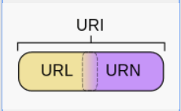

## 5层网络模型

-   HTTP位于应用层

### 低三层

-   物理层主要作用是定义物理设备如何传输数据
-   数据链路层在通信的实体间建立数据链路连接
-   网络层为数据在节点之间传输创建逻辑链路

### 传输层

-   向用户提供可靠的 端 到 端 的服务(End-to-End)
-   传输层向高层屏蔽了下层数据通信的细节

### 应用层

-   为应用软件提供服务
-   构建与TCP协议之上
-   屏蔽网络传输相关细节


### HTTP/0.9

-   只有一个命令GET
-   没有HEADER等描述数据的信息
-   服务器发送完毕，就关闭TCP连接

### HTTP/1.0

-   增加了命令
-   增加了 STATUS CODE  和  HEADER
-   多字符集支持，多部份发送，权限，缓存等

### HTTP/1.1

-   支持持久连接（创建连接时间多）
-   pipeline  一次可以发送多次请求
-   增加host 和其他命令

### HTTP2（未普及）

-   所有数据以二进制传输
-   同一个链接里面发送多个请求不在需要按照顺序来
-   头信息压缩（头信息占用带宽较多） 以及推送等提高效率的功能（服务端可以主动发动传输）

## HTTP三次握手

-   HTTP只有 请求 与 相应 的功能
-   在客户端与服务器 连接需要建立 **TCP connector**  连接通道


-   时序图
-   SYN 为标志位 ，创建数据包    Seq


-   若不采用三次握手而是两次，当发生网络延迟，服务器向客户端发出响应不及时或丢失，客户端无法知道服务端是否开启端口，连接服务；客户端可能因为连接超时关闭连接或者是重新发送连接请求，导致服务器端口重复开放，增大服务器开销


## 默认端口

>   默认HTTP的端口号为80，HTTPS的端口号为443


## **HTTP之URL**

HTTP使用统一资源标识符（Uniform Resource Identifiers, URI）来传输数据和建立连接。URL是一种特殊类型的URI，包含了用于查找某个资源的足够的信息

URL,全称是`UniformResourceLocator`, 中文叫统一资源定位符,是互联网上用来标识某一处资源的地址。以下面这个URL为例，介绍下普通URL的各部分组成：

`http:`//`www.aspxfans.com`:`8080` `/news/` `index.asp?` `boardID=5&ID=24618&page=1` `#name`

```javascript
http:  -- 协议
www.aspxfans.com  -- 域名
8080   -- 端口部分
/news/  -- 虚拟目录
index.asp  -- 文件名
name   -- 锚部分
boardID=5&ID=24618&page=1  -- 参数部分

[协议类型]://[访问资源需要的凭证信息]@[服务器地址]:[端口号]/[资源层级UNIX文件路径][文件名]?[查询]#[片段ID]

其中[访问凭证信息]、[端口号]、[查询]、[片段ID]都属于选填项
```

从上面的URL可以看出，一个完整的URL包括以下几部分：

1.  **协议部分**：该URL的协议部分为“http：”，这代表网页使用的是HTTP协议。在Internet中可以使用多种协议，如HTTP，FTP等等本例中使用的是HTTP协议。在"HTTP"后面的“//”为分隔符

2.  **域名部分**：该URL的域名部分为“www.aspxfans.com”。一个URL中，也可以使用IP地址作为域名使用

3.  **端口部分**：跟在域名后面的是端口，域名和端口之间使用“:”作为分隔符。端口不是一个URL必须的部分，如果省略端口部分，将采用默认端口

4.  **虚拟目录部分**：从域名后的第一个“/”开始到最后一个“/”为止，是虚拟目录部分。虚拟目录也不是一个URL必须的部分。本例中的虚拟目录是“/news/”

5.  **文件名部分**：从域名后的最后一个“/”开始到“？”为止，是文件名部分，如果没有“?”,则是从域名后的最后一个“/”开始到“#”为止，是文件部分，如果没有“？”和“#”，那么从域名后的最后一个“/”开始到结束，都是文件名部分。本例中的文件名是“index.asp”。文件名部分也不是一个URL必须的部分，如果省略该部分，则使用默认的文件名

6.  **锚部分**：从“#”开始到最后，都是锚部分。本例中的锚部分是“name”。锚部分也不是一个URL必须的部分

7.  **参数部分**：从“？”开始到“#”为止之间的部分为参数部分，又称搜索部分、查询部分。本例中的参数部分为“boardID=5&ID=24618&page=1”。参数可以允许有多个参数，参数与参数之间用“&”作为分隔符。


## URI 与 URL

>   URI   **U**niform **R**esource **I**dentifier   一个用于标识某一互联网资源名称的字符串
>
>   URL  **U**niform **R**esource **L**ocator      因特网的万维网服务程序上用于指定信息位置的表示方法




