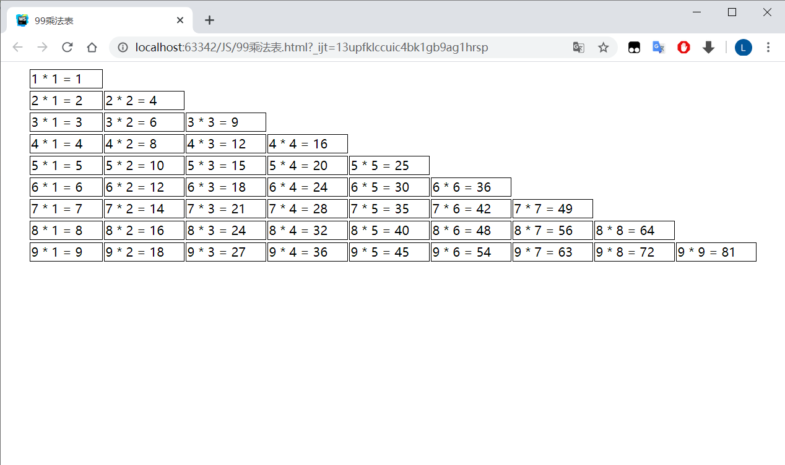
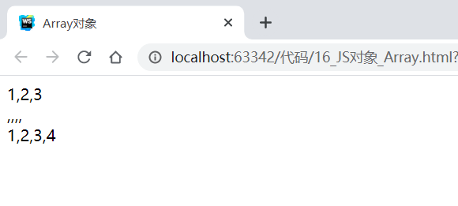
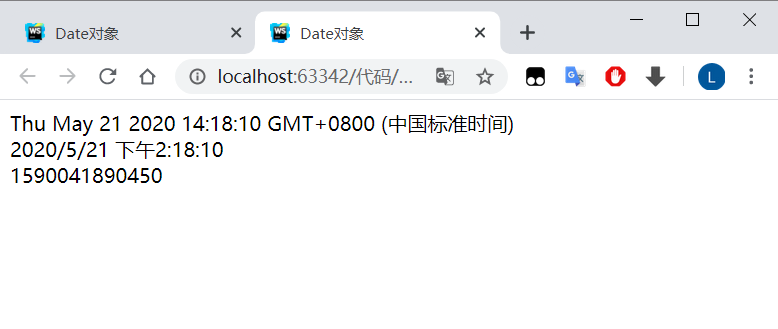
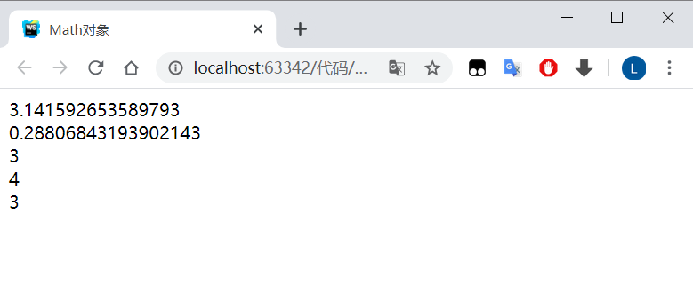

# JavaScript

**让用户可以与网站交互**

客户端脚本语言

>   JavaScript 是一种多范式的动态语言，它包含类型、运算符、标准内置（ built-in）对象和方法
>
>   语法来源于 Java 和 C，所以这两种语言的许多语法特性同样适用于 JavaScript
>
>   JavaScript 通过原型链而不是类来支持面向对象编程
>
>   JavaScript同样支持函数式编程——因为它们也是对象，函数也可以被保存在变量中，并且像其他对象一样被传递


## 与HTML结合方式

>   <script> 可以定义在html页面的任何地方 但是定义的位置会影响执行的顺序

1.  内部JS

    ```html
    <!DOCTYPE html>
    <html lang="en">
    <head>
    	<meta charset="UTF-8">
        <title>Title</title>
    	// 在html 内部  为内部JS  顺序执行
    	<script>
    		alert("Hello World");
    	</script>
    </head>
    <body>
    </body>
    </html>
    ```


2.  外部JS

    通过src 属性引入外部的js 文件

    ```html
    <script src="./js/a.js"></script>
    ```


## 注释

1.  单行注释

    ```js
    // 注释内容
    ```

2.  多行注释

    ```js
    /* 注释内容 */
    ```


## 一个练习

>   输出99乘法表

```html
<!DOCTYPE html>
<html lang="en">
<head>
    <meta charset="UTF-8">
    <title>99乘法表</title>
    <style>
        td{
            border: 1px solid;
        }
    </style>
    <script>

        document.write("<table | align='center'>");
        // 1. 完成基本的 for 循环 展示乘法表
        for (var i = 1; i <= 9; i++){
            document.write("<tr>");
            for(var j = 1; j <= i; j ++){
                document.write("<td>");
                // &nbsp; 代表空格
                document.write(i + " * " + j + " = " +  i*j + "&nbsp; &nbsp; &nbsp;");

                document.write("</td>");
            }
            // 换行操作
            document.write("<tr>");
        }

        // 完成表格嵌套
        document.write("</table>");
    </script>
</head>

</html>
```




## 数据类型

-   [`Number`](https://developer.mozilla.org/zh-CN/docs/Web/JavaScript/Reference/Global_Objects/Number)（数字）   不区分整数，浮点数  均为浮点数

-   [`String`](https://developer.mozilla.org/zh-CN/docs/Web/JavaScript/Reference/String)（字符串）

-   [`Boolean`](https://developer.mozilla.org/zh-CN/docs/Web/JavaScript/Reference/Boolean)（布尔）

-   [`Symbol`](https://developer.mozilla.org/zh-CN/docs/Web/JavaScript/Reference/Global_Objects/Symbol)（符号）（ES2015 新增）

-   `Object`

    （对象）

    -   [`Function`](https://developer.mozilla.org/zh-CN/docs/Web/JavaScript/Reference/Function)（函数）
    -   [`Array`](https://developer.mozilla.org/zh-CN/docs/Web/JavaScript/Reference/Array)（数组）
    -   [`Date`](https://developer.mozilla.org/zh-CN/docs/Web/JavaScript/Reference/Date)（日期）
    -   [`RegExp`](https://developer.mozilla.org/zh-CN/docs/Web/JavaScript/Reference/RegExp)（正则表达式）

-   [`null`](https://developer.mozilla.org/zh-CN/docs/Web/JavaScript/Reference/Global_Objects/null)（空）

-   [`undefined`](https://developer.mozilla.org/zh-CN/docs/Web/JavaScript/Reference/Global_Objects/undefined)（未定义）


JavaScript 支持标准的[算术运算符]，包括加法、减法、取模（或取余）等等。还有一个之前没有提及的内置对象 [`Math`]（数学对象），用以处理更多的高级数学函数和常数：

```js
Math.sin(3.5);
var circumference = 2 * Math.PI * r;
```

内置函数 [`parseInt()`] 将字符串转换为整型。该函数的第二个可选参数表示字符串所表示数字的基（进制）：

```js
parseInt("123", 10); // 123
parseInt("010", 10); // 10

把一个二进制数字字符串转换成整数值，只要把第二个参数设置为 2 
parseInt("11", 2); // 3

JavaScript 还有一个类似的内置函数 parseFloat()，用以解析浮点数字符串，与parseInt()不同的地方是，parseFloat() 只应用于解析十进制数字
```


单元运算符 + 也可以把数字字符串转换成数值：

```js
+ "42";   // 42
+ "010";  // 10
+ "0x10"; // 16
如果给定的字符串不存在数值形式，函数会返回一个特殊的值 NaN（Not a Number 的缩写）
parseInt("hello", 10); // NaN

如果把 NaN 作为参数进行任何数学运算，结果也会是 NaN
NaN + 5; //NaN

可以使用内置函数 isNaN() 来判断一个变量是否为 NaN：
isNaN(NaN); // true
```


两个特殊值：[`Infinity`](https://developer.mozilla.org/zh-CN/docs/Web/JavaScript/Reference/Global_Objects/Infinity)（正无穷）和 `-Infinity`（负无穷）：

```js
1 / 0; //  Infinity
-1 / 0; // -Infinity
```

可以使用内置函数 [`isFinite()`](https://developer.mozilla.org/zh-CN/docs/Web/JavaScript/Reference/Global_Objects/isFinite) 来判断一个变量是否是一个有穷数， 如果类型为`Infinity`, `-Infinity` 或 `NaN则返回false`：

```js
isFinite(1/0); // false
isFinite(Infinity); // false
isFinite(-Infinity); // false
isFinite(NaN); // false

isFinite(0); // true
isFinite(2e64); // true

isFinite("0"); // true
// 如果是纯数值类型的检测，则返回 false：
Number.isFinite("0"); // false
```


**备注：** [`parseInt()`](https://developer.mozilla.org/zh-CN/docs/Web/JavaScript/Reference/Global_Objects/parseInt) 和 [`parseFloat()`](https://developer.mozilla.org/zh-CN/docs/Web/JavaScript/Reference/Global_Objects/parseFloat) 函数会尝试逐个解析字符串中的字符，直到遇上一个无法被解析成数字的字符，然后返回该字符前所有数字字符组成的数字。然而如果使用运算符 "+"， 只要字符串中含有无法被解析成数字的字符，该字符串都将被转换成 `NaN`。可分别使用这两种方法解析“10.2abc”这一字符串，并比较得到的结果，来理解这两种方法的区别


## 字符串

JavaScript 中的字符串是一串[Unicode 字符](https://developer.mozilla.org/zh-CN/docs/Web/JavaScript/Guide/Values,_variables,_and_literals#Unicode.E7.BC.96.E7.A0.81)序列。这对于那些需要和多语种网页打交道的开发者来说是个好消息。更准确地说，它们是**一串UTF-16编码单元的序列**，每一个编码单元由一个 16 位二进制数表示。每一个Unicode字符由一个或两个编码单元来表示

如果想表示一个单独的字符，只需使用长度为 1 的字符串

通过访问字符串的 [`length`](https://developer.mozilla.org/zh-CN/docs/Web/JavaScript/Reference/Global_Objects/String/length)（编码单元的个数）属性，可以得到它的长度

```js
"hello".length; // 5
```

这是我们第一次碰到 JavaScript 对象。我们有没有提过你可以像 [object](https://developer.mozilla.org/zh-CN/docs/Web/JavaScript/Reference/Global_Objects/Object) 一样使用字符串？是的，字符串也有 [methods](https://developer.mozilla.org/zh-CN/docs/Web/JavaScript/Reference/String#Methods)（方法）能让你操作字符串和获取字符串的信息。

```js
"hello".charAt(0); // "h"
"hello, world".replace("world", "mars"); // "hello, mars"
"hello".toUpperCase(); // "HELLO"
```


## 其他类型

与其他类型不同，JavaScript 中的 [`null`](https://developer.mozilla.org/zh-CN/docs/Web/JavaScript/Reference/Global_Objects/null) 表示一个空值（non-value），必须使用 null 关键字才能访问，[`undefined`](https://developer.mozilla.org/zh-CN/docs/Web/JavaScript/Reference/Global_Objects/undefined) 是一个“undefined（未定义）”类型的对象，表示一个**未初始化的值**，也就是还没有被分配的值。我们之后再具体讨论变量，但有一点可以先简单说明一下，JavaScript **允许声明变量但不对其赋值**，一个未被赋值的变量就是 `undefined` 类型。还有一点需要说明的是，`undefined` 实际上是一个不允许修改的常量

JavaScript 包含布尔类型，这个类型的变量有两个可能的值，分别是 `true` 和 `false`（两者都是关键字）。根据具体需要，JavaScript 按照如下规则将变量转换成布尔类型：

1.  `false`、`0`、空字符串（`""`）、`NaN`、`null` 和 `undefined` 被转换为 `false`
2.  所有其他值被转换为 `true`

也可以使用 `Boolean()` 函数进行显式转换：

```js
Boolean(''); // false
Boolean(234); // true
```

不过一般没必要这么做，因为 JavaScript 会在需要一个布尔变量时隐式完成这个转换操作（比如在 `if` 条件语句中）。所以，有时我们可以把转换成布尔值后的变量分别称为 真值（true values）——即值为 true  和 假值（false values）——即值为 false；也可以分别称为“真的”（truthy）和“假的”（falsy）。

JavaScript 支持包括 `&&`（逻辑与）、`||` （逻辑或）和`!`（逻辑非）在内的一些逻辑运算符。下面会有所提到。

## 变量

在 JavaScript 中声明一个新变量的方法是使用关键字 `let` 、`const` 和 [`var`](https://developer.mozilla.org/zh-CN/docs/Web/JavaScript/Reference/Statements/var)：

`let` 语句声明一个**块级作用域的****本地变量**，并且可选的将其初始化为一个值

```js
let a;
let name = 'Simon';
```

下面是使用 `let` 声明变量作用域的例子：

```js
// myLetVariable is *not* visible out here

for (let myLetVariable = 0; myLetVariable < 5; myLetVariable++) {
  // myLetVariable is only visible in here
}

// myLetVariable is *not* visible out here
```

`const` 允许声明一个不可变的常量   这个常量在**定义域内**总是可见的

```js
const Pi = 3.14; // 设置 Pi 的值  
Pi = 1; // 将会抛出一个错误因为你改变了一个常量的值。
```

`var` 是最常见的声明变量的关键字。它没有其他两个关键字的种种限制。这是因为它是传统上在 JavaScript 声明变量的唯一方法。使用 **`var`** 声明的变量在**它所声明的整个函数都是可见的**

```js
var a;
var name = "simon";
```

一个使用 **`var`** 声明变量的语句块的例子：

```js
// myVarVariable *is* visible out here 

for (var myVarVariable = 0; myVarVariable < 5; myVarVariable++) { 
  // myVarVariable is visible to the whole function 
} 

// myVarVariable *is* visible out here
```

如果声明了一个变量却没有对其赋值，那么这个变量的类型就是 `undefined`。

JavaScript 与其他语言的（如 Java）的重要区别是在 JavaScript 中**语句块（blocks）是没有作用域的，只有函数有作用域**。因此如果在一个复合语句中（如 if 控制结构中）使用 var 声明一个变量，那么它的作用域是整个函数（复合语句在函数中）。 但是从 ECMAScript Edition 6 开始将有所不同的， `let` 和 `const` 关键字允许你创建块作用域的变量。

## 运算符

JavaScript的算术操作符包括 `+`、`-`、`*`、`/` 和 `%` ——求余（[与模运算相同](https://developer.mozilla.org/zh-CN/docs/Web/JavaScript/Reference/Operators/Arithmetic_Operators#求余_())）。赋值使用 `=` 运算符，此外还有一些复合运算符，如 `+=` 和 `-=`，它们等价于 `x = x *operator* y`。

```js
x += 5; // 等价于 x = x + 5;
```

可以使用 `++` 和 `--` 分别实现变量的自增和自减。两者都可以作为前缀或后缀操作符使用。

[`+` 操作符](https://developer.mozilla.org/zh-CN/docs/Web/JavaScript/Reference/Operators/Arithmetic_Operators#.E5.8A.A0.E6.B3.95_(.2B))还可以用来连接字符串：

```js
"hello" + " world"; // hello world
```

如果你用一个字符串加上一个数字（或其他值），那么操作数都会被首先转换为字符串。如下所示：

```js
"3" + 4 + 5; // 345
3 + 4 + "5"; // 75
```

这里不难看出一个实用的技巧——**通过与空字符串相加，可以将某个变量快速转换成字符串类型**

JavaScript 中的[比较操作](https://developer.mozilla.org/zh-CN/docs/Web/JavaScript/Reference/Operators/Comparison_Operators)使用 `<`、`>`、`<=` 和 `>=`，这些运算符对于数字和字符串都通用。相等的比较稍微复杂一些

**由两个“`=`（等号）”组成的相等运算符有类型自适应的功能**，具体例子如下：

```js
123 == "123" // true
1 == true; // true
```

如果在**比较前不需要自动类型转换**，应该使用由三个“`=`（等号）”组成的相等运算符：

```js
1 === true; //false
123 === "123"; // false
```

JavaScript 还支持 `!=` 和 `!==` 两种不等运算符，具体区别与两种相等运算符的区别类似。

JavaScript 还提供了 [位操作符](https://developer.mozilla.org/en-US/docs/Web/JavaScript/Reference/Operators/Bitwise_Operators)。

## 控制结构

JavaScript 的控制结构与其他类 C 语言类似。可以使用 `if` 和 `else` 来定义条件语句，还可以连起来使用：

```js
var name = "kittens";
if (name == "puppies") {
  name += "!";
} else if (name == "kittens") {
  name += "!!";
} else {
  name = "!" + name;
}
name == "kittens!!"; // true
```

JavaScript 支持 `while` 循环和 `do-while` 循环。前者适合常见的基本循环操作，如果**需要循环体至少被执行一次则可以使用 `do-while`**：

```js
while (true) {
  // 一个无限循环！
}

var input;
do {
  input = get_input();
} while (inputIsNotValid(input))
```

JavaScript 的 `for` 循环与 C 和 Java 中的相同：使用时可以在一行代码中提供控制信息。

```js
for (var i = 0; i < 5; i++) {
  // 将会执行五次
}
```

JavaScript 也还包括其他两种重要的 for 循环： [`for`...`of`](https://developer.mozilla.org/en-US/docs/Web/JavaScript/Reference/Statements/for...of)

```js
for (let value of array) {
  // do something with value
}
```

和 [`for`...`in`](https://developer.mozilla.org/en-US/docs/Web/JavaScript/Reference/Statements/for...in) ：

```js
for (let property in object) {
  // do something with object property
}
```

`&&` 和 `||` 运算符使用短路逻辑（short-circuit logic），是否会执行第二个语句（操作数）取决于第一个操作数的结果。在需要访问某个对象的属性时，使用这个特性可以事先检测该对象是否为空：

```js
var name = o && o.getName();
```

或用于缓存值（当错误值无效时）：

```js
var name = cachedName || (cachedName = getName());
```

类似地，JavaScript 也有一个用于条件表达式的三元操作符：

```js
var allowed = (age > 18) ? "yes" : "no";
```

在需要多重分支时可以使用 `基于一个数字或字符串的switch` 语句：

```js
switch(action) {
    case 'draw':
        drawIt();
        break;
    case 'eat':
        eatIt();
        break;
    default:
        doNothing();
}
```

如果你不使用 `break` 语句，JavaScript 解释器将会执行之后 `case` 中的代码。除非是为了调试，一般你并不需要这个特性，所以大多数时候**不要忘了加上 `break。`**

```js
switch(a) {
    case 1: // 继续向下
    case 2:
        eatIt();
        break;
    default:
        doNothing();
}
```

`default` 语句是可选的。`switch` 和 `case` 都可以使用需要运算才能得到结果的表达式；在 `switch` 的表达式和 `case` 的表达式是使用 `===` 严格相等运算符进行比较的：

```js
switch(1 + 3){
    case 2 + 2:
        yay();
        break;
    default:
        neverhappens();
}
```


## 对象

JavaScript 中的对象，Object，可以简单理解成**“名称-值”**对（而不是键值对：现在，ES 2015 的映射表（Map），比对象更接近键值对），不难联想 JavaScript 中的对象与下面这些概念类似：

-   Python 中的字典（Dictionary）
-   Perl 和 Ruby 中的散列/哈希（Hash）
-   C/C++ 中的散列表（Hash table）
-   Java 中的散列映射表（HashMap）
-   PHP 中的关联数组（Associative array）

这样的数据结构设计合理，能应付各类复杂需求，所以被各类编程语言广泛采用。正因为 JavaScript 中的一切（除了核心类型，core object）都是对象，所以 JavaScript 程序必然与大量的散列表查找操作有着千丝万缕的联系，而散列表擅长的正是高速查找

“名称”部分是一个 JavaScript 字符串，“值”部分可以是任何 JavaScript 的数据类型——包括对象。这使用户可以根据具体需求，创建出相当复杂的数据结构。

有两种简单方法可以创建一个空对象：

```js
var obj = new Object();
```

和：

```js
var obj = {};
```

这两种方法在语义上是相同的。第二种更方便的方法叫作“**对象字面量（object literal）”法**。这种也是 JSON 格式的核心语法，一般我们优先选择第二种方法。

“对象字面量”也可以用来在对象实例中定义一个对象：

```js
var obj = {
    name: "Carrot",
    "for": "Max",//'for' 是保留字之一，使用'_for'代替
    details: {
        color: "orange",
        size: 12
    }
}
```

对象的属性可以通过链式（chain）表示方法进行**访问**：

```js
obj.details.color; // orange
obj["details"]["size"]; // 12
```

下面的例子创建了一个对象原型，`Person`，和这个原型的实例，**`You`**

```js
function Person(name, age) {
  this.name = name;
  this.age = age;
}

// 定义一个对象
var You = new Person("You", 24); 
// 我们创建了一个新的 Person，名称是 "You" 
// ("You" 是第一个参数, 24 是第二个参数..)
```

完成创建后，对象属性可以通过如下两种方式进行赋值和访问：

```js
obj.name = "Simon"
var name = obj.name;
```

和：

```js
// bracket notation
obj['name'] = 'Simon';
var name = obj['name'];
// can use a variable to define a key
var user = prompt('what is your key?')
obj[user] = prompt('what is its value?')
```

这两种方法在语义上也是相同的。第二种方法的优点在于属性的名称被看作一个字符串，这就意味着它可以在运行时被计算，缺点在于这样的代码有可能无法在后期被解释器优化。它也可以被用来访问某些以[预留关键字](https://developer.mozilla.org/en-US/docs/Web/JavaScript/Reference/Lexical_grammar#Keywords)作为名称的属性的值：

```js
obj.for = "Simon"; // 语法错误，因为 for 是一个预留关键字
obj["for"] = "Simon"; // 工作正常
```

**注意：**从 EcmaScript 5 开始，预留关键字可以作为对象的属性名（reserved words may be used as object property names "in the buff"）。 这意味着当定义对象字面量时不需要用双引号了。参见 ES5 [Spec](http://es5.github.io/#x7.6.1).

关于对象和原型的详情参见： [Object.prototype](https://developer.mozilla.org/en-US/docs/Web/JavaScript/Reference/Global_Objects/Object/prototype). 解释对象原型和对象原型链可以参见：[继承与原型链](https://developer.mozilla.org/zh-CN/docs/Web/JavaScript/Inheritance_and_the_prototype_chain)。

**注意：**从 EcmaScript 6 开始，对象键可以在创建时使用括号表示法由变量定义。{[phoneType]: 12345} 可以用来替换 `var userPhone = {}; userPhone[phoneType] = 12345` .


## 数组

Array:数组对象

1.  创建：
         1. var arr = new Array(元素列表);
   
         2. var arr = new Array(默认长度);
          
         3. var arr = [元素列表];
          
            ```js
                    var arr1 = new Array(1,2,3);
                    var arr2 = new Array(5);
                    var arr3 = [1,2,3,4];
            
                    var arr4 = new Array();
            
                    document.write(arr1 +"<br>");
                    document.write(arr2 +"<br>");
                    document.write(arr3 +"<br>");
                    document.write(arr4 +"<br>");
            ```
          
            
   
2.  方法
     join(参数):将数组中的元素按照指定的分隔符拼接为字符串
     push()	向数组的末尾添加一个或更多元素，并返回新的长度。
     
3. 属性
	length:数组的长度
4. 特点：
	1. JS中，数组元素的类型可变的。
	2. JS中，数组长度可变的。

JavaScript 中的数组是一种特殊的对象。它的工作原理与普通对象类似（以数字为属性名，但只能通过`[]` 来访问），但数组还有一个特殊的属性——`length`（长度）属性。这个属性的值通常比数组最大索引大 1。

创建数组的传统方法是：

```js
var a = new Array();
a[0] = "dog";
a[1] = "cat";
a[2] = "hen";
a.length; // 3
```

使用数组字面量（array literal）法更加方便：

```js
var a = ["dog", "cat", "hen"];
a.length; // 3
```

注意，`Array.length `并不总是等于数组中元素的个数，如下所示：

```js
var a = ["dog", "cat", "hen"];
a[100] = "fox";
a.length; // 101
```

记住：**数组的长度是比数组最大索引值多一的数**。

如果试图访问一个不存在的数组索引，会得到 `undefined`：

```js
typeof(a[90]); // undefined
```

可以通过如下方式遍历一个数组：

```js
for (var i = 0; i < a.length; i++) {
    // Do something with a[i]
}
```

ES2015 引入了更加简洁的 [`for`...`of`](https://developer.mozilla.org/en-US/docs/Web/JavaScript/Reference/Statements/for...of) 循环，可以用它来遍历可迭代对象，例如数组：

```js
for (const currentValue of a) {
  // Do something with currentValue
}
```

遍历数组的另一种方法是使用 [`for...in`](https://developer.mozilla.org/zh-CN/docs/Web/JavaScript/Reference/Statements/for...in) 循环， 然而这并不是遍历数组元素而是数组的索引。注意，如果哪个家伙直接向 `Array.prototype` 添加了新的属性，使用这样的循环这些属性也同样会被遍历。所以并不推荐使用这种方法遍历数组：

```js
for (var i in a) {
  // Do something with a[i]
}
```

ECMAScript 5 增加了另一个遍历数组的方法，`forEach()`：

```js
["dog", "cat", "hen"].forEach(function(currentValue, index, array) {
  // Do something with currentValue or array[index]
});
```

如果想在数组后追加元素，只需要：

```js
a.push(item);
```

除了 `forEach()` 和 `push()`，Array（数组）类还自带了许多方法。建议查看 [Array 方法的完整文档](https://developer.mozilla.org/zh-CN/docs/Web/JavaScript/Reference/Global_Objects/Array)。

| 方法名称                                             | 描述                                                         |
| :--------------------------------------------------- | :----------------------------------------------------------- |
| `a.toString()`                                       | 返回一个包含数组中所有元素的字符串，每个元素通过逗号分隔。   |
| `a.toLocaleString()`                                 | 根据宿主环境的区域设置，返回一个包含数组中所有元素的字符串，每个元素通过逗号分隔。 |
| `a.concat(item1[, item2[, ...[, itemN]]])`           | 返回一个数组，这个数组包含原先 `a` 和 `item1、item2、……、itemN` 中的所有元素。 |
| `a.join(sep)`                                        | 返回一个包含数组中所有元素的字符串，每个元素通过指定的 `sep` 分隔。 |
| `a.pop()`                                            | 删除并返回数组中的最后一个元素。                             |
| `a.push(item1, ..., itemN)`                          | 将 `item1、item2、……、itemN` 追加至数组 `a`。                |
| `a.reverse()`                                        | 数组逆序（会更改原数组 `a`）。                               |
| `a.shift()`                                          | 删除并返回数组中第一个元素。                                 |
| `a.slice(start, end)`                                | 返回子数组，以 `a[start]` 开头，以 `a[end]` 前一个元素结尾。 |
| `a.sort([cmpfn])`                                    | 依据可选的比较函数 `cmpfn` 进行排序，如果未指定比较函数，则按字符顺序比较（即使被比较元素是数字）。 |
| `a.splice(start, delcount[, item1[, ...[, itemN]]])` | 从 `start` 开始，删除 `delcount` 个元素，然后插入所有的 `item`。 |
| `a.unshift(item1[, item2[, ...[, itemN]]])`          | 将 `item` 插入数组头部，返回数组新长度（考虑 `undefined`）。 |


## Date

Date：日期对象
     1. 创建：
         var date = new Date();

 2. 方法：
     toLocaleString()：返回当前date对象对应的时间本地字符串格式
     getTime():获取毫秒值。返回当前如期对象描述的时间到1970年1月1日零点的毫秒值差

```js
        var date = new Date();

        document.write(date + "<br>");

        document.write(date.toLocaleString() + "<br>");

        document.write(date.getTime() + "<br>");
```




## Math：数学对象

     1. 创建：
         * 特点：Math对象不用创建，直接使用。  Math.方法名();

 2. 方法：
     random():返回 0 ~ 1 之间的随机数。 含0不含1
     ceil(x)：对数进行上舍入。
     floor(x)：对数进行下舍入。
     round(x)：把数四舍五入为最接近的整数。
 3. 属性：
     PI

```js
        document.write(Math.PI +"<br>");
        document.write(Math.random() +"<br>");
        document.write(Math.round(3.14) +"<br>");
        document.write(Math.ceil(3.14) +"<br>");
        document.write(Math.floor(3.14) +"<br>");
```




## 正则表达式

2. 正则对象：
     1. 创建
         1. var reg = new RegExp("正则表达式");
         2. var reg = /正则表达式/;
     2. 方法
         1. test(参数):验证指定的字符串是否符合正则定义的规范

```js
    <script >
        // 1.
        var reg = new RegExp("^\\w{6,12}$");
        // 2.
        var reg2= /^\w{6,12}$/;

        /*alert(reg);
        alert(reg2);*/

        var username = "zhangsan";

        //验证
        var flag = reg.test(username);
        alert(flag);

    </script>
```


## Global 全局变量

1. 特点：全局对象，这个Global中封装的方法不需要对象就可以直接调用。  方法名();
2. 方法：
    encodeURI():url编码
    decodeURI():url解码

    encodeURIComponent():url编码,编码的字符更多
    decodeURIComponent():url解码

    parseInt():   将字符串转为数字
    
    *   逐一判断每一个字符是否是数字，直到不是数字为止，将前边数字部分转为number
        isNaN():判断一个值是否是NaN
*   NaN六亲不认，连自己都不认。NaN参与的==比较全部问false
  
    eval():  讲 JavaScript 字符串，并把它作为脚本代码来执行。
            3. URL编码
               传智播客 =  %E4%BC%A0%E6%99%BA%E6%92%AD%E5%AE%A2

```js
<script >
    var str = "http://www.baidu.com?wd=传智播客";
    var encode = encodeURI(str);
    document.write(encode +"<br>");//%E4%BC%A0%E6%99%BA%E6%92%AD%E5%AE%A2
    var s = decodeURI(encode);
    document.write(s +"<br>");//传智播客


    var str1 = "http://www.baidu.com?wd=传智播客";
    var encode1 = encodeURIComponent(str1);
    document.write(encode1 +"<br>");//%E4%BC%A0%E6%99%BA%E6%92%AD%E5%AE%A2
    var s1 = decodeURIComponent(encode);
    document.write(s1 +"<br>");//传智播客


    var str = "a234abc";
    var number = parseInt(str);
    //alert(number + 1);

    var a = NaN;

    document.write(a == NaN);
    document.write(isNaN(a));

    var jscode = "alert(123)";
    eval(jscode);
```


## 函数

>   方法定义时，形参的类型不用写
>
>   同名函数会覆盖，以近的为准
>
>   参数可以选择不传 返回undeined类型


```js
        Function：函数(方法)对象
            1. 创建：
var fun = new Function(形式参数列表,方法体);  //忘掉吧
2. function 方法名称(形式参数列表){
     方法体
}

3. var 方法名 = function(形式参数列表){
      方法体
}
方法：

属性：
 length:代表形参的个数

特点：
1. 方法定义是，形参的类型不用写,返回值类型也不写。
2. 方法是一个对象，如果定义名称相同的方法，会覆盖
3. 在JS中，方法的调用只与方法的名称有关，和参数列表无关
4. 在方法声明中有一个隐藏的内置对象（数组），arguments,封装所有的实际参数

调用：
方法名称(实际参数列表);
```


学习 JavaScript 最重要的就是要理解**对象和函数**两个部分。最简单的函数就像下面这个这么简单：

```js
function add(x, y) {
    var total = x + y;
    return total;
}
```

这个例子包括你需要了解的关于基本函数的所有部分。一个 JavaScript 函数可以包含 0 个或多个已命名的变量。函数体中的表达式数量也没有限制。你可以声明函数自己的局部变量。`return` 语句在返回一个值并结束函数。如果没有使用 `return` 语句，或者一个没有值的 `return` 语句，**JavaScript 会返回 `undefined`**

已命名的参数更像是一个指示而没有其他作用。如果调用函数时没有提供足够的参数，缺少的参数会被 `undefined` 替代

```js
add(); // NaN 
// 不能在 undefined 对象上进行加法操作
```

你还可以传入多于函数本身需要参数个数的参数：

```js
add(2, 3, 4); // 5
 // 将前两个值相加，4 被忽略了
```

这看上去有点蠢。函数实际上是访问了函数体中一个名为 [`arguments`](https://developer.mozilla.org/zh-CN/docs/Web/JavaScript/Reference/Functions_and_function_scope/arguments) 的内部对象，这个对象就如同一个类似于数组的对象一样，包括了所有被传入的参数。让我们重写一下上面的函数，使它可以接收任意个数的参数：

```js
function add() {
    var sum = 0;
    for (var i = 0, j = arguments.length; i < j; i++) {
        sum += arguments[i];
    }
    return sum;
}

add(2, 3, 4, 5); // 14
```

这跟直接写成 `2 + 3 + 4 + 5` 也没什么区别。我们还是创建一个求平均数的函数吧：

```js
function avg() {
    var sum = 0;
    for (var i = 0, j = arguments.length; i < j; i++) {
        sum += arguments[i];
    }
    return sum / arguments.length;
}
avg(2, 3, 4, 5); // 3.5
```

这个就有用多了，但是却有些冗长。为了使代码变短一些，我们可以使用[剩余参数](https://developer.mozilla.org/zh-CN/docs/Web/JavaScript/Reference/Functions/Rest_parameters)来替换arguments的使用。在这方法中，我们可以传递任意数量的参数到函数中同时尽量减少我们的代码。这个**剩余参数操作符**在函数中以：**...variable** 的形式被使用，它将包含在调用函数时使用的未捕获整个参数列表到这个变量中。我们同样也可以将 **for** 循环替换为 **for...of** 循环来返回我们变量的值。

```js
function avg(...args) {
  var sum = 0;
  for (let value of args) {
    sum += value;
  }
  return sum / args.length;
}

avg(2, 3, 4, 5); // 3.5
```

在上面这段代码中，所有被传入该函数的参数都被变量 **args** 所持有。

需要注意的是，无论“剩余参数操作符”被放置到函数声明的哪里，它都会把除了自己之前的所有参数存储起来。比如函数：function avg(**firstValue**, ...args) 会把传入函数的第一个值存入 **firstValue**，其他的参数存入 **args**。这是虽然一个很有用的语言特性，却也会带来新的问题。`avg()` 函数只接受逗号分开的参数列表 -- 但是如果你想要获取一个数组的平均值怎么办？一种方法是将函数按照如下方式重写：

```js
function avgArray(arr) {
    var sum = 0;
    for (var i = 0, j = arr.length; i < j; i++) {
        sum += arr[i];
    }
    return sum / arr.length;
}
avgArray([2, 3, 4, 5]); // 3.5
```

但如果能重用我们已经创建的那个函数不是更好吗？幸运的是 JavaScript 允许你通过任意函数对象的 `apply()` 方法来传递给它一个数组作为参数列表。

```js
avg.apply(null, [2, 3, 4, 5]); // 3.5
```

传给 `apply()` 的第二个参数是一个数组，它将被当作 `avg()` 的参数列表使用，至于第一个参数 `null`，我们将在后面讨论。这也正说明了一个事实——函数也是对象。

通过使用[展开语法](https://developer.mozilla.org/zh-CN/docs/Web/JavaScript/Reference/Operators/Spread_syntax)，你也可以获得同样的效果。

比如说：`avg(...numbers)`

JavaScript 允许你创建匿名函数：

```js
var avg = function() {
    var sum = 0;
    for (var i = 0, j = arguments.length; i < j; i++) {
        sum += arguments[i];
    }
    return sum / arguments.length;
};
```

这个函数在语义上与 `function avg()` 相同。你可以在代码中的任何地方定义这个函数，就像写普通的表达式一样。基于这个特性，有人发明出一些有趣的技巧。与 C 中的块级作用域类似，下面这个例子隐藏了局部变量：

```js
var a = 1;
var b = 2;
(function() {
    var b = 3;
    a += b;
})();

a; // 4
b; // 2
```

JavaScript 允许以递归方式调用函数。递归在处理树形结构（比如浏览器 [DOM](https://developer.mozilla.org/zh-CN/docs/Web/API/Document_Object_Model)）时非常有用。

```js
function countChars(elm) {
    if (elm.nodeType == 3) { // TEXT_NODE 文本节点
        return elm.nodeValue.length;
    }
    var count = 0;
    for (var i = 0, child; child = elm.childNodes[i]; i++) {
        count += countChars(child);
    }
    return count;
}
```

这里需要说明一个潜在问题——既然匿名函数没有名字，那该怎么递归调用它呢？在这一点上，JavaScript 允许你命名这个函数表达式。你可以命名立即调用的函数表达式（IIFE——Immediately Invoked Function Expression），如下所示：

```js
var charsInBody = (function counter(elm) {
    if (elm.nodeType == 3) { // 文本节点
        return elm.nodeValue.length;
    }
    var count = 0;
    for (var i = 0, child; child = elm.childNodes[i]; i++) {
        count += counter(child);
    }
    return count;
})(document.body);
```

如上所提供的函数表达式的名称的作用域仅仅是该函数自身。这允许引擎去做更多的优化，并且这种实现更可读、友好。该名称也显示在调试器和一些堆栈跟踪中，节省了调试时的时间。

需要注意的是 JavaScript 函数是它们本身的对象——就和 JavaScript 其他一切一样——你可以给它们添加属性或者更改它们的属性，这与前面的对象部分一样。

## 自定义对象

**备注：**关于 JavaScript 中面向对象编程更详细的信息，请参考 [JavaScript 面向对象简介](https://developer.mozilla.org/zh-CN/docs/Web/JavaScript/Introduction_to_Object-Oriented_JavaScript)。

在经典的面向对象语言中，对象是指数据和在这些数据上进行的操作的集合。与 C++ 和 Java 不同，JavaScript 是一种基于原型的编程语言，并没有 class 语句，而是把函数用作类。那么让我们来定义一个人名对象，这个对象包括人的姓和名两个域（field）。名字的表示有两种方法：“名 姓（First Last）”或“姓, 名（Last, First）”。使用我们前面讨论过的函数和对象概念，可以像这样完成定义：

```js
function makePerson(first, last) {
    return {
        first: first,
        last: last
    }
}
function personFullName(person) {
    return person.first + ' ' + person.last;
}
function personFullNameReversed(person) {
    return person.last + ', ' + person.first
}
s = makePerson("Simon", "Willison");
personFullName(s); // Simon Willison
personFullNameReversed(s); // Willison, Simon
```

上面的写法虽然可以满足要求，但是看起来很麻烦，因为需要在全局命名空间中写很多函数。既然函数本身就是对象，如果需要使一个函数隶属于一个对象，那么不难得到：

```js
function makePerson(first, last) {
    return {
        first: first,
        last: last,
        fullName: function() {
            return this.first + ' ' + this.last;
        },
        fullNameReversed: function() {
            return this.last + ', ' + this.first;
        }
    }
}
s = makePerson("Simon", "Willison");
s.fullName(); // Simon Willison
s.fullNameReversed(); // Willison, Simon
```

上面的代码里有一些我们之前没有见过的东西：关键字 [`this`](https://developer.mozilla.org/zh-CN/docs/Web/JavaScript/Reference/Operators/this)。当使用在函数中时，`this` 指代当前的对象，也就是调用了函数的对象。如果在一个对象上使用[点或者方括号](https://developer.mozilla.org/en/JavaScript/Reference/Operators/Member_Operators)来访问属性或方法，这个对象就成了 `this`。如果并没有使用“点”运算符调用某个对象，那么 `this` 将指向全局对象（global object）。这是一个经常出错的地方。例如：

```js
s = makePerson("Simon", "Willison");
var fullName = s.fullName;
fullName(); // undefined undefined
```

当我们调用 `fullName()` 时，`this` 实际上是指向全局对象的，并没有名为 `first` 或 `last` 的全局变量，所以它们两个的返回值都会是 `undefined`。

下面使用关键字 `this` 改进已有的 `makePerson`函数：

```js
function Person(first, last) {
    this.first = first;
    this.last = last;
    this.fullName = function() {
        return this.first + ' ' + this.last;
    }
    this.fullNameReversed = function() {
        return this.last + ', ' + this.first;
    }
}
var s = new Person("Simon", "Willison");
```

我们引入了另外一个关键字：[`new`](https://developer.mozilla.org/zh-CN/docs/Web/JavaScript/Reference/Operators/new)，它和 `this` 密切相关。它的作用是创建一个崭新的空对象，然后使用指向那个对象的 `this` 调用特定的函数。注意，含有 `this` 的特定函数不会返回任何值，只会修改 `this` 对象本身。`new` 关键字将生成的 `this` 对象返回给调用方，而被 `new` 调用的函数称为构造函数。习惯的做法是将这些函数的首字母大写，这样用 `new` 调用他们的时候就容易识别了。

不过，这个改进的函数还是和上一个例子一样，在单独调用`fullName()` 时，会产生相同的问题。

我们的 Person 对象现在已经相当完善了，但还有一些不太好的地方。每次我们创建一个 Person 对象的时候，我们都在其中创建了两个新的函数对象——如果这个代码可以共享不是更好吗？

```js
function personFullName() {
    return this.first + ' ' + this.last;
}
function personFullNameReversed() {
    return this.last + ', ' + this.first;
}
function Person(first, last) {
    this.first = first;
    this.last = last;
    this.fullName = personFullName;
    this.fullNameReversed = personFullNameReversed;
}
```

这种写法的好处是，我们只需要创建一次方法函数，在构造函数中引用它们。那是否还有更好的方法呢？答案是肯定的。

```js
function Person(first, last) {
    this.first = first;
    this.last = last;
}
Person.prototype.fullName = function() {
    return this.first + ' ' + this.last;
}
Person.prototype.fullNameReversed = function() {
    return this.last + ', ' + this.first;
}
```

`Person.prototype` 是一个可以被`Person`的所有实例共享的对象。它是一个名叫原型链（prototype chain）的查询链的一部分：当你试图访问一个 `Person` 没有定义的属性时，解释器会首先检查这个 `Person.prototype` 来判断是否存在这样一个属性。所以，任何分配给 `Person.prototype` 的东西对通过 `this` 对象构造的实例都是可用的。

这个特性功能十分强大，JavaScript 允许你在程序中的任何时候修改原型（prototype）中的一些东西，也就是说你可以在运行时(runtime)给已存在的对象添加额外的方法：

```js
s = new Person("Simon", "Willison");
s.firstNameCaps();  // TypeError on line 1: s.firstNameCaps is not a function

Person.prototype.firstNameCaps = function() {
    return this.first.toUpperCase()
}
s.firstNameCaps(); // SIMON
```

有趣的是，你还可以给 JavaScript 的内置函数原型（prototype）添加东西。让我们给 `String` 添加一个方法用来返回逆序的字符串：

```js
var s = "Simon";
s.reversed(); // TypeError on line 1: s.reversed is not a function

String.prototype.reversed = function() {
    var r = "";
    for (var i = this.length - 1; i >= 0; i--) {
        r += this[i];
    }
    return r;
}
s.reversed(); // nomiS
```

定义新方法也可以在字符串字面量上用（string literal）。

```js
"This can now be reversed".reversed(); // desrever eb won nac sihT
```

正如我前面提到的，原型组成链的一部分。那条链的根节点是 `Object.prototype`，它包括 `toString()` 方法——将对象转换成字符串时调用的方法。这对于调试我们的 `Person` 对象很有用：

```js
var s = new Person("Simon", "Willison");
s; // [object Object]

Person.prototype.toString = function() {
    return '<Person: ' + this.fullName() + '>';
}
s.toString(); // <Person: Simon Willison>
```

你是否还记得之前我们说的 `avg.apply()` 中的第一个参数 `null`？现在我们可以回头看看这个东西了。`apply()` 的第一个参数应该是一个被当作 `this` 来看待的对象。下面是一个 `new` 方法的简单实现：

```js
function trivialNew(constructor, ...args) {
    var o = {}; // 创建一个对象
    constructor.apply(o, args);
    return o;
}
```

这并不是 `new` 的完整实现，因为它没有创建原型（prototype）链。想举例说明 new 的实现有些困难，因为你不会经常用到这个，但是适当了解一下还是很有用的。在这一小段代码里，`...args`（包括省略号）叫作[剩余参数（rest arguments）](https://developer.mozilla.org/zh-CN/docs/Web/JavaScript/Reference/rest_parameters)。如名所示，这个东西包含了剩下的参数。

因此，调用

```js
var bill = trivialNew(Person, "William", "Orange");
```

可认为和调用如下语句是等效的

```js
var bill = new Person("William", "Orange");
```

`apply()` 有一个姐妹函数，名叫 [`call`](https://developer.mozilla.org/zh-CN/docs/Web/JavaScript/Reference/Global_Objects/Function/call)，它也可以允许你设置 `this`，但它带有一个扩展的参数列表而不是一个数组。

```js
function lastNameCaps() {
    return this.last.toUpperCase();
}
var s = new Person("Simon", "Willison");
lastNameCaps.call(s);
// 和以下方式等价
s.lastNameCaps = lastNameCaps;
s.lastNameCaps();
```

### 内部函数


JavaScript 允许在一个函数内部定义函数，这一点我们在之前的 `makePerson()` 例子中也见过。关于 JavaScript 中的嵌套函数，一个很重要的细节是，它们可以访问父函数作用域中的变量：

```js
function parentFunc() {
  var a = 1;

  function nestedFunc() {
    var b = 4; // parentFunc 无法访问 b
    return a + b;
  }
  return nestedFunc(); // 5
}
```

如果某个函数依赖于其他的一两个函数，而这一两个函数对你其余的代码没有用处，你可以将它们嵌套在会被调用的那个函数内部，这样做可以减少全局作用域下的函数的数量，这有利于编写易于维护的代码。

这也是一个减少使用全局变量的好方法。当编写复杂代码时，程序员往往试图使用全局变量，将值共享给多个函数，但这样做会使代码很难维护。内部函数可以共享父函数的变量，所以你可以使用这个特性把一些函数捆绑在一起，这样可以有效地防止“污染”你的全局命名空间——你可以称它为“局部全局（local global）”。虽然这种方法应该谨慎使用，但它确实很有用，应该掌握。

## 闭包

闭包是 JavaScript 中最强大的抽象概念之一——但它也是最容易造成困惑的。它究竟是做什么的呢？

```js
function makeAdder(a) {
  return function(b) {
    return a + b;
  }
}
var add5 = makeAdder(5);
var add20 = makeAdder(20);
add5(6); // ?
add20(7); // ?
```

`makeAdder` 这个名字本身，便应该能说明函数是用来做什么的：它会用一个参数来创建一个新的“adder”函数，再用另一个参数来调用被创建的函数时，`makeAdder` 会将一前一后两个参数相加。

从被创建的函数的视角来看的话，这两个参数的来源问题会更显而易见：新函数自带一个参数——在新函数被创建时，便钦定、钦点了前一个参数（如上方代码中的 a、5 和 20，参考 `makeAdder` 的结构，它应当位于新函数外部）；新函数被调用时，又接收了后一个参数（如上方代码中的 b、6 和 7，位于新函数内部）。最终，新函数被调用的时候，前一个参数便会和由外层函数传入的后一个参数相加。

这里发生的事情和前面介绍过的内嵌函数十分相似：一个函数被定义在了另外一个函数的内部，内部函数可以访问外部函数的变量。唯一的不同是，外部函数已经返回了，那么常识告诉我们局部变量“应该”不再存在。但是它们却仍然存在——否则 `adder` 函数将不能工作。也就是说，这里存在 `makeAdder` 的局部变量的两个不同的“副本”——一个是 `a` 等于 5，另一个是 `a` 等于 20。那些函数的运行结果就如下所示：

```js
x(6); // 返回 11
y(7); // 返回 27
```

下面来说说，到底发生了什么了不得的事情。每当 JavaScript 执行一个函数时，都会创建一个作用域对象（scope object），用来保存在这个函数中创建的局部变量。它使用一切被传入函数的变量进行初始化（初始化后，它包含一切被传入函数的变量）。这与那些保存的所有全局变量和函数的全局对象（global object）相类似，但仍有一些很重要的区别：第一，每次函数被执行的时候，就会创建一个新的，特定的作用域对象；第二，与全局对象（如浏览器的 `window` 对象）不同的是，你不能从 JavaScript 代码中直接访问作用域对象，也没有 可以遍历当前作用域对象中的属性 的方法。

所以，当调用 `makeAdder` 时，解释器创建了一个作用域对象，它带有一个属性：`a`，这个属性被当作参数传入 `makeAdder` 函数。然后 `makeAdder` 返回一个新创建的函数（暂记为 `adder`）。通常，JavaScript 的垃圾回收器会在这时回收 `makeAdder` 创建的作用域对象（暂记为 `b`），但是，`makeAdder` 的返回值，新函数 `adder`，拥有一个指向作用域对象 `b` 的引用。最终，作用域对象 `b` 不会被垃圾回收器回收，直到没有任何引用指向新函数 `adder`。

作用域对象组成了一个名为作用域链（scope chain）的（调用）链。它和 JavaScript 的对象系统使用的原型（prototype）链相类似。

一个**闭包**，就是 一个函数 与其 被创建时所带有的作用域对象 的组合。闭包允许你保存状态——所以，它们可以用来代替对象。[这个 StackOverflow 帖子里](http://stackoverflow.com/questions/111102/how-do-javascript-closures-work)有一些关于闭包的详细介绍。


## BOM

>   将浏览器各个组成部分封装成对象

### 组成部分

*   Window: 窗口对象

    

*   Navigator: 浏览器对象

    

*   Screen: 显示器屏幕对象

*   History: 历史记录对象

    浏览的历史记录

*   Location: 地址栏对象

    


### Window窗口对象

*   方法

    ```js
    alert() 显示带有一段消息和一个确认按钮的警告框
    confirm() 显示带有一段消息以及确认按钮和取消按钮的对话框
    	点击确定按钮，返回 true
    	点击取消按钮，返回 false
    promot() 显示可提示用户输入的对话框
    ```

    alert()

    


​	confirm() 

```js
<html>
    <head>
        <script type="text/javascript">
            function show_confirm(){
            	var r=confirm("Press a button!");
                if (r==true)
                  {
                  alert("You pressed OK!");
                  }else{
                  alert("You pressed Cancel!");
                  }
            }
        </script>
    </head>
    <body>

        <input type="button" onclick="show_confirm()" 
			value="Show a confirm box" />

    </body>
</html>
```


promot()  


## DOM

>   控制页面标签文档内容

*   获取页面标签对象

```js
// 通过元素 id 获取元素对象
document.getElementById("id值");
// 修改标签体内容  innerHTML
使用inner HTML修改标签体内容

<!DOCTYPE html>
<html lang="en">
<head>
    <meta charset="UTF-8">
    <title>DOM学习</title>
//    顺序执行 无法捕捉到light id
//    <script>
//        var light = document.getElementById(light);
//        alert(light);
//    </script>
</head>
<body>

    
    <h1 id="title" >look this is a h1.</h1>
    <!--可以捕捉-->
    <script>
        <!--双引号不要忘-->
        var light = document.getElementById("light");
        alert(light);
        alert("change this picture");
        light.src = "img/2.jpg";

        var title = document.getElementById("title");
        title.innerHTML = "不识妻美刘强东";
    </script>
</body>
</html>
```


## 事件简单学习

>   某些组件执行操作，触发代码执行

### 绑定事件

1.  在html标签上，指定事件的属性操作，属性值就是 js 代码

    onclick  – 单击事件

    ```html
    <!DOCTYPE html>
    <html lang="en">
    <head>
        <meta charset="UTF-8">
        <title>事件绑定学习</title>
        <script>
            function fun() {
                alert('我被点击了了');
            }
        </script>
    </head>
    <body>
        
    </body>
    </html>
    ```


2.  直接获取 light 对象

    ```js
        <script>
            var light = document.getElementById("light");
            light.onclick = fun();
        </script>
    ```


### 小练习：实现图片切换

```html
<!DOCTYPE html>
<html lang="en">
<head>
    <meta charset="UTF-8">
    <title>灯泡开关</title>
    <style>
        img{
            width: 160px;
            height: 90px;
        }
    </style>
</head>
<body>
    

    <script>
        var light = document.getElementById('light');
        var flag = false;   // 默认灯泡是灭的

        // 绑定单击事件
        light.onclick = function () {
            if(flag){
                // 如果图片为 2.jpg  则切换
                light.src = "img/1.jpg";
                // alert("图片已经切换");
                flag = false;
            }else{
                // 如果图片为 1.jpg 则切换
                light.src = "img/2.jpg";
                // alert("图片已经切换");
                flag = true;
            }
        }
    </script>
</body>
</html>
```

