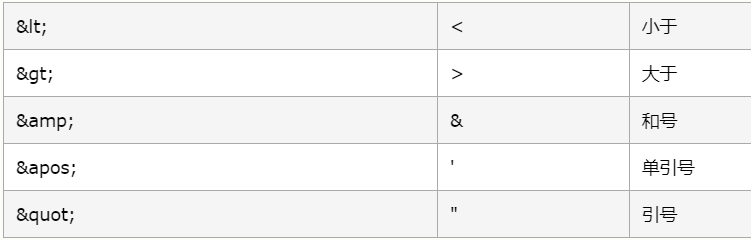

# XML

>   Extensible Markup Language 可扩展标记语言
>
>   *独立于软件和硬件的信息传输工具*
>
>   用来结构化、存储以及传输信息
>
>   仅仅是纯文本
>
>   *XML 是对 HTML 的补充*

可扩展：标签都是自定义的。 <user>  <student>

## 功能

*   存储数据

*   配置文件

*   在网络中传输数据

## xml与html的区别

1. xml标签都是自定义的，html标签是预定义。
2. xml的语法严格，html语法松散
3. xml是传输数据的，html是展示数据


## 语法

*   xml文档的后缀名 .xml
*   xml第一行必须定义为文档声明
*   xml文档中有且仅有一个根标签
*   属性值必须使用引号(单双都可)引起来
*   标签必须正确关闭
*   xml标签名称**区分大小写**

例子：

```xml
<?xml version="1.0" encoding="ISO-8859-1"?>
<note>
<to>George</to>
<from>John</from>
<heading>Reminder</heading>
<body>Don't forget the meeting!</body>
</note>
第一行是 XML 声明。它定义 XML 的版本 (1.0) 和所使用的编码 (ISO-8859-1 = Latin-1/西欧字符集)
standalone：是否独立 
取值：
yes：不依赖其他文件, no：依赖其他文件

第二行文档的根元素（本文档是一个note(标签)）

后面有根元素的四个子元素

最后一行为根元素的结尾
```

XML文档与HTML类似，是一种树结构，必须有根元素

在 XML 中，有 5 个预定义的实体引用

| &lt;   | <    | 小于   |
| ------ | ---- | ------ |
| &gt;   | >    | 大于   |
| &amp;  | &    | 和号   |
| &apos; | '    | 单引号 |
| &quot; | "    | 引号   |




*   注释与HTML中相同

*   XML会保留空格，不会被删减
*   XML以LF存储换行

## 使用

>   通过JavaScript 来导入到 HTML中，更新HTML中的数据内容

### 规定xml文档的书写规则

作为框架的使用者(程序员)：
   			1. 能够在xml中引入约束文档
   			2. 能够简单的读懂约束文档

约束分类：

1.  DTD: 一种简单的约束技术
2.  Schema:一种复杂的约束技术

#### DTD

引入dtd文档到xml文档中

*   内部dtd：将约束规则定义在xml文档中

*   外部dtd：将约束的规则定义在外部的dtd文件中
    *   本地：<!DOCTYPE 根标签名 SYSTEM "dtd文件的位置">
    *   网络：<!DOCTYPE 根标签名 PUBLIC "dtd文件名字" "dtd文件的位置URL">

#### Sclema

引入：

1.  填写xml文档的根元素

2.  引入xsi前缀. 

    ```xml
    xmlns:xsi="http://www.w3.org/2001/XMLSchema-instance"
    ```

3.  引入xsd文件命名空间

    ```xml
    xsi:schemaLocation="http://www.itcast.cn/xml  student.xsd"
    ```

4.  为每一个xsd约束声明一个前缀,作为标识 

    ```xml
    xmlns="http://www.itcast.cn/xml" 
    ```

例子：

```xml
<students   xmlns:xsi="http://www.w3.org/2001/XMLSchema-instance"
			xmlns="http://www.itcast.cn/xml"
			xsi:schemaLocation="http://www.itcast.cn/xml  student.xsd">
```


## 操作XML文档

>   将文档中的数据读取到内存中

### 操作xml文档

		1.  解析(读取)：将文档中的数据读取到内存中
  		2.  写入：将内存中的数据保存到xml文档中。持久化的存储

###  解析xml的方式

1. DOM：将标记语言文档一次性加载进内存，在内存中形成一颗dom树
    * 优点：操作方便，可以对文档进行CRUD的所有操作

    * 缺点：占内存

2. SAX：逐行读取，基于事件驱动的。

    *   优点：不占内存。

    *   缺点：只能读取，不能增删改

### xml常见的解析器：

*   JAXP：sun公司提供的解析器，支持dom和sax两种思想
*   DOM4J：一款非常优秀的解析器
*   Jsoup：jsoup 是一款Java 的HTML解析器，可直接解析某个URL地址、HTML文本内容。它提供了一套非常省力的API，可通过DOM，CSS以及类似于jQuery的操作方法来取出和操作数据。
*   PULL：Android操作系统内置的解析器，sax方式的。


## Jsoup解析器

>   是一款Java 的HTML解析器，可直接解析某个URL地址、HTML文本内容。它提供了一套非常省力的API，可通过DOM，CSS以及类似于jQuery的操作方法来取出和操作数据

步骤：

1.  导入jar包获取
2.  Document对象 
3.  获取对应的标签
4.  Element对象获取数据


### 对象的使用

1. Jsoup：工具类，可以解析html或xml文档，返回Document

   *    parse：解析html或xml文档，返回Document
        * parse(File in, String charsetName)：解析xml或html文件的

        * parse(String html)：解析xml或html字符串

        * parse(URL url, int timeoutMillis)：通过网络路径获取指定的html或xml的文档对象

2. Document：文档对象。代表内存中的dom树

*   获取Element对象
  
     *   getElementById(String id)：根据id属性值获取唯一的element
     *   getElementsByTag(String tagName)：根据标签名称获取元素对象集合
     *   getElementsByAttribute(String key)：根据属性名称获取元素对象集合
*   getElementsByAttributeValue(String key, String value)：根据对应的属性名和属性值获取元素对象集合
  
     

3. Elements：元素Element对象的集合。可以当做 ArrayList<Element>来使用

   1.  Element：元素对象
   2.  获取子元素对象

       *   getElementById(String id)：根据id属性值获取唯一的element对象
       *   getElementsByTag(String tagName)：根据标签名称获取元素对象集合
       *   getElementsByAttribute(String key)：根据属性名称获取元素对象集合
       *   getElementsByAttributeValue(String key, String value)：根据对应的属性名和属性值获取元素对象集合

      	3. 获取属性值
                * String attr(String key)：根据属性名称获取属性值
      	4. 获取文本内容
                * String text():获取文本内容
                * String html():获取标签体的所有内容(包括字标签的字符串内容)
        5. Node：节点对象

            * 是Document和Element的父类


### 快捷查询方式

*   selector:选择器
    使用的方法：Elements	select(String cssQuery)
    语法：参考Selector类中定义的语法
*   XPath：XPath即为XML路径语言，它是一种用来确定XML（标准通用标记语言的子集）文档中某部分位置的语言
    使用Jsoup的Xpath需要额外导入jar包。
    查询w3cshool参考手册，使用xpath的语法完成查询