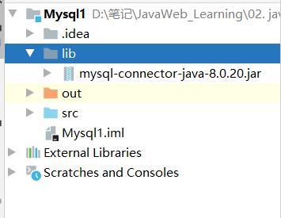
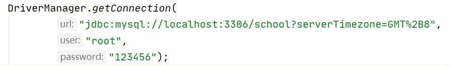
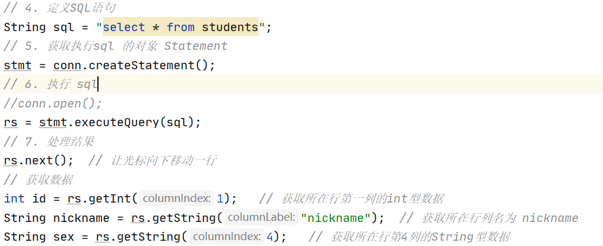

# JDBC--Java数据库连接

>   Java DataBase Connectivity Java
>
>   定义了操作所有关系型数据库的规则(接口)


**JDBC本质**：其实是官方（sun公司）定义的一套操作所有关系型数据库的规则，即接口。各个数据库厂商去实现这套接口，提供数据库驱动jar包。我们可以使用这套接口（JDBC）编程，真正执行的代码是驱动jar包中的实现类


## 使用步骤

1.  导入驱动jar包
  在项目目录下创建文件夹 lib 将下来的jar包复制粘贴到里面，将lib文件夹右键 `add to library`

  

2.  编写代码，注册驱动

3.  获取数据库连接对象  Connection

4.  定义SQL

5.  获取执行 SQL语句的对象 Statement

6.  执行 SQL  接受返回结果

7.  处理结果

8.  释放资源

完整代码

```java
import java.sql.*;

public class JdbcDemo1 {
    public static void main(String[] args) throws ClassNotFoundException, SQLException {
        // 1. 导入驱动jar包
        // 2. 注册驱动
        Class.forName("com.mysql.cj.jdbc.Driver");
        // Class.forName("org.gjt.mm.mysql.Driver");
        // 3. 获取数据库的连接对象
        Connection connection = DriverManager.getConnection(
     "jdbc:mysql://localhost:3306/school?serverTimezone=GMT%2B8", 		"root","123456");   // 这里一定要注意使用英文字符,中英文的斜杠字符差不多 / /
        // ?serverTimezone=GMT%2B8  保证编码的正常
            			
        // 4. 定义SQL语句
        String sql = 
            "update students set `name` = '苍井空' where id = 4";
        // 5. 获取执行sql 的对象 Statement
        Statement statement = connection.createStatement();
        // 6. 执行 sql
        int count = statement.executeUpdate(sql);
        // 7. 处理结果
        System.out.println(count);
        // 8. 释放资源
        stmt.close();
        conn.close();
    }
}
```


## DriverManger对象

>   驱动管理对象

功能

1.  注册驱动，告诉程序该使用哪一个数据库驱动 jar

```java
static void registerDriver(Driver driver)
// 使用jar包    
Class.forName("com.mysql.cj.jdbc.Driver"); // 在版本5后,可以不写
查看jar包下的Driver.java
发现含有可以自动运行的静态代码块
static {
    try {
         java.sql.DriverManager.registerDriver(new Driver());
    } catch (SQLException E) {
         throw new RuntimeException("Can't register driver!");
    }
}
```

2.  获取数据库连接：

```java
方法：
static Connection getConnection(String url, String user, String password)
参数：url: 连接路径 
	 语法：jdbc.mysql://ip地址(域名):端口号/数据库名称
	 若是连接本机数据库  ip地址:端口号 可以不写
```



## Connection对象

>   数据库连接对象

1.  获取执行 SQL 的对象

```java
Statement createStatement()
PrepareStatement prepareStatement(String sql)
```

2.  管理事务：

```java
开启事务
setAutoCommit(boolean autoCommit) : 调用方法设置参数为false,开启事务
提交事务
commit()
回滚事务
rollback()
```


## Statement: 执行SQL对象

1.  执行SQL

```java
boolean execute(String sql) ： 可以执行任意的SQL
int executeUpdate(String sql)  
返回值为: 影响的行数 int型 >0为成功  < 0 为失败
执行DML(INSERT, UPDATE, DELETE)语句, DDL(CREATE, ALTER, DROP)语句
    
ResultSet executeQuery(String sql):  
执行DQL(SELECT)语句 返回封装后的查询结果
// 4. 定义SQL语句
String sql = "select * from students";
// 5. 获取执行sql 的对象 Statement
Statement stmt = conn.createStatement();
// 6. 执行 sql
ResultSet rs = stmt.executeQuery(sql);
// 7. 处理结果
rs.next();  // 让光标向下移动一行
// 获取数据
int id = rs.getInt(1);   // 获取所在行第一列的int型数据
String nickname = rs.getString("nickname");  
// 获取所在行列名为 nickname
String sex = rs.getString(4);   // 获取所在行第4列的String型数据
```




**优化的ResultSet**

```java
检查当前行是否是最后一行  再进行数据处理
boolean next();  进入当前行的下一行  若下一行为空 则 false
// 判断是否有数据
if(rs.next()){
	int id = rs.getInt(1);   
	String nickname = rs.getString("nickname");  
	String sex = rs.getString(4); 
}
// 或者通过while循环
while(rs.next()){
    int id = rs.getInt(1);   
	String nickname = rs.getString("nickname");  
	String sex = rs.getString(4); 
}
```

```java
// 实例
while(rs.next()) {  
    int id = rs.getInt(1);   
    String name = rs.getString("name");  // 获取所在行列名为 nickname
    String nickname = rs.getString("nickname");  // 获取所在行列名为 nickname
    String sex = rs.getString(4);   // 获取所在行第4列的String型数据
    // 输出
    System.out.println(
        id + "---" + name + "---" + nickname + "---" + sex);
}
```


**PreparedStatement: 执行SQL的对象**