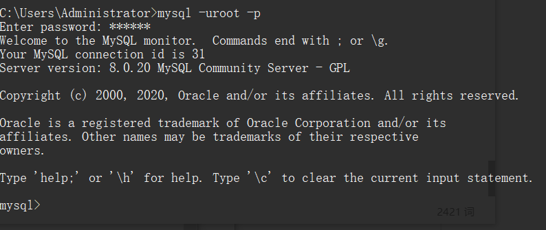
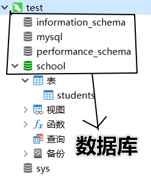
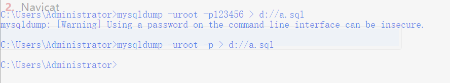
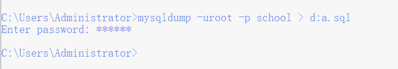
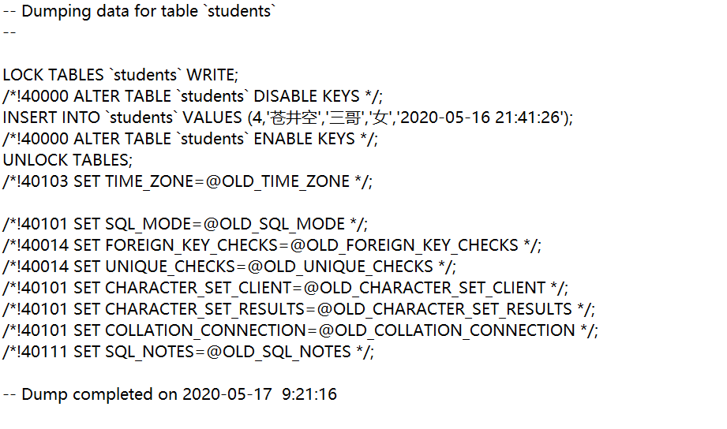
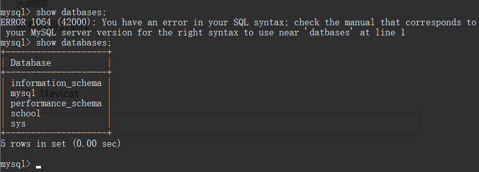
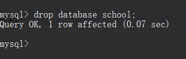
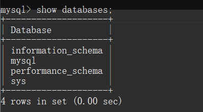
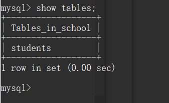
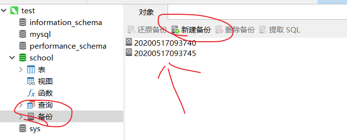

# MySQL

## 配置

MySQL服务启动

-   管理员模式打开cmd 

-   ```cmd
    mysql -uroot -p
    ```

    

MySQL登录, 退出

-   mysql -uroot -proot
-   exit   quit 

MySQL目录结构

-   数据库：文件夹
-   表：文件
-   数据：文件中存储的字节

```SQL
SELECT  [ALL|DISTINCT]  <列名> as <别称>  [,<表名> as <别称> ].... FROM <表名> as <别称> [,<表名> as <别称> ].... 
where <条件>  
GROUP BY  <列名> 
HAVING  <条件> 
ORDER BY <列名>  [ASC|DESC]
```


## SQL

>   Structured Query Language  结构化查询语言
>
>   定义了操作关系性数据库的规则
>
>   存在一定的版本之间的差异

### SQL通用语法

-   SQL 语句以单行，多行书写，以分号结尾
-   不区分大小写 关键字建议大写
-   -- 单行注释       # 注释内容
-   /* 多行注释 */

>   结构化查询语言
>
>   SQL 是用于访问和处理数据库的标准的计算机语言
>
>   与数据库系统进行交流的语言，通过SQL对数据库进行操作

-   SQL 指结构化查询语言
-   SQL 使我们有能力访问数据库
-   SQL 是一种 ANSI 的标准计算机语言

>   存在着很多不同版本的 SQL 语言
>
>   除了 SQL 标准之外，大部分 SQL 数据库程序都拥有它们自己的私有扩展


## 在您的网站中使用 SQL

要创建发布数据库中数据的网站，您需要以下要素：

-   RDBMS 数据库程序（比如 MS Access, SQL Server, MySQL）
-   服务器端脚本语言（比如 PHP 或 ASP）
-   SQL
-   HTML / CSS


>   您需要在数据库上执行的大部分工作都由 SQL 语句完成
>
>   SQL对**大小写不敏感**
>
>   某些数据库系统要求在每条 SQL 命令的末端使用分号，这样就可以在对服务器的相同请求中执行一条以上的语句

```SQL
从表中选取LastName列的数据
SELECT LastName FROM Persons
```


### DML	DDL

>   **把 SQL 分为两个部分：数据操作语言 (DML) 和 数据定义语言 (DDL)**
>
>   DML（Data Manipulation Language）
>
>   DDL    (Data Definition Language)


查询和更新指令构成了 SQL 的 DML 部分：

-   *SELECT* - 从数据库表中获取数据
-   *UPDATE* - 更新数据库表中的数据
-   *DELETE* - 从数据库表中删除数据
-   *INSERT INTO* - 向数据库表中插入数据

数据定义语言 (DDL) 使我们有能力创建或删除表格。我们也可以定义索引（键），规定表之间的链接，以及施加表间的约束




## SQL 中最重要的 DDL 语句: 

```SQL
CREATE DATABASE - 创建新数据库
-- CREATE DATABASE school;

USE school;    -- 使用数据库 school

ALTER DATABASE - 修改数据库
CREATE TABLE - 创建新表
CREATE TABLE 'student'(
	'id' INT NOT NULL AUTO_INCREMENT,
	'name' VARCHAR(200) NOT NULL
);    -- 常见类型有  int, char, varchar, datetime
	  -- char 字节数固定  varchar 会根据数据调整字节长度
	  
ALTER TABLE - 变更（改变）数据库表
DROP TABLE - 删除表
CREATE INDEX - 创建索引（搜索键）
DROP INDEX - 删除索引
```


## **SELECT 和 SELECT \* 语句**

>   SELECT 语句用于从表中选取数据，结果被存储在一个结果表中（称为结果集）

```sql
SQL语法
SELECT 列名称 FROM 表名称
或者
SELECT * FROM 表名称

获取名为 "LastName" 和 "FirstName" 的列的内容（从名为 "Persons" 的数据库表）
SELECT LastName,FirstName FROM Persons
```


从 "Persons" 表中选取所有的列。

请使用符号 * 取代列的名称，就像这样：

```sql
星号（*）是选取所有列的快捷方式
SELECT * FROM Persons
```


### 在结果集（result-set）中导航

**由 SQL 查询程序获得的结果被存放在一个结果集中**。大多数数据库软件系统都允许使用编程函数在结果集中进行导航，比如：Move-To-First-Record、Get-Record-Content、Move-To-Next-Record 等等。


## **SQL SELECT DISTINCT 语句**

```sql
关键词 DISTINCT 用于返回唯一不同的值  
SELECT DISTINCT 列名称 FROM 表名称

如果要从 "Company" 列中选取所有的值，我们需要使用 SELECT 语句
SELECT Company FROM Orders
```


## **SQL WHERE 子句**

>   **WHERE 子句用于规定选择的标准**

有条件地从表中选取数据，可将 WHERE 子句添加到 SELECT 语句

```sql
SELECT 列名称 FROM 表名称 WHERE 列 运算符 值;
```


### 使用 WHERE 子句

如果只希望选取居住在城市 "Beijing" 中的人，我们需要向 SELECT 语句添加 WHERE 子句：

```sql
SELECT * FROM Persons WHERE City='Beijing'
```


-   SQL 使用单引号来环绕*文本值*（大部分数据库系统也接受双引号）。如果是*数值*，请不要使用引号

### 文本值：

```sql
这是正确的：
SELECT * FROM Persons WHERE FirstName='Bush'

这是错误的：
SELECT * FROM Persons WHERE FirstName=Bush
```


### 数值：

```sql
这是正确的：
SELECT * FROM Persons WHERE Year>1965

这是错误的：
SELECT * FROM Persons WHERE Year>'1965'
```


## **SQL AND & OR 运算符**

>   **AND 和 OR 运算符用于基于一个以上的条件对记录进行过滤**

与语言中的 and or  用法相同


使用 AND 来显示所有姓为 "Carter" 并且名为 "Thomas" 的人：

```sql
SELECT * FROM Persons WHERE FirstName='Thomas' AND LastName='Carter'
```


**or同理**


#### 结合 AND 和 OR 运算符

我们也可以把 AND 和 OR 结合起来（使用圆括号来组成复杂的表达式）:

```sql
SELECT * FROM Persons WHERE (FirstName='Thomas' OR FirstName='William')
AND LastName='Carter'
```


## **SQL ORDER BY 子句**

>   **ORDER BY 语句用于对结果集进行排序**
>
>   默认为升序，使用DESC关键字改为降序


以字母顺序显示公司名称：

从Orders表中选中 company，ordernumber列进行操作

```sql
SELECT Company, OrderNumber FROM Orders ORDER BY Company
```


以字母顺序显示公司名称（Company），并以数字顺序显示顺序号（OrderNumber）：

```sql
SELECT Company, OrderNumber FROM Orders ORDER BY Company, OrderNumber
```


以逆字母顺序显示公司名称：

```sql
SELECT Company, OrderNumber FROM Orders ORDER BY Company DESC
```

**注意：**当结果中列出现相同数据。只有这一次，在第一列中有相同的值时，第二列是以升序排列的。如果第一列中有些值为 nulls 时，情况也是这样的。


## **SQL INSERT INTO 语句**

>   INSERT INTO 语句用于向表格中插入新的行

### 语法

```sql
insert 插入      value 值
INSERT INTO 表名称 VALUES (值1, 值2,....)
```

我们也可以指定所要插入数据的列：

```sql
table  表
INSERT INTO table_name (列1, 列2,...) VALUES (值1, 值2,....)
```


插入新的行

"Persons" 表：

| LastName | FirstName | Address        | City    |
| :------- | :-------- | :------------- | :------ |
| Carter   | Thomas    | Changan Street | Beijing |

SQL 语句：

```sql
INSERT INTO Persons VALUES ('Gates', 'Bill', 'Xuanwumen 10', 'Beijing')
```

结果：

| LastName | FirstName | Address        | City    |
| :------- | :-------- | :------------- | :------ |
| Carter   | Thomas    | Changan Street | Beijing |
| Gates    | Bill      | Xuanwumen 10   | Beijing |


在指定的列中插入数据

"Persons" 表：

| LastName | FirstName | Address        | City    |
| :------- | :-------- | :------------- | :------ |
| Carter   | Thomas    | Changan Street | Beijing |
| Gates    | Bill      | Xuanwumen 10   | Beijing |

SQL 语句：

```sql
指定数据添加
INSERT INTO Persons (LastName, Address) VALUES ('Wilson', 'Champs-Elysees')
```

结果：

| LastName | FirstName | Address        | City    |
| :------- | :-------- | :------------- | :------ |
| Carter   | Thomas    | Changan Street | Beijing |
| Gates    | Bill      | Xuanwumen 10   | Beijing |
| Wilson   |           | Champs-Elysees |         |


## **SQL UPDATE 语句**

>   Update 语句用于修改表中的数据

### 


```sql
UPDATE 表名称 SET 列名称 = 新值 WHERE 列名称 = 某值
```


**Person:**

| LastName | FirstName | Address        | City    |
| :------- | :-------- | :------------- | :------ |
| Gates    | Bill      | Xuanwumen 10   | Beijing |
| Wilson   |           | Champs-Elysees |         |

**更新某一行中的一个列**

我们为 lastname 是 "Wilson" 的人添加 firstname：

```sql
UPDATE Person SET FirstName = 'Fred' WHERE LastName = 'Wilson' 
```

结果：

| LastName | FirstName | Address        | City    |
| :------- | :-------- | :------------- | :------ |
| Gates    | Bill      | Xuanwumen 10   | Beijing |
| Wilson   | Fred      | Champs-Elysees |         |


**更新某一行中的若干列**

我们会修改地址（address），并添加城市名称（city）：

```sql
UPDATE Person SET Address = 'Zhongshan 23', City = 'Nanjing' WHERE LastName = 'Wilson'
```

结果：

| LastName | FirstName | Address      | City    |
| :------- | :-------- | :----------- | :------ |
| Gates    | Bill      | Xuanwumen 10 | Beijing |
| Wilson   | Fred      | Zhongshan 23 | Nanjing |


## **SQL DELETE 语句**

>   DELETE 语句用于删除表中的行

```sql
DELETE FROM 表名称 WHERE 列名称 = 值
```


**Person:**

| LastName | FirstName | Address      | City    |
| :------- | :-------- | :----------- | :------ |
| Gates    | Bill      | Xuanwumen 10 | Beijing |
| Wilson   | Fred      | Zhongshan 23 | Nanjing |

**删除某行**

"Fred Wilson" 会被删除：

```sql
DELETE FROM Person WHERE LastName = 'Wilson' 
```

结果:

| LastName | FirstName | Address      | City    |
| :------- | :-------- | :----------- | :------ |
| Gates    | Bill      | Xuanwumen 10 | Beijing |


**删除所有行**

可以在不删除表的情况下删除所有的行。这意味着表的结构、属性和索引都是完整的：

```sql
DELETE FROM table_name
```

或者：

### 建表语句

```SQL
CREATE TABLE 'STUDENT'(
'ID' INT NOT NULL AUTO_INCREMENT PRIMARY KEY, 'NAME' VARCHAR(200) NOT NULL
);
--int 指定了数据类型
--NOT NULL  指定了数据不可谓空
--PRIMARY KEY  必须有元素为关键  此元素不可重复
```

#### 常见类型

```sql
int, char, varchar, datetime
--char 与 varchar 的区别
--char 指定大小后  char(200)，无论数据多大，都会分配200个内存
--varchar 会根据数据大小来分配内存，最大为200（指定的数）
--datetime 日期，时间
```

### 插入语句

```sql
INSERT INTO '表名' VALUE(2,'张三');
--VALUE 代表第一条记录  值

--指定插入
INSERT INTO '表名' ('NAME', 'ID', 'NICKNAME','DATATINE') VALUE('张三', '2344', '三哥', '2019.02.02')；

--多条插入
INSERT INTO '表名' VALUE
	('张三1', '三哥'),
	('张三2', '三哥1'),
	('张三3', 'sange2')
;
```

### 查询语句

```sql
--按条件查询
SELECT ID NAME FRON SCHOOLDOG WHERE ID = 1 ORDER BY ID DESC;
SELECT 后面指定了要查询的列，FROM 指定了要查询的表，WHERE 为条件
ORDER BY ID 以ID正序排列
DESC属性  倒叙
```

#### 分页查询

```sql
SELECT ID, NAMEE FROM schooldog WHERE ID > 0 ORDER BY ID LIMIT x, y;
--LIMIT 为分页
--LIMIT [第一条数据的索引],[本次打印数据的数量]
```


## 数据库的备份

1.  命令行的方式

```java
mysqldump -u用户名 -p密码 > 保存路径
```



若无密码 则为空

在指定位置生成


备份指定数据库

```java
mysqldump -uroot -p 数据库名称 > 指定位置
```



a.sql文件内容




还原数据库

先删除

查看现有数据库  show databases;



删除数据库  school

```sql
drop database school;
```



```sql
show databases;
```




```sql
-- 先创建数据库 
create database school;
-- 使用数据库
use school;
-- 使用备份
source d://a.sql;
-- 查看
show tables;
```





2.  Navicat

直接点击备份即可



