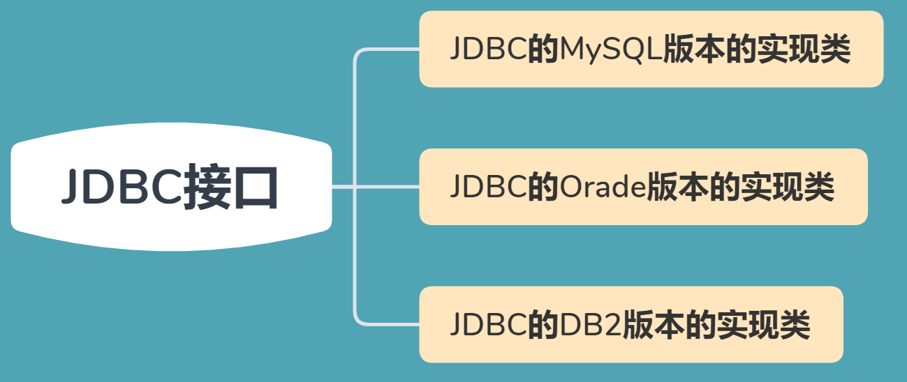
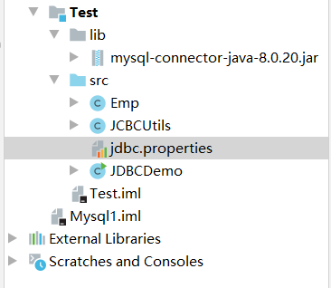
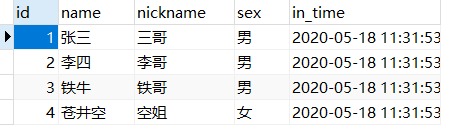
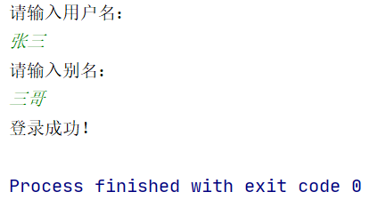
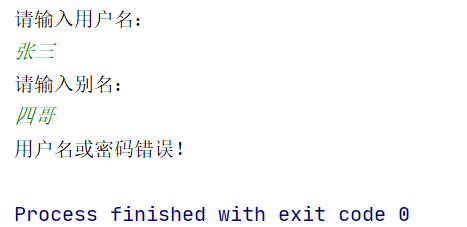
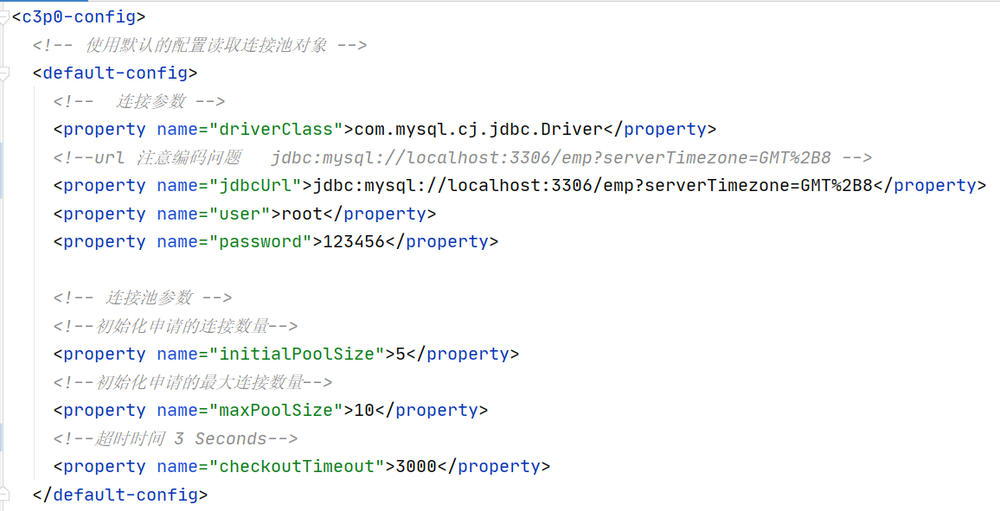
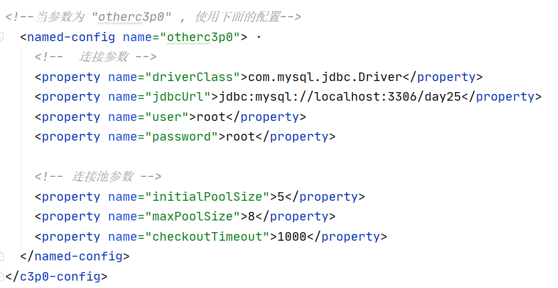
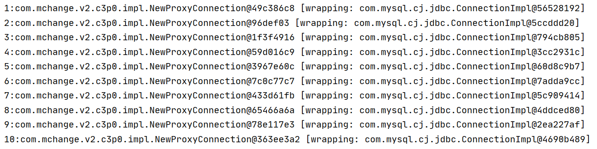
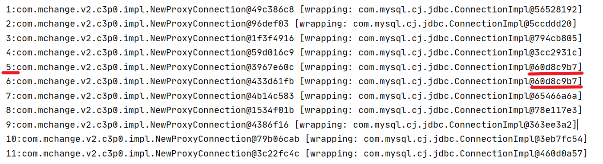

# JDBC--Java数据库连接

>   Java DataBase Connectivity Java
>
>   定义了操作所有关系型数据库的规则(接口)




**JDBC本质**：其实是官方（sun公司）定义的一套操作所有关系型数据库的规则，即接口。各个数据库厂商去实现这套接口，提供数据库驱动jar包。我们可以使用这套接口（JDBC）编程，真正执行的代码是驱动jar包中的实现类


## 使用步骤

1.  导入驱动jar包
  在项目目录下创建文件夹 lib 将下来的jar包复制粘贴到里面，将lib文件夹右键 `add to library`

  

2.  编写代码，注册驱动

3.  获取数据库连接对象  Connection

4.  定义SQL

5.  获取执行 SQL语句的对象 Statement

6.  执行 SQL  接受返回结果

7.  处理结果

8.  释放资源

完整代码

```java
import java.sql.*;

public class JdbcDemo1 {
    public static void main(String[] args) throws ClassNotFoundException, SQLException {
        // 1. 导入驱动jar包
        // 2. 注册驱动
        Class.forName("com.mysql.cj.jdbc.Driver");
        // Class.forName("org.gjt.mm.mysql.Driver");
        // 3. 获取数据库的连接对象
        Connection connection = DriverManager.getConnection(
     "jdbc:mysql://localhost:3306/school?serverTimezone=GMT%2B8", 	   "root",
     "123456"
        );   // 这里一定要注意使用英文字符,中英文的斜杠字符差不多 / /
        // ?serverTimezone=GMT%2B8  保证编码的正常
            			
        // 4. 定义SQL语句
        String sql = 
            "update students set `name` = '苍井空' where id = 4";
        // 5. 获取执行sql 的对象 Statement
        Statement statement = connection.createStatement();
        // 6. 执行 sql
        int count = statement.executeUpdate(sql);
        // 7. 处理结果
        System.out.println(count);
        // 8. 释放资源
        stmt.close();
        conn.close();
    }
}
```


## DriverManger对象

>   驱动管理对象

功能

1.  注册驱动，告诉程序该使用哪一个数据库驱动 jar

```java
static void registerDriver(Driver driver)
// 使用jar包    
Class.forName("com.mysql.cj.jdbc.Driver"); // 在版本5后,可以不写
查看jar包下的Driver.java
发现含有可以自动运行的静态代码块
static {
    try {
         java.sql.DriverManager.registerDriver(new Driver());
    } catch (SQLException E) {
         throw new RuntimeException("Can't register driver!");
    }
}
```

2.  获取数据库连接：

```java
方法：
static Connection getConnection(String url, String user, String password)
参数：url: 连接路径 
	 语法：jdbc.mysql://ip地址(域名):端口号/数据库名称
	 若是连接本机数据库  ip地址:端口号 可以不写
```


## Connection对象

>   数据库连接对象

1.  获取执行 SQL 的对象

```java
Statement createStatement()
PrepareStatement prepareStatement(String sql)
```

2.  管理事务：

```java
开启事务
setAutoCommit(boolean autoCommit) : 调用方法设置参数为false,开启事务
提交事务
commit()
回滚事务
rollback()
```


## Statement: 执行SQL对象

1.  执行SQL

```java
boolean execute(String sql) ： 可以执行任意的SQL
int executeUpdate(String sql)  
返回值为: 影响的行数 int型 >0为成功  < 0 为失败
执行DML(INSERT, UPDATE, DELETE)语句, DDL(CREATE, ALTER, DROP)语句
    
ResultSet executeQuery(String sql):  
执行DQL(SELECT)语句 返回封装后的查询结果
// 4. 定义SQL语句
String sql = "select * from students";
// 5. 获取执行sql 的对象 Statement
Statement stmt = conn.createStatement();
// 6. 执行 sql
ResultSet rs = stmt.executeQuery(sql);
// 7. 处理结果
rs.next();  // 让光标向下移动一行
// 获取数据
int id = rs.getInt(1);   // 获取所在行第一列的int型数据
String nickname = rs.getString("nickname");  
// 获取所在行列名为 nickname
String sex = rs.getString(4);   // 获取所在行第4列的String型数据
```


**优化的ResultSet**

```java
检查当前行是否是最后一行  再进行数据处理
boolean next();  进入当前行的下一行  若下一行为空 则 false
// 判断是否有数据
if(rs.next()){
	int id = rs.getInt(1);   
	String nickname = rs.getString("nickname");  
	String sex = rs.getString(4); 
}
// 或者通过while循环
while(rs.next()){
    int id = rs.getInt(1);   
	String nickname = rs.getString("nickname");  
	String sex = rs.getString(4); 
}
```

```java
// 实例
while(rs.next()) {  
    int id = rs.getInt(1);   
    String name = rs.getString("name");  // 获取所在行列名为 nickname
    String nickname = rs.getString("nickname");  // 获取所在行列名为 nickname
    String sex = rs.getString(4);   // 获取所在行第4列的String型数据
    // 输出
    System.out.println(
        id + "---" + name + "---" + nickname + "---" + sex);
}
```


**PreparedStatement: 执行SQL的对象**


## 抽取JDBC工具类：JDBCUtils

>   简化书写

-   注册驱动抽取

-   抽取一个方法获取连接对象

    不想传入参数，还得保证工具类的通用性

    采用配置文件的方式

    jdbc.properties

    ```properties
    url = jdbc:mysql://localhost:3306/emp?serverTimezone=GMT%2B8
    user = root
    password = 123456
    driver = com.mysql.cj.jdbc.Driver
    ```

    

    此时只需要读取文件即可

    ```java
        private static String url;
        private static String user;
        private static String password;
        private static String driver;
        /**
         * 文件的读取，只需要读取一次即可拿到这些值。使用静态代码块
         */
        static{
            //读取资源文件，获取值。
    
            try {
                //1. 创建Properties集合类。
                Properties pro = new Properties();
    
                //获取src路径下的文件的方式--->ClassLoader 类加载器			ClassLoader classLoader =
                	JDBCUtils.class.getClassLoader();
             	URL res  = 
                	classLoader.getResource("jdbc.properties");
                String path = res.getPath();
               // 		
             System.out.println(path);///D:/IdeaProjects/itcast/out/production/day04_jdbc/jdbc.properties
                //2. 加载文件
               // pro.load(new FileReader("D:\\IdeaProjects\\itcast\\day04_jdbc\\src\\jdbc.properties"));
                pro.load(new FileReader(path));
    
                //3. 获取数据，赋值
                url = pro.getProperty("url");
                user = pro.getProperty("user");
                password = pro.getProperty("password");
                driver = pro.getProperty("driver");
                //4. 注册驱动
                Class.forName(driver);
            } catch (IOException e) {
                e.printStackTrace();
            } catch (ClassNotFoundException e) {
                e.printStackTrace();
            }
        }
    ```

    

-   抽取一个方法释放资源


### 练习

工具类  **JDBCUtils.java**

```java
import java.sql.Connection;
import java.sql.ResultSet;
import java.sql.SQLException;
import java.sql.Statement;

//JDBC 工具类
public class JCBCUtils {
    // 获取连接
    public static Connection getConnection(){
        return null;
    }

    // 释放资源
    public static void close(ResultSet rs, Statement stmt, Connection conn){
        if(stmt != null){
            try{
                stmt.close();
            }catch (SQLException e){
                e.printStackTrace();
            }
        }

        if(conn != null){
            try{
                conn.close();
            }catch (SQLException e){
                e.printStackTrace();
            }
        }
    }
}
```

配置文件  **jdbc.properties**

```properties
# 根据实际情况改动
url = jdbc:mysql://localhost:3306/emp?serverTimezone=GMT%2B8
user = root
password = 123456
driver = com.mysql.cj.jdbc.Driver
```

实现类  **JDBCDemo3.java**

```java
import java.sql.Connection;
import java.sql.ResultSet;
import java.sql.SQLException;
import java.sql.Statement;
import java.util.Scanner;

public class JDBCDemo3 {

    // 执行语句
    public static void main(String[] args) {
        //1.键盘录入，接受用户名和密码
        Scanner sc = new Scanner(System.in);
        System.out.println("请输入用户名：");
        String username = sc.nextLine();
        System.out.println("请输入别名：");
        String password = sc.nextLine();
        //2.调用方法
        boolean flag = new JDBCDemo3().login(username, password);
        //3.判断结果，输出不同语句
        if(flag){
            //登录成功
            System.out.println("登录成功！");
        }else{
            System.out.println("用户名或密码错误！");
        }
    }

    //
    public boolean login(String username, String password){
        if(username == null || password == null)
            return false;

        Connection conn = null;
        Statement stmt = null;
        ResultSet rs = null;
        try{
            // 1. 获取连接
            conn = JCBCUtils.getConnection();
            // 2. 定义SQL
            String sql = 
"select * from students where name = '"+username+"' and nickname = '"+password+"' ";
            // System.out.println(sql);
            // 3. 获取执行SQL对象
            stmt = conn.createStatement();
            // 4. 执行查询
            rs = stmt.executeQuery(sql);
            return rs.next();  // 如果有下一行返回 true

        } catch (SQLException throwables) {
            throwables.printStackTrace();
        }finally {
            // 关闭资源
            JCBCUtils.close(rs, stmt, conn);
        }
        return false;
    }
}
```

**数据库 emp表格students**



执行结果：






## JDBC控制事务

1.  事务：一个包含多个步骤的业务操作。如果这个业务操作被事务管理，可能同时成功，可能同时失败

2.  操作：

    1.  开启事务
    2.  提交事务
    3.  回滚事务

3.  使用 Connection 对象来管理事务

    -   开启事务    在执行 SQL 之前开启事务

    ```java
    setAutoCommit(boolean autoCommit)
    调用该方法设置参数为false 即开启事务
    ```

    -   提交事务   当所有 SQL 都执行完提交事务

    ```java
    commit()
    ```

    -   回滚事务  在 catch 中回滚事务

    ```java
    rollback()
    ```

    实例： 代码片段

    ```java
    // 1. 获取连接
    connection = JCBCUtils.getConnection();
    // 开启事务
    connection.setAutoCommit(false);
    // 2. 定义SQL
    String sql1 = "update emp set money = money - ? where id = ?";
    String sql2 = "update emp set money = money + ? where id = ?";
    ```

    ```java
    // 5. 执行 SQL
    pstmt1.executeUpdate();
    pstmt2.executeUpdate();
    // 提交事务
    connection.commit();
    ```

    ```java
    }catch (Exception e){
    	if(connection != null){   // 当事务执行发生异常，进行回滚操作
    		connection.rollback();
    	}
    	e.printStackTrace();
    }finally {
    	JCBCUtils.close(pstmt1, connection);
    	JCBCUtils.close(pstmt2, connection);
    }
    ```


# 数据库连接池

>   其实就是一个容器（集合），存放数据库连接的容器
>
>   与线程池原理相似

## 实现

接口： `DataSource` 

方法： 

-   获取连接 getConnection()

-   归还连接 Connection.close()  归还而不是关闭

一般由数据库厂商实现

-   ​	C3P0: 数据库连接池技术
-   ​    Druid: 数据库连接池实现技术，由阿里巴巴提供


## C3P0：数据库连接池技术

**配置文件 c3p0-config.xml** 

默认配置



传入参数使用其他配置

```java
DataSource dataSource = new ComboPooledDataSource("otherc3p0");
```




-   规定了 url, user, password, driverClass  初始化连接数量  最大连接数量

```java
public class C3P0Demo2 {
    public static void main(String[] args) throws SQLException {
        // 1. 调用配置文件，使用默认参数
        DataSource dataSource = new ComboPooledDataSource();
        // 2. 申请10 个连接并打印
        for(int i = 1; i <= 10; i ++){
            Connection connection = dataSource.getConnection();
            System.out.println(i + ":" + connection);
        }
    }
}
```



当连接数超过10时，会等待3 秒 报错

```java
Exception in thread "main" java.sql.SQLException: An attempt by a client to checkout a Connection has timed out.
```

高效利用连接的方法，使用完毕立即 close()  归还

```java
public class C3P0Demo2 {
    public static void main(String[] args) throws SQLException {
        // 1.
        DataSource dataSource = new ComboPooledDataSource();
        // 2.
        for(int i = 1; i <= 11; i ++){
            Connection connection = dataSource.getConnection();
            System.out.println(i + ":" + connection);

            if(i == 5){   // 连接5 会归还连接  所以会多出一个空闲
                connection.close();
            }
        }
    }
}
```




## Druid: 数据库连接池  阿里巴巴

1. 步骤：
    1.  定义配置文件：

        -   properties 形式
        -   需要自己指定所在目录
    2.  加载配置文件
    3.  获取数据库连接池对象  DruidDataSourceFactory
    4.  获取连接

2. 定义工具类  与上个类似
	1. 定义一个类 JDBCUtils
	2. 提供静态代码块加载配置文件, 初始化
	3. 提供方法
		-  获取连接方法
		-  释放资源
		-  获取连接池的方法


# Spring JDBC

>   Spring 提供的 JDBC 简单封装

提供了一个 JDBCTemplate 对象简化 JDBC 的开发

-   导入jar包

-   创建 JDBCTemplate 对象 

    ```java
    JDBCTemplate template = nw JDBCTemplate();
    ```

-    调用JDBCTemplate 的方法实现CRUD操作

    -   update()：执行DML语句  增、删、改语句
    -   queryForMap()：查询结果捋结果集封装为map集合
    -   queryForList()：查询结果捋结果集封装为list集合
    -   query()：查询结果，捋结果封装为JavaBean对象
    -   queryForobject：查询结果，捋结果封装为对象


## 单元测试，让方法独立执行

>   一种测试代码的常用方法

