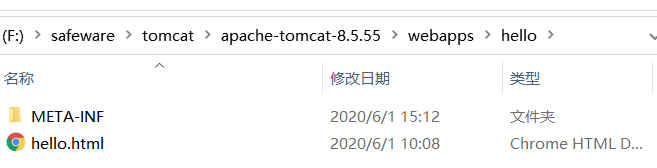
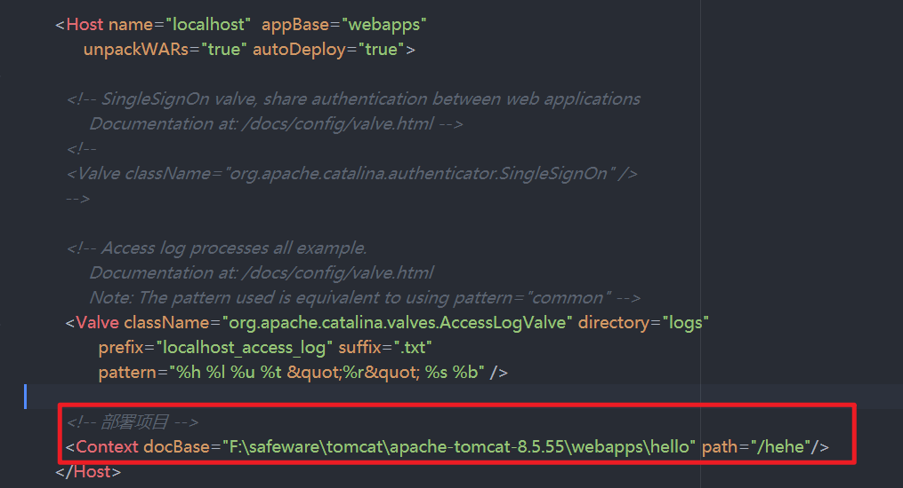
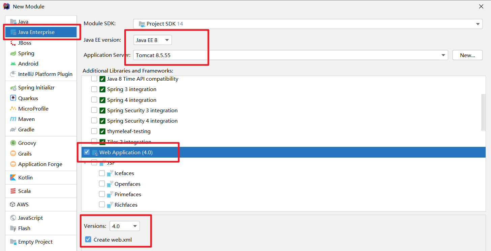
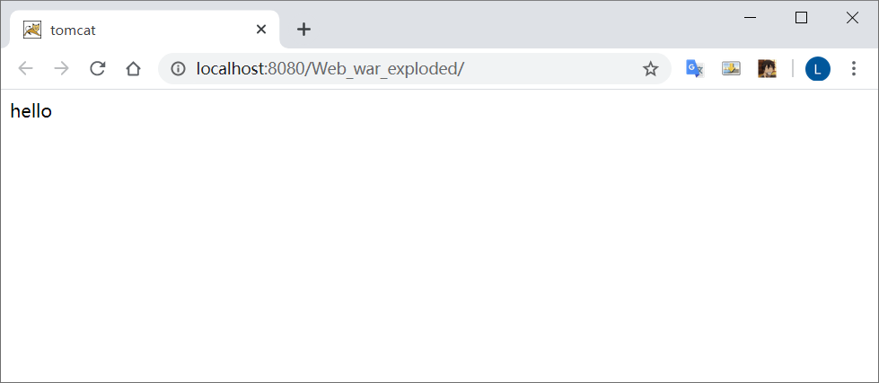
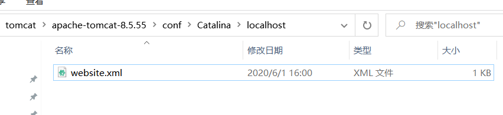

# Tomcat

web服务器软件

## Tomcat目录结构


通过bin目录下的 startup.bat来开启服务

保持开启状态

浏览器输入 http://localhost:8080


http://别人的IP:8080

可能遇到的问题：

* 黑窗口一闪而过：
  
  原因：没有正确配置环境变量JAVA_HOME

* 启动报错：
  
  找到占用的端口号，杀死进程
  
  cmd运行
  
  ```cmd
  netstate -ano
  ```
  
  找到本地地址对应的端口号，关闭即可
  
  
  
    或者是修改自身的端口号
  
    在conf中的server.xml中修改端口号
  
  ```xml
    <Connector port="8888" protocol="HTTP/1.1"
                           connectionTimeout="20000"
                           redirectPort="8445" />
  ```
  
    一般会将tomcat的默认端口号修改为80。80端口号是http协议的默认端口号
    好处：在访问时，就不用输入端口号

* 关闭
  
  运行 shutdown.bat
  
  或者在startup.bat   运行 ctrl + c

* 配置
  
  部署项目的方法：
  
  * 将项目直接放到webapps文件夹中即可
    
    ```
    /hello：项目的访问路径-->虚拟目录
    浏览器访问
    http://localhost:8080/hello/hello.html
    ```
    
    也可以简化部署：将项目打成一个war包，再将war包放置到webapps目录下
    war包会自动解压缩




* 在配置文件中设置con/server.xml文件
  
  ```XML
  在<Host> 标签体中配置
  <Context docBase="D:\hello" path="/hehe" />
  ```
  
  
  path 为虚拟路径
  
  
  
  docBase:项目存放的路径
  访问 `http://localhost:8080/hehe/hello.html`
  
  
  
缺点：不安全
  
* 在conf.Catalina/localhost 创建任意名称的 xml 文件，在文件中编写
  
  ```xml
  <Context docBase="F:\safeware\tomcat\apache-tomcat-8.5.55\webapps\hehe" />
  ```
  
  


  虚拟目录：xml文件的名称

## webapps目录的详细说明

在webapps中建立了web1目录，下面放置我们的html文件，jsp文件，图片等等，**则web1就被当做web应用管理起来**【tomcat6.0以后的版本才支持】

例子：**在webapps下创建一个web站点，在web站点下创建一个html文件，访问html文件**


## 项目形式

* 静态项目

* 动态项目：
  
  目录结构：
  
  -- 项目的根目录
  
  ​    -- WEB-INF目录：
  
  ​        -- web.xml: web 项目核心配置文件
  
  ​        -- classes目录: 放置字节码文件的目录
  
  ​        -- lib目录：放置依赖的 jar包
  
  

## 将Tomcat集成到 IDEA中




部署完成后，进行index.js配置


启动后会自动弹出页面



部署新页面，hello.html


重启服务后，后缀加上/hello.html 即可访问


修改配置，当有新项目或是代码改动时，自动重启服务


配置虚拟目录
--------------

### 为什么需要配置虚拟目录？

- 如果把所有web站点的目录都放在webapps下，可能导致**磁盘空间不够用**，也**不利于对web站点目录的管理**【如果存在非常多的web站点目录】

- 把**web站点的目录分散到其他磁盘管理就需要配置虚拟目录【默认情况下，只有webapps下的目录才能被Tomcat自动管理成一个web站点】**

- 把web应用所在目录交给web服务器管理，这个过程称之为虚拟目录的映射

### 配置虚拟目录方法一

在其他盘符下创建一个web站点目录，并创建WEB-INF目录和一个html文件。


找到Tomcat目录下/conf/server.xml文件


在server.xml中的`<Host>`节点下添加如下代码。**path表示的是访问时输入的web项目名，docBase表示的是站点目录的绝对路径**

    <Context path="/web1" docBase="D:\web1"/>

访问配置好的web站点

```url
浏览器url输入
localhost:8080/web1/1.html
即可访问
```

### 配置虚拟目录方法二

进入到conf\\Catalina\\localhost文件下，创建一个xml文件，**该文件的名字就是站点的名字**


xml文件的代码如下，**docBase是你web站点的绝对路径**

```xml
// 通过docBase 指向项目路径
<?xml version="1.0" encoding="UTF-8"?> 
<Context 
    docBase="D:\web1" 
    reloadable="true"> 
</Context> 
```

访问web站点下的html资源

```
浏览器url输入
localhost:8080/web1/1.html
即可访问
```

## 配置临时域名

访问Tomcat服务器的几种方式

•  使用localhost域名访问【localhost代表本机】

•  使用ip地址127.0.0.1访问【该ip地址也是本机】

•  使用机器名称访问【只限用于本机上或者局域网】

•  使用本机IP地址访问【***\*在cmd中输入ipconfig可以查询到本机IP地址\****】

•  还可以为机器配置临时域名

打开到 `C:\Windows\System32\drivers\etc` 打开host文件


## **设置虚拟主机**

### **什么是虚拟主机**

**多个不同域名的网站共存于一个Tomcat中**

### **为什么需要用到虚拟主机？**

例子：我现在开发了4个网站，有4个域名。如果我不配置虚拟主机，一个Tomcat服务器运行一个网站，我就需要4台电脑才能把4个网站运行起来

### **配置虚拟主机的步骤**

* 在tomcat的server.xml文件中添加主机名
  
  ```xml
  <Host name="zhongfucheng" appBase="D:\web1">
  <Context path="/web1" docBase="D:\web1"/>
  </Host>
  ```
  
  

* 访问 `http://lmc:8080/web1/hello.html`
  
  

## Tomcat体系结构


## 浏览器访问WEB资源的流程图


