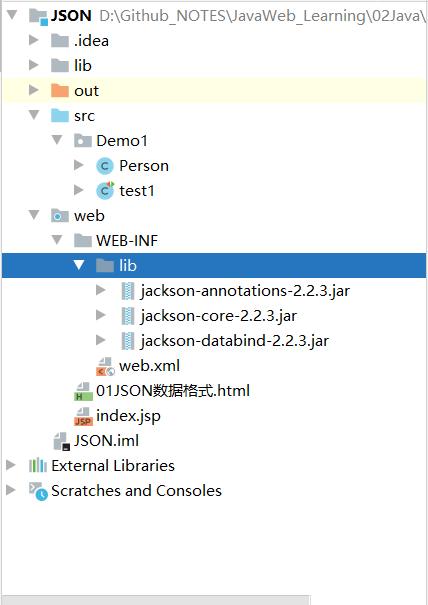
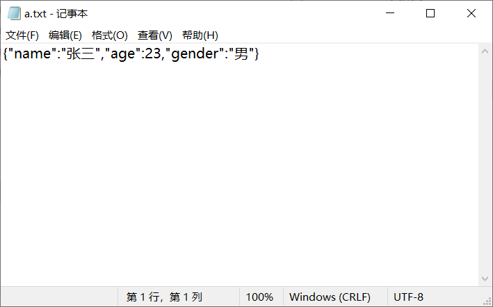

## 概念

*   `JavaScript Object Notation`    `JavaScript`表示法
*   现在多用于存储和交换文本信息
*   比 `XML` 更小，更快，更易解析

## 语法

### 基本规则

* 数据在名称/值对中：`json`数据是由键值对构成的
    * 键用引号(单双都行)引起来，也可以不使用引号
       * 值得取值类型：
          1. 数字（整数或浮点数）
          2. 字符串（在双引号中）
          3. 逻辑值（true 或 false）
          4. 数组（在方括号中）	{"persons":[{},{}]}
          5. 对象（在花括号中） {"address":{"province"："陕西"....}}
          6. null
       * 数据由逗号分隔：多个键值对由逗号分隔
       * 花括号保存对象：使用{}定义`json` 格式
       * 方括号保存数组：[]

    #### 例子

    ```html
    <!DOCTYPE html>
    <html lang="en">
    <head>
        <meta charset="UTF-8">
        <title>JSON数据格式</title>
        <script>
            // 定义基本格式
            var person = {"name":"张三", age:23, gender:true};
            alert(person);
    
            // 嵌套格式   {} --> []
            var persons = {
                "presons":[
                    {name:bob, age:23, gender: true},
                    {name:lily, age:21, gender: false},
                    {name:tom, age:20, gender: true}
                    ]
            };
            alert(persons);
    
            // 嵌套格式2   [] --> {}
            var persons1 = [
                {name:bob, age:23, gender: true},
                {name:lily, age:21, gender: false},
                {name:tom, age:20, gender: true}
            ]
            alert(person1);
        </script>
    </head>
    <body>
    
    </body>
    </html>
    ```

    

### 获取数据

获取数据的方法有三种

1.  `JSON`对象.键名
2.  `JSON`对象["键名"]
3.  数据对象[索引]

```json
// 定义基本格式
var person = {"name":"张三", age:23, gender:true};
alert(person);
        
// 获取值
var name = person.name;
var age = person["age"];
```

```json
var persons = {
	"persons":[
		{name:bob, age:23, gender: true},
		{name:lily, age:21, gender: false},
		{name:tom, age:20, gender: true}
	]
};
var name1 = persons.persons[2].name;
```

遍历获取

```json
        var persons1 = [
            {name:bob, age:23, gender: true},
            {name:lily, age:21, gender: false},
            {name:tom, age:20, gender: true}
        ]
        for(var i = 0; i < persons1.length; i++){
            var p = person1[i];
            for(var key in p){
                alert(key + ":" + p[key]);
            }
        }
```


## `JSON`解析器

*   `JSON`数据和 `Java`对象的相互转换

*   需要用到 JSON解析器

*   常见的有： `JsonLib`  `Gson` `fastjson`  `jackson`

*   这里学习 `jackson`  在`ssm`中是默认的解析器

*   Java对象 转换为 `JSON`

### 步骤

1.  导入 `jackson` 包
2.  创建 `Jackson` 核心对象 `ObjectMapper`
3.  调用 `ObjectMapper`的相关方法进行转换

在 `web`目录下的 `WEB-INF` 文件夹下导入



#### 创建一个类  测试用

```java
public class Person {

    private String name;
    private int age;
    private String gender;
    private Date birthday;

	// 一些 get set toString 方法
    }
}
```

#### 测试类

```java
import com.fasterxml.jackson.core.JsonProcessingException;
import com.fasterxml.jackson.databind.ObjectMapper;
import org.junit.Test;

public class test1 {

    // Java对象转换为 JSON字符串
    @Test
    public void test1() throws JsonProcessingException {
        // 创建Person对象
        Person person = new Person();
        person.setName("张三");
        person.setAge(23);
        person.setGender("男");
        // 创建 Jackson 的核心对象 ObjectMapper
        ObjectMapper objectMapper = new ObjectMapper();
        // 转换
        // 转换方法: writeValue(参数1, obj);
        // 参数1 可以是
        // File  将 obj 对象转换为 JSON 字符串  并保存到指定的文件中
        // Writer 将 obj 对象转换为 JSON 字符串 并将 json 数据填充到字符输出流中

        // writeValueString(obj) 将对象转为 json 字符串
        String json1 = objectMapper.writeValueAsString(person);
        System.out.println(json1);
        // {"name":"张三","age":23,"gender":"男"}
        }
}
```

将数据写到指定路径的文件中（如指定的文件不存在，则创建）

```java
// writeValue 
objectMapper.writeValue(
new File(
	"D:\\Github_NOTES\\JavaWeb_Learning\\02Java\\JavaWeb\\Code\\JSON\\a.txt"), 		person);
```



将数据关联到 writer 中

```java
// writeValue 
objectMapper.writeValue(
    new FileWriter(
    "D:\\Github_NOTES\\JavaWeb_Learning\\02Java\\JavaWeb\\Code\\JSON\\b.txt"), 		person);
}
```


将 `JSON`字符串转化为 Java对象

`readValue(json字符串数据, Class)` 

```java
import com.fasterxml.jackson.databind.ObjectMapper;
import org.junit.Test;

import java.io.IOException;

public class test5 {
    @Test
    public void test5() throws Exception{
        // 初始化 JSON 字符串
        String json = "{\"gender\":\"男\",\"name\":\"bob\",\"age\":23}";

        // 创建 ObjectMapper 对象
        ObjectMapper objectMapper = new ObjectMapper();
        // 转换为 Java对象 Person对象
        Person person = null;
        try {
            person = objectMapper.readValue(json, Person.class);
        } catch (IOException e) {
            e.printStackTrace();
        }
        System.out.println(person);
    }
}
```

输出为

```java
Person{name='bob', age=23, gender='男', birthday=null}
```


### 注解

*   `@JsonIgnore`: 排除属性
*   `@JsonFormat`: 属性值格式化

#### `@JsonFormat`

在使用注解前，增加 `Date` 类型数据   并打印

```java
// 转换
ObjectMapper objectMapper = new ObjectMapper();
String json = objectMapper.writeValueAsString(person);
System.out.println(json);
// {"name":"张三","age":23,"gender":"男","birthday":1594631346261}
```

我们发现  这个日期的数据类型的格式不易于阅读

需要注解来设置日期数据的格式

在 `Person`类中添加

```java
@JsonFormat(pattern = "yyyy-MM-dd")  // 设置属性值的格式
private Date birthday;
```

再次打印

```java
ObjectMapper objectMapper = new ObjectMapper();
String json = objectMapper.writeValueAsString(person);
System.out.println(json);
// {"name":"张三","age":23,"gender":"男","birthday":"2020-07-13"}
```


## 对于一些复杂的Java数据类型

### 列表List

将列表转换为数组

```java
import com.fasterxml.jackson.databind.ObjectMapper;
import org.junit.Test;

import java.io.IOException;
import java.util.ArrayList;
import java.util.Date;
import java.util.List;

public class test3 {

    // Java对象转换为 JSON字符串
    @Test
    public void test2() throws IOException {
        // 创建Person对象
        Person person1 = new Person();
        person1.setName("张三");
        person1.setAge(23);
        person1.setGender("男");
        person1.setBirthday(new Date());

        Person person2 = new Person();
        person2.setName("张三");
        person2.setAge(23);
        person2.setGender("男");
        person2.setBirthday(new Date());

        Person person3 = new Person();
        person3.setName("张三");
        person3.setAge(23);
        person3.setGender("男");
        person3.setBirthday(new Date());

        // 创建 List 集合
        List<Person> persons = new ArrayList<Person>();
        persons.add(person1);
        persons.add(person2);
        persons.add(person3);

        ObjectMapper objectMapper = new ObjectMapper();
        String json = objectMapper.writeValueAsString(persons);
        System.out.println(json);
    }
}
```

输出

```json
[{"name":"张三","age":23,"gender":"男","birthday":"2020-07-13"},
 {"name":"张三","age":23,"gender":"男","birthday":"2020-07-13"},
 {"name":"张三","age":23,"gender":"男","birthday":"2020-07-13"}]
```


### 集合Map

转换后与对象格式一致

```java
import com.fasterxml.jackson.databind.ObjectMapper;
import org.junit.Test;

import java.io.IOException;
import java.util.*;

public class test4 {

    // Java对象转换为 JSON字符串
    @Test
    public void test2() throws IOException {
        Map<String, Object> map = new HashMap<String, Object>();
        map.put("name", "bob");
        map.put("age", 23);
        map.put("gender", "男");

        ObjectMapper objectMapper = new ObjectMapper();
        String json = objectMapper.writeValueAsString(map);
        System.out.println(json);
    }
}
```

输出

```json
{"gender":"男","name":"bob","age":23}
```

