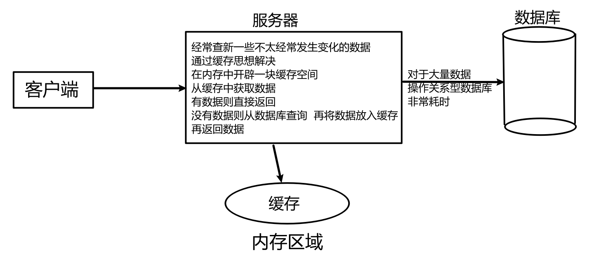
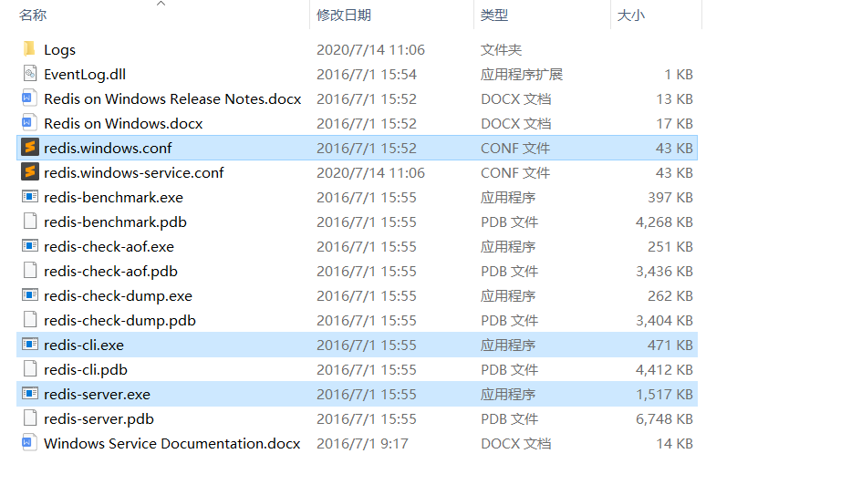
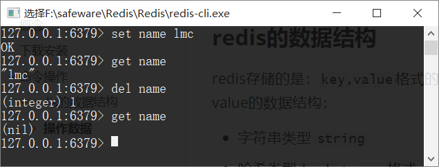
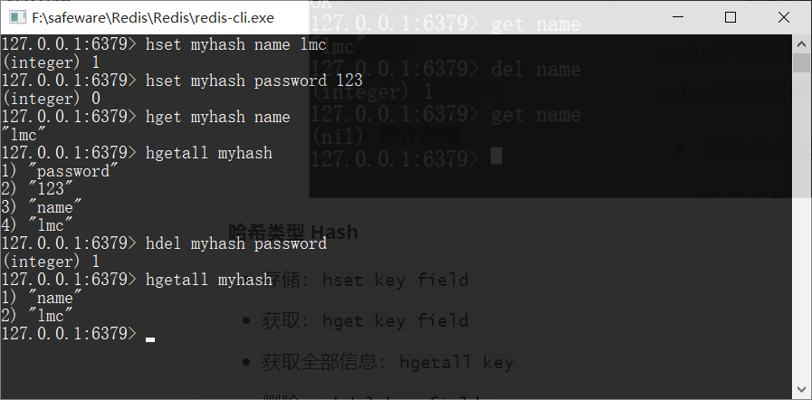
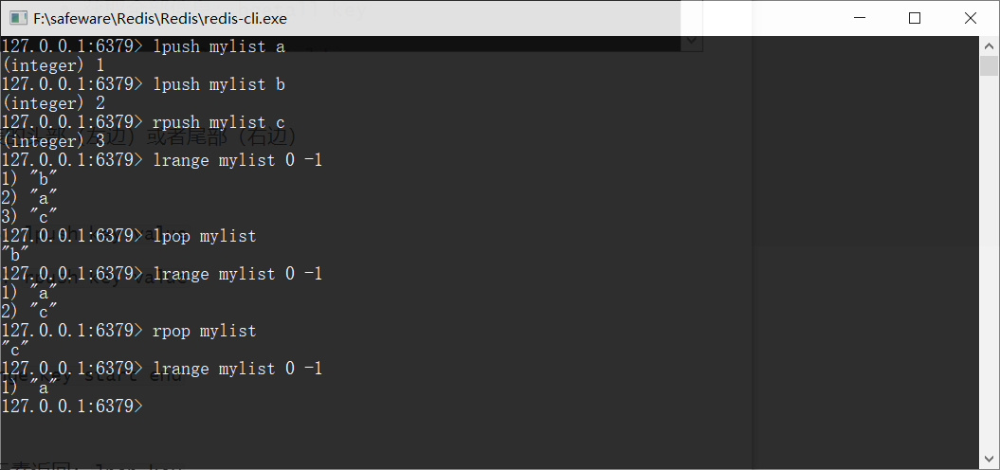
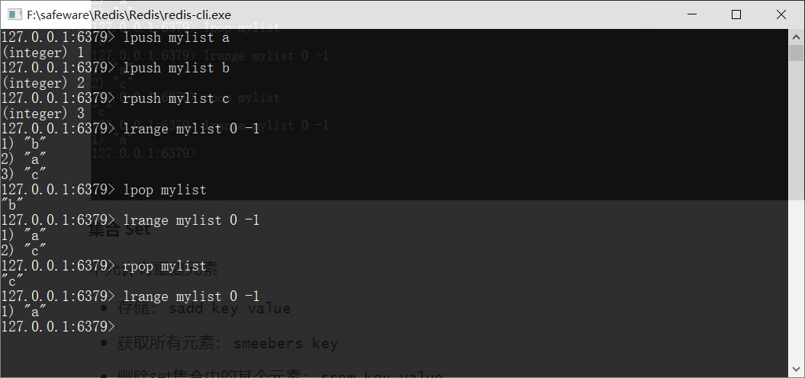
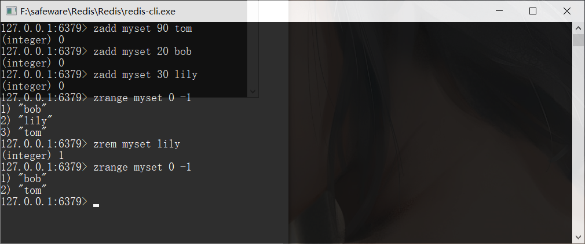

## 概念

redis 是一款高性能的 `NOSQL` 系列的**非关系型数据库**

<!--more-->

与关系型数据库（mysql, oracle) 的区别

**关系型数据库**

*   数据之间有关联关系
*   数据存储在硬盘的文件上
*   相对而言，关系型数据库要慢一些

关系型数据库查询数据图

**非关系型数据库**

*   以键值对进行存储  `key: value`  `name: bob age:23`
*   数据之间没有关联关系
*   数据存储在内存中
*   性能高

## 下载安装

[下载地址](https://github.com/MicrosoftArchive/redis/releases)

安装后，打开文件夹，最主要的文件有三个

*   `redis.windows.conf` 配置文件
*   `redis-cli.exe`: redis的客户端
*   `redis-server.exe`: redis服务器端

## 命令操作

### redis的数据结构

redis存储的是：`key,value`格式的数据，其中`key`都是字符串，`value`有5种不同的数据结构
value的数据结构：

*   字符串类型 `string`
*   哈希类型 `hash` ： `map`格式 
*    列表类型 `list` ： `linkedlist`格式。支持重复元素
*   集合类型 `set`  ： 不允许重复元素
*   有序集合类型 `sortedset`：不允许重复元素，且元素有顺序

#### 操作数据

##### 字符串String

*   存储： `set key value`
*   获取：`get key`
*   删除：`del key`

##### 哈希类型 Hash

*   存储：`hset key field`
*   获取：`hget key field`
*   获取全部信息：`hgetall key`
*   删除：`hdel key field`

##### 列表 List

可以添加一个原生到列表的头部（左边）或者尾部（右边）

添加

*   将元素加入列表头部：`lpush key value` 
*   将元素加入列表尾部：`rpush key value`

获取

*   获取范围元素：`lrange key start end`

删除

*   删除头部元素, 并将元素返回：`lpop key`
*   删除尾部元素, 并将元素返回：`rpop key`

##### 集合 Set

不允许有重复元素

*   存储：`sadd key value`
*   获取所有元素：`smeebers key`
*   删除set集合中的某个元素：`srem key value`

##### 有序集合 SortedSet

不允许重复元素，且元素有顺序

*   存储 `zadd key score value`
*   获取：`zrange key start end`
*   删除：`zrem key value`

