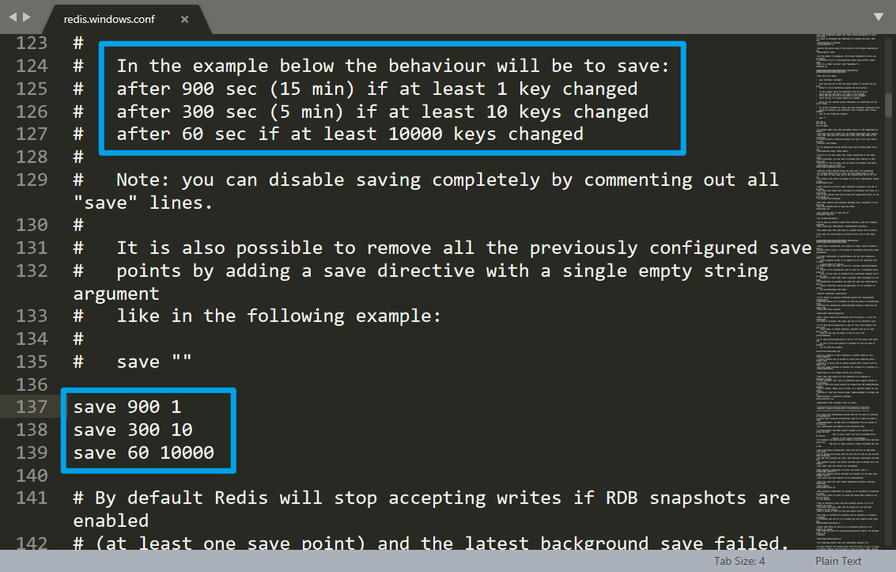
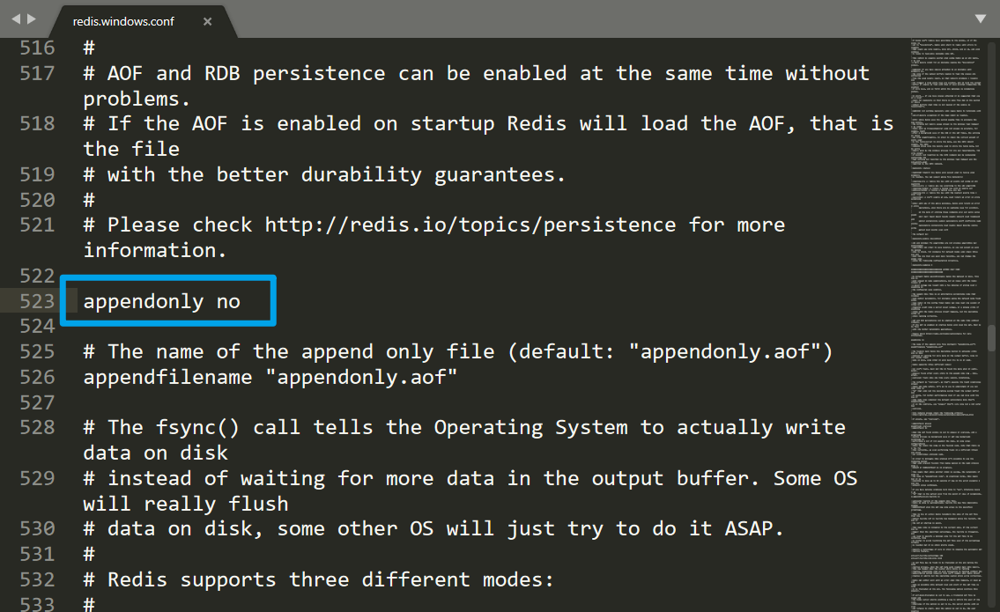
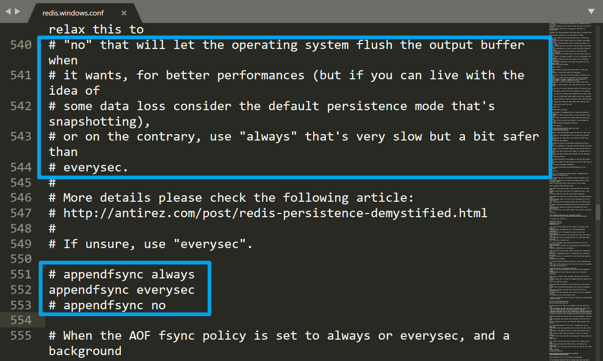
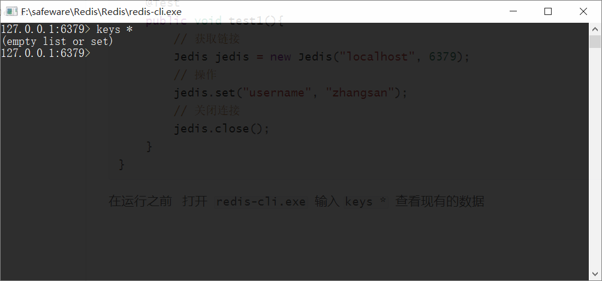
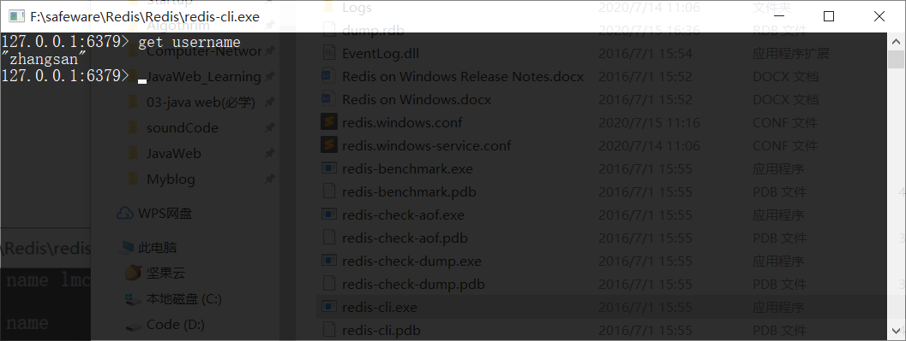
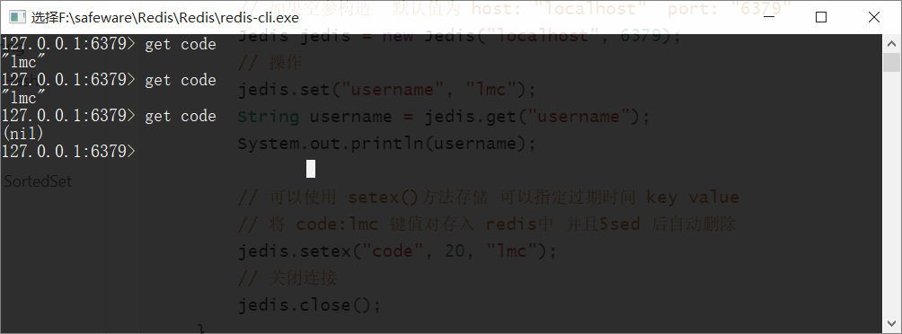
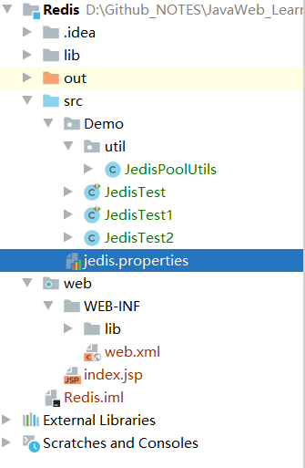

## 概念

redis 是一款高性能的 `NOSQL` 系列的**非关系型数据库**

<!--more-->

与关系型数据库（mysql, oracle) 的区别

**关系型数据库**

*   数据之间有关联关系
*   数据存储在硬盘的文件上
*   相对而言，关系型数据库要慢一些

关系型数据库查询数据图


**非关系型数据库**

*   以键值对进行存储  `key: value`  `name: bob age:23`
*   数据之间没有关联关系
*   数据存储在内存中
*   性能高


## 下载安装

[下载地址](https://github.com/MicrosoftArchive/redis/releases)

安装后，打开文件夹，最主要的文件有三个


*   `redis.windows.conf` 配置文件
*   `redis-cli.exe`: redis的客户端
*   `redis-server.exe`: redis服务器端


## 命令操作

### redis的数据结构

redis存储的是：`key,value`格式的数据，其中`key`都是字符串，`value`有5种不同的数据结构
value的数据结构：

*   字符串类型 `string`
*   哈希类型 `hash` ： `map`格式 
*    列表类型 `list` ： `linkedlist`格式。支持重复元素
*   集合类型 `set`  ： 不允许重复元素
*   有序集合类型 `sortedset`：不允许重复元素，且元素有顺序

#### 操作数据

##### 字符串String

*   存储： `set key value`
*   获取：`get key`
*   删除：`del key`


##### 哈希类型 Hash

*   存储：`hset key field`
*   获取：`hget key field`
*   获取全部信息：`hgetall key`
*   删除：`hdel key field`


##### 列表 List

可以添加一个原生到列表的头部（左边）或者尾部（右边）

添加

*   将元素加入列表头部：`lpush key value` 
*   将元素加入列表尾部：`rpush key value`

获取

*   获取范围元素：`lrange key start end`

删除

*   删除头部元素, 并将元素返回：`lpop key`
*   删除尾部元素, 并将元素返回：`rpop key`


##### 集合 Set

不允许有重复元素

*   存储：`sadd key value`
*   获取所有元素：`smeebers key`
*   删除set集合中的某个元素：`srem key value`


##### 有序集合 SortedSet

不允许重复元素，且元素有顺序

*   存储 `zadd key score value`
*   正序获取：`zrange key start end`
*   倒序获取：`zrange key start end withscores`
*   删除：`zrem key value`


### 通用命令

*   `keys`: 查询所有的键
*   `type key`: 获取键对应的 `value` 的类型
*   `del key`: 删除指定的 `key value`


## Redis 持久化

>   `redis` 是一个内存数据库，当`redis` 服务器重启，获取电脑重启，数据会丢失，我们可以将`redis`内存中的数据持久化保存到硬盘的文件中

### 持久化机制

#### RDB

默认方式，不需要进行配置，默认就使用这种机制

在一定间隔事件中，检测 key 的变化情况，然后持久化数据

编辑 `redis.windows.conf` 文件



修改配置后，在`cmd`下进入 `redis` 根目录  运行

```
redis-server.exe redis.windows.conf
```

使配置生效


#### ADF

日志记录的方式可以记录每一条命令的操作，可以每一次命令操作后，持久化数据

编辑 `redis.windows.conf` 文件

ADF 默认为关闭状态   修改为  `yes`  开启服务



然后修改  `appendfsync`的属性



修改配置后，在`cmd`下进入 `redis` 根目录  运行

```
redis-server.exe redis.windows.conf
```

使配置生效


## Java客户端  `Jedis`


### 使用`Jedis`

创建测试类

```java
import org.junit.Test;
import redis.clients.jedis.Jedis;

// Jedis 的测试类
public class JedisTest {

    @Test
    public void test1(){
        // 获取链接
		// 如果空参构造  默认值为 host: "localhost"  port: "6379"
        Jedis jedis = new Jedis("localhost", 6379);
        // 操作
        jedis.set("username", "zhangsan");
        // 关闭连接
        jedis.close();
    }
}
```

在运行之前   打开  `redis-cli.exe`  输入 `keys *`  查看现有的数据



运行测试类后




### 用`Jedis`操作不同的数据类型

#### 字符串

```java
// Jedis 的测试类
public class JedisTest {

    @Test
    public void test1(){
        // 获取链接
        // 如果空参构造  默认值为 host: "localhost"  port: "6379"
        Jedis jedis = new Jedis("localhost", 6379);
        // 操作
        jedis.set("username", "lmc");
        String username = jedis.get("username");
        System.out.println(username);

        // 可以使用 setex()方法存储 可以指定过期时间 key value
        // 将 code:lmc 键值对存入 redis中 并且5sed 后自动删除
        jedis.setex("code", 20, "lmc");
        // 关闭连接
        jedis.close();
    }
}
```

过 20s 自动删除



可以保存一些 验证码  激活码  激活链接 等时效性东西

**其他数据类型与字符串类似**


### Jedis连接池

#### 使用步骤

*   创建 `JedisPol`对象（可以传入参数）
*   获取链接
*   使用
*   关闭  归还到连接池中

#### 目录



```java
public class JedisTest1 {
    @Test
    public void test1(){
        // 创建一个配置对象
        JedisPoolConfig jedisPoolConfig = new JedisPoolConfig();
        jedisPoolConfig.setMaxTotal(50);
        jedisPoolConfig.setMaxIdle(10);
        JedisPool jedisPool = new JedisPool(jedisPoolConfig, "localhost", 6379);
        // 获取连接
        Jedis jedis = jedisPool.getResource();
        // 使用
        jedis.set("hehe", "haha");
        // 关闭 归还到连接池中
        jedis.close();
    }
}
```

#### 创建连接池工具类

`JedisPoolUtils`

```java
import redis.clients.jedis.Jedis;
import redis.clients.jedis.JedisPool;
import redis.clients.jedis.JedisPoolConfig;

import java.io.IOException;
import java.io.InputStream;
import java.util.Properties;

// JedisPool 工具类
// 加载配置文件 配置连接池参数
// 提供获取连接的方法
public class JedisPoolUtils {

    private static final JedisPool jedisPool;
    // 定义静态代码块  来读取静态文件
    static {
        // 读取配置文件
        InputStream inputStream =
                JedisPoolUtils.class.getClassLoader().getResourceAsStream("jedis.properties");
        // 创建 Properties对象
        Properties properties = new Properties();
        // 关联文件
        try{
            properties.load(inputStream);
        } catch (IOException e){
            e.printStackTrace();
        }
        // 获取数据 设置到 JedisPoolConfig 中
        JedisPoolConfig jedisPoolConfig = new JedisPoolConfig();
        jedisPoolConfig.setMaxTotal(Integer.parseInt(properties.getProperty("maxTotal")));
        jedisPoolConfig.setMaxIdle(Integer.parseInt(properties.getProperty("maxIdle")));

        // 初始化JedisPool
        jedisPool =
                new JedisPool(jedisPoolConfig,
                              properties.getProperty("host"),
                              Integer.parseInt(properties.getProperty("post")));
    }

    // 获取连接方法
    public static Jedis getJedis(){
        return jedisPool.getResource();
    }

    // 获取关闭方法
    public static void getClose(){
        jedisPool.close();
    }
}
```

