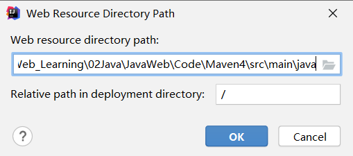

## **概念**

>   Maven 翻译为"专家"、"内行"，是 Apache 下的一个纯 Java 开发的开源项目。基于项目对象模型（缩写：POM）概念，Maven利用一个中央信息片断能管理一个项目的构建、报告和文档等步骤
>
>   Maven 是一个项目管理工具，可以对 Java 项目进行构建、依赖管理
>
>   Maven 也可被用于构建和管理各种项目，例如 C#，Ruby，Scala 和其他语言编写的项目。Maven 曾是 Jakarta 项目的子项目，现为由 Apache 软件基金会主持的独立 Apache 项目

<!--more-->

## 功能

-   构建
-   文档生成
-   报告
-   依赖
-   SCMs
-   发布
-   分发
-   邮件列表

## 约定配置

Maven 提倡使用一个共同的标准目录结构，Maven 使用约定优于配置的原则，大家尽可能的遵守这样的目录结构。如下所示：

| 目录                               | 目的                                                         |
| :--------------------------------- | :----------------------------------------------------------- |
| ${basedir}                         | 存放pom.xml和所有的子目录                                    |
| ${basedir}/src/main/java           | 项目的java源代码                                             |
| ${basedir}/src/main/resources      | 项目的资源，比如说property文件，springmvc.xml                |
| ${basedir}/src/test/java           | 项目的测试类，比如说Junit代码                                |
| ${basedir}/src/test/resources      | 测试用的资源                                                 |
| ${basedir}/src/main/webapp/WEB-INF | web应用文件目录，web项目的信息，比如存放web.xml、本地图片、jsp视图页面 |
| ${basedir}/target                  | 打包输出目录                                                 |
| ${basedir}/target/classes          | 编译输出目录                                                 |
| ${basedir}/target/test-classes     | 测试编译输出目录                                             |
| Test.java                          | Maven只会自动运行符合该命名规则的测试类                      |
| ~/.m2/repository                   | Maven默认的本地仓库目录位置                                  |


## 下载&环境配置

[下载地址](https://maven.apache.org/download.cgi)

下载完成后，在系统环境变量中添加


在 Path 中添加

```
%MAVEN_HOME%\bin
```


## `Maven`软件的目录结构

```
apache-maven-3.6.3
├─ LICENSE
├─ NOTICE
├─ README.txt
├─ bin
│    ├─ m2.conf
│    ├─ mvn   # 用来构建项目
│    ├─ mvn.cmd
│    ├─ mvnDebug
│    ├─ mvnDebug.cmd
│    └─ mvnyjp
├─ boot  # 自身运行所需要的类加载器
│    ├─ plexus-classworlds-2.6.0.jar
│    └─ plexus-classworlds.license
├─ conf
│    ├─ logging
│    │    └─ simplelogger.properties
│    ├─ settings.xml   # 主要配置文件
│    └─ toolchains.xml
└─ lib  # Maven自身运行所需要的 jar包
```


## Maven仓库种类&彼此关系

仓库分三类

*   本地仓库
*   远程仓库（私服）
*   中央仓库

Maven目录下 `apache-maven-3.6.3\conf\settings.xml`

```xml
<settings xmlns="http://maven.apache.org/SETTINGS/1.0.0"
          xmlns:xsi="http://www.w3.org/2001/XMLSchema-instance"
          xsi:schemaLocation="http://maven.apache.org/SETTINGS/1.0.0 http://maven.apache.org/xsd/settings-1.0.0.xsd">
  <!-- localRepository
   | The path to the local repository maven will use to store artifacts.
   |
   | Default: ${user.home}/.m2/repository # 默认在C盘用户目录下创建jar包仓库
  <localRepository>F:\safeware\Maven\jar_repository</localRepository>
  # 这里我们修改的本地仓库位置
  -->
```


通过修改 配置文件`apache-maven-3.6.3\conf\settings.xml`

修改`localRepository`标签 来指定本地仓库位置


## Maven项目标准目录结构

```
Maven_project 项目名
├─ src/main/java 核心代码部分
├─ src/main/resources 配置文件部分
├─ src/test/java 测试代码部分
├─ src/test/resources 测试配置文件
├─ src/main/webapp 页面资源 js css img等
```

在IDEA中创建的Maven项目


## Maven常用命令

创建好项目后，在终端中打开

#### `mvn clean`

清除项目编译信息（也就是删除`target`文件夹）

防止因为本地环境不同引起冲突


#### `mvn compile`

对 `src/main/java`中的java文件进行编译  放到 target 目录下


#### `mvn test`

对 `src/test/java` 测试代码进行编译


`target` 目录下有新生成了三个文件夹


#### `mvn package`

将项目打包

需要先执行 `mvn clean`


对 `main` 和 `test` java文件都进行了编译

同时封装了 jar包


#### `mvn install`

在`mvn package` 命令的基础上    将生成的jar包放入了本地仓库


## Maven生命周期

**生命周期的五个阶段（也称默认生命周期）**

*   编译  `mvn compile`
*   测试 `mvn test`
*   打包 `mvn package`
*   安装 `mvn install`
*   发布 `mvn deploy`

**清理生命周期**

*   清除项目编译信息  `mvn clean`

**站点生命周期**


## Maven项目模型图

在项目配置文件 `pom.xml`中 定义了

*   项目基本信息

    ```xml
    <groupId>org.example</groupId>
    <artifactId>Maven1</artifactId>
    <version>1.0-SNAPSHOT</version>
    ```

*   所依赖的jar包信息

    ```xml
    <dependency>
    	<groupId>javax.servlet.jsp</groupId>   # 公司组织名称
    	<artifactId>jsp-api</artifactId>	# 项目名
    	<version>2.0</version>	# 版本号
    </dependency>
    ```

*   所依赖的环境信息

    ```
    
    ```


## IDEA集成 Maven

打开设置


找到 Maven

配置Maven所在的目录   与本地仓库位置


进入 Runner 在 `VM Options`中添加

```
-DarchetypeCatatlog=internal
```

这样会先利用本地的插件   若没有再在网络上下载


## 通过IDEA骨架创建Maven项目

`JavaWeb_Learning\02Java\JavaWeb\Code\Maven2`

选择 `quickstart`一项


确认使用环境  与 参数信息


点击 `Finish` 即可  初次使用会耗费较长时间  因为会在网络上下载相关模板骨架

完成后的目录   


使用骨架，直接生成了java包下的java文件

不使用骨架的目录


## 使用骨架创建Maven—web工程

选择`webapp`一项


确定环境参数


点击 `Finish` 即可

自动生成的目录


### 将指定的文件包变成资源包

此时 main.java下不能创建 `jsp jsx`等web文件


打开`Project Structure`选项  点击 `+`


将 main.java文件夹添加到其中



保存后  main.java文件夹下就可以创建了


### 导入依赖的jar包

在 项目配置文件中`pom.xml`中配置jar包的相关信息

```xml
<!--  放置的都是项目运行所依赖的jar包-->
  <dependencies>
    <!--    测试类jar包-->
    <dependency>
      <groupId>junit</groupId>
      <artifactId>junit</artifactId>
      <version>4.11</version>
      <scope>test</scope>
    </dependency>
    <dependency>
      <groupId>javax.servlet</groupId>
      <artifactId>servlet-api</artifactId>
      <version>2.5</version>
    </dependency>
    <!-- https://mvnrepository.com/artifact/javax.servlet.jsp/javax.servlet.jsp-api -->
    <dependency>
      <groupId>javax.servlet.jsp</groupId>
      <artifactId>javax.servlet.jsp-api</artifactId>
      <version>2.3.3</version>
      <scope>provided</scope>
    </dependency>

  </dependencies>
```

导入时发现呈红色报错状态

在[Maven中央仓库](https://mvnrepository.com/)中搜索相关jar包

选择版本，将框中的文本复制粘贴到配置文件中即可

重新部署项目时，jar包会自动下载到本地仓库


### Maven命令快速执行

点击右侧工具栏中的 `Maven`

双击即可执行命令


**执行 tomcat:run** 


### 解决jar包冲突的问题

例如：

当 tomcat 本身所有的 `servlet-api.jar`  `jsp-api.jar` 与手动导入的jar包冲突

解决方法：

在项目的配置文件中  设置jar包的作用域

```xml
  <dependencies>
    <!--    测试类jar包-->
    <dependency>
      <groupId>junit</groupId>
      <artifactId>junit</artifactId>
      <version>4.11</version>
      <scope>test</scope>   # 测试时生效
    </dependency>
    <dependency>
      <groupId>javax.servlet</groupId>
      <artifactId>servlet-api</artifactId>
      <version>2.5</version>
      <scope>provided</scope>  # 在编译时生效   项目部署时失效
    </dependency>
    <!-- https://mvnrepository.com/artifact/javax.servlet.jsp/javax.servlet.jsp-api -->
    <dependency>
      <groupId>javax.servlet.jsp</groupId>
      <artifactId>javax.servlet.jsp-api</artifactId>
      <version>2.3.3</version>
      <scope>provided</scope>	# 在编译时生效   项目部署时失效
    </dependency>

  </dependencies>
```

**作用域参数** `<scope>`

| 依赖范围 | 编译有效 | 测试有效 | 运行有效 | 例子           |
| -------- | -------- | -------- | -------- | -------------- |
| compile  | Y        | Y        | Y        | spring-core    |
| test     | N        | Y        | N        | junit          |
| provided | Y        | Y        | N        | servlet-api    |
| runtime  | N        | Y        | Y        | JDBC驱动       |
| system   | Y        | Y        | N        | 本地以外的类库 |

防止 tomcat服务重复开启导致端口占用报错

tomcat服务即用即关

## 连接Mysql数据库

在配置文件`pom.xml`中导入相关 jar包

```xml
<dependencies>
    <!-- https://mvnrepository.com/artifact/mysql/mysql-connector-java -->
    <dependency>
        <groupId>mysql</groupId>
        <artifactId>mysql-connector-java</artifactId>
        <version>8.0.21</version>
        <scope>runtime</scope>
    </dependency>
    <dependency>
        <groupId>junit</groupId>
        <artifactId>junit</artifactId>
        <version>4.13</version>
        <scope>test</scope>
    </dependency>

</dependencies>
```

### 四个要素

*   数据库驱动
*   连接数据库的地址，名称，密码


### 项目目录


#### `java.dao.Dao.java` 接口类

```java
import com.sun.tools.javac.jvm.Items;

import java.sql.SQLException;
import java.util.List;

public interface Dao {
    public List<Items> findAll() throws SQLException, ClassNotFoundException;
}
```

#### `java.impl.DaoImpl` 实现类

```java
import com.sun.tools.javac.jvm.Items;
import dao.Dao;

import java.sql.*;
import java.util.ArrayList;
import java.util.List;

public class DaoImpl implements Dao {

    public List<Items> findAll() throws SQLException, ClassNotFoundException {
        List<Items> list = new ArrayList<Items>();
        Connection connection = null;
        PreparedStatement preparedStatement = null;
        ResultSet resultSet = null;
        try{
            // 加载驱动类
            Class.forName("com.mysql.jdbc.Driver");
            // 获取 connection对象
            connection = DriverManager.getConnection(
                    "jdbc:mysql:///maven", "root", "123456");
            // 获取操作数据的对象
            preparedStatement = connection.prepareCall("select * from items");
            // 执行数据库查询操作
            resultSet = preparedStatement.executeQuery();
            // 把数据库结果转成 java list集合

            while (resultSet.next()){
                Items items = new Items();
                items.setId(resultSet.getInt("id"));
                items.setName(resultSet.getString("name"));
                list.add(items);
            }
        } catch (Exception e){
            e.printStackTrace();
        }finally {
            connection.close();
            preparedStatement.close();
            resultSet.close();
        }
        return list;
    }
}
```

#### `java.mysql.connect.java`

```java
public class connect {
    private Integer id;
    private String name;

    public Integer getId() {
        return id;
    }

    public void setId(Integer id) {
        this.id = id;
    }

    public String getName() {
        return name;
    }

    public void setName(String name) {
        this.name = name;
    }
}
```

#### `test.java.Demo1.mysqlTest.java` 测试类

```java
import com.sun.tools.javac.jvm.Items;
import dao.Dao;
import impl.DaoImpl;
import org.junit.Test;

import java.sql.SQLException;
import java.util.List;

public class mysqlTest {
    @Test
    public void findAll() throws SQLException, ClassNotFoundException {
        DaoImpl dao = new DaoImpl();
        List<Items> list = DaoImpl.findAll();
        for (Items items:list){
            System.out.println(items.getName());
        }
    }
}
```

