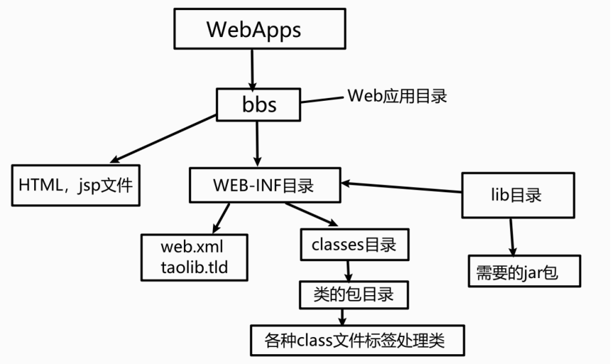

# HTTP

> 定义了客户端和服务端通信时，发送数据的格式
>
> **是客户端和服务器交互的一种通迅的格式**

特点：

* 基于TCP/IP 的高级协议

* 默认接口号：80

* 基于请求/响应模型：一次请求对应一次响应

* 无状态的：每次请求之间相互独立，不能交互数据

历史版本：

* 每一次请求响应都会建立新的连接
* 复用连接

原理：

*   原理：当在浏览器中点击这个链接的时候，**浏览器会向服务器发送一段文本**，**告诉服务器请求打开的是哪一个网页。服务器收到请求后，就返回一段文本给浏览器，浏览器会将该文本解析，然后显示出来**，这段文本就是遵循HTTP协议规范的

## 请求消息数据格式

**浏览器向服务器请求某个web资源时，称之为浏览器向服务器发送了一个http请求。**

一个完整http请求应该包含三个部分：

1. 请求行

2. 请求头

3. 请求空行


请求行

* 请求方式 请求 `url` 请求协议版本
  
  GET /login.html HTTP/1.1
  
  

* 请求头：请求头值
  
  User-Agent: 浏览器告诉服务器，使用的浏览器版本信息
  
  可以在服务器端获取该头的信息，解决浏览器的兼容性问题
  
  作用：防盗链，统计工作
  
  

* 请求空行
  
  为空  分隔请求头与请求体

  
  
  ### 请求体（正文）
  
  `GET /java.html HTTP/1.1` 
  
  请求行中的GET称之为请求方式，请求方式有： 
  
  ​        POST,GET,HEAD,OPTIONS,DELETE,TRACE,PUT。
  
  
  封装POST请求消息的请求参数的
  
  


### 请求方式

HTTP协议有7种请求方式，常用为2种

* GET
  
  * 请求参数在请求行种，在url后
  
  * 请求的url长度有限制
  
  * 不太安全

* POST:
  
  * 请求参数都在请求体中
  * 请求的`url`长度没有限制
  * 相对安全


一般来说，当我们点击超链接，**通过地址栏访问都是get请求方式。通过表单提交的数据一般是post方式**

可以简单理解GET方式用来查询数据, POST方式用来提交数据，get的提交速度比post快

GET方式：在URL地址后附带的参数是有限制的，其数据容量通常不能超过1K

POST方式：可以在请求的实体内容中向服务器发送数据，传送的数据量无限制


### 请求头


• Accept: text/html,image/* 【浏览器告诉服务器，它支持的数据类型】

• Accept-Charset: ISO-8859-1 【浏览器告诉服务器，它支持哪种**字符集**】

• Accept-Encoding: gzip,compress 【浏览器告诉服务器，它支持的**压缩格式**】

• Accept-Language: en-us,zh-cn 【浏览器告诉服务器，它的语言环境】

• Host: www.it315.org:80【浏览器告诉服务器，它的想访问哪台主机】

• If-Modified-Since: Tue, 11 Jul 2000 18:23:51 GMT【浏览器告诉服务器，缓存数据的时间】

• Referer: http://www.it315.org/index.jsp【浏览器告诉服务器，客户机是从那个页面来的---**反盗链**】

• 8.User-Agent: Mozilla/4.0 (compatible; MSIE 5.5; Windows NT 5.0)【浏览器告诉服务器，浏览器的内核是什么】

• Cookie【浏览器告诉服务器，**带来的Cookie是什么**】

• Connection: close/Keep-Alive 【浏览器告诉服务器，请求完后是断开链接还是保持链接】 

• Date: Tue, 11 Jul 2000 18:23:51 GMT【浏览器告诉服务器，请求的时间】 


## HTTP 响应

**一个HTTP响应代表着服务器向浏览器回送数据**

一个完整的HTTP响应应该包含四个部分:

1.  一个状态行【用于描述服务器对请求的处理结果。】
2.  多个消息头【用于描述服务器的基本信息，以及数据的描述，服务器通过这些数据的描述信息，可以通知客户端如何处理等一会儿它回送的数据】
3.  一个空行
4.  实体内容【服务器向客户端回送的数据】


### 状态行

格式： HTTP版本号 状态码 原因叙述

状态行：HTTP/1.1 200 OK

状态码用于表示**服务器对请求的处理结果**，它是一个**三位的十进制数**。响应状态码分为5类

| 状态码  | 含义                                                         |
| ------- | ------------------------------------------------------------ |
| 100~199 | 表示成功接受请求，要求客户端继续提交下一次请求才能完成整个处理过程 |
| 200~299 | 表示成功接受请求并已完成整个处理过程，常用200                |
| 300~399 | 为完成请求，客户需进一步细化请求。如：请求资源已经移动到一个新地址，常用为302，307和304 |
| 400~499 | 客户端的请求有错误，常用 404                                 |
| 500~599 | 服务器出现错误，常用500                                      |


### 响应头

*   Location: http://www.it315.org/index.jsp 【服务器告诉浏览器要跳转到哪个页面】
*    Server:apache tomcat【服务器告诉浏览器，服务器的型号是什么】
*    Content-Encoding: gzip 【服务器告诉浏览器数据压缩的格式】
*    Content-Length: 80 【服务器告诉浏览器回送数据的长度】
*    Content-Language: zh-cn 【服务器告诉浏览器，服务器的语言环境】
*    Content-Type: text/html; charset=GB2312 【服务器告诉浏览器，回送数据的类型】
*    Last-Modified: Tue, 11 Jul 2000 18:23:51 GMT【服务器告诉浏览器该资源上次更新时间】
*    Refresh: 1;url=http://www.it315.org【服务器告诉浏览器要定时刷新】
*    Content-Disposition: attachment; filename=aaa.zip【服务器告诉浏览器以下载方式打开数据】
*    Transfer-Encoding: chunked 【服务器告诉浏览器数据以分块方式回送】
*   Set-Cookie:SS=Q0=5Lb_nQ; path=/search【服务器告诉浏览器要保存Cookie】
*   Expires: -1【服务器告诉浏览器不要设置缓存】
*   Cache-Control: no-cache 【服务器告诉浏览器不要设置缓存】
*   Pragma: no-cache 【服务器告诉浏览器不要设置缓存】
*   Connection: close/Keep-Alive 【服务器告诉浏览器连接方式】
*   Date: Tue, 11 Jul 2000 18:23:51 GMT【服务器告诉浏览器回送数据的时间】


## `JavaWeb` 目录结构




*   bbs目录代表一个web应用
*   bbs目录下的html,jsp文件可以直接被浏览器访问
*   WEB-INF目录下的资源是不能直接被浏览器访问的
*   web.xml文件是web程序的主要配置文件
*   所有的classes文件都放在classes目录下
*   jar文件放在lib目录下


## Request请求原理

request, response 对象都是由服务器创建的

request对象是来获取请求消息，response对象是来设置响应消息


request 对象继承体系结构：

```java
ServletRequest        --    接口
        |    继承
    HttpServletRequest    -- 接口
        |    实现
    org.apache.catalina.connector.RequestFacade 类(tomcat)
```


## request功能

### 获取请求消息数据

* 获取请求行数据
  
  `GET /Servlet?name=zhangsan HTTP/1.1`
  
  1. 获取请求方式 ：GET
    
     - 方法：
       
       ```java
               1. 获取请求方式 ：GET
                   * String getMethod()  
               2. (*)获取虚拟目录：/day14
                   * String getContextPath()
               3. 获取Servlet路径: /demo1
                   * String getServletPath()
               4. 获取get方式请求参数：name=zhangsan
                   * String getQueryString()
               5. (*)获取请求URI：/day14/demo1
                   * String getRequestURI():        /day14/demo1
                   * StringBuffer getRequestURL()  :http://localhost/day14/demo1
       
                   * URL:统一资源定位符 ： http://localhost/day14/demo1    
                       类比类似：中华人民共和国
                   * URI：统一资源标识符 : /day14/demo1                    
                       类比类似：共和国
       
               6. 获取协议及版本：HTTP/1.1
                   * String getProtocol()
       
               7. 获取客户机的IP地址：
                   * String getRemoteAddr()
       ```

              2. 获取请求头数据

```java
String getHeader(String name):通过请求头的名称获取请求头的值
Enumeration<String> getHeaderNames():获取所有的请求头名称
```

              3. 获取请求体数据

                只有POST请求方式，才有请求体，在请求体中封装了POST请求的请求参数

                步骤：

   1. 获取流对象

      ```java
      BufferedReader getReader(): 获取字符输入流，只能操作字符数据
      ServletInputStream getInputStream(): 获取字符输入流，可以操作所有类型数据
      ```

   2. 再从流对象中读取数据

      ```java
      @WebServlet("/ServletDemo7")
      public class ServletDemo7 extends HttpServlet {
          protected void doPost(HttpServletRequest request, HttpServletResponse response) throws ServletException, IOException {
      
              // 获取请求体  请求参数
      
              // 1. 获取字符流
              BufferedReader br = request.getReader();
              // 2. 读取数据
              String line = null;
              while ((line = br.readLine()) != null){
                  System.out.println(line);
              }
          }
      
          protected void doGet(HttpServletRequest request, HttpServletResponse response) throws ServletException, IOException {
          }
      }
      ```


### 其他功能：


1. 获取请求参数通用方式：不论get还是post请求方式都可以使用下列方法来获取请求参数


```java
   1. String getParameter(String name)  // 根据参数名称获取参数值    username=zs&password=123
   2. String[] getParameterValues(String name) // 根据参数名称获取参数值的数组  hobby=xx&hobby=game
   3. Enumeration<String> getParameterNames() // 获取所有请求的参数名称
   4. Map<String,String[]> getParameterMap() // 获取所有参数的map集合
```

2. 请求转发：一种在服务器内部的资源跳转方式
  
    步骤：

```java
        1. 通过request对象获取请求转发器对象：RequestDispatcher getRequestDispatcher(String path)
        2. 使用RequestDispatcher对象来进行转发：forward(ServletRequest request, ServletResponse response) 
```

关于中文乱码的问题

```java
        get方式：tomcat 8 已经将get方式乱码问题解决了
        post方式：会乱码
        解决：在获取参数前，设置request的编码request.setCharacterEncoding("utf-8");
```

3. 请求转发，资源跳转的方式

  步骤：

```java
        1. 通过request对象获取请求转发器对象：RequestDispatcher getRequestDispatcher(String path)
        2. 使用RequestDispatcher对象来进行转发：forward(ServletRequest request, ServletResponse response) 
```
