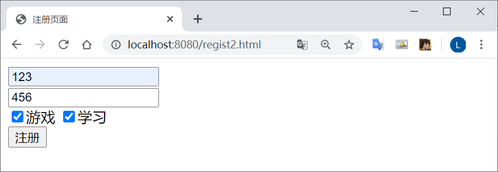
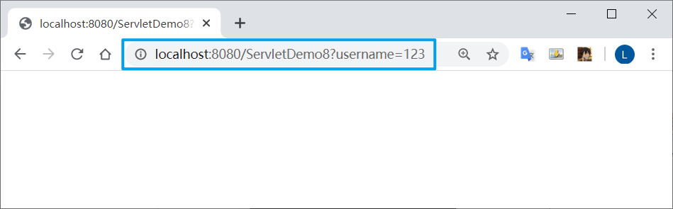

# Request 对象

## 什么是HttpServletRequest

HttpServletRequest对象代表客户端的请求，当客户端通过HTTP协议访问服务器时，HTTP请求头中的所有信息都封装在这个对象中，开发人员通过这个对象的方法，可以获得客户这些信息
简单来说，要得到浏览器信息，就找HttpServletRequest对象

## HttpServletRequest常用方法

### 获得客户机【浏览器】信息

*   getRequestURL方法返回客户端发出请求时的完整URL

*   getRequestURI方法返回请求行中的资源名部分。

*   getQueryString 方法返回请求行中的参数部分。

*   getPathInfo方法返回请求URL中的额外路径信息。额外路径信息是请求URL中的位于Servlet的路径之后和查询参数之前的内容，它以“/”开头。

*   getRemoteAddr方法返回发出请求的客户机的IP地址

*   getRemoteHost方法返回发出请求的客户机的完整主机名

*   getRemotePort方法返回客户机所使用的网络端口号

*   getLocalAddr方法返回WEB服务器的IP地址

*   getLocalName方法返回WEB服务器的主机名

    

### 获得客户机请求头

*   getHeader方法

*   getHeaders方法 

*   getHeaderNames方法 

    

### 获得客户机请求参数(客户端提交的数据)

*   getParameter方法
*   getParameterValues（String name）方法
*   getParameterNames方法 
*   getParameterMap方法


## HttpServletRequest应用

### 防盗链

获取Referer这个消息头，判断Referer是不是从指定页面来的。如果不是从指定页面来的，跳转回指定的页面

```java
//获取到网页是从哪里来的
String referer = request.getHeader("Referer");

//如果不是从我的首页来或者从地址栏直接访问的，
if ( referer == null || !referer.contains("localhost:8080/zhongfucheng/index.jsp") ) {

  //回到首页去
  response.sendRedirect("/zhongfucheng/index.jsp");
  return;
}

//能执行下面的语句，说明是从我的首页点击进来的，那没问题，照常显示
response.setContentType("text/html;charset=UTF-8");
response.getWriter().write("路飞做了XXXXxxxxxxxxxxxxxxxx");
```

在html中设置提交数据的方法    post get

```java
<form action="/zhongfucheng/Servlet111" method="post">
```

然后在HttpServletRequest实现类中接受数据

```java
//设置request字符编码的格式
request.setCharacterEncoding("UTF-8");

//通过html的name属性，获取到值
String username = request.getParameter("username");
String password = request.getParameter("password");
String gender = request.getParameter("gender");

//复选框和下拉框有多个值，获取到多个值
String[] hobbies = request.getParameterValues("hobbies");
String[] address = request.getParameterValues("address");

//获取到文本域的值
String description = request.getParameter("textarea");

//得到隐藏域的值
String hiddenValue = request.getParameter("aaa");
```


### 超链接方式提交数据

常见的get方式提交数据有：使用超链接，sendRedirect()
格式如下：

```java
sendRedirect("servlet的地址?参数名="+参数值 &"参数名="+参数值);
```

通过超链接将数据带给浏览器

```html
<a href="/zhongfucheng/Servlet111?username=xxx">使用超链接将数据带给浏览器</a>
```

然后在HttpServletRequest实现类中接受数据

```java
//接收以username为参数名带过来的值
String username = request.getParameter("username");
System.out.println(username);
```



点击注册后，跳转




## 中文乱码问题

乱码的原因：

Tomcat服务器默认编码是**ISO 8859-1**，而浏览器使用的是UTF-8编码。浏览器的中文数据提交给服务器，Tomcat以ISO 8859-1编码对中文编码，当我在Servlet读取数据的时候，拿到的当然是乱码。而我设置request的编码为UTF-8，乱码就解决了

点击提交按钮的时候，数据封装进了Form Data中，http请求中把实体主体带过去了【传输的数据称之为实体主体】，既然**request对象封装了http请求**，所以request对象可以解析到发送过来的数据，于是只要把编码设置成UTF-8就可以解决乱码问题了

**在 post 方法中加入**

```java
//设置request字符编码的格式
request.setCharacterEncoding("UTF-8");
```

而在get方法中 这样设置是无效的

它的数据是从消息行带过去的，**没有封装到request对象里面**，所以使用request设置编码是无效的

**可以通过解码再重新编码的方式来解决**

```java
//此时得到的数据已经是被ISO 8859-1编码后的字符串了，这个是乱码
String name = request.getParameter("username");

//乱码通过反向查ISO 8859-1得到原始的数据
byte[] bytes = name.getBytes("ISO8859-1");

//通过原始的数据，设置正确的码表，构建字符串
String value = new String(bytes, "UTF-8");
```

get方式还可以**改Tomcat服务器的配置**来解决乱码，但是不推荐使用，这样不灵活

在配置文件中，在8080端口的Connector上加入URIEncoding="utf-8"，设置Tomcat的访问该端口时的编码为utf-8，从而解决乱码

```java
<Connector port="8080" protocol="HTTP/1.1" 
           connectionTimeout="20000" 
           redirectPort="8443" URIEncoding="utf-8"/>
```

**另一种改服务器编码的方式**。设置Tomcat的访问该端口时的编码为页面的编码，这种改法是随着页面的编码而变

```java
    <Connector port="8080" protocol="HTTP/1.1" 
               connectionTimeout="20000" 
               redirectPort="8443" useBodyEncodingForURI="true" />
```


### 总结：

*   post方式直接改request对象的编码
*   get方式需要手工转换编码
*   get方式也可以修改Tomcat服务器的编码，不推荐，因为会太依赖服务器了！
*   提交数据能用post就用post