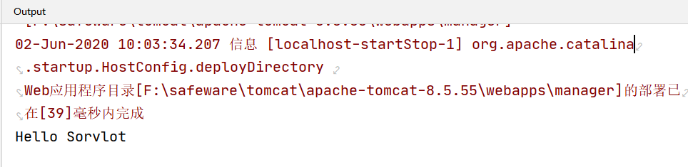
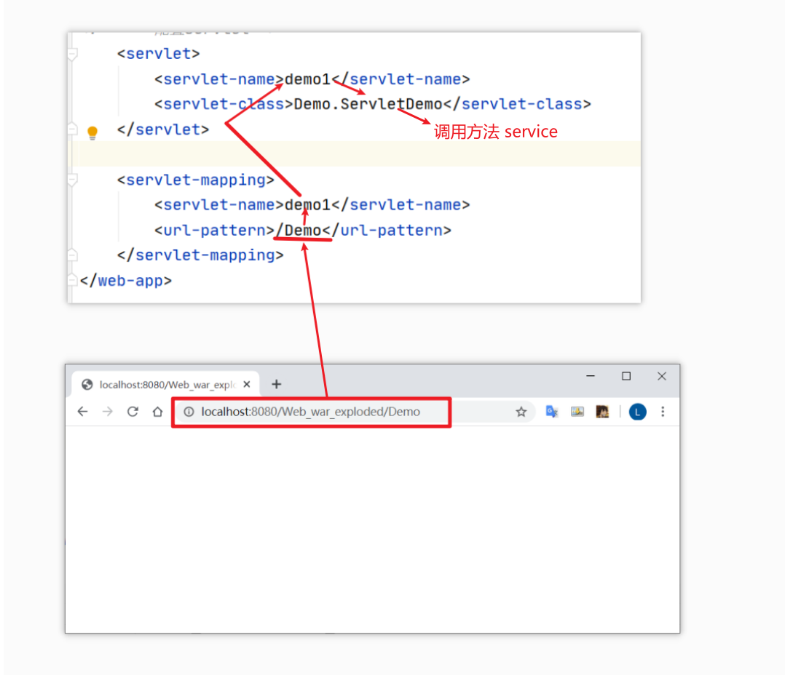
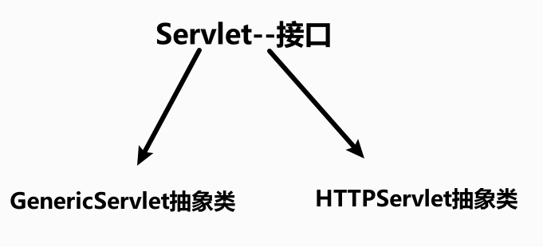
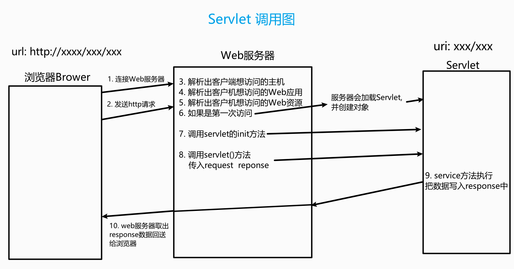
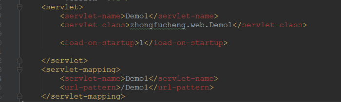
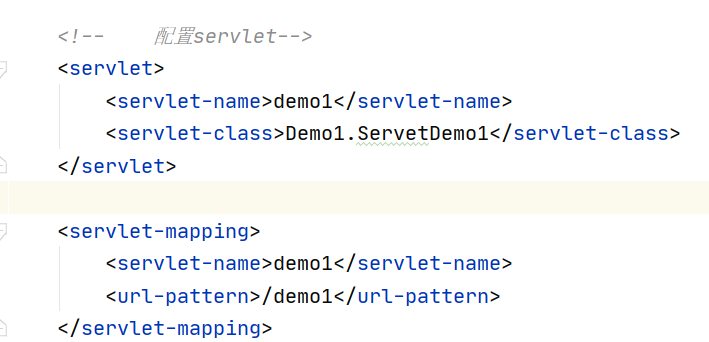

# Servlet

>   server applet
>
>   运行在服务器端的小程序
>
>   一个**遵循Servlet开发的java类**
>
>   Servlet 是一个接口，定义了 Java类被浏览器访问到(tomcat识别)的规则
>
>   我们自定义类，实现Servlet接口，复写方法

步骤：

* 创建 `JavaEE`项目
* 定义一个类，实现Servlet接口
* 实现接口中的抽象方法
* 配置Servlet

在web.xml中配置servlet


添加代码

```xml
<!--    配置servlet-->
    <servlet>
        <servlet-name>demo1</servlet-name>
        <servlet-class>Demo.ServletDemo</servlet-class>
    </servlet>

    <servlet-mapping>
        <servlet-name>demo1</servlet-name>
        <url-pattern>/Demo</url-pattern>  通过 /Demo进行访问
    </servlet-mapping>
```

启动服务，输入/Demo （区分大小写)

成功访问


输出台显示：



调用了`ServletDemo`中的方法

每次刷新都会再次执行

### 执行原理

* 当服务器接受到客户端浏览器得请求后，会解析请求URL路径，获取访问的Servlet的资源路径
* 查找web.xml文件，是否有对应的`<url-pattern>`标签体内容
* 如果有，则在找到对应的`<servlet-class>`全类名
* tomcat会将字节码文件加载进内存，并且创建其对象
* 调用其方法



```java
public class ServletDemo2 implements Servlet{

    // 初始化方法，创建时，执行
    @Override
    public void init(ServletConfig servletConfig) throws ServletException {
        System.out.println("初始化方法被执行");
    }

    // 获得 ServletConfig 对象
    // Servlet 的配置对象
    @Override
    public ServletConfig getServletConfig() {
        return null;
    }

    // 提供服务方法  每一次servlet 被访问时，执行多次
    @Override
    public void service(ServletRequest servletRequest, 
                        ServletResponse servletResponse) 
                        throws ServletException, IOException {
        System.out.println("服务方法被执行");
    }

    // 获取Servlet 的一些信息，版本等
    @Override
    public String getServletInfo() {
        return null;
    }

    // 销毁方法
    // 在服务器正常关闭时，执行
    @Override
    public void destroy() {
        System.out.println("关闭服务");
    }
}
```

## Servlet的生命周期

* 被创建：执行一次 `init`方法, 说明一个Servlet 在内存中只存在一个对象，是单例的
  
  多个用户同时访问时，可能存在线程安全问题
  
  尽量不要在servlet 中定义成员变量，如果定义了，不要修改值
  
  默认情况下，第一次被访问时，Servlet被创建
  
  指定servlet创建时机
  
  ​    值为负数，第一次被访问时创建
  
  ​    为非负数，在服务器启动时，创建
  
  ```xml
          <load-on-startup>5</load-on-startup>
  ```

* 提供服务：执行servlet方法，执行多次

* 被**正常销毁**：执行一次`destory`方法


### 5个步骤

1.  加载Servlet。当Tomcat第一次访问Servlet的时候，Tomcat会负责创建Servlet的实例
2.  初始化。当Servlet被实例化后，Tomcat会调用init()方法初始化这个对象
3.  处理服务。当浏览器访问Servlet的时候，Servlet 会调用service()方法处理请求
4.  销毁。当Tomcat关闭时或者检测到Servlet要从Tomcat删除的时候会自动调用destroy()方法，让该实例释放掉所占的资源。一个Servlet如果长时间不被使用的话，也会被Tomcat自动销毁
5.  卸载。当Servlet调用完destroy()方法后，等待垃圾回收。如果有需要再次使用这个Servlet，会重新调用init()方法进行初始化操作。


## Servlet3.0

>   支持注解配置，可以不需要web.xml

步骤：

* 创建`JavaEE`项目，选择servlet版本在3以上，可以不创建 web.xml
* 定义一个类，实现Servlet接口
* 复写方法
* 在类上使用`@WebServlet`注解,进行配置

```@WebServlet(urlPatterns
@WebServlet(urlPatterns = "/Demo")
```

## IDEA与Tomcat的配置

* IDEA 会为每一个tomcat部署的项目单独建立一份配置文件
* 工作空间项目
* tomcat 真正访问的是`tomcat部署的web项目` 对应着Web项目
* WEB-INF目录下的不可被浏览器直接访问


启动服务后，自动弹出窗口


## Servlet体系结构



`GenericServlet`：将Servlet接口中其他的方法做了默认空实现，只将service()方法作为抽象
将来定义Servlet类时，可以继承`GenericServlet`，实现service()方法即可

 `HTTPServlet`：对http协议的一种封装，简化操作**（推荐方法）**

* 定义类继承`HttpServlet`
* 复写`doGet/doPost`方法

hello.html

```html
<!DOCTYPE html>
<html lang="en">
<head>
    <meta charset="UTF-8">
    <title>hello</title>
</head>
<body>
    <form action="/demo3" method="post">
        <input name="username">
        <input type="submit" value="提交">
    </form>
</body>
</html>
```


## Servlet相关配置

1. `urlpartten`: Servlet 访问路径

```java
@WebServlet("/demo3")
public class ServletDemo2 extends HttpServlet {}
```

`url` 可以是一个集合  任何一个都可以开启服务，访问该页面

```java
@WebServlet({"/d4", "/dd4", "/ddd4"})
public class ServletDemo3 extends HttpServlet {
    @Override
    protected void doGet(HttpServletRequest req, HttpServletResponse resp) throws ServletException, IOException {
        System.out.println("demo4....");
    }
}
```

2. 路径定义规则：
* /xxx

* /xxx/xxx    多层路径，目录结构

```java
@WebServlet({"/user/demo4"})
public class ServletDemo3 extends HttpServlet {
    @Override
    protected void doGet(HttpServletRequest req, HttpServletResponse resp) throws ServletException, IOException {
        System.out.println("demo4....");
    }
}
```

* *.do
  
  ```java
  // 使用任何u'r'l后缀都可以访问到
  @WebServlet({"/*"})
  public class ServletDemo3 extends HttpServlet {
      @Override
      protected void doGet(HttpServletRequest req, HttpServletResponse resp) throws ServletException, IOException {
          System.out.println("demo4....");
      }
  }
  ```
  
  ```java
  @WebServlet("*.do")
  public class ServletDemo3 extends HttpServlet {
      @Override
      protected void doGet(HttpServletRequest req, HttpServletResponse resp) throws ServletException, IOException {
          System.out.println("demo4....");
      }
  }
  ```
  
  


## 继承HttpServlet编写Servlet程序

>   HttpServlet类已经实现了Servlet接口的所有方法，编写Servlet时，只需要继承HttpServlet，重写你需要的方法即可，并且它在原有Servlet接口上添加了一些与HTTP协议处理方法，它比Servlet接口的功能更为强大

一般我们开发的时候，都是重写doGet()和doPost()方法的。对于idea而言，创建Servlet的时候已经帮你重写好了


## ServletConfig, ServletContext, Servlet

### Servlet 调用图




### Servlet是单例的

#### 为什么Servlet是单例的

浏览器多次对Servlet的请求，一般情况下，服务器只创建一个Servlet对象，也就是说，Servlet对象一旦创建了，就会驻留在内存中，为后续的请求做服务，直到服务器关闭。


#### 每次访问请求对象和响应对象都是新的

对于每次访问请求，Servlet引擎都会创建一个新的HttpServletRequest请求对象和一个新的HttpServletResponse响应对象，然后将这两个对象作为参数传递给它调用的Servlet的service()方法，service方法再根据请求方式分别调用doXXX方法。


#### 线程安全问题

当多个用户访问Servlet的时候，服务器会为每个用户创建一个线程。当多个用户并发访问Servlet共享资源的时候就会出现线程安全问题。
原则：

1.  如果一个变量需要多个用户共享，则应当在访问该变量的时候，加同步机制synchronized (对象){}
2.  如果一个变量不需要共享，则直接在 doGet() 或者 doPost()定义.这样不会存在线程安全问题
3.   load-on-startup
    如果在<servlet>元素中配置了一个<load-on-startup>元素，那么WEB应用程序在启动时，就会装载并创建Servlet的实例对象、以及调用Servlet实例对象的init()方法。




作用：

1.  为web应用写一个InitServlet，这个servlet配置为启动时装载，为整个web应用创建必要的数据库表和数据

2.  完成一些定时的任务【定时写日志，定时备份数据】


### 在web访问任何资源都是在访问Servlet

当你启动Tomcat，你在网址上输入http://localhost:8080。为什么会出现Tomcat小猫的页面？
这是由缺省Servlet在起作用
我们先看一下web.xml文件中的配置,web.xml文件配置了一个缺省Servlet

```xml
<servlet>
  <servlet-name>default</servlet-name>
  <servlet-class>org.apache.catalina.servlets.DefaultServlet</servlet-class>
  <init-param>
    <param-name>debug</param-name>
    <param-value>0</param-value>
  </init-param>
  <init-param>
    <param-name>listings</param-name>
    <param-value>false</param-value>
  </init-param>
  <load-on-startup>1</load-on-startup>
</servlet>

<servlet-mapping>
  <servlet-name>default</servlet-name>
  <url-pattern>/</url-pattern>
</servlet-mapping>
```

在web.xml文件中找不到匹配的元素的URL，它们的访问请求都将交给缺省Servlet处理，也就是说，缺省Servlet用于处理所有其他Servlet都不处理的访问请求

无论在web中访问什么资源【包括JSP】，都是在访问Servlet。没有手工配置缺省Servlet的时候，你访问**静态图片，静态网页**，缺省Servlet会在你web站点中寻找该图片或网页，如果有就返回给浏览器，没有就报**404错误**


### ServletConfig 对象

>   通过此对象可以读取web.xml中配置的初始化参数

把参数信息放到web.xml文件中，能够让程序更加灵活【更换需求，更改配置文件web.xml即可，程序代码不用改】


#### 获取web.xml文件配置信息




获取配置信息

```java
    @Override
    protected void doPost(HttpServletRequest req, HttpServletResponse resp) throws ServletException, IOException {
        // 获取ServletConfig 对象
        ServletConfig servletConfig = this.getServletConfig();

        // 根据配置名字获取值
        String value = servletConfig.getInitParameter("name");
        System.out.println(value);
    }
```


### ServletContext 对象

#### 什么是ServletContext对象

当Tomcat启动的时候，就会创建一个ServletContext对象。它代表着当前web站点


#### ServletContext有什么用

1.  ServletContext既然代表着当前web站点，那么所有Servlet都共享着一个ServletContext对象，所以Servlet之间可以通过ServletContext实现通讯。

2.  ServletConfig获取的是配置的是单个Servlet的参数信息，ServletContext可以获取的是配置整个web站点的参数信息

3.  利用ServletContext读取web站点的资源文件
4.  实现Servlet的转发【用ServletContext转发不多，主要用request转发】


### Servlet之间实现通讯

ServletContext对象可以被称之为域对象
到这里可能有一个疑问，域对象是什么呢？其实域对象可以简单理解成一个容器【类似于Map集合】
实现Servlet之间通讯就要用到 `ServletContext` 的**setAttribute(String name,Object obj)**方法，第一个参数是关键字，第二个参数是你要存储的对象


#### 例子

**Demo1.java**

```java
//获取到ServletContext对象
ServletContext servletContext = this.getServletContext();

String value = "zhongfucheng";

//MyName作为关键字，value作为值存进   域对象【类型于Map集合】
servletContext.setAttribute("MyName", value);
```

**Demo2.java**

```java
//获取ServletContext对象
ServletContext servletContext = this.getServletContext();

//通过关键字获取存储在域对象的值
String value = (String) servletContext.getAttribute("MyName");

System.out.println(value);
```


#### 获取web站点配置的信息

如果我想要让所有的Servlet都能够获取到连接数据库的信息，不可能在web.xml文件中每个Servlet中都配置一下，这样代码量太大了！并且会显得非常啰嗦冗余

web.xml文件支持对整个站点进行配置参数信息【所有Servlet都可以取到该参数信息】

```xml
<context-param>
  <param-name>name</param-name>
  <param-value>zhongfucheng</param-value>
</context-param>
```

获取值

```java
//获取到ServletContext对象
ServletContext servletContext = this.getServletContext();

//通过名称获取值
String value = servletContext.getInitParameter("name");
System.out.println(value);
```

在其他Demo中也是可行的


### 读取资源文件

文件放在三个地方可以被读取

*   存放在WEB-INF\classes文件夹中的
*   文件放在web目录下
*   类装载器读取资源文件    放在了src目录下【也叫做类目录】


#### 存放在WEB-INF\classes中

```java
FileInputStream fileInputStream = new FileInputStream(
"D:\\zhongfucheng\\web\\WEBINF\\classes\\zhongfucheng\\web\\1.png");
System.out.println(fileInputStream);
```

绝对路径不够灵活

通过ServletContext读取就可以避免修改代码的情况，因为ServletContext对象是根据当前web站点而生成的

```java
//获取到ServletContext对象
ServletContext servletContext = this.getServletContext();

//调用ServletContext方法获取到读取文件的流
InputStream inputStream = servletContext.getResourceAsStream(
    "/WEB-INF/classes/zhongfucheng/web/1.png");
```


#### 文件放在web目录下

直接通过文件名获取

```java
//获取到ServletContext对象
ServletContext servletContext = this.getServletContext();

//调用ServletContext方法获取到读取文件的流
InputStream inputStream = servletContext.getResourceAsStream("2.png");
```


#### 类装载器读取资源文件

文件放在了src目录下

```java
//获取到类装载器
ClassLoader classLoader = Servlet111.class.getClassLoader();

//通过类装载器获取到读取文件流
InputStream inputStream = classLoader.getResourceAsStream("3.png");
```

放在了src目录下的包下

```java
添加包名路径即可。
//获取到类装载器
ClassLoader classLoader = Servlet111.class.getClassLoader();

//通过类装载器获取到读取文件流
InputStream inputStream = classLoader.getResourceAsStream("/zhongfucheng/web/1.png");
```

**原则：**如果文件太大，就不能用类装载器的方式去读取，会导致内存溢出


