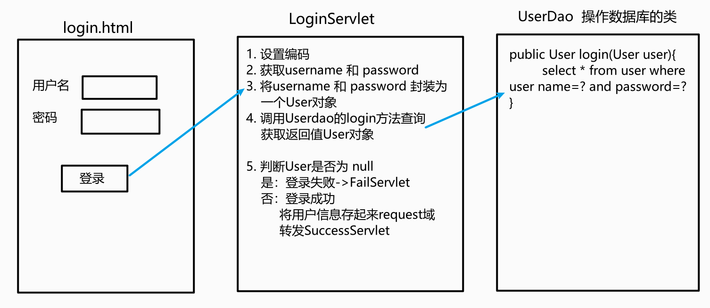
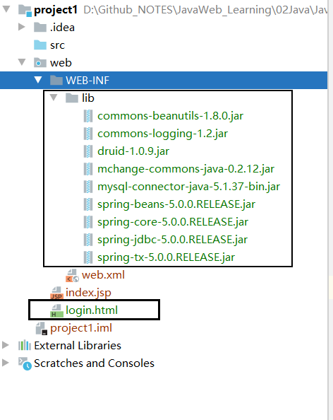
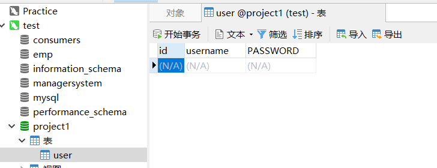

## 需求分析

用户登录案例需求：

1.  编写login.html登录页面
            username & password 两个输入框
2.  使用Druid数据库连接池技术,操作mysql，day14数据库中user表
3.  使用JdbcTemplate技术封装JDBC
4.  登录成功跳转到SuccessServlet展示：登录成功！用户名,欢迎您
5.  登录失败跳转到FailServlet展示：登录失败，用户名或密码错误




## 开发步骤

1.  创建项目，导入HTML页面，配置文件，jar包

    

2.  创建数据库的环境

    ```SQL
    CREATE DATABASE project1;
    USE project1;
    
    CREATE TABLE USER(
    	id INT PRIMARY KEY AUTO_INCREMENT,
    	username VARCHAR(32) UNIQUE NOT NULL,
    	PASSWORD  VARCHAR(32) UNIQUE NOT NULL
    );
    ```

    

    

3.  目录结构

    ```
    project1      // 根目录
    ├─ .idea      // Idea配置文件夹
    ├─ out
    ├─ project1.iml    // 项目配置文件夹
    ├─ src         // 类资源
    │    ├─ SQL_user    // 操作数据库中User表的类
    │    │    └─ UserDao.java
    │    ├─ User        // 用户信息类
    │    │    └─ User.java
    │    ├─ druid.properties   // 配置文件  数据库信息
    │    ├─ test        // 测试类
    │    │    └─ UserDaoTest.java
    │    ├─ util        // 创建连接池，mysql连接
    │    │    └─ JDBCUtils.java
    │    └─ web
    │           └─ servlet
    |           	└─ LoginServlet  // 登录成功判断控制
    |           	└─ FailServlet  // 登录失败控制
    |           	└─ SuccessServlet  // 登录成功控制
    └─ web
           ├─ WEB-INF
           │    ├─ lib    	// 依赖的包
           │    └─ web.xml  // 配置文件
           ├─ index.jsp      
           └─ login.html    // 登录页面
    ```

    

## 优化

通过BeanUtils 进行优化

可以将用户输入一次性读取

导入包 `commons-beanutils-1.8.0.jar`


### BeanUtils工具类

简化数据封装

*   JavaBean:标准的Java类
    *   类必须被public修饰
    *   必须提供空参的构造器
    *   成员变量必须使用private 修饰
    *   提供公共setter和getter方法


主要功能：封装数据


#### 概念：

成员变量

属性：setter 和 getter 方法截取后的产物

​	例如：getUsername() —> Username –> username


#### 内置方法

*   setProperty()
*   getProperty()
*   populate(object obj, Map map): 将map集合的键值对信息，封装到对应的JavaBean对象中


