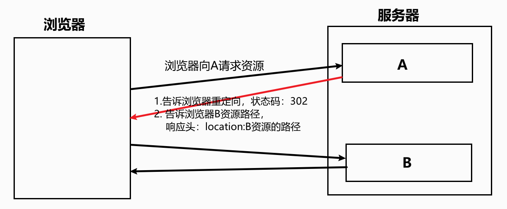
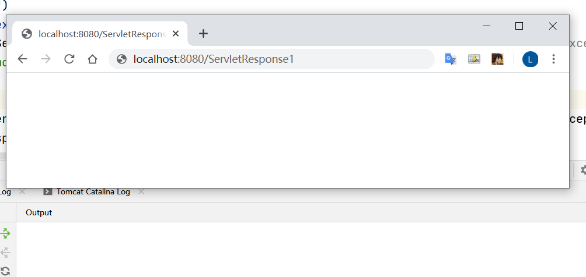
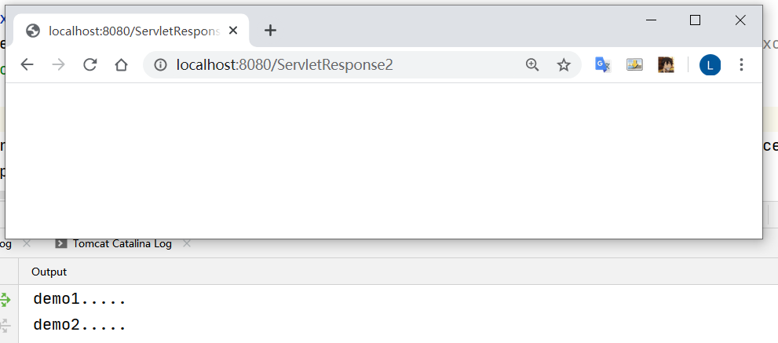
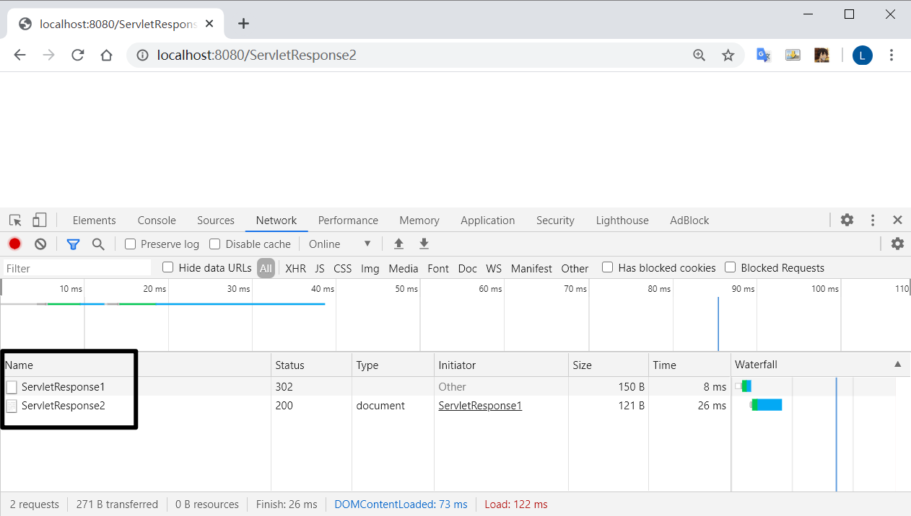
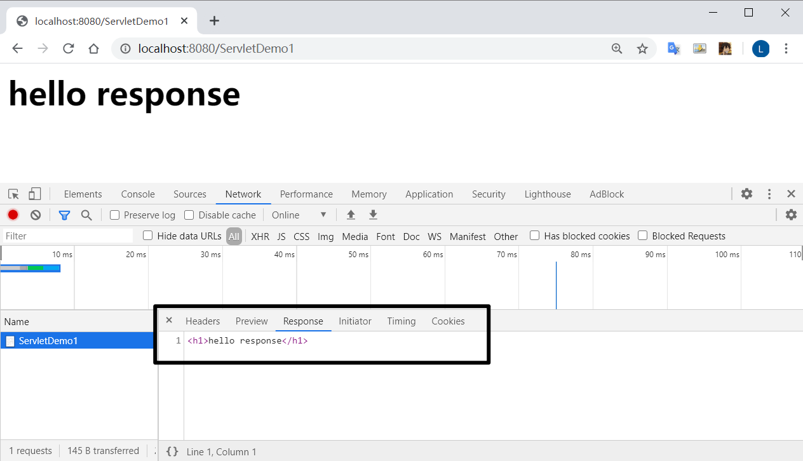
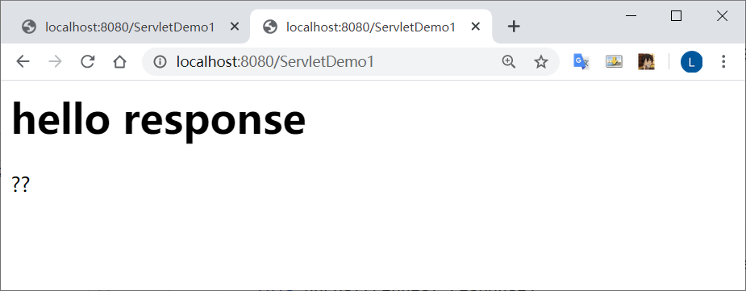
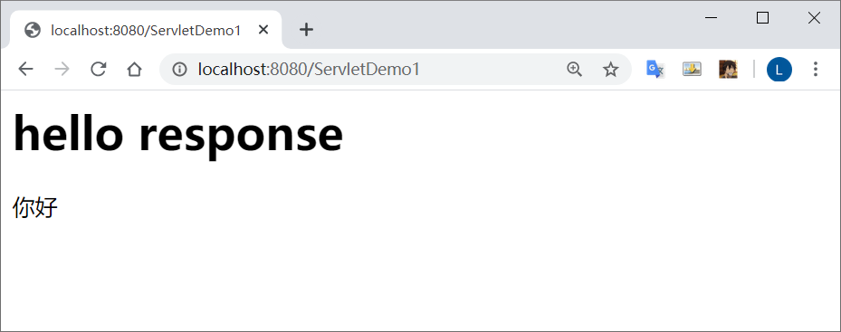
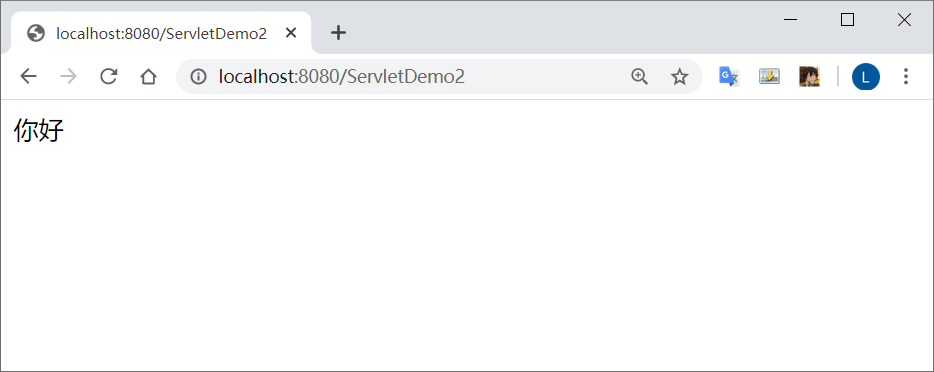
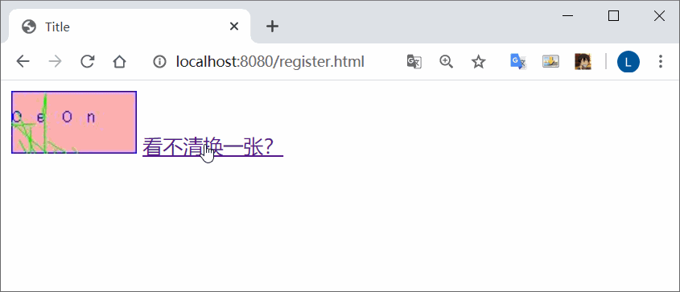

# Response案例

## 完成重定向


**Responseproject1**项目下




### 代码实现

**ServletResponse1.java**

```java
@WebServlet("/ServletResponse1")
public class ServletResponse1 extends HttpServlet {
    protected void doPost(HttpServletRequest request, HttpServletResponse response) throws ServletException, IOException {

        System.out.println("demo1.....");
        // 访问 /ServletResponse1 会自动跳转到 /ServletResponse2
        /*
        // 设置状态码为 302
        response.setStatus(302);
        // 设置响应头
        response.setHeader("location", "/ServletResponse2");
        */

        // 对重定向的封装方法
        response.sendRedirect("/ServletResponse2");
    }

    protected void doGet(HttpServletRequest request, HttpServletResponse response) throws ServletException, IOException {
        this.doPost(request,response);
    }
}
```

**ServletResponse2.java**

```java
@WebServlet("/ServletResponse2")
public class ServletResponse2 extends HttpServlet {
    protected void doPost(HttpServletRequest request, HttpServletResponse response) throws ServletException, IOException {
        System.out.println("demo2.....");
    }

    protected void doGet(HttpServletRequest request, HttpServletResponse response) throws ServletException, IOException {
        this.doPost(request,response);
    }
}
```

资源位置的重定向

请求行会发生改变

请求行输入 `http://localhost:8080/ServletResponse1`



按回车

url发生变化  控制台输出




### 重定向的特点

*   地址栏变化

*   可以访问其他服务器内容

    ```java
    response.sendRedirect("http://www.google.com");
    ```

*   两次请求  状态栏分别为  302  200

    所以不能用 `response.setAttribute()` 进行共享数据

    

### 转发的特点

*   转发地址栏路径不变
*   转发只能访问当前服务器下的资源
*   转发是一次请求


### forward 和 redirect 区别

路径写法:

**相对路径**：不可以确定唯一资源

```
./index.html
../mysql/mysql.md
```

**绝对路径**：可以确定唯一资源

大多以斜杠开头的

```
http://localhost:8080/ServletResponse2
/ServletResponse2
```

*   给客户端浏览器用：需要夹虚拟目录
*   给服务器用：不需要虚拟目录


## 服务器输出字符数据到浏览器

`ResponseProject2/src/servlet/ServletDemo1`

```java
@WebServlet("/ServletDemo1")
public class ServletDemo1 extends HttpServlet {
    protected void doPost(HttpServletRequest request, HttpServletResponse response) throws ServletException, IOException {

        // 获取流对象之前，设置流得默认编码: ISO-8859-1 设置为：GBK
//        response.setCharacterEncoding("GBK");

        // 告诉浏览器消息得编码，建议浏览器使用该编码解码
        response.setHeader("content-type", "text/html;charset=utf-8");

        // 获取字符输出流
        PrintWriter printWriter = response.getWriter();
        // 输出数据
        printWriter.write("<h1>hello response</h1>");
        printWriter.write("你好");
    }

    protected void doGet(HttpServletRequest request, HttpServletResponse response) throws ServletException, IOException {
        this.doPost(request,response);
    }
}
```




若不做特殊设置，中文会乱码



原因：编解码使用的字符集不一致

浏览器端与系统编码一致：window(GBK, GB2312)

而tomcat得编码为 ISO-8859-1

注意：需要再获取流之前设置

```java
// 获取流对象之前，设置流得默认编码: ISO-8859-1 设置为：GBK
response.setCharacterEncoding("GBK");
```



但最佳得处理方法是：

```java
// 告诉浏览器消息得编码，建议浏览器使用该编码解码
// 让浏览器响应 
response.setHeader("content-type", "text/html;charset=utf-8");
```


## 服务器输出字节数据到浏览器

`ResponseProject2/src/servlet/ServletDemo2`

```java
@WebServlet("/ServletDemo2")
public class ServletDemo2 extends HttpServlet {
    protected void doPost(HttpServletRequest request, HttpServletResponse response) throws ServletException, IOException {

        // 编码设置
        response.setContentType("text/html;charset=utf-8");
        // 获取字节输出流
        ServletOutputStream servletOutputStream = response.getOutputStream();
        // 输出数据
        servletOutputStream.write("你好".getBytes("utf-8"));

    }

    protected void doGet(HttpServletRequest request, HttpServletResponse response) throws ServletException, IOException {
        this.doPost(request,response);
    }
}
```




## 验证码

`ResponseProject2/src/servlet/ServletDemo3`

`web/register.html`




