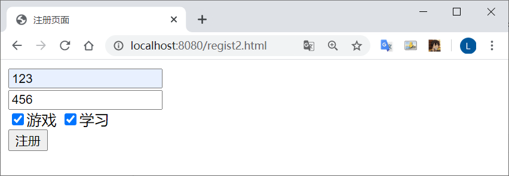
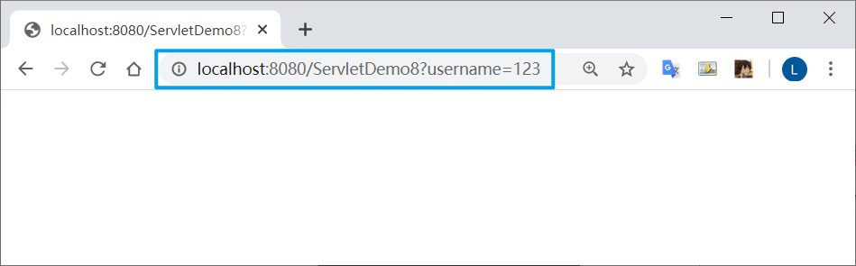
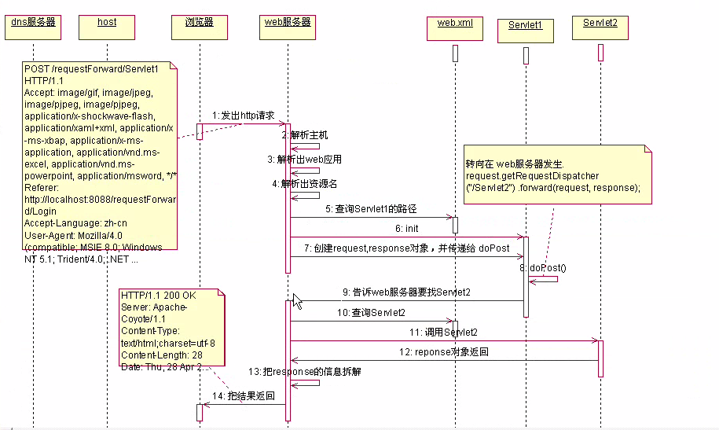
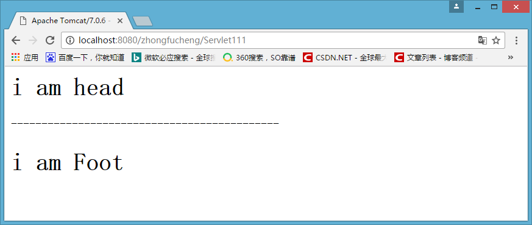

# Request 对象

## 什么是HttpServletRequest

HttpServletRequest对象代表客户端的请求，当客户端通过HTTP协议访问服务器时，HTTP请求头中的所有信息都封装在这个对象中，开发人员通过这个对象的方法，可以获得客户这些信息
简单来说，要得到浏览器信息，就找HttpServletRequest对象

## HttpServletRequest常用方法

### 获得客户机【浏览器】信息

*   getRequestURL方法返回客户端发出请求时的完整URL

*   getRequestURI方法返回请求行中的资源名部分

*   getQueryString 方法返回请求行中的参数部分

*   getPathInfo方法返回请求URL中的额外路径信息。额外路径信息是请求URL中的位于Servlet的路径之后和查询参数之前的内容，它以“/”开头

*   getRemoteAddr方法返回发出请求的客户机的IP地址

*   getRemoteHost方法返回发出请求的客户机的完整主机名

*   getRemotePort方法返回客户机所使用的网络端口号

*   getLocalAddr方法返回WEB服务器的IP地址

*   getLocalName方法返回WEB服务器的主机名

    

### 获得客户机请求头

*   getHeader方法

*   getHeaders方法 

*   getHeaderNames方法 

    

### 获得客户机请求参数(客户端提交的数据)

*   getParameter方法
*   getParameterValues（String name）方法
*   getParameterNames方法 
*   getParameterMap方法


## HttpServletRequest应用

### 防盗链

获取Referer这个消息头，判断Referer是不是从指定页面来的。如果不是从指定页面来的，跳转回指定的页面

```java
//获取到网页是从哪里来的
String referer = request.getHeader("Referer");

//如果不是从我的首页来或者从地址栏直接访问的，
if ( referer == null || !referer.contains("localhost:8080/zhongfucheng/index.jsp") ) {

  //回到首页去
  response.sendRedirect("/zhongfucheng/index.jsp");
  return;
}

//能执行下面的语句，说明是从我的首页点击进来的，那没问题，照常显示
response.setContentType("text/html;charset=UTF-8");
response.getWriter().write("路飞做了XXXXxxxxxxxxxxxxxxxx");
```

在html中设置提交数据的方法    post get

```java
<form action="/zhongfucheng/Servlet111" method="post">
```

然后在HttpServletRequest实现类中接受数据

```java
//设置request字符编码的格式
request.setCharacterEncoding("UTF-8");

//通过html的name属性，获取到值
String username = request.getParameter("username");
String password = request.getParameter("password");
String gender = request.getParameter("gender");

//复选框和下拉框有多个值，获取到多个值
String[] hobbies = request.getParameterValues("hobbies");
String[] address = request.getParameterValues("address");

//获取到文本域的值
String description = request.getParameter("textarea");

//得到隐藏域的值
String hiddenValue = request.getParameter("aaa");
```


### 超链接方式提交数据

常见的get方式提交数据有：使用超链接，sendRedirect()
格式如下：

```java
sendRedirect("servlet的地址?参数名="+参数值 &"参数名="+参数值);
```

通过超链接将数据带给浏览器

```html
<a href="/zhongfucheng/Servlet111?username=xxx">使用超链接将数据带给浏览器</a>
```

然后在HttpServletRequest实现类中接受数据

```java
//接收以username为参数名带过来的值
String username = request.getParameter("username");
System.out.println(username);
```



点击注册后，跳转




### 实现转发

*   **response** 的 **sendRedirect()** 可以实现重定向，做到的功能是**页面跳转**
*   **request** 的 **getRequestDispatcher.forward(request,response)** 实现**转发**


#### 转发

可以提交数据给服务器  使用很频繁

```java
//获取到requestDispatcher对象，跳转到index.jsp
RequestDispatcher requestDispatcher = request.getRequestDispatcher("/index.jsp");

//调用requestDispatcher对象的forward()实现转发,传入request和response方法
requestDispatcher.forward(request, response);
```


#### 重定向

可以通过sendRedirect()重定向可以在资源尾部添加参数提交数据给服务器


#### ServletContext  与  request 

Servlet之间可以通过ServletContext实现通讯，ServletContext也能称之为域对象。而request也可以称之为域对象，只不过ServletContext的域是整个web应用，而request的域仅仅代表一次http请求

通过request实现Servlet之间的通讯

**Servlet111.java**

```java
//以username为关键字存zhongfucheng值
request.setAttribute("username", "zhongfucheng");

//获取到requestDispatcher对象
RequestDispatcher requestDispatcher = request.getRequestDispatcher("/Servlet222");

//调用requestDispatcher对象的forward()实现转发,传入request和response方法
requestDispatcher.forward(request, response);
```

**Servlet222.java**

```java
//获取到存进request对象的值
String userName = (String) request.getAttribute("username");

//在浏览器输出该值
response.getWriter().write("i am :"+userName);
```

访问 Servlet111 即可


#### 使用选择

ServletContext  和  request   都可以实现Servlet之间的通讯

一般的原则：可以使用request就尽可能使用request。

因为ServletContext代表着整个web应用，使用ServletContext会消耗大量的资源

而request对象会随着请求的结束而结束，资源会被回收

使用request域进行Servlet之间的通讯在开发中是非常频繁的。


#### 转发的时序图




#### 请求转发的细节

如果在调用forward方法之前，在Servlet程序中写入的部分内容已经被真正地传送到了客户端，forward方法将抛出IllegalStateException异常。 

也就是说：**不要在转发之前写数据给浏览器**

错误代码

```java
OutputStream outputStream = response.getOutputStream();
outputStream.write("给浏览器写入数据".getBytes());

//关闭流，确保让数据到浏览器中
outputStream.close();

//跳转
request.getRequestDispatcher("/Foot").forward(request, response);
```

如果在调用forward方法之前向Servlet引擎的缓冲区中写入了内容，只要写入到缓冲区中的内容还没有被真正输出到客户端，forward方法就可以被正常执行，原来写入到输出缓冲区中的内容将被清空，但是，已写入到HttpServletResponse对象中的响应头字段信息保持有效


### 转发与重定向的区别

>   **转发是带着转发前的请求的参数的。重定向是新的请求**

#### 实际发生位置不同，地址栏不同

*   转发是发生在服务器的
    转发是由**服务器**进行跳转的。在转发的时候，**浏览器的地址栏是没有发生变化的**，在我访问Servlet111的时候，即使跳转到了Servlet222的页面，浏览器的地址还是Servlet111的。也就是说浏览器是不知道该跳转的动作，转发是对浏览器透明的。通过上面的转发时序图我们也可以发现，实现转发只是一次的http请求，一次转发中request和response对象都是同一个。这也解释了，为什么可以使用request作为域对象进行Servlet之间的通讯
*   重定向是发生在**浏览器**的
    重定向是由浏览器进行跳转的，进行重定向跳转的时候，浏览器的地址会发生变化的。曾经介绍过：实现重定向的原理是由response的状态码和Location头组合而实现的。这是由浏览器进行的页面跳转实现重定向会发出两个http请求，request域对象是无效的，因为它不是同一个request对象

#### 用法不同

*   很多人都搞不清楚转发和重定向的时候，资源地址究竟怎么写。有的时候要把应用名写上，有的时候不用把应用名写上。很容易把人搞晕。记住一个原则：**给服务器用的直接从资源名开始写，给浏览器用的要把应用名写上**
*   `request.getRequestDispatcher("/资源名 URI").forward(request,response)`
    转发时"/"代表的是本应用程序的根目录【zhongfucheng】
*   `response.send("/web应用/资源名 URI");`
    重定向时"/"代表的是webapps目录

#### 能够去往的URL的范围不一样

*   转发是服务器跳转只能去往当前web应用的资源

*   重定向是服务器跳转，可以去往任何的资源

#### 传递数据的类型不同

*   转发的request对象可以传递各种类型的数据，包括对象

*   重定向只能传递字符串

#### 跳转的时间不同

*   转发时：执行到跳转语句时就会立刻跳转
*   重定向：整个页面执行完之后才执行跳转


### 两者应用场景

1.  转发: 访问 Servlet 处理业务逻辑，然后 forward 到 jsp 显示处理结果，浏览器里 URL 不变
2.  重定向: 提交表单，处理成功后 redirect 到另一个 jsp，防止表单重复提交，浏览器里 URL 变了


### RequestDispatcher

RequestDispatcher对象调用forward()可以实现转发

RequestDispatcher还有另外一个方法include()，该方法可以实现包含

我们在写网页的时候，一般网页的头部和尾部是不需要改变的。如果我们多个地方使用Servlet输出网头和网尾的话，需要把代码重新写一遍。而使用RequestDispatcher的include()方法就可以实现包含网头和网尾的效果了

通过 `include()` 方法将已经写好的网头 网尾包含

```java
// 包含Head.java
request.getRequestDispatcher("/Head").include(request, response);

response.getWriter().write("将已经写好的网头 网尾显示再页面上");
// 包含 Foot.java
request.getRequestDispatcher("/Foot").include(request, response);
```




## 中文乱码问题

乱码的原因：

Tomcat服务器默认编码是**ISO 8859-1**，而浏览器使用的是UTF-8编码。浏览器的中文数据提交给服务器，Tomcat以ISO 8859-1编码对中文编码，当我在Servlet读取数据的时候，拿到的当然是乱码。而我设置request的编码为UTF-8，乱码就解决了

点击提交按钮的时候，数据封装进了Form Data中，http请求中把实体主体带过去了【传输的数据称之为实体主体】，既然**request对象封装了http请求**，所以request对象可以解析到发送过来的数据，于是只要把编码设置成**UTF-8**就可以解决乱码问题了

**在 post 方法中加入**

```java
//设置request字符编码的格式
request.setCharacterEncoding("UTF-8");
```

而在get方法中 这样设置是无效的

它的数据是从消息行带过去的，**没有封装到request对象里面**，所以使用request设置编码是无效的

**可以通过解码再重新编码的方式来解决**

```java
//此时得到的数据已经是被ISO 8859-1编码后的字符串了，这个是乱码
String name = request.getParameter("username");

//乱码通过反向查ISO 8859-1得到原始的数据
byte[] bytes = name.getBytes("ISO8859-1");

//通过原始的数据，设置正确的码表，构建字符串
String value = new String(bytes, "UTF-8");
```

get方式还可以**改Tomcat服务器的配置**来解决乱码，但是不推荐使用，这样不灵活

在配置文件中，在8080端口的Connector上加入URIEncoding="utf-8"，设置Tomcat的访问该端口时的编码为utf-8，从而解决乱码

```java
<Connector port="8080" protocol="HTTP/1.1" 
           connectionTimeout="20000" 
           redirectPort="8443" URIEncoding="utf-8"/>
```

**另一种改服务器编码的方式**。设置Tomcat的访问该端口时的编码为页面的编码，这种改法是随着页面的编码而变

```java
    <Connector port="8080" protocol="HTTP/1.1" 
               connectionTimeout="20000" 
               redirectPort="8443" useBodyEncodingForURI="true" />
```


### 总结：

*   post方式直接改request对象的编码
*   get方式需要手工转换编码
*   get方式也可以修改Tomcat服务器的编码，不推荐，因为会太依赖服务器了！
*   提交数据能用post就用post


