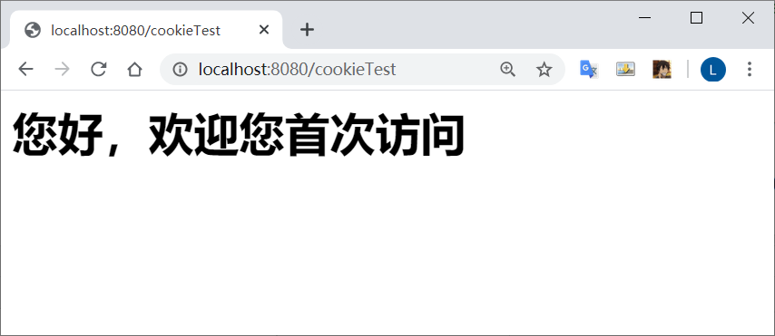
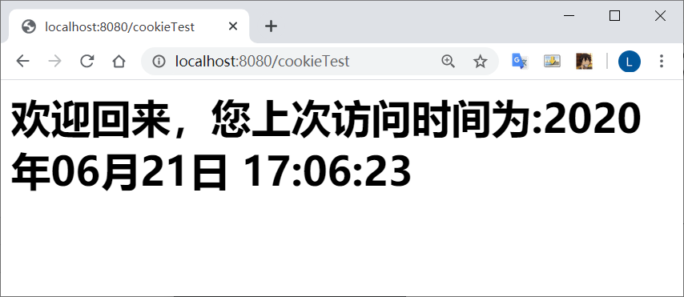

# Cookie案例

`ResponseProject3/src/Cookie/ServletDemo2`

## 记录上一次登录时间

**需求：**

1.  访问一个Servlet, 如果第一次访问，则显示：您好，欢迎您首次访问
2.  若不是，则显示: 欢迎回来，您上次访问时间为: xxx-xxx–xx–xx

**分析**：

*   可以采用Cookie 来完成
*   在服务器中的Servlet判断是否有一个名为`lastTime` 的 Cookie

再次刷新

