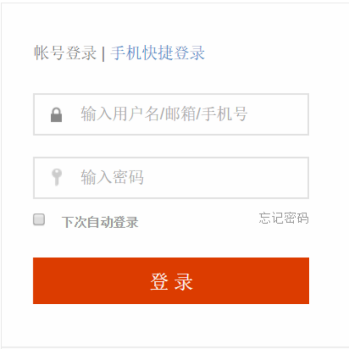

# Cookie

1. 什么是会话技术
   基本概念: 指用户开一个浏览器，访问一个网站,只要不关闭该浏览器，不管该用户点击多少个超链接，访问多少资源，直到用户关闭浏览器，整个这个过程我们称为一次会话.

2. 为什么我们要使用会话技术？
   会话跟踪技术可以解决我们很多很多问题。
   
   * 在论坛登陆的时候，很多时候会有一个小框框问你是否要自动登陆，当你下次登陆的时候就不用输入密码了
   * 
* 根据我以前浏览过的商品，猜我喜欢什么商品（要猜我喜欢，总得知道”我是谁“）
3. Cookie
   会话跟踪技术有**Cookie**和**Session**，Cookie技术是先出现的。我们先讲Cookie技术吧。
4. 什么是Cookie
   Cookie是由W3C组织提出，最早由`netscape`社区发展的一种机制
* 网页之间的交互是通过HTTP协议传输数据的，而Http协议是无状态的协议。无状态的协议是什么意思呢？一旦数据提交完后，浏览器和服务器的连接就会关闭，再次交互的时候需要重新建立新的连接
* 服务器无法确认用户的信息，于是乎，W3C就提出了：给每一个用户都发一个通行证，无论谁访问的时候都需要携带通行证，这样服务器就可以从通行证上确认用户的信息。通行证就是Cookie
  
  

## Cookie的流程

浏览器访问服务器，如果服务器需要记录该用户的状态，就使用response向浏览器发送一个Cookie，浏览器会把Cookie保存起来。当浏览器再次访问服务器的时候，浏览器会把请求的网址连同Cookie一同交给服务器

### Cookie API

•Cookie类用于创建一个Cookie对象
•response接口中定义了一个`addCookie`方法，它用于在其响应头中增加一个相应的Set-Cookie头字段
•request接口中定义了一个`getCookies`方法，它用于获取客户端提交的Cookie
常用的Cookie方法：
•public Cookie(String name,String value)
•`setValue`与`getValue`方法 
•`setMaxAge`与`getMaxAge`方法 
•`setPath`与`getPath`方法 
•`setDomain`与`getDomain`方法
•`getName`方法 

## 简单使用Cookie

```java
创建Cookie对象，发送Cookie给浏览器、 //设置response的编码 
response.setContentType("text/html;charset=UTF-8");

//创建Cookie对象，指定名称和值
Cookie cookie = new Cookie("username", "zhongfucheng");

//向浏览器给一个Cookie//设置response的编码
response.setContentType("text/html;charset=UTF-8");

//设置Cookie的时间  不可缺
cookie.setMaxAge(1000);

//创建Cookie对象，指定名称和值
Cookie cookie = new Cookie("username", "zhongfucheng");

//向浏览器给一个Cookie
response.addCookie(cookie);

response.getWriter().write("我已经向浏览器发送了一个Cookie");
response.addCookie(cookie);

response.getWriter().write("我已经向浏览器发送了一个Cookie");
```


google浏览器Cookie文件位置

`C:\Users\Administrator\AppData\Local\Google\Chrome\User Data\Default\Cache`


## Cookie细节

### Cookie不可跨域名性

Cookie具有不可跨域名性。

区别各个网站 之间的依据是域名。所以一般来说，当我访问`baidu`的时候，浏览器只会把`baidu`颁发的Cookie带过去，而不会带上google的Cookie。

这里需要注意：

中文属于Unicode字符，英文数据ASCII字符，中文占4个字符或者3个字符，英文占2个字符。解决：Cookie使用Unicode字符时需要对Unicode字符进行编码。

```java
String name = "中国";
//对Unicode字符进行编码
Cookie cookie = 
new Cookie("country", URLEncoder.encode(name, "UTF-8"));ountry", name);
cookie.setMaxAge(2000);
response.addCookie(cookie);

printWriter.write("我颁发了一个Cookie，值保存的是中文数据");
```

访问Servlet1，已经把Cookie成功颁发给浏览器了

我们发现Cookie保存在硬盘的中文数据是经过编码的，那么我们在取出Cookie的时候要对中文数据进行解码

取出存进Cookie的值

```java
Cookie[] cookies = request.getCookies();
for (int i = 0; cookies != null && i < cookies.length; i++) {
 String name = cookies[i].getName();

//经过URLEncoding就要URLDecoding
 String value = URLDecoder.decode(cookies[i].getValue(), "UTF-8");

printWriter.write(name + "------" + value);
}
```


### Cookie的有效期

Cookie的有效期是通过`setMaxAge()`来设置的

* 如果`MaxAge`为正数，浏览器会把Cookie写到硬盘中，只要还在`MaxAge`秒之前，登陆网站时该Cookie就有效【不论关闭了浏览器还是电脑】 

* 如果`MaxAge`为负数，Cookie是临时性的，仅在本浏览器内有效，关闭浏览器Cookie就失效了，Cookie不会写到硬盘中。Cookie默认值就是-1。这也就为什么在我第一个例子中，如果我没设置Cookie的有效期，在硬盘中就找不到对应的文件

* 如果`MaxAge`为0，则表示删除该Cookie。Cookie机制没有提供删除Cookie对应的方法，把`MaxAge`设置为0等同于删除Cookie 
  
  
  
   Cookie的修改和删除 
  
  上面我们已经知道了Cookie机制没有提供删除Cookie的方法。其实细心点我们可以发现，Cookie机制也没有提供修改Cookie的方法。那么我们怎么修改Cookie的值呢？

Cookie存储的方式类似于Map集合，如下图所示

Cookie的名称相同，通过response添加到浏览器中，会覆盖原来的Cookie。以country为名保存的是%E4%B8%AD%E5%9B%BD，下面我再以country为名，把值改变一下。

String name = "看完博客就点赞";

//对Unicode字符进行编码
Cookie cookie = new Cookie("country", URLEncoder.encode(name, "UTF-8"));
再次查看Cookie的时候，值已经改变了，但是文件还是那一份

现在我要删除该Cookie，把MaxAge设置为0，并添加到浏览器中即可
String name = "看完博客就点赞";

//对Unicode字符进行编码
Cookie cookie = new Cookie("country", URLEncoder.encode(name, "UTF-8"));

//一定不要忘记添加到浏览器中
cookie.setMaxAge(0);
response.addCookie(cookie);

printWriter.write("我删除了该Cookie");
访问Servlet，在硬盘已经找不到Cookie的文件了！

注意：删除，修改Cookie时，新建的Cookie除了value、maxAge之外的所有属性都要与原Cookie相同。否则浏览器将视为不同的Cookie，不予覆盖，导致删除修改失败！我们来试验一下把。
String name = "看完博客就点赞";

//对Unicode字符进行编码
Cookie cookie = new Cookie("country", URLEncoder.encode(name, "UTF-8"));

//一定不要忘记添加到浏览器中
cookie.setMaxAge(10000);
response.addCookie(cookie);

上面新建了一个Cookie，我修改下Cookie的其他属性，再删除，看能否把Cookie删除掉
//一定不要忘记添加到浏览器中
cookie.setPath("/ouzicheng");
cookie.setMaxAge(0);
response.addCookie(cookie);

printWriter.write("删除一个Cookie");
结果Cookie还在硬盘中

4.5 Cookie的域名
Cookie的domain属性决定运行访问Cookie的域名。domain的值规定为“.域名”
•Cookie的隐私安全机制决定Cookie是不可跨域名的。也就是说www.baidu.com和www.google.com之间的Cookie是互不交接的。即使是同一级域名，不同二级域名也不能交接，也就是说：www.google.com和www.image.goole.com的Cookie也不能访问
•我在本地上配置了3个虚拟主机，localhost,www.zhongfucheng.com,www.image.zhongfucheng.com【如果不知道怎么配置，在我Tomcat的博客有】

我用www.zhongfucheng.com域名发送了一个Cookie给浏览器
Cookie cookie = new Cookie("name", "zhongfucheng");
cookie.setMaxAge(1000);
response.addCookie(cookie);

printWriter.write("使用www.zhongfucheng.com域名添加了一个Cookie");

首先，证明了Cookie不可跨名性，localhost域名拿不到www.zhongfucheng.com颁发给浏览器的Cookie

再使用www.image.zhongfucheng.com域名访问,证明即使一级域名相同，二级域名不同，也不能获取到Cookie

当然，使用www.zhongfucheng.com当然能获取到Cookie，Cookie通过请求头带给服务器

现在我希望一级域名相同的网页Cookie之间可以相互访问。也就是说www.image.zhongfucheng.com可以获取到www.zhongfucheng.com的Cookie就需要使用到domain方法。
Cookie cookie = new Cookie("name", "ouzicheng");
cookie.setMaxAge(1000);
cookie.setDomain(".zhongfucheng.com");
response.addCookie(cookie);

printWriter.write("使用www.zhongfucheng.com域名添加了一个Cookie,只要一级是zhongfucheng.com即可访问");
使用www.zhongfucheng.com发布一个Cookie

使用www.image.zhongfucheng.com域名访问一下。发现可以获取到Cookie了

4.6 Cookie的路径
Cookie的path属性决定允许访问Cookie的路径。一般地，Cookie发布出来，整个网页的资源都可以使用。现在我只想Servlet1可以获取到Cookie，其他的资源不能获取。

使用Servlet2颁发一个Cookie给浏览器,设置路径为"/Servlet1"。
Cookie cookie = new Cookie("username", "java");
cookie.setPath("/Servlet1");
cookie.setMaxAge(1000);
response.addCookie(cookie);

printWriter.write("该Cookie只有Servlet1获取得到");
使用Servlet3访问服务器，看看浏览器是否把Cookie带上。显然，浏览器访问Servlet3并没有把Cookie带上。

使用Servlet1访问服务器，看看浏览器是否把Cookie带上。答案是肯定的！

4.7 Cookie的安全属性
•HTTP协议不仅仅是无状态的，而且是不安全的！如果不希望Cookie在非安全协议中传输，可以设置Cookie的secure属性为true，浏览器只会在HTTPS和SSL等安全协议中传输该Cookie。
•当然了，设置secure属性不会将Cookie的内容加密。如果想要保证安全，最好使用md5算法加密【后面有】。

5. Cookie的应用
   5.1显示用户上次访问的时间
   •其实就是每次登陆的时候，取到Cookie保存的值，再更新下Cookie的值。
   •访问Serlvet有两种情况
   –第一次访问
   –已经访问过了
   •全部代码如下：
   SimpleDateFormat simpleDateFormat = new SimpleDateFormat("yyyy-MM-dd HH:mm:ss");
   response.setContentType("text/html;charset=UTF-8");
   PrintWriter printWriter = response.getWriter();

//获取网页上所有的Cookie
Cookie[] cookies = request.getCookies();

//判断Cookie的值是否为空
String cookieValue = null;
for (int i = 0; cookies != null && i < cookies.length; i++) {

  //获取到以time为名的Cookie
  if (cookies[i].getName().equals("time")) {
    printWriter.write("您上次登陆的时间是：");
    cookieValue = cookies[i].getValue();
    printWriter.write(cookieValue);

    cookies[i].setValue(simpleDateFormat.format(new Date()));
    response.addCookie(cookies[i]);
    
    //既然已经找到了就可以break循环了
    break;

  }
}

//如果Cookie的值是空的，那么就是第一次访问
if (cookieValue == null) {
  //创建一个Cookie对象，日期为当前时间
  Cookie cookie = new Cookie("time", simpleDateFormat.format(new Date()));

  //设置Cookie的生命期
  cookie.setMaxAge(20000);

  //response对象回送Cookie给浏览器
  response.addCookie(cookie);

  printWriter.write("您是第一次登陆啊！");
}
•按照正常的逻辑来写，程序流程应该是这样子的。先创建Cookie对象，回送Cookie给浏览器。再遍历Cookie，更新Cookie的值。

•但是，按照上面的逻辑是做不到的！因为每次访问Servlet的时候都会覆盖原来的Cookie，取到Cookie的值永远都是当前时间，而不是上次保存的时间。
•我们换一个逻辑写：先检查（遍历）所有Cookie有没有我要的，如果得不到我想要的Cookie，Cookie的值是null，那么就是第一次登陆，于是就有了上面的代码了。
•我们来看下效果吧！当我第一次登陆的时候

Cookie保存在硬盘中。

再次访问Servlet。明显地，取到的就是Cookie的值

5.2显示上次浏览过商品
我就以书籍为例子了！首先设计Book对象
    private String id ;
    private String name ;
    private String author;

    public Book() {
    }
    
    public Book(String id, String name, String author) {
        this.id = id;
        this.name = name;
        this.author = author;
    }
    
    ...各种set、get方法

设计一个简单的数据库存储数据。就用LinkedHashMap集合【根据商品的id找书籍所以用Map，删改较多所以用Linked】
private static LinkedHashMap<String, Book> linkedHashMap = new LinkedHashMap();

//简化开发复杂度，book的id和商品的id相同
static {
  linkedHashMap.put("1", new Book("1", "javaweb", "zhong"));
  linkedHashMap.put("2", new Book("2", "java", "fu"));
  linkedHashMap.put("3", new Book("3", "oracle", "cheng"));
  linkedHashMap.put("4", new Book("4", "mysql", "ou"));
  linkedHashMap.put("5", new Book("5", "ajax", "zi"));
}

//获取到所有书籍
public static LinkedHashMap getAll() {
  return linkedHashMap;
}

显示网页上所有的书籍【首页】
printWriter.write("网页上所有的书籍："+"<br/>");

//拿到数据库所有的书
LinkedHashMap<String, Book> linkedHashMap = DB.getAll();
Set<Map.Entry<String, Book>> entry = linkedHashMap.entrySet();

//显示所有的书到网页上
for (Map.Entry<String, Book> stringBookEntry : entry) {
  Book book = stringBookEntry.getValue();
  printWriter.write(book.getId() +"           "+ book.getName()+"<br/>");
}

接着，我们要做的就是给显示的书籍挂上一个超链接，当用户点击想看的书籍时，就跳转到该书籍的详细信息页面
超链接应该把书的id传递过去，不然处理页面是不知道用户想看的是哪一本书的！
//显示所有的书到网页上
for (Map.Entry<String, Book> stringBookEntry : entry) {
  Book book = stringBookEntry.getValue();
  printWriter.write("<a href='/ouzicheng/Servlet2?id=" + book.getId() + "''target=_blank' +" + book.getName() + "</a>");
  printWriter.write("<br/>");
}

接收id，找到用户想要看哪一本书，输出该书的详细信息
        String id = request.getParameter("id");

        //由于book的id和商品的id是一致的。获取到用户点击的书
        Book book = (Book) DB.getAll().get(id);
    
        //输出书的详细信息
        printWriter.write("书的编号是：" + book.getId()+"<br/>");
        printWriter.write("书的名称是：" + book.getName()+"<br/>");
        printWriter.write("书的作者是：" + book.getAuthor()+"<br/>");

点击想要的书籍。

得到书籍的详细信息

既然用户点击了书籍，那么服务器就应该颁发Cookie给浏览器，记住用户点击了该书籍。现在问题来了，Cookie的值应该是什么呢？试想一下，待会还要把浏览过的书籍显示出来，所以用书籍的id是最好不过的。想到了用书籍的id作为Cookie的值，我们还要定义一些规则！

我们可能有非常多的书籍，不可能把用户浏览过的书籍都显示出来。所以我们定义只能显示3本浏览过的书籍
书籍的id都是数字，如果不做任何修改，存到Cookie里边可能就是231，345，123此类的数字，这样取出某一个id的时候就十分费劲并且后面还要判断该书是否存在Cookie里边了，所以我们要把存储到Cookie的书籍id分割起来。所以我们定义”_“作为分隔符
按上面的应用，我们的逻辑应该是：先遍历下Cookie，看下有没有我们想要的Cookie。如果找到想要的Cookie，那就取出Cookie的值
String bookHistory = null;
Cookie[] cookies = request.getCookies();
for (int i = 0; cookies != null && i < cookies.length; i++) {
  if (cookies[i].getName().equals("bookHistory")) {
    bookHistory = cookies[i].getValue();
  }
}
•取出了Cookie的值也分几种情况
1.Cookie的值为null【直接把传入进来的id当做是Cookie的值】
2.Cookie的值长度有3个了【把排在最后的id去掉，把传进来的id排在最前边】
3.Cookie的值已经包含有传递进来的id了【把已经包含的id先去掉，再把id排在最前面】
4.Cookie的值就只有1个或2个，直接把id排在最前边
if (bookHistory == null) {
  return id;
}

//如果Cookie的值不是null的，那么就分解Cookie的得到之前的id。
String[] strings = bookHistory.split("\\_");

//为了增删容易并且还要判断id是否存在于该字符串内-----我们使用LinkedList集合装载分解出来的id
List list = Arrays.asList(strings);
LinkedList<String> linkedList = new LinkedList<>();
linkedList.addAll(list);

if (linkedList.contains(id)) {
  linkedList.remove(id);
  linkedList.addFirst(id);
}else {
  if (linkedList.size() >= 3) {
    linkedList.removeLast();
    linkedList.addFirst(id);
  } else {
    linkedList.addFirst(id);
  }
}
这么折腾完了，我们的Cookie值就在LinkedList集合里边了。接下来，我们要做的就是把集合中的值取出来，拼接成一个字符串
StringBuffer stringBuffer = new StringBuffer();

//遍历LinkedList集合，添加个下划线“_”
for (String s : linkedList) {
  stringBuffer.append(s + "_");
}

//最后一个元素后面就不需要下划线了
return stringBuffer.deleteCharAt(stringBuffer.length() - 1).toString();
好的，我们现在已经完成了Cookie值了。接下来设置Cookie的生命周期，回送给浏览器即可
String bookHistory = makeHistory(request, id);
Cookie cookie = new Cookie("bookHistory", bookHistory);
cookie.setMaxAge(30000);
response.addCookie(cookie);
既然我们已经把Cookie回送给浏览器了。那么接下来我们就在首页上获取Cookie的值，显示用户浏览过什么商品就行了！
printWriter.write("您曾经浏览过的商品：");
printWriter.write("<br/>");

//显示用户浏览过的商品
Cookie[] cookies = request.getCookies();
for (int i = 0; cookies != null && i < cookies.length; i++) {

  if (cookies[i].getName().equals("bookHistory")) {

    //获取到的bookHistory是2_3_1之类的
    String bookHistory = cookies[i].getValue();
    
    //拆解成每一个id值
    String[] ids = bookHistory.split("\\_");
    
    //得到每一个id值
    for (String id : ids) {
    
      //通过id找到每一本书
      Book book = linkedHashMap.get(id);
    
      printWriter.write(book.getName());
      printWriter.write("<br/>");
    
    }
    break;

  }

}
好的，我们来试验一下吧！！，第一次访问首页，并没有浏览过的商品

当我点击javaweb书籍再访问首页的时候

再点击ajax然后访问首页

再点击javaweb然后访问首页

点击oracle然后访问首页

好的，经过测试，该程序应该没有什么问题了！