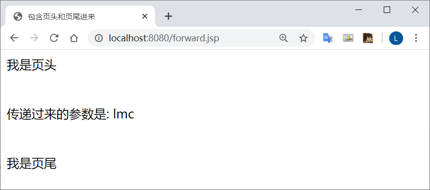
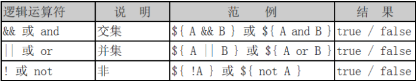
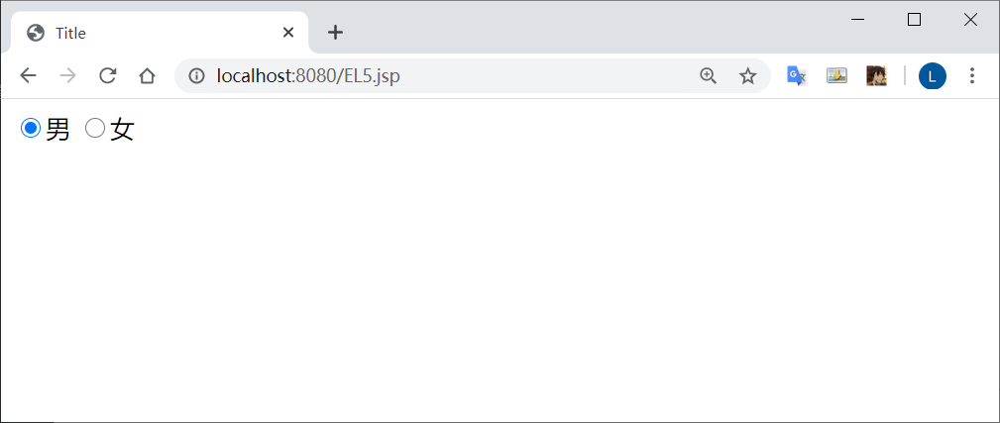
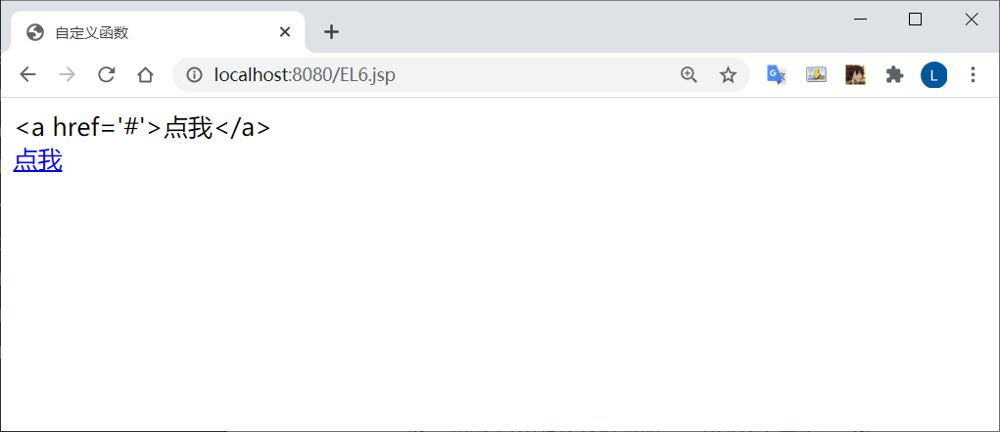
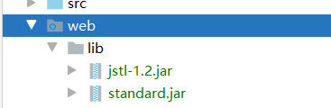
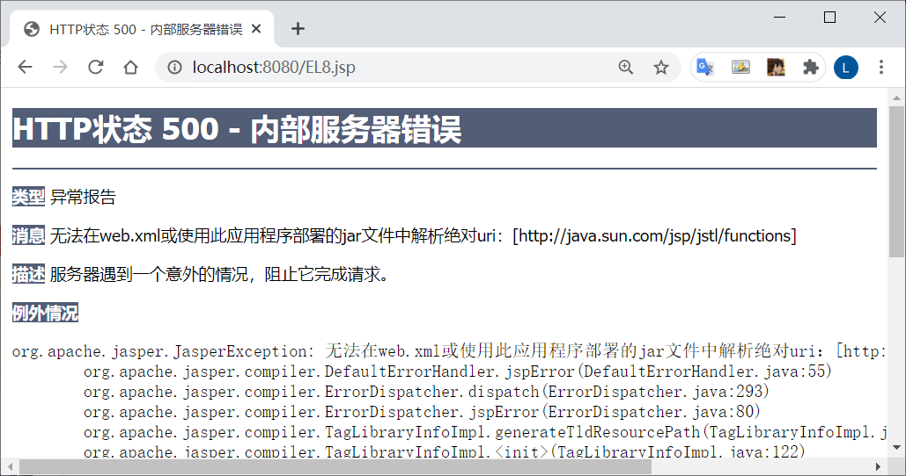
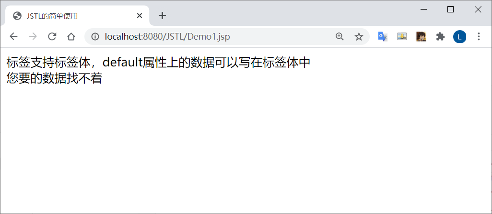
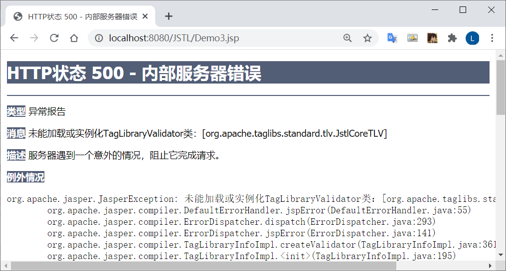
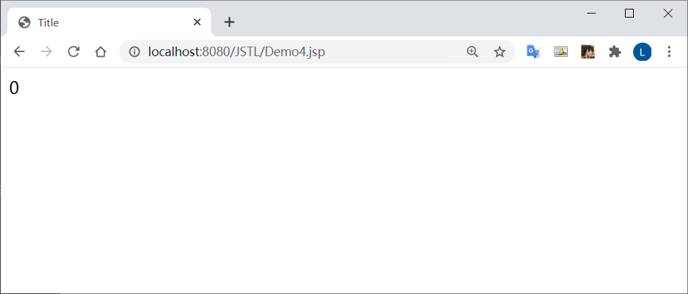

# JSP入门

## 什么是JSP

JSP全名为**Java Server Pages**，java服务器页面。JSP是一种基于文本的程序

特点: HTML和Java代码共同存在

## 为什么需要JSP

JSP是为了简化Servlet的工作出现的替代品，Servlet输出HTML非常困难，JSP就是替代Servlet输出HTML的


## 一个简单的JSP

<% %>  内进行java语言输入

```jsp
<%@ page contentType="text/html;charset=UTF-8" language="java" %>
<html>
  <head>
    <title>简单使用JSP</title>
  </head>
  <body>
  <%
    String str = "HelloWorld!";
    out.println(str);
    // 不可用  System.out.println(str);
  %>
  </body>
</html>
```


## JSP的工作原理

Tomcat访问任何的资源都是在访问Servlet！，JSP也不例外！**JSP本身就是一种Servlet**。为什么我说JSP本身就是一种Servlet呢？其实JSP在第一次被访问的时候会被编译为HttpJspPage类（该类是HttpServlet的一个子类）


### 编译过程

浏览器第一次请求**index.jsp**时，Tomcat会将**index.jsp**转化成**index_jsp.java**这么一个类，并将该文件编译成class文件。编译完毕后再运行class文件来响应浏览器的请求

以后访问**index.jsp**就不再重新编译jsp文件了，直接调用class文件来响应浏览器。当然了，如果Tomcat检测到JSP页面改动了的话，会重新编译的

说到底，JSP就是封装了Servlet的java程序罢了


JSP比Servlet更方便更简单的一个重要原因就是：

内置了9个对象

内置对象有：out、session、response、request、config、page、application、pageContext、exception


## JSP生命周期

JSP也是Servlet，**运行时只有一个实例**，JSP初始化和销毁时也会调用Servlet的init()和destroy()方法。另外，JSP还有自己初始化和销毁的方法 

```java
public void _jspInit() {
    _el_expressionfactory = _jspxFactory.getJspApplicationContext(
        getServletConfig().
        getServletContext()).getExpressionFactory();
    _jsp_instancemanager = org.apache.jasper.runtime.InstanceManagerFactory.getInstanceManager(getServletConfig());
  }

public void _jspDestroy() {
  }
```


## JSP的语法

JSP代码可以分为两部分：

1.  模板数据：就是HTML代码
2.  2.元素：JSP页面中的java代码、JSP指令、JSP标签


### JSP脚本

​    JSP的脚本就是JSP页面中的java代码，也叫做scriptlet。JSP的脚本必须使用<%%>括起来，不然会被当成是模板数据的！

​    JSP脚本有三种方式：

```java
<%%>【定义局部变量，编写语句】

<%!%>【定义类或方法，但是没人这样用！】

<%=%>（也称之为表达式输出）【输出各种类型的变量，int、double、String、Object等】
```

<% %> 标签可以用 `scriptlet` 标签代替   功能相同

```jsp
<jsp:scriptlet>

  String s = "HelloWorld";
  out.println(s);

</jsp:scriptlet>
```


### JSP注释

```java
<%--这是JSP注释--%>
<%--%>

//这是java的当行注释
//

/*这是java的多行注释*/
/**/
```

​	

### JSP指令

JSP指令用来声明JSP页面的相关属性，例如编码方式、文档类型等等
JSP指令的语法：

```jsp
<%@指令  属性名="值"  %>
```


### page指令

在idea生成的JSP页面就有page指令了。

```jsp
<%@ page contentType="text/html;charset=UTF-8" language="java" %>
```

page指令常见属性：

```java
language="java" 
extends="package.class" 
import="{package.class | package.*}, ..." 
session="true | false" 
buffer="none | 8kb | sizekb" 
autoFlush="true | false" 
isThreadSafe="true | false" 
info="text" 
errorPage="relative_url" 
isErrorPage="true | false" 
contentType="mimeType ;charset=characterSet " | "text/html ; charset=ISO-8859-1" 
pageEncoding="characterSet | ISO-8859-1" 
isELIgnored="true | false" 
```

*   一般地，在eclipse或idea这些高级开发工具上开发，我们只需要在page指令中指定contentType="text/html;charset=UTF-8"，就不会出现中文乱码问题！

*   当然了contentType 不仅仅可以指定以text/html的方式显示，还可以使用其他的形式显示出来。在conf/web.xml文件中可以查询出来


我们上网的时候，如果我们操作不当，或者服务器出错了，页面都是会出现友好提示的！这个也能通过page指令来实现跳转到友好提示页面上


### Page指令属性

page指令errorPage=和isErrorPage这两个属性

jsp出现了错误，通过page指令的errorPage属性跳转到error.jsp页面上

```jsp
<%@ page contentType="text/html;charset=UTF-8" language="java" errorPage="error.jsp" %>
	<html>
	<head>
	    <title>该页面出错了！</title>
	</head>
	<body>
	    <%--模拟页面出错了！！！--%>
	    <%
	        int result = 2 / 0;
	    %>
	    你好呀
	</body>
	</html>
```

error.jsp页面要通过page指令的isErrorPage属性设置页面就是错误页面

```jsp
	<%@ page contentType="text/html;charset=UTF-8" language="java" isErrorPage="true"   %>
	<html>
	    <head>
	        <title>友好提示页面</title>
	    </head>
	    <body>
	        服务器正忙着呢！
	    </body>
	</html>
```


当然了，细心的朋友可以发现地址栏是没有变化的，所以属于是服务器跳转。以上的做法是单个页面设置的，如果多个会有很多错误（JSP多的情况下，错误就会多），单个设置太麻烦了！

我们可以在web.xml文件中全局设置错误页，只要发生了404错误或者空指针异常的错误都会跳转到error.jsp页面上

```jsp
<error-page>
	<error-code>404</error-code>
	<location>/error.jsp</location>
</error-page>
<error-page>
    <exception-type>java.lang.NullPointerException</exception-type>
    <location>/error.jsp</location>
</error-page>
```

随便输个资源进行，会发生发404错误的，跳转到错误页面


地址栏是没有变化的，属于是服务器跳转


### include指令

在讲解request对象的时候,  我们曾经使用过

`request.getRequestDispatcher(String url).include(request,response)`

来对页头和页尾面进行包含

**inclue指令**也是做这样的事情

include指令是**静态包含**

静态包含的意思就是：把文件的代码内容都包含进来，再编译！

这是页头

**head.jsp**

```jsp
<%@ page contentType="text/html;charset=UTF-8" language="java"   %>
<html>
<head>
    <title>页头</title>
</head>
<body>
我是页头
<br>
<br>
<br>
</body>
</html>
```

这是页尾

**foot.jsp**

```jsp
<%@ page contentType="text/html;charset=UTF-8" language="java" %>
<html>
<head>
    <title>页尾</title>
</head>
<body>
<br>
<br>
<br>   
我是页尾
</body>
</html>
```

在site.jsp中把页头和页尾包含进来

```jsp
<%@ page contentType="text/html;charset=UTF-8" language="java" %>
<html>
<head>
    <title>包含页头和页尾进来</title>
</head>
<body>
<%@include file="head.jsp" %>
<%@include file="foot.jsp" %>
</body>
</html>
```


jsp还提供另一种包含文件的方式：JSP行为---动态包含


### taglib指令

JSP支持标签技术，要使用标签技术就先得声明标签库和标签前缀。taglib指令就是用来指明JSP页面内使用标签库技术


## JSP行为

JSP行为（JSP Actions）是一组JSP内置的标签，只书写少量的标记代码就能够使用JSP提供丰富的功能，JSP行为是对常用的JSP功能的抽象和封装

把这些JSP内置的标签称之为JSP行为，能够和JSTL标签区分开来


### include行为

上面已经提及到了，**include指令**是静态包含，**include行为**是动态包含。其实include行为就是封装了

```java
request.getRequestDispatcher(String url).include(request,response)
```

include行为语法是这个样子的

我们先来使用一下把，在1.jsp页面中也将页头和页尾包含进来。

```jsp
	<jsp:include page=""/>
```

我们先来使用一下把，在site.jsp页面中也将页头和页尾包含进来

注意与include 指令 包含页头页尾的区别

```jsp
<%@ page contentType="text/html;charset=UTF-8" language="java" %>
	<html>
	<head>
	    <title>包含页头和页尾进来</title>
	</head>
	<body>
        // include 行为
	    <jsp:include page="head.jsp"/>
	    <jsp:include page="foot.jsp"/>
        // include 指令
        // <%@include file="head.jsp" %>
		// <%@include file="foot.jsp" %>
	</body>
	</html>
```


jsp行为包含文件就是先编译被包含的页面，再将页面的结果写入到包含的页面中

使用动态包含更优

动态包含可以向被包含的页面**传递参数**（用处不大），并且是分别处理包含页面的（将被包含页面编译后得出的结果再写进包含页面）【如果有相同名称的参数，使用静态包含就会报错！】


先使用静态包含

**heda.jsp**

```jsp
<%@ page contentType="text/html;charset=UTF-8" language="java"   %>
<html>
	<head>
		<title>页头</title>
	</head>
	<body>
	    <%
		String s = "zhongfucheng";
		%>
		我是页头呀
		<br>
		<br>
		<br>
	</body>
</html>
```


**foot.jsp**

```jsp
<%@ page contentType="text/html;charset=UTF-8" language="java" %>
<html>
<head>
    <title>页尾</title>
</head>
<body>
    <%
        String s = "zhongfucheng";
    %>
我是页尾呀
</body>
</html>
```

访问报错


出现异常的原因很简单，就是同一个文件中有两个相同的变量s

而动态包含就可以避免错误


### param行为

当使用jsp:include和jsp:forward行为引入或将请求转发给其它资源时，可以使用jsp:param行为向这个资源传递参数


### forward行为

进行页面跳转   **url不变**

在讲解request对象的时候，我们使用request.getRequestDispatcher(String url).forward(request,response)进行跳转。其实forward行为就是对其封装！

forward的语法：

```jsp
<jsp:forward page=""/>
```

**forward.jsp**

```jsp
<%@ page contentType="text/html;charset=UTF-8" language="java" %>
<html>
<head>
    <title>访问后跳转</title>
</head>
<body>
<jsp:forward page="site.jsp"/>
</body>
</html>
```


**传递参数**

就要在forward行为嵌套param行为

在跳转到head.jsp时传入参数username值为lmc

**forward.jsp**

```jsp
<%@ page contentType="text/html;charset=UTF-8" language="java" %>
<html>
<head>
    <title>访问后跳转</title>
</head>
<body>
<jsp:forward page="site.jsp">
    <jsp:param name="username" value="lmc"/>
</jsp:forward>
</body>
</html>
```

**site.jsp**

```jsp
<%@ page contentType="text/html;charset=UTF-8" language="java" %>
<html>
<head>
    <title>包含页头和页尾进来</title>
</head>
<body>
<%@include file="head.jsp" %>
<%
    String ss = request.getParameter("username");
    out.println("传递过来的参数是: " + ss);
%>

<%@include file="foot.jsp" %>
</body>
</html>
```




### directive行为

directive的中文意思就是指令

该行为就是替代指令%@%的语法的

```jsp
<jsp:directive.include file=""/> 相当于<%@include file="" %>
jsp:directive.page/ 相当于<%@page %>
jsp:directive.taglib/ 相当于<%@taglib %> 
```

**forward.jsp**

```jsp
<%@ page contentType="text/html;charset=UTF-8" language="java" %>
<html>
<head>
    <title>包含页头和页尾进来</title>
</head>
<body>

<jsp:directive.include file="head.jsp">

</jsp:directive.include>

<%
    String ss = request.getParameter("username");
    out.println("传递过来的参数是: " + ss);
%>

<jsp:directive.include file="foot.jsp">

</jsp:directive.include>
</body>
</html>
```


###  javaBean行为

*   JSP还提供了操作javaBean对象的行为，在这里就不详细说明了，后面会讲到的！现在记住JSP提供了javaBean行为来操作简单类即可！

    ```jsp
    <jsp:useBean id=""/>
    <jsp:setProperty name="" property=""/>
    <jsp:getProperty name="" property=""/>
    ```


# 内置对象、属性范围

## 什么是JSP内置对象

JSP引擎在调用JSP对应的jspServlet时，会传递或创建9个与web开发相关的对象供jspServlet使用。JSP技术的设计者为便于开发人员在编写JSP页面时获得这些web对象的引用，特意定义了9个相应的变量，开发人员在JSP页面中通过这些变量就可以快速获得这9大对象的引用

九个内置对象：

*   pageContext

*   page

*   config

*   request

*   response

*   session

*   application

*   exception

*   out

    ​    

## out对象

```java
int getBufferSize()【得到缓存大小】
int getRemaining()【得到未使用缓存的大小】
boolean isAutoFlush()
void println() 
void flush()
void close()
void clearBuffer()
void clear()
```

out对象用于向浏览器输出数据，与之对应的是**Servlet的PrintWriter对象**。然而这个out对象的类型并不是PrintWriter，是**JspWriter**

可以理解为：JspWriter就是带缓存的PrintWrieter


只有向out对象中写入了内容，且满足如下任何一个条件时，out对象才去调用

ServletResponse.getWriter方法，并通过该方法返回的PrintWriter对象将out对象的缓冲区中的内容真正写入到Servlet引擎提供的缓冲区中：

*   设置page指令的buffer属性关闭了out对象的缓存功能

*   out对象的缓冲区已满

*   整个JSP页面结束

    一般我们在JSP页面输出都是用表达式（<%=%>)，所以out对象用得并不是很多


## request

内置对象request其实就是HttpServletRequest

## response

内置对象response其实就是HttpServletResponse

## config

内置对象config其实就是ServletConfig

## session

内置对象session其实就是HttpSession

在page指令配置如下信息，session将不可使用

```JSP
	<%@page session="false" %>
```


## page

内置对象page是HttpJasPage对象，其实page对象代表的就是当前JSP页面，是当前JSP编译后的Servlet类的对象。也就是说：page对象相当于普通java类的this


## exception

内置对象exception是java.lang.Exception类的对象，exception封装了JSP页面抛出的异常信息。exception经常被用来处理错误页面

**exception.jsp**

```jsp
<%@ page contentType="text/html;charset=UTF-8" language="java" errorPage="exceptionError.jsp" %>
<html>
<head>
    <title>Title</title>
</head>
<body>
<%--模拟空指针异常的错误--%>
<%
    String sss = null;
    sss.length();
%>
</body>
</html>
```

**exceptionError.jsp**

```jsp
<%@ page contentType="text/html;charset=UTF-8" language="java" isErrorPage="true" %>
<html>
<head>
    <title>出错啦！</title>
</head>
<body>
    <%
        out.println("程序抛出了异常：" + exception);
    %>
</body>
</html>
```


## pageContext

pageContext是内置对象中**最重要**的一个对象，它代表着**JSP页面编译后的内容**（也就是JSP页面的运行环境）！


### pageContext获取8个内置对象

既然它代表了JSP页面编译后的内容，理所当然的：它封装了对其他8大内置对象的引用！也就是说，通过pageContext可以获取到其他的8个内置对象


### pageContext作为域对象

#### 访问本JSP域

类似于request，session，ServletContext作为域对象而言都有以下三个方法：

```java
setAttribute(String name,Objcet o)
getAttribute(String name)
removeAttribute(String name)
```

当然了，pageContext也不例外，pageContext也有这三个方法

*   pageContext本质上代表的是当前JSP页面编译后的内容，作为域对象而言，它就代表着**当前JSP页面**（也就是page）！
*   **pageContext域对象只在page范围内有效**，超出了page范围就无效了！


#### 访问外部JSP域

pageContext本质上代表着编译后JSP的内容，pageContext还可以封装了访问其他域的方法

上面的pageContext默认是page范围的，但pageContext对象重载了set、get、removeAttribute这三个方法

```java
getAttribute(String name,int scope)
setAttribute(String name,Object value,int scope)
removeAttribute(String name,int scope)
```

多了一个设置域范围的一个参数，如果不指定默认就是page

pageContext把request、session、application、page这几个域对象封装着了静态变量供我们使用

```java
PageContext.APPLICATION_SCOPE
PageContext.SESSION_SCOPE
PageContext.REQUEST_SCOPE
PageContext.PAGE_SCOPE 
```

刚才我们没有使用重载方法的时候，使用pageContext是无法获取到request域对象设置的属性的。现在我们使用重载后的方法看一下能不能获取得到！

**pageContext.jsp**

```jsp
<%@ page contentType="text/html;charset=UTF-8" language="java" %>
<html>
<head>
    <title>获取八大内置对象</title>
</head>
<body>
<%
    request.setAttribute("name","lmc");
%>
<jsp:forward page="pageContext2.jsp"/>
</body>
</html>
```

**pageContext2.jsp**

```jsp
<%@ page contentType="text/html;charset=UTF-8" language="java" %>
<html>
<head>
    <title>在page域对象获取request域对象的属性</title>
</head>
<body>

<%
    //使用重载的方法获取request域对象的属性
    String value = (String) pageContext.getAttribute("name", PageContext.REQUEST_SCOPE);
    System.out.println(value);
%>

</body>
</html>
```


pageContexst还有这么一个方法：

```
findAttribute(String name)
```

该方法会查找各个域的属性，从小到大开始寻找

```
也就是page—>request->session->application
```

用此方法查找出request域对象的属性

```jsp
<%@ page contentType="text/html;charset=UTF-8" language="java" %>
<html>
<head>
    <title>在page域对象获取request域对象的属性</title>
</head>
<body>

<%
    // 使用findAttribute查找2.jsp中request域对象的属性
    String value1 = (String) pageContext.findAttribute("name");
    System.out.println(value1);
%>

</body>
</html>
```


### 引入和跳转

PageContext类中定义了一个**forward**方法和两个**include**方法来分别简化和替代

RequestDispatcher.forward方法和include方法。

```java
pageContext.forward(String url)
// 实现页面跳转  url 不变
    
pageContext.include(String url)
// 
```


## 4种属性范围

到目前为止，我们已经学了4种属性范围了

1.  page【只在一个页面中保存属性，跳转页面无效】

2.  requet【只在一次请求中保存属性，服务器跳转有效，浏览器跳转无效】

3.  session【在一个会话范围中保存属性，无论何种跳转均有效，关闭浏览器后无效】

4.  application【在整个服务器中保存，所有用户都可以使用】


4个内置对象都支持以下的方法：

```java
setAttribute(String name, Object o )
getAttribute(String name)
removeAttribute(String name)
```


## 应用场景

1.  request：如果客户向服务器发请求，产生的数据，用户看完就没用了，像这样的数据就存在request域,像新闻数据，属于用户看完就没用的

2.  session：如果客户向服务器发请求，产生的数据，用户用完了等一会儿还有用，像这样的数据就存在session域中，像购物数据，用户需要看到自己购物信息，并且等一会儿，还要用这个购物数据结帐

3.  servletContext：如果客户向服务器发请求，产生的数据，用户用完了，还要给其它用户用，像这样的数据就存在servletContext域中，像聊天数据


# JavaBean

## 什么是javaBean

JavaBean就是一个普通的java类，也称之为简单**java对象--POJO**（Plain Ordinary Java Object），是Java程序设计中一种设计模式，是一种基于 Java 平台的软件组件思想
JavaBean遵循着特定的写法，通常有以下的规则：

*   有无参的构造函数

*   成员属性私有化

*   封装的属性如果需要被外所操作，必须编写public类型的setter、getter方法

javaBean其实非常简单，下面的代码就是按照特定写法、规则编写的一个JavaBean对象

```java
public class Person {
    private String username ;
    private int age;

    public Person() {

    }


    public String getName() {
        return username;
    }

    public void setName(String username) {
        this.username = username;
    }

    public int getAge() {
        return age;
    }

    public void setAge(int age) {
        this.age = age;
    }
}
```


## 使用Javabean的好处

**封装，重用,可读**

JaveBean你可以理解为一辆货车，在你的java端和web页面进行数据传递的载体，你当然可以每个变量单独传递，或者使用集合传递，但是javabean可以使你的数据更有可读性，方便开发时明确变量的意义，也使其他阅读你代码的人能直接你的意图

如果把bean类与数据库联合使用，一张表使用bean类，可以使你的代码更加简洁高效，易于理解，现在大多数框架都会使用这种机制。


## JSP行为--JavaBean

JSP技术提供了三个关于JavaBean组件的动作元素，即JSP行为（标签），它们分别为：

```java
jsp:useBean【在JSP页面中查找javaBean对象或者实例化javaBean对象】
jsp:setProperty【设置javaBean的属性】
jsp:getProperty【获取javaBean的属性】
```


### jsp:useBean

`<jsp:useBean>`标签用于在指定的域范围内查找指定名称的JavaBean对象：

*   存在则直接返回该JavaBean对象的引用

*   不存在则实例化一个新的JavaBean对象并将它以指定的名称存储到指定的域范围中。

语法：

```
<jsp:useBean id="实例化对象的名称" class="类的全名" scope="保存范围"/>
```

如果JSP不支持`<jsp:useBean>`这个行为，我们要使用Person类是这样使用的

```jsp
<%--这里需要导入Person类--%>
<%@ page import="domain.Person" %>

<%@ page contentType="text/html;charset=UTF-8" language="java" %>
<html>
<head>
<title></title>
</head>
<body>

<%
        //new出对象
        Person person = new Person();

        person.setName("lmc");
        System.out.println(person.getName());
        %>

</body>
</html>
```


**需要注意的是**

构造函数必须是无参的

把JavaBean中无参的构造函数改成有参的，会出现异常

```java
	 public Person(int age) {
	        this.age = age;
	    }
```

`<jsp:useBean id="person" class="domain.Person" scope="page"/>`内部原理


内部在new 对象的时候是没有传递参数进去的


### jsp:setProperty

语法：

```jsp
<jsp:setProerty name="对象名称" property="属性名" param="参数名" value="值">
```

在语法上可分为4种模式

```jsp
<jsp:setProperty name="对象名称" property="*"/>自动匹配
<jsp:setProperty name="对象名称" property="属性名称"/>指定属性
<jsp:setProperty name="对象名称" property="属性名称" param="参数名称"/>指定参数【很少用】
<jsp:setProperty name="对象名称" property="属性名称" value="内容"/>指定内容【很少用】
```

例如：

注意：**JavaBean属性名要和表单的name的名称一致**

```jsp
<%--指定属性名称为age--%>
<jsp:setProperty name="person" property="age"/>
<%
    person.setAge(23);
    out.println(person.getAge());
%>
```

我们存储设置int类型或其他非字符串类型的数据是需要强转的

但是`jsp:setProperty`不需要我们强转，它内部自动帮我们转换了


### jsp:getProperty

语法：

```jsp
<jsp:getProperty name="对象名" property="属性名"/>
```

```jsp
	<%--使用<jsp:getProperty>输出--%>
	<jsp:getProperty name="person" property="username"/>
	<jsp:getProperty name="person" property="age"/>
```


# EL表达式

## 什么是EL表达式?

表达式语言（**Expression Language**，EL）,EL表达式是用"${}"括起来的脚本

**用来更方便的读取对象**！EL表达式主要用来**读取数据，进行内容的显示**


## 为什么要使用EL表达式？

为什么要使用EL表达式，我们先来看一下没有EL表达式是怎么样读取对象数据的吧！
在2.jsp中读取Session设置的属性

```jsp
<%@ page contentType="text/html;charset=UTF-8" language="java" %>
<html>
<head>
    <title>EL表达式</title>
</head>
<body>
${name}
</body>
</html>
```


## EL表达式的作用

首先来看一下EL表达式的语法吧：
`${标识符}`
EL表达式如果找不到相应的对象属性，返回的的空白字符串“”，而不是null，这是EL表达式最大的特点！


### 获取各类数据

#### 获取域对象的数据

上面在例子中，我们已经体验到了获取Session域对象的数据是多么地方便！其实EL表达式可以让我们获取各个域范围的数据
在1.jsp中设置ServeltContext属性（也就是application）

```JSP
<%
    //向ServletContext设置一个属性
    application.setAttribute("name", "aaa");
    System.out.println("向application设置了一个属性");
%>
```

在2.jsp中获取application的属性

```JSP
<%
    ${name}
%>
```

ServletContext对象的一个方法findAttribute(String name)

EL表达式语句在执行的时候会调用该方法

用标识符作为关键字分别从page、request、session、application四个域中查找相应的对象

这也解释了为什么EL表达式可以仅仅通过标识符就能够获取到存进域对象的数据


### 获取JavaBean的属性

以前在JSP页面获取JavaBean的数据是这样子的：

1.jsp页面Session存进一个Person对象，设置age的属性为22

```jsp
	<jsp:useBean id="person" class="domain.Person" scope="session"/>
	<jsp:setProperty name="person" property="age" value="22"/>
```


在2.jsp中取出Session的属性

```jsp
<%
Person person = (Person) session.getAttribute("person");
System.out.println(person.getAge());
%>
```

```jsp
//等同于person.getAge()
${person.age}
```


### 获取集合的数据

集合操作在开发中被广泛地采用，在EL表达式中也很好地支持了集合的操作！可以非常方便地读取Collection和Map集合的内容

为了更好地看出EL表达式的强大之处，我们也来对比一下使用EL表达式和不使用EL表达式的区别

下面不使用EL表达式输出集合的元素，在1.jsp页面中设置session的属性，session属性的值是List集合，List集合装载的又是Person对象

```jsp
<%
	    List<Person> list = new ArrayList();
	
	    Person person1 = new Person();
	    person1.setUsername("zhongfucheng");
	
	    Person person2 = new Person();
	    person2.setUsername("ouzicheng");
	
	    list.add(person1);
	    list.add(person2);
	
	    session.setAttribute("list",list);
	%>
```

在2.jsp中获取到session的属性，并输出到页面上

```jsp
<%    
    List<Person> list = (List) session.getAttribute("list");
    out.write(list.get(0).getUsername()+"<br>");
    out.write(list.get(1).getUsername());
%>
```

使用EL表达式

```jsp
<%--取出list集合的第1个元素（下标从0开始），获取username属性--%>
${list[0].username}
<br>
<%--取出list集合的第2个元素，获取username属性--%>
${list[1].username}
```


**Map集合**
在1.jsp中session属性存储了Map集合，Map集合的关键字是字符串，值是Person对象

```jsp
<%
Map<String, Person> map = new HashMap<>();

Person person1 = new Person();
person1.setUsername("zhongfucheng1");

Person person2 = new Person();
person2.setUsername("ouzicheng1");

map.put("aa",person1);
map.put("bb",person2);

session.setAttribute("map",map);
%>
```

看起来好像取出数据的时候是会有点复杂，但是有了EL表达式也是非常轻松的！

```
${map.aa.username}
<br>
${map.bb.username}
```


如果Map集合存储的关键字是一个数字，就不能使用"."号运算符了

对于这种情况，我们可以使用"[]"的形式读取Map集合的数据

```jsp
${map["1"].username}
<br>
${map["2"].username}
```


## EL运算符

EL表达式支持简单的运算符：加减乘除取摸，逻辑运算符。empty运算符（判断是否为null)，三目运算符





empty运算符可以判断对象是否为null，用作于流程控制！
三目运算符简化了if和else语句，简化代码书写

```jsp
<%
    List<Person> list = null;
%>
${list==null?"list集合为空":"list集合不为空"}
```


### EL表达式11个内置对象

EL表达式主要是来对内容的显示，为了显示的方便，EL表达式提供了11个内置对象

1.  pageContext 对应于JSP页面中的pageContext对象（注意：取的是pageContext对象）

2.  pageScope 代表page域中用于保存属性的Map对象

3.  requestScope 代表request域中用于保存属性的Map对象

4.  sessionScope 代表session域中用于保存属性的Map对象

5.  applicationScope 代表application域中用于保存属性的Map对象

6.  param 表示一个保存了所有请求参数的Map对象

7.  paramValues表示一个保存了所有请求参数的Map对象，它对于某个请求参数，返回的是一个string[]

8.  header 表示一个保存了所有http请求头字段的Map对象

9.  headerValues同上，返回string[]数组。

10.  cookie 表示一个保存了所有cookie的Map对象

11.  initParam 表示一个保存了所有web应用初始化参数的map对象

获取内置对象

```jsp
<%--pageContext内置对象--%>
<%
    pageContext.setAttribute("pageContext1", "pageContext");
%>
pageContext内置对象：${pageContext.getAttribute("pageContext1")}
<br>

<%--pageScope内置对象--%>
<%
    pageContext.setAttribute("pageScope1","pageScope");
%>
pageScope内置对象:${pageScope.pageScope1}
<br>

<%--requestScope内置对象--%>
<%
    request.setAttribute("request1","reqeust");
%>
requestScope内置对象:${requestScope.request1}
<br>

<%--sessionScope内置对象--%>
<%
    session.setAttribute("session1", "session");
%>
sessionScope内置对象：${sessionScope.session1}
<br>

<%--applicationScope内置对象--%>
<%
    application.setAttribute("application1","application");
%>
applicationScopt内置对象：${applicationScope.application1}
<br>

<%--header内置对象--%>
header内置对象：${header.Host}
<br>

<%--headerValues内置对象,取出第一个Cookie--%>
headerValues内置对象：${headerValues.Cookie[0]}
<br>


<%--Cookie内置对象--%>
<%
    Cookie cookie = new Cookie("Cookie1", "cookie");
%>
Cookie内置对象：${cookie.JSESSIONID.value}
<br>

<%--initParam内置对象，需要为该Context配置参数才能看出效果【jsp配置的无效！亲测】--%>

initParam内置对象:${initParam.name}

<br>
```


### 注意事项

*   测试headerValues时，如果头里面有“-” ，例Accept-Encoding，则要headerValues[“Accept-Encoding”]

*   测试cookie时，例${cookie.key}取的是cookie对象，如访问cookie的名称和值，须${cookie.key.name}或${cookie.key.value}

*   测试initParam时，初始化参数要的web.xml中的配置Context的，仅仅是jsp的参数是获取不到的

上面已经测过了9个内置对象了，至于param和parmaValues内置对象一般都是别的页面带数据过来的（表单、地址栏）


**EL3.jsp**

```jsp
<%@ page contentType="text/html;charset=UTF-8" language="java" %>
<html>
<head>
    <title>Title</title>
</head>
<body>
<form action="/EL4.jsp" method="post">
    用户名：<input type="text" name="username"><br>
    年龄：<input type="text " name="age"><br>
    爱好：
    <input type="checkbox" name="hobbies" value="football">足球
    <input type="checkbox" name="hobbies" value="basketball">篮球
    <input type="checkbox" name="hobbies" value="table tennis">兵乓球<br>
    <input type="submit" value="提交"><br>
</form>
</body>
</html>
```

**EL4.jsp**

```jsp
<%@ page contentType="text/html;charset=UTF-8" language="java" %>
<html>
<head>
    <title>Title</title>
</head>
<body>

${param.username}
<br>

${param.age}
<br>

//没有学习jstl之前就一个一个写吧。
${paramValues.hobbies[0]}
<br>

${paramValues.hobbies[1]}
<br>

${paramValues.hobbies[2]}
<br>

</body>
</html>
```

注意：地址栏会发生跳转


### EL表达式回显数据

EL表达式最大的特点就是：如果获取到的数据为null，输出空白字符串""！这个特点可以让我们数据回显

#### 在1.jsp中模拟场景

```jsp
<%--模拟数据回显场景--%>
<%
    User user = new User();
    user.setGender("male");
    //数据回显
    request.setAttribute("user",user);
%>

<input type="radio" name="gender" value="male" ${user.gender=='male'?'checked':'' }>男
<input type="radio" name="gender" value="female" ${user.gender=='female'?'checked':'' }>女
```




## EL自定义函数

EL自定义函数用于扩展EL表达式的功能，可以让EL表达式完成普通Java程序代码所能完成的功能

开发HTML转义的EL函数

我们有时候想在JSP页面中输出JSP代码，但是JSP引擎会自动把HTML代码解析，输出给浏览器。此时我们就要对HTML代码转义。
步骤：编写一个包含静态方法的类（EL表达式只能调用静态方法），该方法很常用，Tomcat都有此方法，可在\webapps\examples\WEB-INF\classes\util中找到

```java
package Bean;

public class ownFuntion {

    public static String filter(String message) {

        if (message == null)
            return (null);

        char[] content = new char[message.length()];
        message.getChars(0, message.length(), content, 0);
        StringBuilder result = new StringBuilder(content.length + 50);
        for (char c : content) {
            switch (c) {
                case '<' -> result.append("&lt;");
                case '>' -> result.append("&gt;");
                case '&' -> result.append("&amp;");
                case '"' -> result.append("&quot;");
                default -> result.append(c);
            }
        }
        return (result.toString());

    }
}
```

在WEB/INF下创建tld（taglib description）文件，在tld文件中描述自定义函数


```xml
<?xml version="1.0" encoding="ISO-8859-1"?>

<taglib xmlns="http://java.sun.com/xml/ns/javaee"
        xmlns:xsi="http://www.w3.org/2001/XMLSchema-instance"
        xsi:schemaLocation="http://java.sun.com/xml/ns/javaee http://java.sun.com/xml/ns/javaee/web-jsptaglibrary_2_1.xsd"
        version="2.1">

    <tlib-version>1.0</tlib-version>
    <short-name>myshortname</short-name>
    <uri>/zhongfucheng</uri>

    <!--函数的描述-->
    <function>

        <!--函数的名字-->
        <name>filter</name>

        <!--函数位置-->
        <function-class>utils.HTMLFilter</function-class>

        <!--函数的方法声明-->
        <function-signature>java.lang.String filter(java.lang.String)</function-signature>
    </function>

</taglib>
```

在JSP页面中导入和使用自定义函数，EL自定义的函数一般前缀为"fn"，uri是"/WEB-INF/tld文件名称"

```jsp
<%@ page language="java" contentType="text/html" pageEncoding="UTF-8" %>
<%@taglib prefix="fn" uri="/WEB-INF/EL.tld" %>

<html>
<head>
    <title>自定义函数</title>
</head>
<body>

<%--完成了HTML转义的功能   以纯文本显示 --%>
${fn:filter("<a href='#'>点我</a>")}
<br>
<a href='#'>点我</a>
</body>
</html>
```




## EL函数库（fn方法库）

由于在JSP页面中显示数据时，经常需要对显示的字符串进行处理，SUN公司针对于一些常见处理定义了一套EL函数库供开发者使用

其实EL函数库就是fn方法库，是JSTL标签库中的一个库，也有人称之为fn标签库，但是该库长得不像是标签，所以称之为fn方法库

既然作为JSTL标签库中的一个库，要使用fn方法库就需要导入JSTL标签！要想使用JSTL标签库就要导入jstl.jar和standard.jar包！

所以，要对fn方法库做测试，首先导入开发包（jstl.jar、standard.jar)




在JSP页面中指明使用标签库

```jsp
<%@taglib prefix="fn" uri="http://java.sun.com/jsp/jstl/functions" %>
fn方法库全都是跟字符串有关的（可以把它想成是String的方法）
fn:toLowerCase
fn:toUpperCase 
fn:trim 
fn:length
fn:split 
fn:join 【接收字符数组，拼接字符串】
fn:indexOf
fn:contains
fn:startsWith
fn:replace
fn:substring
fn:substringAfter
fn:endsWith
fn:escapeXml【忽略XML标记字符】
fn:substringBefore
```

 测试代码：

```jsp
contains:${fn:contains("zhongfucheng",zhong )}<br>

containsIgnoreCase:${fn:containsIgnoreCase("zhongfucheng",ZHONG )}<br>

endsWith:${fn:endsWith("zhongfucheng","eng" )}<br>

escapeXml:${fn:escapeXml("<zhongfucheng>你是谁呀</zhongfucheng>")}<br>

indexOf:${fn:indexOf("zhongfucheng","g" )}<br>

length:${fn:length("zhongfucheng")}<br>

replace:${fn:replace("zhongfucheng","zhong" ,"ou" )}<br>

split:${fn:split("zhong,fu,cheng","," )}<br>

startsWith:${fn:startsWith("zhongfucheng","zho" )}<br>

substring:${fn:substring("zhongfucheng","2" , fn:length("zhongfucheng"))}<br>

substringAfter:${fn:substringAfter("zhongfucheng","zhong" )}<br>

substringBefore:${fn:substringBefore("zhongfucheng","fu" )}<br>

toLowerCase:${fn:toLowerCase("zhonGFUcheng")}<br>

toUpperCase:${fn:toUpperCase("zhongFUcheng")}<br>

trim:${fn:trim("zhong    fucheng")}<br>

<%--将分割成的字符数组用"."拼接成一个字符串--%>
join:${fn:join(fn:split("zhong,fu,cheng","," ),"." )}<br>
```

使用fn方法库数据回显

```jsp
<%
    User user = new User();
    String likes[] = {"sing"};
    user.setLikes(likes);

    //数据回显
    request.setAttribute("user",user);
%>

<%--java的字符数组以","号分割开，首先拼接成一个字符串，再判读该字符串有没有包含关键字，如果有就checked--%>
<input type="checkbox"${ fn:contains(fn:join(user.likes,","),"sing")?'checked':'' }>唱歌
<input type="checkbox"${ fn:contains(fn:join(user.likes,","),"dance")?'checked':'' }>跳舞
```

但是报错了  占坑




# JSTL

## 什么是JSTL

JSTL全称为  **Standard Tag Library** 即JSP标准标签库。

JSTL作为最基本的标签库，提供了一系列的JSP标签，实现了基本的功能：集合的遍历、数据的输出、字符串的处理、数据的格式化等等！


## 为什么要使用JSTL

EL表达式不够完美，需要JSTL的支持！在JSP中，我们前面已经用到了EL表达式，体会到了EL表达式的强大功能：使用EL表达式可以很方便地引用一些JavaBean以及其属性，不会抛出NullPointerException之类的错误！但是，EL表达式非常有限，它不能遍历集合，做逻辑的控制。这时，就需要JSTL的支持了！

Scriptlet的可读性，维护性，重用性都十分差！JSTL与HTML代码十分类似，遵循着XML标签语法，使用JSTL让JSP页面显得整洁，可读性非常好，重用性非常高，可以完成复杂的功能！

**在JSP中不推荐使用scriptlet输出，推荐使用JSP标签**


## 使用JSTL标签库步骤：

1.  导入jstl.jar和standard.jar开发包

2.  在JSP页面中用tablib指令引入需要用到的JSTL标签


## core标签库

core标签库是JSTL的核心标签库，实现了最基本的功能：流程控制、迭代输出等操作！

core标签库的前缀一般是c

### c:out

| 属性名    | 是否支持EL | 属性类型 | 属性描述                                                     |
| --------- | ---------- | -------- | ------------------------------------------------------------ |
| Value     | true       | Object   | 指定要输出的内容                                             |
| escapeXml | true       | Boolean  | 指定是否将>, <, &, ‘ , “ 等特殊字符进行HTML编码转换后再进行输出 |
| default   | true       | Object   | 指定如果value属性的值为 null 时输出的默认值                  |

 简单例子：

```jsp
<%@ page contentType="text/html;charset=UTF-8" language="java" %>
<html>
<head>
    <title>JSTL的简单使用</title>
</head>
<body>

<%
    session.setAttribute("name", "LMC");
%>

<c:out/>标签支持标签体，default属性上的数据可以写在标签体中
<br>
<c:out value="${name}" escapeXml="true">您要的数据找不着</c:out>
<br>
<c:out value="${name}" default="您要的数据找不着" escapeXml="true"/>
<br>
</body>
</html>
```




实现的效果和EL表达式是一样的，它出色的地方就多了两个属性,default和escapeXml属性

如果我们用到这两个属性，我们就使用该标签，如果没有用到这两个属性就用EL表达式就可以了


### c:set

| 属性名       | 是否支持EL | 属性类型   | 属性描述                                                     |
| ------------ | ---------- | ---------- | ------------------------------------------------------------ |
| **value**    | **true**   | **Object** | 用于指定属性值                                               |
| **var**      | **false**  | **String** | 用于指定要设置的Web域属性的名称                              |
| **scope**    | **false**  | **String** | 用于指定属性所在的Web域                                      |
| **target**   | **true**   | **Object** | 用于指定要设置属性的对象，这个对象必须是JavaBean 对象 或  java.util.Map对象 |
| **property** | **true**   | **String** | 用于指定当前要为对象设置的属性名称                           |

该标签有5个属性，用起来有稍微有些复杂了！

现在要记住的就是：

*   var属性操作的是Integer、Double、Float、String等类型的数据

*   target属性操作的是JavaBean或Map对象的数据

*   scope代表的是Web域

*   value是值

*   property是对象的属性


#### 使用var属性

既然var属性只能操作Integer、Double、String等类型，那么存在var属性就一定没有property属性（property代表的是对象的成员属性，Integer、String这些类型哪来的成员变量呀）
下面的代码流程是这样的：创建了一个name的变量，设置的值为**lmc**，范围是page

```jsp
<c:set var="name" value="lmc" scope="page"/>
${name}
```

报的相同的错  占坑


set标签也支持标签体，value的值可以写在标签体里边

```jsp
<c:set var="name" scope="page">
	    zhongfucheng
</c:set>
```

使用var属性和scope属性实现计数器

```jsp
<%--由于下面变量需要做加法运算，所以要定义出来，不然服务器是不知道我的变量是Integer类型的--%>
	<%
	    Integer sessionCount = 0;
	    Integer applicationCount = 0;
	%>
	<c:set var="sessionCount" value="${sessionCount+1}" scope="session"/>
	
	<c:set var="applicationCount" value="${applicationCount+1}" scope="application"/>
```




#### 使用target属性

使用target属性与之配对的是property属性，target属性只能操作JavaBean或Map对象，property就是对应的成员变量或key了

既然target属性操作的是JavaBean或Map对象，那么一定是通过EL表达式来获取到对象了。taget属性如果获取不到数据会抛出异常！

使用target属性就一定没有scope属性（scope属性代表的是保存范围，target的值都是获取来的）

```jsp
<%@ page contentType="text/html;charset=UTF-8" language="java" %>
<html>
<head>
    <title>Title</title>
</head>
<body>

<%--创建出JavaBean对象，设置为session范围的属性--%>
<jsp:useBean id="person" class="Bean.Person" scope="session"/>

<%--获取到person对象，设置age属性的值为32--%>
<c:set target="${person}" property="age" value="32"/>

${person.age}

</body>
</html>
```




### c:remove

remove标签就相当简单了，只有var和scope属性，代表的是删除域范围的属性

下面简单来测试一下吧：

```JSP
<%--创建出JavaBean对象，设置为session范围的属性--%>
	<jsp:useBean id="person" class="domain.Person" scope="session"/>
	
	<%--获取到person对象，设置age属性的值为32--%>
	<c:set target="${person}" property="age" value="32"/>
	
	${person.age}
	<br>
	
	<%--删除session属性--%>
	<c:remove var="person" scope="session"></c:remove>
	${person.age==null?"存在session的person对象被删除了！":"我还在呢！"}
```


### c:catch

该标签主要用来处理程序中产生的异常。
catch标签也十分简单，只有一个var属性，var属性封装了异常的信息！

```JSP
<%--创建出JavaBean对象，设置为session范围的属性--%>
	<jsp:useBean id="person" class="domain.Person" scope="session"/>
	
	<c:catch var="message">
	
	    <%--target属性只能是EL表达式，现在我是字符串，获取不到对象，肯定会抛出异常的！--%>
	    <c:set target="person" property="age" value="32"/>
	
	</c:catch>
	
	${message}
```


### c:if

| 属性名 | 是否支持EL | 属性类型 | 属性描述                                                     |
| ------ | ---------- | -------- | ------------------------------------------------------------ |
| test   | true       | boolean  | 决定是否处理标签体中的内容的条件表达式                       |
| var    | false      | String   | 用于指定将test属性的执行结果保存到某个Web域中的某个属性的名称 |
| scope  | false      | String   | 指定将test 属性的执行结果保存到哪个Web域中                   |

JSTL提供了if标签完成分支语句的实现，test属性是不可或缺的

var和scope属性我看来好像没什么用的（保存执行结果有什么用？）

根据传递过来的参数的不同显示不同的页面！

```jsp
<%--如果带过来的名字是zhongfucheng，那么可以登陆--%>
	<c:if test="${param.name=='zhongfucheng'}">
	    用户名：<input type="text" name="username"><br>
	    密码：<input type="password" name="password"><br>
	    <input type="submit" value="登陆">
	</c:if>
	
	<%--如果带过来的名字是ouzicheng，那么就是注册--%>
	<c:if test="${param.name=='ouzicheng'}">
	    用户名：<input type="text" name="username"><br>
	    密码：<input type="password" name="password"><br>
	    <input type="submit" value="注册">
	</c:if>
```

注意地址栏的参数！


### c:choose

**if**  标签没有else的功能，如果需要类似于java中的if else流程就需要使用choose标签

choose标签需要联合when和otherwise标签一起使用！

```jsp
<c:choose>
	    <c:when test="${param.name=='zhongfucheng'}">
	        你好啊，zhongfucheng
	    </c:when>
	    <c:when test="${param.name=='ouzicheng'}">
	        你好啊，ouzicheng
	    </c:when>
	    <c:otherwise>
	        你是谁啊？别随便过来！
	    </c:otherwise>
</c:choose>
```


### c:forEach

| 属性名        | 是否支持EL | 属性类型           | 属性描述                                                     |
| ------------- | ---------- | ------------------ | ------------------------------------------------------------ |
| **var**       | **false**  | **String**         | 指定将当前迭代到的元素保存到page这个Web域中的属性名称        |
| **items**     | **true**   | **任何支持的类型** | 将要迭代的集合对象                                           |
| **begin**     | **true**   | **int**            | 如果指定**items**属性，就从集合中的第**begin**个元素开始进行迭代，**begin**的索引值从0开始编号；如果没有指定**items**属性，就从**begin**指定的值开始迭代，直到**end**值时结束迭代 |
| **end**       | **true**   | **int**            | 参看 **begin** 属性的描述                                    |
| **step**      | **true**   | **int**            | 指定迭代的步长，即迭代因子的迭代增量                         |
| **varStatus** | **false**  | **LoopTagStatus**  | 当前被遍历对象的信息被记录再**varStatus**里                  |


**forEach**为循环标签，相当于**Java**中的**while和for**

之前我们在使用EL表达式获取到集合的数据，遍历集合都是用scriptlet代码循环，现在我们学了forEach标签就可以舍弃scriptlet代码了

向Session中设置属性，属性的类型是List集合

```jsp
<c:forEach  var="list" items="${list}" >
	    ${list}<br>
</c:forEach>
```

图片


遍历Map对象有稍微地不一样，var属性保存的不是每个迭代的对象，而是Map.Entry

```jsp
<%
	    Map map = new HashMap();
	    map.put("1", "zhongfucheng");
	    map.put("2", "xiaohong");
	    map.put("3", "xiaoming");
	    session.setAttribute("map",map);
%>
	
<c:forEach  var="me" items="${map}" >
	${me.key}  ${me.value}<br>
</c:forEach>
```

图片


begin默认从0开始、end默认为集合的最后一个元素、step默认为1

varStatus代表着当前对象被迭代的信息，它有以下的属性

*   index【返回当前是第几个对象，从0开始计数】

*   count【已经遍历多少个对象了，从1开始计数】

*   first【是否是第一个】

*   last【是否是最后一个】

*   current【当前被迭代的对象】

*   begin【开始的位置】

*   end【最后的位置】

*   step【步长】

```jsp
<c:forEach  var="list" items="${list}" varStatus="varStatus" >
	
	    ${list}您的下标是:${varStatus.index}<br>
	
</c:forEach>
```

图片


### c: forTokens

该标签类似于String类的split()和for循环的一种集合

它与forEach标签非常相似，都有begin、end、step、items、var、varStatus属性

不同的是forTokens标签的items属性里面是字符串，这个字符串会被delims属性的内容分割成多个字符串

```jsp
<c:forTokens items="zhongfucheng,ouzicheng,xiaoming,xiaohong" var="name" delims="," >
	${name}
</c:forTokens>
```


### c: import

import标签类似于JSP行为`<jsp:include/>`和JSP指令`<%include>`

import标签的属性：

1.  url【指定要包含的路径，Internet所有的url都可以】

2.  context【访问同一个web容器的其他资源，以"/"开头】

3.  var【保存导入的文件的内容，以String类型存储】

4.  socpe【保存的范围，默认是page】

5.  charEncoding【字符编码】

6.  varReader【保存导入文件的内容，以Reader类型存储】

当然了，import标签功能更加更大！强大在哪里呢？import标签可以引入Internet网页上的内容，也就是说，csdn也可以引入进来！

```jsp
<c:import url="http://www.csdn.net" charEncoding="UTF-8" />
```

打印csdn的源代码：

```jsp
<c:import url="http://www.csdn.net" charEncoding="UTF-8" var="net"/>
	CSDN的源码是：<br><br><br><br><br>
<c:out value="${net}" escapeXml="true"></c:out>
```


### c: param

在JSP页面进行URL的相关操作时，经常要在URL地址后面附加一些参数。c:param标签可以嵌套在c:import、c:url或c:redirect标签内，为这些标签所使用的URL地址附加参数

**c:param**标签在为一个URL地址附加参数时，将自动对参数值进行URL编码，例如，如果传递的参数值为“中国”，则将其转换为“%d6%d0%b9%fa”后再附加到URL地址后面，这也就是使用c:param标签的最大好处。


### c: url

url标签十分实用！在浏览器禁用Cookie的时候，我们之前学Servlet时解决办法是：**response.encodeURL()**

url标签也可以实现这样的功能，再配合param标签使用，就十分实用了！

| 属性名 | 是否支持EL | 属性类型 | 属性描述                                     |
| ------ | ---------- | -------- | -------------------------------------------- |
| value  | true       | String   | 指定要构造的URL                              |
| var    | false      | String   | 指定将构造出的URL结果保存到Web域中的属性名称 |
| scope  | false      | String   | 指定将构造出的URL结果保存到哪个Web域中       |

```jsp
<c:url value="2.jsp" var="url">
	<c:param name="name" value="中国！">
	</c:param>
</c:url>
	
<a href="${url}">我经过了URL地址重写！</a>
```

图片


### c:redirect

redirect标签用于实现Redirect功能，当然了，此标签也能够配合param标签使用！

| 属性名  | 是否支持EL | 属性类型 | 属性描述                                                     |
| ------- | ---------- | -------- | ------------------------------------------------------------ |
| url     | true       | String   | 指定要转发或重定向到的目标资源的URL地址                      |
| context | true       | String   | 当要使用相对路径重定向到同一个服务器下的其他WEB应用程序中的资源时，context属性指定其他WEB应用程序的名称 |

```jsp
<c:redirect url="2.jsp" >
	<c:param name="name" value="zhongfucheng">
	</c:param>
</c:redirect>
```


# 传统自定义标签

## 为什么要使用自定义标签

JSTL标签库只提供了简单的输出等功能，没有实现任何的HTML代码封装，并且某些复杂类型转换，或者逻辑处理的时候，JSTL标签库完成不了，需要自定义标签


## 编写自定义标签的步骤

1.  编写一个实现Tag接口的Java类【标签处理器类】

2.  在WEB-INF目录下创建tld(**Tag Library Descriptor**)文件，在tld文件中对标签处理类（实现Tag接口的Java类）进行描述


## 快速入门

目标：使用标签输出客户机的IP地址！

按照步骤来：首先编写一个实现Tag接口的Java类