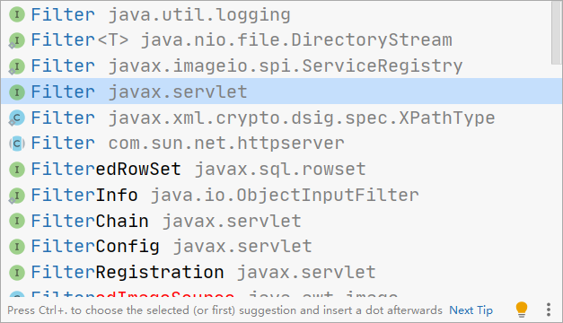
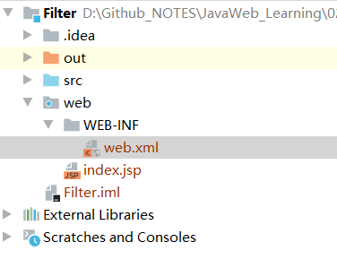

# Filter过滤器

代码位置：`JavaWeb_Learning\02Java\JavaWeb\Code\Filter`

>   与 Servlet ，Listener  统称为Web的三大组件

当我们访问服务器中的资源时，过滤器可以将请求拦截下来，完成一些特殊的功能

## 过滤器的作用

*   一般用于完成一些通用的操作。如：登录验证，统一编码处理，敏感字符过滤


## 快速入门

### 步骤

*   定义一个类，实现接口Filter
*   复写方法
*   配置拦截路径

#### 注意导入的包



#### 进行配置

```java
@WebFilter("/*")   // 访问所有资源之前，都会执行该过滤器
```

#### 配置放行许可

```java
@Override
public void doFilter(ServletRequest servletRequest, ServletResponse servletResponse, FilterChain filterChain) throws IOException, ServletException {
    System.out.println("filterDemo1 被执行了");

    // 放行请求或响应
    filterChain.doFilter(servletRequest, servletResponse);
}
```


## 过滤器细节

1.  Web.xml 配置
2.  过滤器执行流程
3.  过滤器生命周期方法
4.  过滤器配置详解
5.  过滤器链（配置多个过滤器）


### Web.xml配置



与 Servlet配置类似

```xml
<?xml version="1.0" encoding="UTF-8"?>
<web-app xmlns="http://xmlns.jcp.org/xml/ns/javaee"
         xmlns:xsi="http://www.w3.org/2001/XMLSchema-instance"
         xsi:schemaLocation="http://xmlns.jcp.org/xml/ns/javaee http://xmlns.jcp.org/xml/ns/javaee/web-app_4_0.xsd"
         version="4.0">

    <filter>
        <filter-name>demo1</filter-name>
        <filter-class>filter.FilterDemo1</filter-class>
    </filter>
    <filter-mapping>
        <filter-name>demo1</filter-name>
        <url-pattern>/*</url-pattern>
    </filter-mapping>

</web-app>
```


### 过滤器执行流程

1. 执行过滤器
 2. 执行放行后的资源
 3. 回来执行过滤器放行代码下边的代码


### 过滤器生命周期

1. init:在服务器启动后，会创建Filter对象，然后调用init方法。只执行一次。用于加载资源
  2. doFilter:每一次请求被拦截资源时，会执行。执行多次
  3.  destroy:在服务器关闭后，Filter对象被销毁。如果服务器是正常关闭，则会执行destroy方法。只执行一次   用于释放资源


### 过滤器配置详解

#### 拦截路径配置

1.  具体资源路径： /index.jsp  只有访问 index.jsp 资源时，过滤器才会被执行
2.  目录拦截： /user/*   访问 /user 下的所有资源时，过滤器都会被执行
3.  后缀名拦截：*.jsp   访问所有后缀名为 jsp 资源时，过滤器都会被执行
4.  拦截所有资源：/*    访问所有资源时，过滤器都会被执行

#### 拦截方式的配置

>   资源被访问的方式

*   注解配置

    设置 `dispatcherTypes` 属性

    ```java
    1. REQUEST：默认值。浏览器直接请求资源
    2. FORWARD：转发访问资源
    3. INCLUDE：包含访问资源
    4. ERROR：错误跳转资源
    5. ASYNC：异步访问资源
    ```

    例如
    
    ```java
    @WebFilter(value = "/ServletDemo3", dispatcherTypes = DispatcherType.REQUEST)
    ```
    
    可以设置多个值
    
    ```java
    @WebFilter(value = "/ServletDemo3",
    			dispatcherTypes = DispatcherType.REQUEST, 
    							  DispatcherType.FORWARD)
    ```
    
*   Web.xml配置

    `<dispatcher></dispatcher>`  标签

    ```xml
        <filter>
            <filter-name>demo1</filter-name>
            <filter-class>filter.FilterDemo2</filter-class>
        </filter>
        <filter-mapping>
            <filter-name>demo1</filter-name>
            <url-pattern>/Filter2</url-pattern>
            <dispatcher>REQUEST</dispatcher>
        </filter-mapping>
    ```


## 过滤器链

>   配置多个过滤器

### 执行顺序：

如果有两个过滤器： 1 和 2

1.  过滤器1 init
2.  过滤器2  init
3.  资源
4.  过滤器2 
5.  过滤器1

### 顺序问题

*   注解配置

    按照类名的字符串比较规则比较，值小的先执行

*   Web.xml 配置    谁定义再上边，谁先执行

    `<filter-mapping>`


# Listener监听器

事件监听机制

*   事件：一件事情
*   事件源：事件发生的地方
*   监听器：一个对象
*   注册监听：将事件，事件源，监听器绑定在一起。当事件源上发生某个事件，执行监听器代码


## ServletContextListener

代码位置：`JavaWeb_Learning\02Java\JavaWeb\Code\Listener`

监听ServletContext对象的创建和销毁
### 主要方法

```
void contextDestroyed(ServletContextEvent sce) ：ServletContext对象被销毁之前会调用该方法

void contextInitialized(ServletContextEvent sce) ：ServletContext对象创建后会调用该方法
```

### 步骤

*   定义一个类，实现ServletContextListener 接口

*   复写方法

*   两种配置方法

    *   web.xml

        ```xml
        <listener>
        	<listener-class>Listener.ContextLoaderListener</listener-class>
        </listener>
        <!--指定初始化参数-->
        <context-param>
        	<param-name>contextConfigLocation</param-name>
        	<param-value>/WEB-INF/classes/applicationContext.xml</param-value>
        </context-param>
        ```

    *   注解

        

