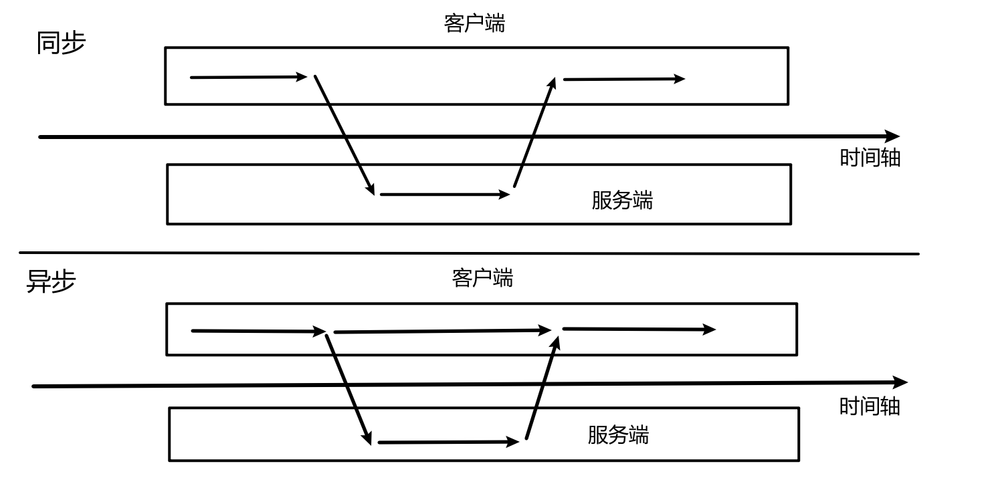
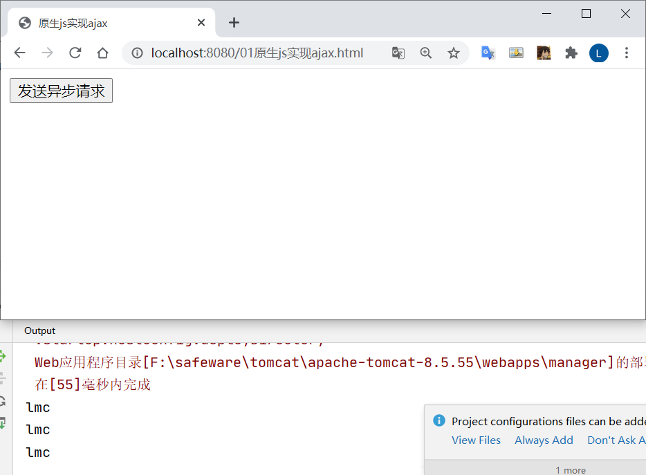
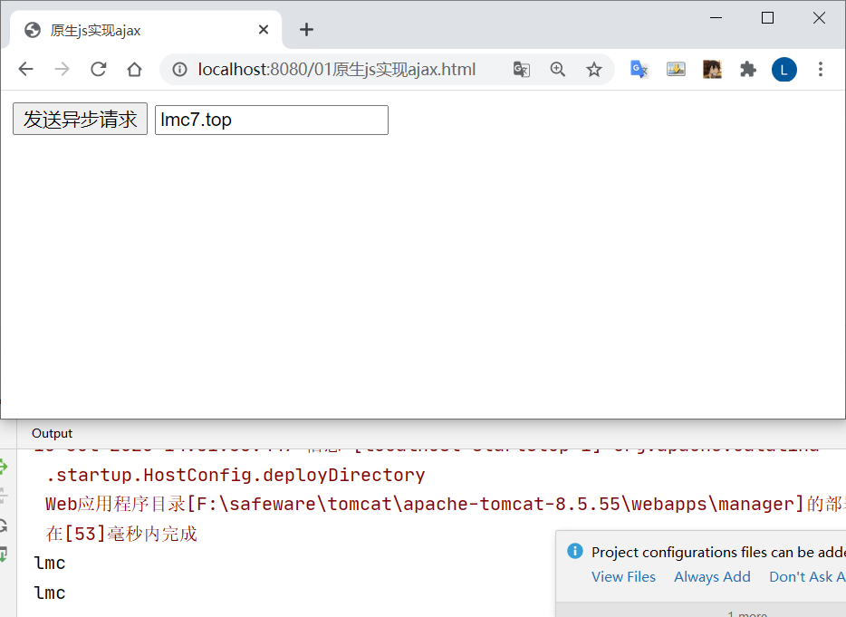
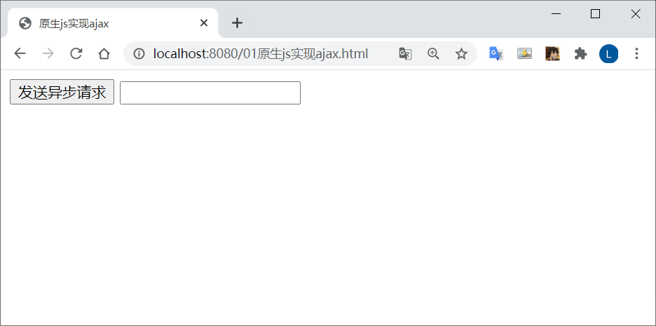
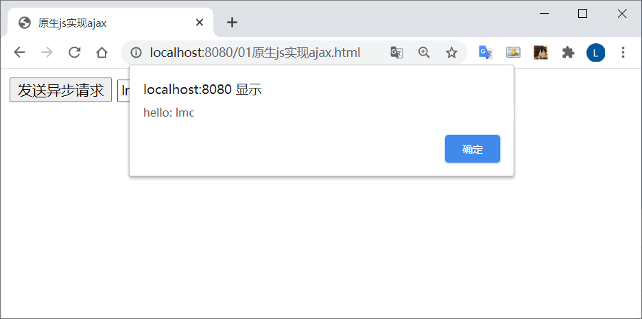
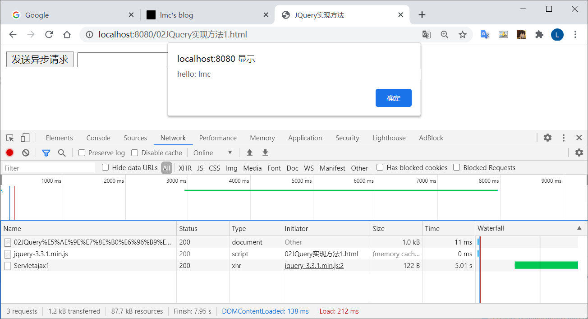
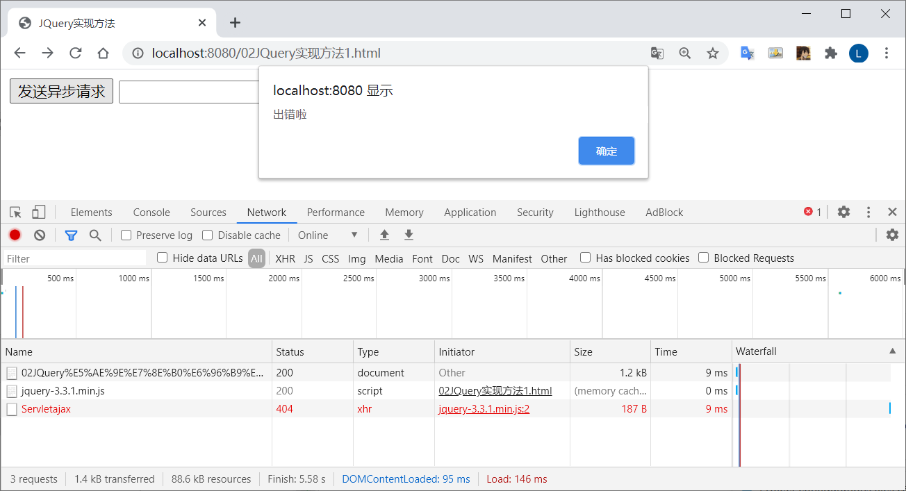
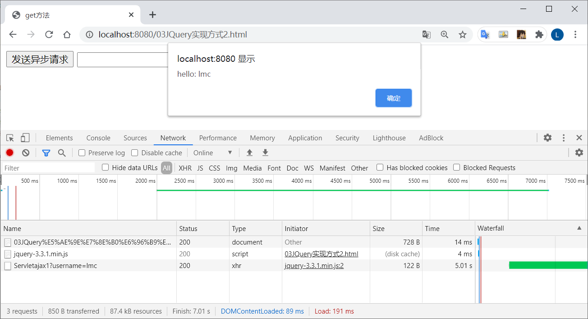
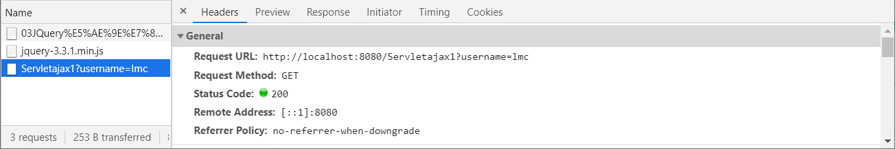
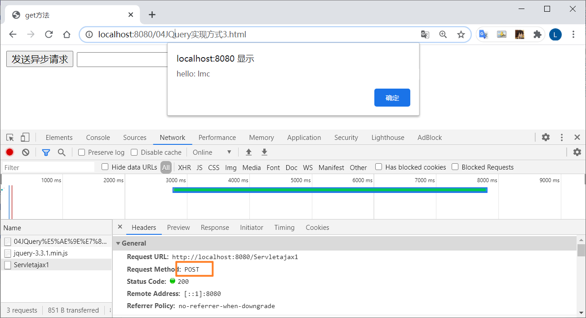

## 概念

 `ASynchronous JavaScript And XML`  异步的  JavaScript 和 XML

*   一种用于创建快速动态网页的技术

*   无需重新加载整个网页的情况下，能够更新部分网页内容的技术

*   提升了用户体验

### 同步与异步

*   同步：客户端必须等待服务器端的响应，在等待的期间客户端不能做其他操作
*   异步：客户端不需要等待服务器端的响应，在服务器处理的过程中客户端可以进行其他操作



## 实现方法

### 原生的JS实现方法（了解）

#### `01原生js实现ajax.html`

```html
<!DOCTYPE html>
<html lang="en">
<head>
    <meta charset="UTF-8">
    <title>原生js实现ajax</title>
    <script>
        // 定义方法
        function  fun() {
            //发送异步请求
            //1.创建核心对象
            var xmlhttp;
            if (window.XMLHttpRequest) {// code for IE7+, Firefox, Chrome, Opera, Safari
                xmlhttp = new XMLHttpRequest();
            } else {// code for IE6, IE5
                xmlhttp = new ActiveXObject("Microsoft.XMLHTTP");
            }
            // 发送请求
            // 参数
            // 1. 请求方式：GET、POST
            // * get方式，请求参数在URL后边拼接。send方法为空参
            // * post方式，请求参数在send方法中定义
            // 2. 请求的URL
            // 3. 同步或异步请求：true（异步）或 false（同步）
            xmlhttp.open("GET", "Servletajax1?username=lmc", true);
            // 发送请求
            xmlhttp.send();
            // 接受并处理来自服务器的响应结果
            // 获取方法： xmlhttp.responseText
            // 什么时候获取 当服务器响应成功后 再获取

            // 当 xmlhttp 对象的就绪状态改变时，触发事件 onreadystatechange
            xmlhttp.onreadystatechange = function () {

                // 判断 readyState就绪状态是否为 4 判断status 响应状态码是否为 200
                if (xmlhttp.readyState==4 && xmlhttp.status==200){
                    // 获取服务器的响应结果
                    var responseText = xmlhttp.responseText;
                    alert(responseText);
                }
            }

        }
    </script>
</head>
<body>

    <input type="button" value="发送异步请求" onclick="fun();">
    <input>

</body>
</html>
```

#### `Servletajax1.java`

```java
package AJAX;

import javax.servlet.ServletException;
import javax.servlet.annotation.WebServlet;
import javax.servlet.http.HttpServlet;
import javax.servlet.http.HttpServletRequest;
import javax.servlet.http.HttpServletResponse;
import java.io.IOException;

@WebServlet("/Servletajax1")
public class Servletajax1 extends HttpServlet {
    protected void doPost(HttpServletRequest request, HttpServletResponse response) throws ServletException, IOException {
        // 获取请求参数
        String username = request.getParameter("username");
//        // 处理业务逻辑，耗时
//        try {
//            Thread.sleep(5000);
//        } catch (InterruptedException e) {
//            e.printStackTrace();
//        }

        // 打印 username
        System.out.println(username);
        // 响应
        response.getWriter().write("hello: " + username);
    }

    protected void doGet(HttpServletRequest request, HttpServletResponse response) throws ServletException, IOException {
        this.doPost(request, response);
    }
}
```

#### 效果

点击按钮，会发送异步请求



点击按钮，只会发生局部刷新  文本框中输入仍在



当参数为 `false` 时  为同步请求

```javascript
xmlhttp.open("GET", "Servletajax1?username=lmc", false);
```

在 `Servletajax1.java` 中，处理业务设置为 5秒

```java
// 处理业务逻辑，耗时
try {
	Thread.sleep(5000);
} catch (InterruptedException e) {
	e.printStackTrace();
}
```

点击按钮后，文本框会有5秒时间不能操作



将参数修改为 `true`

```
xmlhttp.open("GET", "Servletajax1?username=lmc", true);
```

在 `01原生js实现ajax。html` 中的 `<script>`标签中添加如下代码

```java
            // 接受并处理来自服务器的响应结果
            // 获取方法： xmlhttp.responseText
            // 什么时候获取 当服务器响应成功后 再获取

            // 当 xmlhttp 对象的就绪状态改变时，触发事件 onreadystatechange
            xmlhttp.onreadystatechange = function () {

                // 判断 readyState就绪状态是否为 4 判断status 响应状态码是否为 200
                if (xmlhttp.readyState==4 && xmlhttp.status==200){
                    // 获取服务器的响应结果
                    var responseText = xmlhttp.responseText;
                    alert(responseText);
                }
            }
```

效果：

实现了异步效果




### `JQeury`实现方式

#### 1.$.ajax()

##### `02JQuery实现方法ajax.html`

```html
<!DOCTYPE html>
<html lang="en">
<head>
    <meta charset="UTF-8">
    <title>JQuery实现方法</title>
    <script src="js/jquery-3.3.1.min.js"></script>
    <script>
        // 定义方法
        function fun() {
            // 使用$.ajax() 发送异步请求
            $.ajax({
                url:"Servletajax1", // 请求路径
                type:"POST", // 请求方式
                // data: "username=jack&age=23", // 请求参数
                data:{"username" : "lmc", "age" : 21},
                // 响应成功后的回调函数  5秒
                success:function(data){
                    alert(data);
                },
                // 表示如果请求响应出错
                error:function () {
                    alert("出错啦")
                },
                dataType:"text"  // 设置接收到的响应数据的格式
            });
        }
    </script>
</head>
<body>
<input type="button" value="发送异步请求" onclick="fun();">
<input>
</body>
</html>
```

##### 效果图



当出现错误时




#### 2.$.get()

>   发送 get 请求

**语法**

```
$.get(url, [data], [callback], [type])
```

```
url: 请求路径
data: 请求参数
callback: 回调函数
type: 响应结果的类型
```

##### `03JQuery实现方式2.html`

```html
<!DOCTYPE html>
<html lang="en">
<head>
    <meta charset="UTF-8">
    <title>get方法</title>
    <script src="js/jquery-3.3.1.min.js"></script>  // 一定要导入
    <script>
        // 定义方法
        function fun() {
            $.get("Servletajax1", {username:"lmc"}, function (data) {
                alert(data);
            }, "text");
        }
    </script>
</head>
<body>

<input type="button" value="发送异步请求" onclick="fun();">
<input>

</body>
</html>
```

##### **效果图**



用的 GET 方法




#### 3.$.post()

与 get 实现方法 类似

只需要将 `$.get`  改为  `$.post`  即可

##### 效果图

