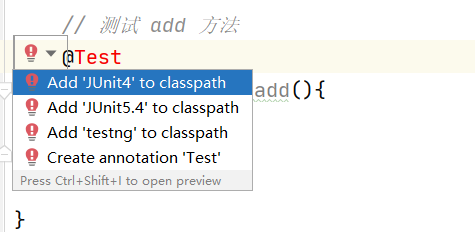
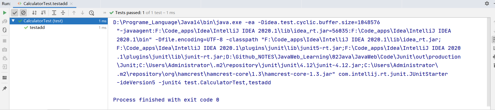
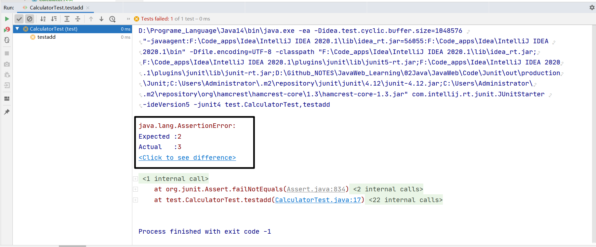

## Junit单元测试

测试分类：

* 黑盒测试：不需要写代码，给输入值，看程序是否能够输出期望的值
* 白盒测试：需要写代码，关注程序的具体执行流程

### Junit使用

步骤：

1. 定义一个测试类（测试用例）
   
   * 测试类名：被测试的类名 + Test
   * 包名： xxx.xxx.xx.test

2. 定义测试方法：可以独立运行
   
   * 方法名：test测试的方法名  testadd()
   * 返回值：void
   * 参数列表：空参

3. 给方法加上 @test
   
   ```java
   import Demo1.Calculator;
   import org.junit.Assert;
   import org.junit.Test;
   
   package test;
   // 单元测试类
   public class CalculatorTest {
       // 测试 add 方法
       @Test
       public void testadd(){
           // 代码块
       }
   }
   ```

4. 导入 Junit依赖环境
   
   

5. 进行预期操作
   
   使用Assert类
   
   ```java
   import Demo1.Calculator;
   import org.junit.Assert;
   import org.junit.Test;
   
   public class CalculatorTest {
   
       // 测试 add 方法
       @Test
       public void testadd(){
   
           Calculator calculator = new Calculator();
           int result = calculator.add(1, 2);
           // Assert.assertEquals(期望值, 实际结果);
           Assert.assertEquals(3, result);
       }
   }
   ```
   
   成功会为绿色
   
   
   
   失败为红色，并有提示
   
   

对于含有一些流的java文件的测试

需要加上资源申请与资源关闭控件

```java
    // 初始化方法
    // 用于资源申请，所有测试方法在执行之前都会先执行该方法
    @Before
    public void init(){
        System.out.println("init...");
    }

    // 释放资源方法
    // 在所有测试方法执行完后，都会自动执行该方法
    @After
    public void close(){
        System.out.println("close...");
    }
```
