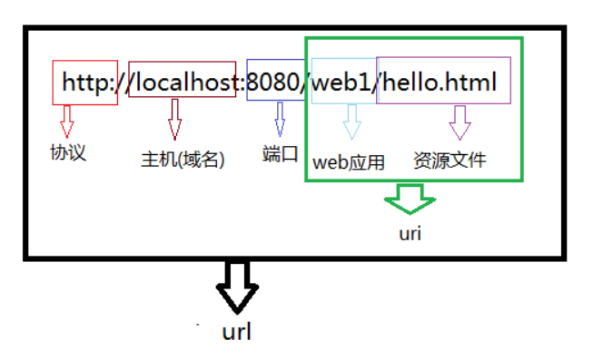
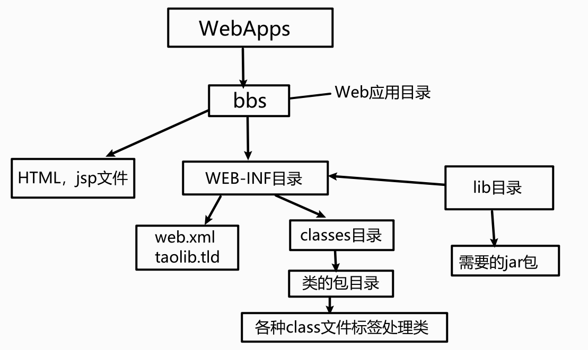

1.什么是Tomcat
--------------

Tomcat简单的说就是一个运行JAVA的网络服务器，底层是Socket的一个程序，它也是JSP和Serlvet的一个容器

2.为什么我们需要用到Tomcat
--------------------------

如果你学过html，css，你会知道你写的页面只能自己访问，**别人不能远程访问你写的页面**，Tomcat就是**提供能够让别人访问自己写的页面的一个程序**

3.配置Tomcat
------------

运行Tomcat需要JDK的支持【Tomcat会通过JAVA\_HOME找到所需要的JDK】。

新建JAVA\_HOME环境变量【路径是JDK的主目录】


进入Tomcat目录下的bin中启动startup.bat，以下是成功启动Tomcat的页面。


在浏览器地址栏输入http://localhost:8080,如果能够出现Tomcat页面，说明配置成功了。

**注意：**如果在使用Tomcat时出现了`Error deploying web application directory web222`,很大原因就是jdk和tomcat的版本不匹配

目前，**jdk8不能匹配tomcat7.0**，所以**要降低jdk版本**【换成JDK7】

当然也有可能不是一帆风顺能够直接启动Tomcat，**不能正常启动Tomcat会有以下情况**

1. JAVA\_HOME配置错误

2. 端口被占用了
  
   - 第一种方法：在cmd输入netstat
     -anb查看谁占用了该端口【Tomcat默认的是8080】,在进程中关闭它
   
   - 第二种方法：主动改变tomcat的端口,
     **到tomcat主目录下的conf/server.xml文件中修改**,把8080端口改成是8088或者是其他的


4.相关术语介绍
--------------



5.tomcat结构目录
----------------


### 5.1目录的简单介绍

1. bin：启动和关闭tomcat的bat文件

2. conf：配置文件
  
   - `server.xml`该文件用于配置server相关的信息，比如tomcat启动的端口号，配置主机(Host)
   
   - `web.xml`文件配置与web应用（web应用相当于一个web站点）
   
   - `tomcat-user.xml`配置用户名密码和相关权限.

3. lib：该目录放置运行tomcat运行需要的jar包

4. logs：存放日志，当我们需要查看日志的时候，可以查询信息

5. webapps：放置我们的web应用

6. work工作目录：该目录用于存放**jsp被访问后生成对应的server文件和.class文件**

{width="3.0555555555555554in"
height="3.0555555555555554in"}

### 5.2webapps目录的详细说明

在webapps中建立了web1目录，下面放置我们的html文件，jsp文件，图片等等，**则web1就被当做web应用管理起来**【tomcat6.0以后的版本才支持】

例子：**在webapps下创建一个web站点，在web站点下创建一个html文件，访问html文件**

{width="5.833333333333333in"
height="4.066951006124235in"}

web站点的目录是有规范的\
{width="5.833333333333333in"
height="3.9560826771653543in"}

为什么要这样设置web站点目录呢？

- 需求：我有多个html文件，想把其中的一个html文件作为我web站点的首页。

- 如果**没有WEB-INF目录下的web.xml文件支持，是无法解决我的需求的**

- **这个规范是约定熟成的。**

下面将web站点下的helloword2.xml文件作为站点的首页，新建一个WEB-INF目录

{width="5.833333333333333in"
height="1.1666666666666667in"}

在WEB-INF目录下创建一个web.xml

{width="5.833333333333333in"
height="1.1666666666666667in"}

web.xml我们不可能会写，所以可以**在webapps目录下其他的站点中抄一份过来**【复制ROOT/WEB-INF/web.xml的文件到自己的站点中】

在web.xml中添加以下代码

    <welcome-file-list>
      <welcome-file>helloword2.html</welcome-file>
    </welcome-file-list>

{width="5.833333333333333in"
height="4.777777777777778in"}

访问web站点【**helloword2.html已经是web站点的首页了，所以不需要指定资源访问了**】

{width="5.833333333333333in"
height="1.5668033683289588in"}

{width="3.5416666666666665in"
height="3.5416666666666665in"}

6.配置虚拟目录
--------------

### 6.1为什么需要配置虚拟目录？

- 如果把所有web站点的目录都放在webapps下，可能导致**磁盘空间不够用**，也**不利于对web站点目录的管理**【如果存在非常多的web站点目录】

- 把**web站点的目录分散到其他磁盘管理就需要配置虚拟目录【默认情况下，只有webapps下的目录才能被Tomcat自动管理成一个web站点】**

- 把web应用所在目录交给web服务器管理，这个过程称之为虚拟目录的映射

### 6.2配置虚拟目录方法一

在其他盘符下创建一个web站点目录，并创建WEB-INF目录和一个html文件。

{width="5.833333333333333in"
height="1.2816447944007in"}

找到Tomcat目录下/conf/server.xml文件

{width="5.833333333333333in"
height="1.5913560804899387in"}

在server.xml中的`<Host>`节点下添加如下代码。**path表示的是访问时输入的web项目名，docBase表示的是站点目录的绝对路径**

    <Context path="/web1" docBase="D:\web1"/>

{width="5.833333333333333in"
height="2.947321741032371in"}

访问配置好的web站点

{width="5.833333333333333in"
height="1.5668033683289588in"}

### 6.3配置虚拟目录方法二

进入到conf\\Catalina\\localhost文件下，创建一个xml文件，**该文件的名字就是站点的名字。**\
{width="5.833333333333333in"
height="1.3423293963254592in"}

xml文件的代码如下，**docBase是你web站点的绝对路径**

    <?xml version="1.0" encoding="UTF-8"?> 
    <Context 
        docBase="D:\web1" 
        reloadable="true"> 
    </Context> 

访问web站点下的html资源

{width="5.833333333333333in"
height="1.012678258967629in"}

7.配置临时域名
--------------

访问Tomcat服务器有好几种方式

- 使用localhost域名访问【localhost代表本机】

- 使用ip地址127.0.0.1访问【该ip地址也是本机】

- 使用机器名称访问【只限用于本机上或者局域网】

- 使用本机IP地址访问【**在cmd中输入ipconfig可以查询到本机IP地址**】

- 还可以为机器配置临时域名

### 7.1配置临时域名步骤

- 打开到C:\\Windows\\System32\\drivers\\etc下，找到hosts文件

{width="5.833333333333333in"
height="1.1972123797025371in"}

- 在hosts文件下配置临时域名

{width="5.833333333333333in"
height="1.6339752843394575in"}

8.设置虚拟主机
--------------

### 8.1什么是虚拟主机？

**多个不同域名的网站共存于一个Tomcat中**

### 8.2为什么需要用到虚拟主机？

例子：我现在开发了4个网站，有4个域名。如果我不配置虚拟主机，一个Tomcat服务器运行一个网站，我就需要4台电脑才能把4个网站运行起来。

### 8.3配置虚拟主机的步骤

- 在tomcat的server.xml文件中添加主机名

```{=html}
<!-- -->
```

    <Host name="zhongfucheng" appBase="D:\web1">
      <Context path="/web1" docBase="D:\web1"/>
    </Host>

{width="5.833333333333333in"
height="2.0880971128608925in"}

访问虚拟主机下的web站点

{width="5.833333333333333in"
height="1.4657731846019249in"}

9.Tomcat体系结构
----------------

{width="5.833333333333333in"
height="3.5189884076990374in"}

10.浏览器访问WEB资源的流程图
----------------------------

{width="5.833333333333333in"
height="3.433892169728784in"}

{width="3.3333333333333335in"
height="3.3333333333333335in"}

11.练习
-------

在浏览器输入`http//:zhongfucheng`直接显示到页面

分析：

1. 需要配置虚拟主机

2. 把8080端口改成80

3. 设置web站点首页

4. 映射虚拟目录为/

{width="5.833333333333333in"
height="1.1362948381452318in"}

{width="3.611111111111111in"
height="3.361111111111111in"}

{width="3.5833333333333335in"
height="3.5833333333333335in"}

Servlet基础知识
===============

1.什么是Servlet？
-----------------

Servlet其实就是一个**遵循Servlet开发的java类**。Servlet是**由服务器调用的**，**运行在服务器端**。

2.为什么要用到Servlet？
-----------------------

我们编写java程序想要在网上实现
聊天、发帖、这样一些的交互功能，**普通的java技术是非常难完成的**。sun公司就提供了Servlet这种技术供我们使用。

3.HTTP协议
----------

### 3.1什么是HTPP协议

> 超文本传输协议（HTTP，HyperText Transfer
> Protocol)是互联网上应用最为广泛的一种网络协议。所有的WWW文件都必须遵守这个标准。它是TCP/IP协议的一个**应用层协议**

简单来说，**HTTP协议就是客户端和服务器交互的一种通迅的格式**。

例子:在浏览器点击一个链接，浏览器就为我打开这个链接的网页。

原理：当在浏览器中点击这个链接的时候，**浏览器会向服务器发送一段文本**，**告诉服务器请求打开的是哪一个网页。服务器收到请求后，就返回一段文本给浏览器，浏览器会将该文本解析，然后显示出来。**这段文本就是遵循HTTP协议规范的。

### 3.2HTTP1.0和HTTP1.1的区别

HTTP1.0协议中，客户端与web服务器建立连接后，只能获得一个web资源【短连接，获取资源后就断开连接】

HTTP1.1协议，允许客户端与web服务器建立连接后，在一个连接上获取多个web资源【保持连接】

### 3.3HTTP请求

**浏览器向服务器请求某个web资源时，称之为浏览器向服务器发送了一个http请求。**

一个完整http请求应该包含三个部分：

1. 请求行【描述客户端的**请求方式**、**请求的资源名称**，以及使用的**HTTP协议版本号**】

2. 多个消息头【描述客户端请求哪台主机，以及**客户端的一些环境信息**等】

3. 一个空行

#### 3.3.1请求行

请求行：GET /java.html HTTP/1.1

**请求行中的GET称之为请求方式**，请求方式有：POST,GET,HEAD,OPTIONS,DELETE,TRACE,PUT。

**常用的有：POST,GET**

一般来说，当我们**点击超链接，通过地址栏访问都是get请求方式**。通过**表单提交的数据一般是post方式**。

可以简单理解**GET方式用来查询数据**,**POST方式用来提交数据**，**get的提交速度比post快**

GET方式：在URL地址后**附带的参数是有限制的**，其**数据容量通常不能超过1K**。

POST方式：可以在**请求的实体内容中向服务器发送数据**，**传送的数据量无限制**。

#### 3.3.2请求头

- Accept: text/html,image/\* 【浏览器告诉服务器，它支持的数据类型】

- Accept-Charset: ISO-8859-1
  【浏览器告诉服务器，它支持哪种**字符集**】

- Accept-Encoding: gzip,compress
  【浏览器告诉服务器，它支持的**压缩格式**】

- Accept-Language: en-us,zh-cn 【浏览器告诉服务器，它的语言环境】

- Host: www.it315.org:80【浏览器告诉服务器，它的想访问哪台主机】

- If-Modified-Since: Tue, 11 Jul 2000 18:23:51
  GMT【浏览器告诉服务器，缓存数据的时间】

- Referer:
  http://www.it315.org/index.jsp【浏览器告诉服务器，客户机是从那个页面来的\-\--**反盗链**】

- 8.User-Agent: Mozilla/4.0 (compatible; MSIE 5.5; Windows NT
  5.0)【浏览器告诉服务器，浏览器的内核是什么】

- Cookie【浏览器告诉服务器，**带来的Cookie是什么**】

- Connection: close/Keep-Alive
  【浏览器告诉服务器，请求完后是断开链接还是保持链接】

- Date: Tue, 11 Jul 2000 18:23:51 GMT【浏览器告诉服务器，请求的时间】

### 3.4HTTP响应

一个HTTP响应代表着**服务器向浏览器回送数据**

一个完整的HTTP响应应该包含四个部分:

1. 一个状态行【用于描述**服务器对请求的处理结果。**】

2. 多个消息头【用于描述**服务器的基本信息**，以及**数据的描述**，**服务器通过这些数据的描述信息，可以通知客户端如何处理等一会儿它回送的数据**】

3. 一个空行

4. 实体内容【**服务器向客户端回送的数据**】

#### 3.4.1状态行

格式： HTTP版本号 状态码 原因叙述

状态行：HTTP/1.1 200 OK

状态码用于表示**服务器对请求的处理结果**，它是一个**三位的十进制数**。响应状态码分为5类

{width="5.833333333333333in"
height="1.703591426071741in"}

#### 3.4.2响应头

- Location: http://www.it315.org/index.jsp
  【服务器告诉浏览器**要跳转到哪个页面**】

- Server:apache tomcat【服务器告诉浏览器，服务器的型号是什么】

- Content-Encoding: gzip 【服务器告诉浏览器**数据压缩的格式**】

- Content-Length: 80 【服务器告诉浏览器回送数据的长度】

- Content-Language: zh-cn 【服务器告诉浏览器，服务器的语言环境】

- Content-Type: text/html; charset=GB2312
  【服务器告诉浏览器，**回送数据的类型**】

- Last-Modified: Tue, 11 Jul 2000 18:23:51
  GMT【服务器告诉浏览器该资源上次更新时间】

- Refresh:
  1;url=http://www.it315.org【服务器告诉浏览器要**定时刷新**】

- Content-Disposition: attachment;
  filename=aaa.zip【服务器告诉浏览器**以下载方式打开数据**】

- Transfer-Encoding: chunked 【服务器告诉浏览器数据以分块方式回送】

- Set-Cookie:SS=Q0=5Lb\_nQ;
  path=/search【服务器告诉浏览器要**保存Cookie**】

- Expires: -1【服务器告诉浏览器**不要设置缓存**】

- Cache-Control: no-cache 【服务器告诉浏览器**不要设置缓存**】

- Pragma: no-cache 【服务器告诉浏览器**不要设置缓存**】

- Connection: close/Keep-Alive 【服务器告诉浏览器连接方式】

- Date: Tue, 11 Jul 2000 18:23:51
  GMT【服务器告诉浏览器回送数据的时间】

{width="3.5416666666666665in"
height="3.5416666666666665in"}

4.JAVAWEB目录结构
-----------------



以上图说明：

- bbs目录代表一个web应用

- bbs目录下的html,jsp文件可以直接被浏览器访问

- **WEB-INF目录下的资源是不能直接被浏览器访问的**

- web.xml文件是web程序的主要配置文件

- 所有的classes文件都放在classes目录下

- jar文件放在lib目录下

5.实现Servlet接口编写Servlet程序
--------------------------------

程序我都是由idea下写，首先要在idea上配置Tomcat，在我别的博文中有教程！

### 5.1编写Servlet程序的步骤

创建一个自定义类，**实现Servlet接口**


有5个方法需要重写，有init【初始化】，destroy【销毁】,service【服务】,ServletConfig【Servlet配置】,getServletInfo【Servlet信息】。

在此一看，发现service()方法是最有可能是写逻辑代码的地方。


6.Servlet生命周期
-----------------

**第一次访问**Servlet，init()和service()都被调用**

**第二次访问**Servlet，**service()被调用了**

第三次访问Servlet，**还是service()被调用了**

当我们**关闭Tomcat服务器**的时候，**destroy()被调用了！**


### 6.1Servlet生命周期可分为5个步骤

1. **加载Servlet**。当Tomcat第一次访问Servlet的时候，**Tomcat会负责创建Servlet的实例**

2. **初始化**。当Servlet被实例化后，Tomcat会**调用init()方法初始化这个对象**

3. **处理服务**。当浏览器**访问Servlet**的时候，Servlet
   **会调用service()方法处理请求**

4. **销毁**。当Tomcat关闭时或者检测到Servlet要从Tomcat删除的时候会自动调用destroy()方法，**让该实例释放掉所占的资源**。一个Servlet如果长时间不被使用的话，也会被Tomcat自动销毁

5. **卸载**。当Servlet调用完destroy()方法后，等待垃圾回收。如果**有需要再次使用这个Servlet，会重新调用init()方法进行初始化操作**。

简单总结：**只要访问Servlet，service()就会被调用。init()只有第一次访问Servlet的时候才会被调用。**\
**destroy()只有在Tomcat关闭的时候才会被调用。**


7.继承HttpServlet编写Servlet程序
--------------------------------

在上面我们实现Servlet接口，要实现5个方法。这样太麻烦了！而**HttpServlet类已经实现了Servlet接口的所有方法**，编写Servlet时，只需要**继承HttpServlet，重写你需要的方法即可**，并且它在原有Servlet接口上**添加了一些与HTTP协议处理方法**，它**比Servlet接口的功能更为强大**。

- 一般我们开发的时候，都是**重写doGet()和doPost()方法的**。对于idea而言，创建Servlet的时候已经帮你重写好了


ServletConfig、ServletContext和Servlet细节
==========================================

1.Servlet的调用图
-----------------

前面我们已经学过了Servlet的生命周期了，我们根据Servlet的生命周期画出Servlet的调用图加深理解


2.Servlet的细节
---------------

### 2.1 一个已经注册的Servlet可以被多次映射

**同一个Servlet可以被映射到多个URL上。**

```xml
<servlet>
  <servlet-name>Demo1</servlet-name>
  <servlet-class>zhongfucheng.web.Demo1</servlet-class>
</servlet>
<servlet-mapping>
  <servlet-name>Demo1</servlet-name>
  <url-pattern>/Demo1</url-pattern>
</servlet-mapping>
<servlet-mapping>
  <servlet-name>Demo1</servlet-name>
  <url-pattern>/ouzicheng</url-pattern>
</servlet-mapping>
```

无论我访问的是http://localhost:8080/Demo1还是http://localhost:8080/ouzicheng。我访问的都是Demo1


### 2.2 Servlet映射的URL可以使用通配符

通配符有两种格式：

1. `*.`扩展名

2. 正斜杠（/）开头并以"/\*"结尾。

**匹配所有**

{width="5.833333333333333in"
height="1.6658759842519686in"}

**匹配扩展名为.jsp的**

{width="5.833333333333333in"
height="1.8793099300087488in"}

如果*.扩展名和正斜杠（/）开头并以"/*"结尾两种通配符同时出现，匹配的是哪一个呢？

1. **看谁的匹配度高，谁就被选择**

2. `*.`扩展名的优先级最低

Servlet映射的URL可以使用通配符和Servlet可以被映射到多个URL上的作用：

1. **隐藏网站是用什么编程语言写的**【.php,.net,.asp实际上访问的都是同一个资源】

2. 用特定的**后缀声明版权**【公司缩写】

```{=html}
<!-- -->
```

```xml
<servlet>
  <servlet-name>Demo1</servlet-name>
  <servlet-class>zhongfucheng.web.Demo1</servlet-class>
</servlet>
<servlet-mapping>
  <servlet-name>Demo1</servlet-name>
  <url-pattern>*.jsp</url-pattern>
</servlet-mapping>
<servlet-mapping>
  <servlet-name>Demo1</servlet-name>
  <url-pattern>*.net</url-pattern>
</servlet-mapping>
<servlet-mapping>
  <servlet-name>Demo1</servlet-name>
  <url-pattern>*.asp</url-pattern>
</servlet-mapping>
<servlet-mapping>
  <servlet-name>Demo1</servlet-name>
  <url-pattern>*.php</url-pattern>
</servlet-mapping>
```


### 2.3 Servlet是单例的

#### 2.3.1 为什么Servlet是单例的

**浏览器多次对Servlet的请求**，一般情况下，**服务器只创建一个Servlet对象**，也就是说，Servlet对象**一旦创建了**，就会**驻留在内存中，为后续的请求做服务，直到服务器关闭**。

#### 2.3.2 每次访问请求对象和响应对象都是新的

对于**每次访问请求**，Servlet引擎都会**创建一个新的HttpServletRequest请求对象和一个新的HttpServletResponse响应对象**，然后将这两**个对象作为参数传递给它调用的Servlet的service()方法**，**service方法再根据请求方式分别调用doXXX方法**。

#### 2.3.3 线程安全问题

当多个用户访问Servlet的时候，**服务器会为每个用户创建一个线程**。**当多个用户并发访问Servlet共享资源的时候就会出现线程安全问题**。

原则：

1. 如果一个**变量需要多个用户共享**，则应当在访问该变量的时候，**加同步机制synchronized
   (对象){}**

2. 如果一个变量**不需要共享**，则**直接在 doGet() 或者
   doPost()定义**.这样不会存在线程安全问题

### 2.4 load-on-startup

如果在`<servlet>`元素中配置了一个`<load-on-startup>`元素，那么**WEB应用程序在启动时**，就会**装载并创建Servlet的实例对象**、以及**调用Servlet实例对象的init()方法**。


作用：

1. 为web应用写一个InitServlet，这个**servlet配置为启动时装载**，为整个web应用**创建必要的数据库表和数据**

2. 完成一些定时的任务【定时写日志，定时备份数据】

### 2.5 在web访问任何资源都是在访问Servlet

当你启动Tomcat，你在网址上输入http://localhost:8080。为什么会出现Tomcat小猫的页面？

这是由**缺省Servlet为你服务的**！

我们先看一下web.xml文件中的配置,**web.xml文件配置了一个缺省Servlet**

    <servlet>
      <servlet-name>default</servlet-name>
      <servlet-class>org.apache.catalina.servlets.DefaultServlet</servlet-class>
      <init-param>
        <param-name>debug</param-name>
        <param-value>0</param-value>
      </init-param>
      <init-param>
        <param-name>listings</param-name>
        <param-value>false</param-value>
      </init-param>
      <load-on-startup>1</load-on-startup>
    </servlet>
    
    <servlet-mapping>
      <servlet-name>default</servlet-name>
      <url-pattern>/</url-pattern>
    </servlet-mapping>

什么叫做缺省Servlet？凡是在web.xml文件中**找不到匹配的元素的URL**，它们的访问**请求都将交给缺省Servlet处理**，也就是说，**缺省Servlet用于处理所有其他Servlet都不处理的访问请求**

既然我说了在web访问任何资源都是在访问Servlet，那么**我访问静态资源【本地图片，本地HTML文件】也是在访问这个缺省Servlet【DefaultServlet】**

证实一下：当我没有手工配置缺省Servlet的时候，**访问本地图片是可以访问得到的**

{width="5.833333333333333in"
height="3.442159886264217in"}

现在我自己配置一个缺省Servlet,**Demo1就是我手工配置的缺省Servlet，覆盖掉web.xml配置的缺省Servlet**

        <servlet>
            <servlet-name>Demo1</servlet-name>
            <servlet-class>zhongfucheng.web.Demo1</servlet-class>
        </servlet>
    
        <servlet-mapping>
            <servlet-name>Demo1</servlet-name>
            <url-pattern>/</url-pattern>
        </servlet-mapping>

下面我继续访问一下刚才的图片，此时输出的是**Demo1这个Servlet写上的内容了**

{width="5.833333333333333in"
height="3.442159886264217in"}

总结：**无论在web中访问什么资源【包括JSP】，都是在访问Servlet。**没有手工配置缺省Servlet的时候，**你访问静态图片，静态网页，缺省Servlet会在你web站点中寻找该图片或网页**，如果有就返回给浏览器，没有就报404错误

3. ServletConfig对象

--------------------

### 3.1ServletConfig对象有什么用？

> 通过此对象可以读取web.xml中配置的初始化参数。

现在问题来了，**为什么我们要把参数信息放到web.xml文件中呢**？我们可以直接在程序中都可以定义参数信息，**搞到web.xml文件中又有什么好处呢**？

好处就是：**能够让你的程序更加灵活**【更换需求，更改配置文件web.xml即可，程序代码不用改】

### 3.2获取web.xml文件配置的参数信息

- 为Demo1这个Servlet配置一个参数，参数名是name，值是zhongfucheng

```{=html}
<!-- -->
```

    <servlet>
      <servlet-name>Demo1</servlet-name>
      <servlet-class>zhongfucheng.web.Demo1</servlet-class>
      <init-param>
        <param-name>name</param-name>
        <param-value>zhongfucheng</param-value>
      </init-param>
    </servlet>
    <servlet-mapping>
      <servlet-name>Demo1</servlet-name>
      <url-pattern>/Demo1</url-pattern>
    </servlet-mapping>

在Servlet中获取ServletConfig对象，通过ServletConfig对象获取在web.xml文件配置的参数\
{width="5.833333333333333in"
height="1.9122856517935258in"}

{width="3.5416666666666665in"
height="3.5416666666666665in"}

{width="3.5833333333333335in"
height="3.5833333333333335in"}

4. ServletContext对象

---------------------

### 4.1 什么是ServletContext对象？

当Tomcat启动的时候，就会创建一个ServletContext对象。它**代表着当前web站点**

### 4.2 ServletContext有什么用？

1. ServletContext既然代表着当前web站点，那么**所有Servlet都共享着一个ServletContext对象**，所以**Servlet之间可以通过ServletContext实现通讯**。

2. ServletConfig获取的是配置的是单个Servlet的参数信息，**ServletContext可以获取的是配置整个web站点的参数信息**

3. **利用ServletContext读取web站点的资源文件**

4. 实现Servlet的转发【用ServletContext转发不多，主要用request转发】

### 4.3 Servlet之间实现通讯

ServletContext对象可以被称之为**域对象**

到这里可能有一个疑问，域对象是什么呢？其实域对象可以简单理解成**一个容器【类似于Map集合】**

实现Servlet之间通讯就要**用到ServletContext的setAttribute(String
name,Object obj)方法**，\
第一个参数是关键字，第二个参数是你要存储的对象

这是Demo2的代码

    //获取到ServletContext对象
    ServletContext servletContext = this.getServletContext();
    
    String value = "zhongfucheng";
    
    //MyName作为关键字，value作为值存进   域对象【类型于Map集合】
    servletContext.setAttribute("MyName", value);

这是Demo3的代码

    //获取ServletContext对象
    ServletContext servletContext = this.getServletContext();
    
    //通过关键字获取存储在域对象的值
    String value = (String) servletContext.getAttribute("MyName");
    
    System.out.println(value);

访问Demo3可以获取Demo2存储的信息，从而实现多个Servlet之间通讯

{width="5.833333333333333in"
height="1.216198600174978in"}

### 4.4 获取web站点配置的信息

如果我想要让所有的Servlet都能够获取到连接数据库的信息，不可能在web.xml文件中每个Servlet中都配置一下，这样代码量太大了！并且会显得非常啰嗦冗余。

- web.xml文件支持**对整个站点进行配置参数信息**【**所有Servlet都可以取到该参数信息**】

```{=html}
<!-- -->
```

    <context-param>
      <param-name>name</param-name>
      <param-value>zhongfucheng</param-value>
    </context-param>

Demo4代码

    //获取到ServletContext对象
    ServletContext servletContext = this.getServletContext();
    
    //通过名称获取值
    String value = servletContext.getInitParameter("name");
    System.out.println(value);

{width="5.833333333333333in"
height="1.170738188976378in"}

试一下Demo3是否能拿到，相同的代码

    //获取到ServletContext对象
    ServletContext servletContext = this.getServletContext();
    
    //通过名称获取值
    String value = servletContext.getInitParameter("name");
    System.out.println(value);

{width="5.833333333333333in"
height="1.4530872703412074in"}

{width="3.3333333333333335in"
height="3.3333333333333335in"}

### 4.5 读取资源文件

#### 读取资源第一种方式：

**第一种方式：**现在我要通过Servlet111读取1.png图片

{width="5.833333333333333in"
height="3.0520384951881017in"}

按我们以前的方式，代码应该是这样的。

    FileInputStream fileInputStream = new FileInputStream("1.png");
    System.out.println(fileInputStream);

当我们访问的时候，却出错了！说**找不到1.png文件**

{width="5.833333333333333in"
height="3.446428258967629in"}

这是为什么呢？我们**以前读取文件的时候，如果程序和文件在同一包名，可以直接通过文件名称获取得到的**！，原因很简单，**以前我们写的程序都是通过JVM来运行的，而现在，我们是通过Tomcat来运行的**

根据web的目录规范，Servlet编译后的class文件是存放在WEB-INF\\classes文件夹中的

{width="5.833333333333333in"
height="5.375087489063867in"}

看到这里，我们知道了**要进入classes目录中读取文件**，所以我们将代码改成以下方式

    FileInputStream fileInputStream = new FileInputStream("D:\\zhongfucheng\\web\\WEB-INF\\classes\\zhongfucheng\\web\\1.png");
    System.out.println(fileInputStream);

再去读取时，就发现可以获取到文件了。但是现在问题又来了，**我读取文件的时候都要写上绝对路径，这样太不灵活了**。试想一下，如果我将该**读取文件的模块移到其他的web站点上**，**我的代码就又要修改了【因为web站点的名字不一样】**。

我们通过**ServletContext读取就可以避免修改代码的情况**，因为ServletContext对象是根据当前web站点而生成的

代码如下所示：

    //获取到ServletContext对象
    ServletContext servletContext = this.getServletContext();
    
    //调用ServletContext方法获取到读取文件的流
    InputStream inputStream = servletContext.getResourceAsStream("/WEB-INF/classes/zhongfucheng/web/1.png");

{width="5.833333333333333in"
height="1.0296587926509186in"}

#### 读取资源第二种方式：

如果我的**文件放在web目录下**，那么就简单得多了！,**直接通过文件名称就能获取**

{width="5.833333333333333in"
height="6.997495625546807in"}

代码如下所示

    //获取到ServletContext对象
    ServletContext servletContext = this.getServletContext();
    
    //调用ServletContext方法获取到读取文件的流
    InputStream inputStream = servletContext.getResourceAsStream("2.png");

{width="5.833333333333333in"
height="1.5667771216097988in"}

#### 读取资源第三种方式：

通过**类装载器读取资源文件**。我的文件放在了**src目录下【也叫做类目录】**

{width="5.833333333333333in"
height="3.697697944006999in"}

代码如下所示

    //获取到类装载器
    ClassLoader classLoader = Servlet111.class.getClassLoader();
    
    //通过类装载器获取到读取文件流
    InputStream inputStream = classLoader.getResourceAsStream("3.png");

{width="5.833333333333333in"
height="1.3638856080489938in"}

我的文件放在了src目录下的包下

{width="5.833333333333333in"
height="3.0219389763779527in"}

代码如下，添加包名路径即可。

    //获取到类装载器
    ClassLoader classLoader = Servlet111.class.getClassLoader();
    
    //通过类装载器获取到读取文件流
    InputStream inputStream = classLoader.getResourceAsStream("/zhongfucheng/web/1.png");

原则：**如果文件太大，就不能用类装载器的方式去读取，会导致内存溢出**

{width="3.5416666666666665in"
height="3.5416666666666665in"}

{width="3.5833333333333335in"
height="3.5833333333333335in"}

Request对象
===========

1. 什么是`HttpServletRequest`

---------------------------

> `HttpServletRequest`对象代表客户端的请求，当客户端通过HTTP协议访问服务器时，**HTTP请求头**中的所有信息都封装在这个对象中，开发人员通过这个对象的方法，可以获得客户这些信息

简单来说，**要得到浏览器信息，就找`HttpServletRequest`对象**

2. `HttpServletRequest`常用方法

-----------------------------

### 2.1 获得客户机【浏览器】信息

- **`getRequestURL`方法返回客户端发出请求时的完整URL。**

- `getRequestURI`方法返回请求行中的资源名部分

- **`getQueryString` 方法返回请求行中的参数部分。**

- `getPathInfo`方法返回请求URL中的额外路径信息。额外路径信息是请求URL中的位于Servlet的路径之后和查询参数之前的内容，它以"/"开头。

- **`getRemoteAdd`方法返回发出请求的客户机的IP地址**

- `getRemoteHost`方法返回发出请求的客户机的完整主机名

- `getRemotePort`方法返回客户机所使用的网络端口号

- **`getLocalAdd`方法返回WEB服务器的IP地址**

- `getLocalName`方法返回WEB服务器的主机名

### 2.2 获得客户机请求头

- **`getHeader`方法**

- `getHeaders`方法

- `getHeaderNames`方法

### 2.3 获得客户机请求参数(客户端提交的数据)

- **`getParameter`方法**

- **`getParameterValues`（String name）方法**

- `getParameterNames`方法

- `getParameterMap`方法
3. `HttpServletRequest`应用

-------------------------

### 3.1 防盗链

什么是防盗链呢？比如：**我现在有海贼王最新的资源，想要看海贼王的要在我的网页上看。现在别的网站的人看到我有海贼王的资源，想要把我的资源粘贴在他自己的网站上。这样我独家的资源就被一个CTRL+C和CTRL+V抢走了**？而反盗链就是不能被他们CRTL+C和CRTL+V

下面我模拟一下场景。现在我首页先有一个超链接，指向着海贼王最新资源

{width="5.833333333333333in"
height="1.9736242344706911in"}

当我点进去，就能看到海贼王最新资源了

{width="5.833333333333333in"
height="1.9736242344706911in"}

其他的人可以通过复制粘贴我的地址，放到它们的网页上

{width="5.833333333333333in"
height="1.9736242344706911in"}

这样我就划不来啦【我的广告你来没看呢！】。**想要看我的资源，就必须经过我的首页点进去看**。

想要实现这样的效果，就要**获取Referer这个消息头**，**判断Referer是不是从我的首页来的。如果不是从我的首页来的，跳转回我的首页**。

    //获取到网页是从哪里来的
    String referer = request.getHeader("Referer");
    
    //如果不是从我的首页来或者从地址栏直接访问的，
    if ( referer == null || !referer.contains("localhost:8080/zhongfucheng/index.jsp") ) {
    
      //回到首页去
      response.sendRedirect("/zhongfucheng/index.jsp");
      return;
    }
    
    //能执行下面的语句，说明是从我的首页点击进来的，那没问题，照常显示
    response.setContentType("text/html;charset=UTF-8");
    response.getWriter().write("路飞做了XXXXxxxxxxxxxxxxxxxx");

首先按正常预想的，**别人从首页点击我的资源，访问我海贼王最新的资源**

{width="5.833333333333333in"
height="1.044870953630796in"}

能够成功访问到资源

{width="5.833333333333333in"
height="1.8886132983377077in"}

如果我在浏览器直接输入地址【此时Referer是为null的】，我们来看看

{width="5.833333333333333in"
height="1.8886132983377077in"}

**跳回到首页上，不能访问到海贼王资源**

{width="5.833333333333333in"
height="1.8886132983377077in"}

再试试，如果**别人粘贴了我的资源url，在它的网页上挂了一个网址呢。**

{width="5.833333333333333in"
height="1.8886132983377077in"}

在别人网页上点击的时候

{width="5.833333333333333in"
height="1.8886132983377077in"}

**又跳回到了我的首页了。**\
{width="5.833333333333333in"
height="1.8886132983377077in"}

### 3.2表单提交数据【通过post方式提交数据】

    <form action="/zhongfucheng/Servlet111" method="post">
        <table>
            <tr>
                <td>用户名</td>
                <td><input type="text" name="username"></td>
            </tr>
            <tr>
                <td>密码</td>
                <td><input type="password" name="password"></td>
            </tr>
            <tr>
                <td>性别</td>
                <td>
                    <input type="radio" name="gender" value="男">男
                    <input type="radio" name="gender" value="女">女
                </td>
            </tr>
            <tr>
                <td>爱好</td>
                <td>
                    <input type="checkbox" name="hobbies" value="游泳">游泳
                    <input type="checkbox" name="hobbies" value="跑步">跑步
                    <input type="checkbox" name="hobbies" value="飞翔">飞翔
                </td>
            </tr>
            <input type="hidden" name="aaa" value="my name is zhongfucheng">
            <tr>
                <td>你的来自于哪里</td>
                <td>
                    <select name="address">
                        <option value="广州">广州</option>
                        <option value="深圳">深圳</option>
                        <option value="北京">北京</option>
                    </select>
                </td>
            </tr>
            <tr>
                <td>详细说明:</td>
                <td>
                    <textarea cols="30" rows="2" name="textarea"></textarea>
                </td>
            </tr>
            <tr>
                <td><input type="submit" value="提交"></td>
                <td><input type="reset" value="重置"></td>
            </tr>
        </table>

在Servlet111中获取到提交的数据，代码如下

    //设置request字符编码的格式
    request.setCharacterEncoding("UTF-8");
    
    //通过html的name属性，获取到值
    String username = request.getParameter("username");
    String password = request.getParameter("password");
    String gender = request.getParameter("gender");
    
    //复选框和下拉框有多个值，获取到多个值
    String[] hobbies = request.getParameterValues("hobbies");
    String[] address = request.getParameterValues("address");
    
    //获取到文本域的值
    String description = request.getParameter("textarea");
    
    //得到隐藏域的值
    String hiddenValue = request.getParameter("aaa");
    
    ....各种System.out.println().......

向表单输入数据

{width="5.833333333333333in"
height="2.570505249343832in"}

Servlet111得到表单带过来的数据，最后的一个数据是隐藏域带过来的。

{width="5.833333333333333in"
height="2.9761898512685914in"}

{width="3.5416666666666665in"
height="3.5416666666666665in"}

### 3.4超链接方式提交数据

**常见的get方式提交数据有**：**使用超链接，sendRedirect()**

格式如下：

    sendRedirect("servlet的地址?参数名="+参数值 &"参数名="+参数值);

我们来使用一下，**通过超链接将数据带给浏览器**

    <a href="/zhongfucheng/Servlet111?username=xxx">使用超链接将数据带给浏览器</a>

在Servlet111接收数据

    //接收以username为参数名带过来的值
    String username = request.getParameter("username");
    System.out.println(username);

注意**看浏览器左下角**

{width="5.833333333333333in"
height="1.4703007436570428in"}

服务器成功接收到浏览器发送过来的数据

{width="5.833333333333333in"
height="0.4326771653543307in"}

并且，**传输数据明文的出现在浏览器的地址栏上**

{width="5.833333333333333in"
height="1.8557917760279965in"}

**sendRedirect()和超链接类似，在这里就不赘述了**

### 3.5解决中文乱码问题

细心的朋友会发现，我在获取表单数据的时候，有这句代码`request.setCharacterEncoding("UTF-8");`，如果没有这句代码，会发生什么事呢？我们看看。

再重新填写数据

{width="5.833333333333333in"
height="1.8557917760279965in"}

在服务器查看提交过来的数据，**所有的中文数据都乱码了**

{width="5.833333333333333in"
height="1.5537871828521435in"}


来这里我们来分析一下乱码的原因，在前面的博客中我已经介绍了，Tomcat服务器默认编码是ISO 8859-1，而**浏览器使用的是UTF-8编码**。浏览器的中文数据提交给服务器，**Tomcat以ISO8859-1编码对中文编码，当我在Servlet读取数据的时候，拿到的当然是乱码。**而我设置request的编码为UTF-8，乱码就解决了。


接下来使用get方式传递中文数据，**把表单的方式改成get即可**，当我们访问的时候，又出现乱码了！

{width="5.833333333333333in"
height="4.250366360454943in"}

{width="5.833333333333333in"
height="1.9023698600174979in"}

于是我按照上面的方式，把request对象设置编码为UTF-8试试

    request.setCharacterEncoding("UTF-8");
    String name = request.getParameter("name");

结果还是乱码。这是为什么呢？**我明明已经把编码设置成UTF-8了，按照post方式，乱码问题已经解决了**！。我们来看看get和post方式的区别在哪？**为什么post方式设置了request编码就可以解决乱码问题，而get方式不能呢。**

首先我们来看一下post方法是怎么进行参数传递的。当我们**点击提交按钮的时候，数据封装进了Form
Data中**，**http请求中把实体主体带过去了【传输的数据称之为实体主体】**，既然request对象封装了http请求，所以**request对象可以解析到发送过来的数据**，于是只要**把编码设置成UTF-8就可以解决乱码问题了**。

{width="5.833333333333333in"
height="2.8862839020122486in"}

而get方式不同，它的**数据是从消息行带过去的，没有封装到request对象里面**，所以使用request设置编码是无效的。

{width="5.833333333333333in"
height="2.8862839020122486in"}

要解决get方式乱码问题也不难，我们既然知道Tomcat默认的编码是ISO
8859-1，那么**get方式由消息体带过去给浏览器的时候肯定是用ISO
8859-1编码了**。

    //此时得到的数据已经是被ISO 8859-1编码后的字符串了，这个是乱码
    String name = request.getParameter("username");
    
    //乱码通过反向查ISO 8859-1得到原始的数据
    byte[] bytes = name.getBytes("ISO8859-1");
    
    //通过原始的数据，设置正确的码表，构建字符串
    String value = new String(bytes, "UTF-8");

上面的代码有些难理解，我画张图说明一下：

{width="5.833333333333333in"
height="3.9827580927384076in"}

经过我们手工转换，再来访问一下

{width="5.833333333333333in"
height="1.0830971128608924in"}

好的，成功解决掉乱码问题了。除了手工转换，**get方式还可以改Tomcat服务器的配置来解决乱码，但是不推荐使用，这样不灵活。**"

我们都知道**Tomcat默认的编码是ISO
8859-1,如果在Tomcat服务器的配置下改成是UTF-8的编码，那么就解决服务器在解析数据的时候造成乱码问题了**

在8080端口的Connector上加入`URIEncoding="utf-8"`，设置Tomcat的访问该端口时的编码为utf-8，从而解决乱码，**这种改法是固定使用UTF-8编码的**

    <Connector port="8080" protocol="HTTP/1.1" 
               connectionTimeout="20000" 
               redirectPort="8443" URIEncoding="utf-8"/>

设置了编码后，没有做任何手工转换，成功拿到数据

{width="5.833333333333333in"
height="3.2654319772528435in"}

当然也有另一种改服务器编码的方式。设置Tomcat的访问该端口时的编码**为页面的编码，这种改法是随着页面的编码而变**

        <Connector port="8080" protocol="HTTP/1.1" 
                   connectionTimeout="20000" 
                   redirectPort="8443" useBodyEncodingForURI="true" />

设置编码为UTF-8

    request.setCharacterEncoding("UTF-8");
    String name = request.getParameter("name");

再次访问

{width="5.833333333333333in"
height="1.8814074803149605in"}

**手写超链接如果附带中文参数问题，要URL重写，在JSP博客中会讲到**

总结：

- post方式直接改request对象的编码

- get方式需要手工转换编码

- **get方式也可以修改Tomcat服务器的编码，不推荐，因为会太依赖服务器了！**

- **提交数据能用post就用post**

{width="3.611111111111111in" height="3.625in"}

### 3.6 实现转发

之前讲过使用response的sendRedirect()可以**实现重定向，做到的功能是页面跳转**，使用request的getRequestDispatcher.forward(request,response)**实现转发，做到的功能也是页面跳转**，他们有什么区别呢？现在我先来说下转发

代码如下所示

    //获取到requestDispatcher对象，跳转到index.jsp
    RequestDispatcher requestDispatcher = request.getRequestDispatcher("/index.jsp");
    
    //调用requestDispatcher对象的forward()实现转发,传入request和response方法
    requestDispatcher.forward(request, response);

访问Servlet111

{width="5.833333333333333in"
height="1.1969827209098862in"}

上面已经说了，可以**通过sendRedirect()重定向可以在资源尾部添加参数提交数据给服务器。那么转发能不能提交数据给服务器呢？答案明显是可以的，并且使用这种方法非常频繁**

在讲ServletContext的时候，**曾经说过Servlet之间可以通过ServletContext实现通讯，ServletContext也能称之为域对象**。而**request也可以称之为域对象**，只不过**ServletContext的域是整个web应用，而request的域仅仅代表一次http请求**

下面我们来使用request实现Servlet之间的通讯，Servlet111代码

    //以username为关键字存zhongfucheng值
    request.setAttribute("username", "zhongfucheng");
    
    //获取到requestDispatcher对象
    RequestDispatcher requestDispatcher = request.getRequestDispatcher("/Servlet222");
    
    //调用requestDispatcher对象的forward()实现转发,传入request和response方法
    requestDispatcher.forward(request, response);

Servlet222代码

    //获取到存进request对象的值
    String userName = (String) request.getAttribute("username");
    
    //在浏览器输出该值
    response.getWriter().write("i am :"+userName);

访问Servlet111看下效果

{width="5.833333333333333in"
height="1.1969827209098862in"}

如上图所示，**Servlet222成功拿到了request对象在Servlet111存进的数据**。

现在问题又来了，我们可以**使用ServletContext和request实现Servlet之间的通讯，那么我们用哪一种呢**？一般的原则：**可以使用request就尽可能使用request**。因为ServletContext代表着整个web应用，使用ServletContext会消耗大量的资源，而**request对象会随着请求的结束而结束，资源会被回收**。**使用request域进行Servlet之间的通讯在开发中是非常频繁的**。

### 3.7 转发的时序图

{width="5.833333333333333in"
height="3.4872484689413823in"}

#### 3.7.1请求转发的细节

如果在**调用forward方法之前**，在**Servlet程序中写入的部分内容已经被真正地传送到了客户端**，forward方法将抛出IllegalStateException异常。
也就是说：**不要在转发之前写数据给浏览器**

我们来试试是不是真的会出现异常。

    OutputStream outputStream = response.getOutputStream();
    outputStream.write("--------------------------------------------".getBytes());
    
    //关闭流，确保让数据到浏览器中
    outputStream.close();
    
    //跳转
    request.getRequestDispatcher("/Foot").forward(request, response);

访问的时候，看到浏览器可以输出数据，Tomcat后台抛出了异常

{width="5.833333333333333in"
height="1.9491404199475066in"}

如果在调用forward方法之前向Servlet引擎的缓冲区中写入了内容，**只要写入到缓冲区中的内容还没有被真正输出到客户端**，forward方法就可以被正常执行，**原来写入到输出缓冲区中的内容将被清空**，但是，**已写入到HttpServletResponse对象中的响应头字段信息保持有效**。

{width="4.166666666666667in"
height="4.166666666666667in"}

{width="3.5833333333333335in"
height="3.5833333333333335in"}

### 3.8转发和重定向的区别

#### 3.8.1实际发生位置不同，地址栏不同

- 转发是发生在服务器的
  
  - **转发是由服务器进行跳转的**，细心的朋友会发现，在转发的时候，**浏览器的地址栏是没有发生变化的**，在我访问Servlet111的时候，即使跳转到了Servlet222的页面，浏览器的地址还是Servlet111的。也就是说**浏览器是不知道该跳转的动作，转发是对浏览器透明的**。通过上面的转发时序图我们也可以发现，**实现转发只是一次的http请求**，**一次转发中request和response对象都是同一个**。这也解释了，为什么可以使用**request作为域对象进行Servlet之间的通讯。**

- 重定向是发生在浏览器的
  
  - **重定向是由浏览器进行跳转的**，进行重定向跳转的时候，**浏览器的地址会发生变化的**。曾经介绍过：实现重定向的原理是由response的状态码和Location头组合而实现的。**这是由浏览器进行的页面跳转**实现重定向**会发出两个http请求**，**request域对象是无效的，因为它不是同一个request对象**

#### 3.8.2用法不同

很多人都搞不清楚转发和重定向的时候，**资源地址究竟怎么写**。有的时候要把应用名写上，有的时候不用把应用名写上。很容易把人搞晕。记住一个原则：**给服务器用的直接从资源名开始写，给浏览器用的要把应用名写上**

- request.getRequestDispatcher(\"/资源名
  URI\").forward(request,response)
  
  - **转发时\"/\"代表的是本应用程序的根目录【zhongfucheng】**

- response.send(\"/web应用/资源名 URI\");
  
  - **重定向时\"/\"代表的是webapps目录**

#### 3.8.3能够去往的URL的范围不一样

- **转发是服务器跳转只能去往当前web应用的资源**

- **重定向是服务器跳转，可以去往任何的资源**

#### 3.8.4传递数据的类型不同

- **转发的request对象可以传递各种类型的数据，包括对象**

- **重定向只能传递字符串**

#### 3.8.5跳转的时间不同

- **转发时：执行到跳转语句时就会立刻跳转**

- **重定向：整个页面执行完之后才执行跳转**

### 3.9 转发和重定向使用哪一个？

根据上面说明了转发和重定向的区别也可以很容易概括出来**。转发是带着转发前的请求的参数的。重定向是新的请求**。

典型的应用场景：

1. 转发: 访问 Servlet 处理业务逻辑，然后 forward 到 jsp
   显示处理结果，浏览器里 URL 不变

2. 重定向: 提交表单，处理成功后 redirect 到另一个
   jsp，防止表单重复提交，浏览器里 URL 变了

### 3.10 RequestDispatcher再说明

RequestDispatcher对象调用forward()可以实现转发上面已经说过了。RequestDispatcher还有另外一个方法include()，该方法可以实现包含，有什么用呢？

我们在写网页的时候，一般网**页的头部和尾部是不需要改变的**。如果我们**多个地方使用Servlet输出网头和网尾的话，需要把代码重新写一遍**。而使用RequestDispatcher的**include()方法就可以实现包含网头和网尾的效果了**。

我们来操作吧！现在我有网头和网尾的Servlet

{width="4.986111111111111in"
height="5.472222222222222in"}

使用Servlet111将网头和网尾包含

    request.getRequestDispatcher("/Head").include(request, response);
    
    response.getWriter().write("--------------------------------------------");


​    
​    request.getRequestDispatcher("/Foot").include(request, response);

访问一下Servlet111,成功把网头和网尾包含了

{width="5.833333333333333in"
height="2.465635389326334in"}

{width="3.3333333333333335in"
height="3.3333333333333335in"}

{width="3.5833333333333335in"
height="3.5833333333333335in"}

Cookie
======

1. 什么是会话技术

-----------------

> 基本概念:
> 指用户开一个浏览器，**访问一个网站,只要不关闭该浏览器，不管该用户点击多少个超链接，访问多少资源，直到用户关闭浏览器，整个这个过程我们称为一次会话**.

2. 为什么我们要使用会话技术？

-----------------------------

会话跟踪技术可以解决我们很多很多问题。

- 在论坛登陆的时候，**很多时候会有一个小框框问你是否要自动登陆，当你下次登陆的时候就不用输入密码了**

{width="5.722222222222222in"
height="5.722222222222222in"}

- **根据我以前浏览过的商品，猜我喜欢什么商品**（要猜我喜欢，总得知道"我是谁"）

{width="5.833333333333333in"
height="1.8056430446194225in"}

3. Cookie

---------

**会话跟踪技术有Cookie和Session**，**Cookie技术是先出现的**。我们先讲Cookie技术吧。

### 3.1 什么是Cookie

> Cookie是由W3C组织提出，最早由netscape社区发展的一种机制

- 网页之间的**交互是通过HTTP协议传输数据的，**而Http协议是**无状态的协议**。无状态的协议是什么意思呢？**一旦数据提交完后，浏览器和服务器的连接就会关闭，再次交互的时候需要重新建立新的连接**。

- 服务器无法确认用户的信息，于是乎，W3C就提出了：**给每一个用户都发一个通行证，无论谁访问的时候都需要携带通行证，这样服务器就可以从通行证上确认用户的信息**。通行证就是Cookie

{width="5.833333333333333in"
height="2.7018996062992127in"}

Cookie的流程：浏览器访问服务器，**如果服务器需要记录该用户的状态，就使用response向浏览器发送一个Cookie，浏览器会把Cookie保存起来。当浏览器再次访问服务器的时候，浏览器会把请求的网址连同Cookie一同交给服务器**。

### 3.2Cookie API

- Cookie类用于创建一个Cookie对象

- response接口中定义了一个addCookie方法，它用于在其响应头中增加一个相应的Set-Cookie头字段

- request接口中定义了一个getCookies方法，它用于获取客户端提交的Cookie

常用的Cookie方法：

- public Cookie(String name,String value)

- setValue与getValue方法

- setMaxAge与getMaxAge方法

- setPath与getPath方法

- setDomain与getDomain方法

- getName方法

### 3.3简单使用Cookie

创建Cookie对象，发送Cookie给浏览器、

    //设置response的编码
    response.setContentType("text/html;charset=UTF-8");
    
    //创建Cookie对象，指定名称和值
    Cookie cookie = new Cookie("username", "zhongfucheng");
    
    //向浏览器给一个Cookie
    response.addCookie(cookie);
    
    response.getWriter().write("我已经向浏览器发送了一个Cookie");

浏览器本身没有任何Cookie

{width="5.833333333333333in"
height="1.9246205161854768in"}

访问Servlet1，**再回到文件夹中，还是没有发现Cookie，这是为什么呢？我明明向浏览器发送了一个Cookie的**。

原来**发送Cookie给浏览器是需要设置Cookie的时间的**。在给浏览器之前，设置一下Cookie的时间

    //设置Cookie的时间
    cookie.setMaxAge(1000);

再次访问，已经发现文件夹中多了个Cookie的文本了

{width="5.833333333333333in"
height="2.652201443569554in"}

{width="3.5416666666666665in"
height="3.5416666666666665in"}

4.Cookie细节
------------

### 4.1Cookie不可跨域名性

很多人在初学的时候可能有一个疑问：在访问Servlet的时候浏览器**是不是把所有的Cookie都带过去给服务器**，**会不会修改了别的网站的Cookie**

答案是否定的。Cookie具有不可跨域名性。浏览器判断**一个网站是否能操作另一个网站的Cookie的依据是域名**。所以一般来说，**当我访问baidu的时候，浏览器只会把baidu颁发的Cookie带过去，而不会带上google的Cookie。**

### 4.2 Cookie保存中文

上面我们的例子保存的是英文字符，下面我们来看下保存中文字符会怎么样。

    response.setContentType("text/html;charset=UTF-8");
    PrintWriter printWriter = response.getWriter();
    
    String name = "中国";
    Cookie cookie = new Cookie("country", name);
    cookie.setMaxAge(2000);
    response.addCookie(cookie);
    
    printWriter.write("我颁发了一个Cookie，值保存的是中文数据");

访问Servlet1，好吧。出异常了！

{width="5.833333333333333in"
height="2.667457349081365in"}

**中文属于Unicode字符，英文数据ASCII字符，中文占4个字符或者3个字符，英文占2个字符。**解决：**Cookie使用Unicode字符时需要对Unicode字符进行编码。**

    //对Unicode字符进行编码
    Cookie cookie = new Cookie("country", URLEncoder.encode(name, "UTF-8"));

再次访问Servlet1，已经把Cookie成功颁发给浏览器了

{width="5.833333333333333in"
height="1.6122594050743657in"}

{width="5.833333333333333in"
height="0.5971741032370954in"}

我们发现Cookie保存在硬盘的中文数据是经过编码的，那么我们在**取出Cookie的时候要对中文数据进行解码**

    Cookie[] cookies = request.getCookies();
    for (int i = 0; cookies != null && i < cookies.length; i++) {
      String name = cookies[i].getName();
    
      //经过URLEncoding就要URLDecoding
      String value = URLDecoder.decode(cookies[i].getValue(), "UTF-8");
    
      printWriter.write(name + "------" + value);
    }

取出存进Cookie的值

{width="5.833333333333333in"
height="0.9130839895013123in"}

### 4.3Cookie的有效期

**Cookie的有效期是通过setMaxAge()来设置的**。

- 如果MaxAge为**正数**，**浏览器会把Cookie写到硬盘中，只要还在MaxAge秒之前，登陆网站时该Cookie就有效**【不论关闭了浏览器还是电脑】

- 如果MaxAge为**负数**，**Cookie是临时性的，仅在本浏览器内有效**，关闭浏览器Cookie就失效了，Cookie不会写到硬盘中。Cookie默认值就是-1。这也就为什么在我第一个例子中，如果我没设置Cookie的有效期，在硬盘中就找不到对应的文件。

- 如果MaxAge为**0**，则表示**删除该Cookie**。Cookie机制没有提供删除Cookie对应的方法，把MaxAge设置为0等同于删除Cookie

### 4.4 Cookie的修改和删除

上面我们已经知道了Cookie机制没有提供删除Cookie的方法。其实细心点我们可以发现，Cookie机制也没有提供修改Cookie的方法。那么我们**怎么修改Cookie的值呢**？

Cookie存储的方式**类似于Map集合**，如下图所示

{width="2.3194444444444446in"
height="3.1666666666666665in"}

**Cookie的名称相同，通过response添加到浏览器中，会覆盖原来的Cookie**。以country为名保存的是%E4%B8%AD%E5%9B%BD，下面我**再以country为名，把值改变一下**。\
{width="5.833333333333333in"
height="0.5971741032370954in"}

    String name = "看完博客就点赞";
    
    //对Unicode字符进行编码
    Cookie cookie = new Cookie("country", URLEncoder.encode(name, "UTF-8"));

再次查看Cookie的时候，**值已经改变了，但是文件还是那一份**

{width="5.833333333333333in"
height="0.5971741032370954in"}

现在我要删除该Cookie，**把MaxAge设置为0，并添加到浏览器中即可**

    String name = "看完博客就点赞";
    
    //对Unicode字符进行编码
    Cookie cookie = new Cookie("country", URLEncoder.encode(name, "UTF-8"));
    
    //一定不要忘记添加到浏览器中
    cookie.setMaxAge(0);
    response.addCookie(cookie);
    
    printWriter.write("我删除了该Cookie");

访问Servlet，在硬盘已经找不到Cookie的文件了！

{width="5.833333333333333in"
height="0.9130839895013123in"}

{width="5.833333333333333in"
height="2.550729440069991in"}

注意：删除，修改Cookie时，**新建的Cookie除了value、maxAge之外的所有属性都要与原Cookie相同**。否则浏览器将**视为不同的Cookie，不予覆盖，导致删除修改失败**！我们来试验一下把。

    String name = "看完博客就点赞";
    
    //对Unicode字符进行编码
    Cookie cookie = new Cookie("country", URLEncoder.encode(name, "UTF-8"));
    
    //一定不要忘记添加到浏览器中
    cookie.setMaxAge(10000);
    response.addCookie(cookie);

{width="5.833333333333333in"
height="2.7577143482064743in"}

上面新建了一个Cookie，我**修改下Cookie的其他属性，再删除，看能否把Cookie删除掉**

    //一定不要忘记添加到浏览器中
    cookie.setPath("/ouzicheng");
    cookie.setMaxAge(0);
    response.addCookie(cookie);
    
    printWriter.write("删除一个Cookie");

结果Cookie还在硬盘中

{width="5.833333333333333in"
height="1.6400831146106736in"}

{width="3.6805555555555554in"
height="3.4166666666666665in"}

### 4.5 Cookie的域名

Cookie的**domain属性决定运行访问Cookie的域名。domain的值规定为".域名"**

- Cookie的隐私安全机制决定Cookie是不可跨域名的。也就是说www.baidu.com和www.google.com之间的Cookie是互不交接的。**即使是同一级域名，不同二级域名也不能交接**，也就是说：www.goole.com和www.image.goole.com的Cookie也不能访问

- 我在本地上**配置了3个虚拟主机**，localhost,www.zhongfucheng.com,www.image.zhongfucheng.com【如果不知道怎么配置，在我Tomcat的博客有】

{width="5.833333333333333in"
height="3.2783639545056866in"}

{width="5.833333333333333in"
height="1.909329615048119in"}

我用www.zhongfucheng.com域名发送了一个Cookie给浏览器

    Cookie cookie = new Cookie("name", "zhongfucheng");
    cookie.setMaxAge(1000);
    response.addCookie(cookie);
    
    printWriter.write("使用www.zhongfucheng.com域名添加了一个Cookie");

{width="5.833333333333333in"
height="2.9732764654418196in"}

首先，证明了Cookie不可跨名性，localhost域名拿不到www.zhongfucheng.com颁发给浏览器的Cookie

{width="5.833333333333333in"
height="3.1597222222222223in"}

再使用www.image.zhongfucheng.com域名访问,**证明即使一级域名相同，二级域名不同，也不能获取到Cookie**

{width="5.833333333333333in"
height="3.1597222222222223in"}

当然，使用www.zhongfucheng.com当然能获取到Cookie，Cookie通过请求头带给服务器

{width="5.833333333333333in"
height="3.248555336832896in"}

现在我希望**一级域名相同的网页Cookie之间可以相互访问。也就是说www.image.zhongfucheng.com可以获取到www.zhongfucheng.com的Cookie**就需要使用到domain方法。

    Cookie cookie = new Cookie("name", "ouzicheng");
    cookie.setMaxAge(1000);
    cookie.setDomain(".zhongfucheng.com");
    response.addCookie(cookie);
    
    printWriter.write("使用www.zhongfucheng.com域名添加了一个Cookie,只要一级是zhongfucheng.com即可访问");

使用www.zhongfucheng.com发布一个Cookie\
{width="5.833333333333333in"
height="1.1825667104111985in"}

使用www.image.zhongfucheng.com域名访问一下。**发现可以获取到Cookie了**

{width="5.833333333333333in"
height="3.622230971128609in"}

### 4.6 Cookie的路径

**Cookie的path属性决定允许访问Cookie的路径**。一般地，**Cookie发布出来，整个网页的资源都可以使用。现在我只想Servlet1可以获取到Cookie，其他的资源不能获取**。

使用Servlet2颁发一个Cookie给浏览器,设置路径为\"/Servlet1\"。

    Cookie cookie = new Cookie("username", "java");
    cookie.setPath("/Servlet1");
    cookie.setMaxAge(1000);
    response.addCookie(cookie);
    
    printWriter.write("该Cookie只有Servlet1获取得到");

使用Servlet3访问服务器，看看浏览器是否把Cookie带上。显然，浏览器访问Servlet3并没有把Cookie带上。

{width="5.833333333333333in"
height="3.622230971128609in"}

使用Servlet1访问服务器，看看浏览器是否把Cookie带上。答案是肯定的！

{width="5.833333333333333in"
height="3.622230971128609in"}

### 4.7 Cookie的安全属性

- HTTP协议不仅仅是无状态的，而且是不安全的！如果不希望Cookie在非安全协议中传输，可以**设置Cookie的secure属性为true，浏览器只会在HTTPS和SSL等安全协议中传输该Cookie**。

- 当然了，设置secure属性不会将Cookie的内容加密。如果想要保证安全，最好使用md5算法加密【后面有】。

{width="4.166666666666667in"
height="4.166666666666667in"}

{width="3.5833333333333335in"
height="3.5833333333333335in"}

5. Cookie的应用

---------------

### 5.1显示用户上次访问的时间

- 其实就是**每次登陆的时候，取到Cookie保存的值，再更新下Cookie的值**。

- 访问Serlvet有两种情况
  
  - 第一次访问
  
  - 已经访问过了

- 全部代码如下：

```{=html}
<!-- -->
```

    SimpleDateFormat simpleDateFormat = new SimpleDateFormat("yyyy-MM-dd HH:mm:ss");
    response.setContentType("text/html;charset=UTF-8");
    PrintWriter printWriter = response.getWriter();


​    
​    
​    //获取网页上所有的Cookie
​    Cookie[] cookies = request.getCookies();
​    
​    //判断Cookie的值是否为空
​    String cookieValue = null;
​    for (int i = 0; cookies != null && i < cookies.length; i++) {
​    
      //获取到以time为名的Cookie
      if (cookies[i].getName().equals("time")) {
        printWriter.write("您上次登陆的时间是：");
        cookieValue = cookies[i].getValue();
        printWriter.write(cookieValue);
    
        cookies[i].setValue(simpleDateFormat.format(new Date()));
        response.addCookie(cookies[i]);
    
        //既然已经找到了就可以break循环了
        break;
      }
    }
    
    //如果Cookie的值是空的，那么就是第一次访问
    if (cookieValue == null) {
      //创建一个Cookie对象，日期为当前时间
      Cookie cookie = new Cookie("time", simpleDateFormat.format(new Date()));
    
      //设置Cookie的生命期
      cookie.setMaxAge(20000);
    
      //response对象回送Cookie给浏览器
      response.addCookie(cookie);
    
      printWriter.write("您是第一次登陆啊！");
    }

- **按照正常的逻辑来写，程序流程应该是这样子的。先创建Cookie对象，回送Cookie给浏览器。再遍历Cookie，更新Cookie的值**。

{width="5.833333333333333in"
height="3.1214687226596673in"}

- 但是，按照上面的逻辑是做不到的！**因为每次访问Servlet的时候都会覆盖原来的Cookie，取到Cookie的值永远都是当前时间，而不是上次保存的时间。**

- 我们换一个逻辑写：**先检查（遍历）所有Cookie有没有我要的，如果得不到我想要的Cookie，Cookie的值是null，那么就是第一次登陆**，于是就有了上面的代码了。

```{=html}
<!-- -->
```

- 我们来看下效果吧！当我第一次登陆的时候

{width="5.833333333333333in"
height="2.1530435258092737in"}

Cookie保存在硬盘中。

{width="5.833333333333333in"
height="0.5971741032370954in"}

再次访问Servlet。**明显地，取到的就是Cookie的值**

{width="5.833333333333333in"
height="2.1530435258092737in"}

### 5.2显示上次浏览过商品

我就以书籍为例子了！**首先设计Book对象**

        private String id ;
        private String name ;
        private String author;
    
        public Book() {
        }
    
        public Book(String id, String name, String author) {
            this.id = id;
            this.name = name;
            this.author = author;
        }
    
        ...各种set、get方法

设计一个简单的数据库存储数据。就用**LinkedHashMap集合【根据商品的id找书籍所以用Map，删改较多所以用Linked】**

    private static LinkedHashMap<String, Book> linkedHashMap = new LinkedHashMap();


​    
​    //简化开发复杂度，book的id和商品的id相同
​    static {
​      linkedHashMap.put("1", new Book("1", "javaweb", "zhong"));
​      linkedHashMap.put("2", new Book("2", "java", "fu"));
​      linkedHashMap.put("3", new Book("3", "oracle", "cheng"));
​      linkedHashMap.put("4", new Book("4", "mysql", "ou"));
​      linkedHashMap.put("5", new Book("5", "ajax", "zi"));
​    }
​    
​    //获取到所有书籍
​    public static LinkedHashMap getAll() {
​      return linkedHashMap;
​    }

**显示网页上所有的书籍【首页】**

    printWriter.write("网页上所有的书籍："+"<br/>");
    
    //拿到数据库所有的书
    LinkedHashMap<String, Book> linkedHashMap = DB.getAll();
    Set<Map.Entry<String, Book>> entry = linkedHashMap.entrySet();
    
    //显示所有的书到网页上
    for (Map.Entry<String, Book> stringBookEntry : entry) {
      Book book = stringBookEntry.getValue();
      printWriter.write(book.getId() +"           "+ book.getName()+"<br/>");
    }

{width="5.833333333333333in"
height="1.9444444444444444in"}

接着，我们要做的就是**给显示的书籍挂上一个超链接**，当用户点击想看的书籍时，就**跳转到该书籍的详细信息页面**

**超链接应该把书的id传递过去，不然处理页面是不知道用户想看的是哪一本书的！**

    //显示所有的书到网页上
    for (Map.Entry<String, Book> stringBookEntry : entry) {
      Book book = stringBookEntry.getValue();
      printWriter.write("<a href='/ouzicheng/Servlet2?id=" + book.getId() + "''target=_blank' +" + book.getName() + "</a>");
      printWriter.write("<br/>");
    }

{width="5.833333333333333in"
height="1.9444444444444444in"}

**接收id，找到用户想要看哪一本书，输出该书的详细信息**

            String id = request.getParameter("id");
    
            //由于book的id和商品的id是一致的。获取到用户点击的书
            Book book = (Book) DB.getAll().get(id);
    
            //输出书的详细信息
            printWriter.write("书的编号是：" + book.getId()+"<br/>");
            printWriter.write("书的名称是：" + book.getName()+"<br/>");
            printWriter.write("书的作者是：" + book.getAuthor()+"<br/>");

点击想要的书籍。

{width="5.833333333333333in"
height="3.0124376640419945in"}

得到书籍的详细信息

{width="5.833333333333333in"
height="3.0124376640419945in"}

既然用户点击了书籍，那么**服务器就应该颁发Cookie给浏览器，记住用户点击了该书籍**。现在问题来了，Cookie的值应该是什么呢？试想一下，**待会还要把浏览过的书籍显示出来，所以用书籍的id是最好不过的**。想到了用书籍的id作为Cookie的值，我们还要定义一些规则！

我们可能有非常多的书籍，不可能把用户浏览过的书籍都显示出来。所以我们定义**只能显示3本浏览过的书籍**

书籍的id都是数字，**如果不做任何修改，存到Cookie里边可能就是231，345，123此类的数字**，这样**取出某一个id的时候就十分费劲并且后面还要判断该书是否存在Cookie里边了**，所以我们要把存储到Cookie的书籍id分割起来。所以**我们定义"\_"作为分隔符**

按上面的应用，**我们的逻辑应该是：先遍历下Cookie，看下有没有我们想要的Cookie。如果找到想要的Cookie，那就取出Cookie的值**

    String bookHistory = null;
    Cookie[] cookies = request.getCookies();
    for (int i = 0; cookies != null && i < cookies.length; i++) {
      if (cookies[i].getName().equals("bookHistory")) {
        bookHistory = cookies[i].getValue();
      }
    }

- 取出了Cookie的值也分几种情况
  
  1. Cookie的值为null【直接把传入进来的id当做是Cookie的值】
  
  2. Cookie的值长度有3个了【把排在最后的id去掉，把传进来的id排在最前边】
  
  3. Cookie的值已经包含有传递进来的id了【把已经包含的id先去掉，再把id排在最前面】
  
  4. Cookie的值就只有1个或2个，直接把id排在最前边

```{=html}
<!-- -->
```

    if (bookHistory == null) {
      return id;
    }
    
    //如果Cookie的值不是null的，那么就分解Cookie的得到之前的id。
    String[] strings = bookHistory.split("\\_");
    
    //为了增删容易并且还要判断id是否存在于该字符串内-----我们使用LinkedList集合装载分解出来的id
    List list = Arrays.asList(strings);
    LinkedList<String> linkedList = new LinkedList<>();
    linkedList.addAll(list);
    
    if (linkedList.contains(id)) {
      linkedList.remove(id);
      linkedList.addFirst(id);
    }else {
      if (linkedList.size() >= 3) {
        linkedList.removeLast();
        linkedList.addFirst(id);
      } else {
        linkedList.addFirst(id);
      }
    }

这么折腾完了，我们的Cookie值就在LinkedList集合里边了。接下来，**我们要做的就是把集合中的值取出来，拼接成一个字符串**

    StringBuffer stringBuffer = new StringBuffer();
    
    //遍历LinkedList集合，添加个下划线“_”
    for (String s : linkedList) {
      stringBuffer.append(s + "_");
    }
    
    //最后一个元素后面就不需要下划线了
    return stringBuffer.deleteCharAt(stringBuffer.length() - 1).toString();

好的，我们现在已经完成了Cookie值了。接下来设置Cookie的生命周期，回送给浏览器即可

    String bookHistory = makeHistory(request, id);
    Cookie cookie = new Cookie("bookHistory", bookHistory);
    cookie.setMaxAge(30000);
    response.addCookie(cookie);

既然我们已经把Cookie回送给浏览器了。那么接下来我们**就在首页上获取Cookie的值，显示用户浏览过什么商品就行了**！

    printWriter.write("您曾经浏览过的商品：");
    printWriter.write("<br/>");
    
    //显示用户浏览过的商品
    Cookie[] cookies = request.getCookies();
    for (int i = 0; cookies != null && i < cookies.length; i++) {
    
      if (cookies[i].getName().equals("bookHistory")) {
    
        //获取到的bookHistory是2_3_1之类的
        String bookHistory = cookies[i].getValue();
    
        //拆解成每一个id值
        String[] ids = bookHistory.split("\\_");
    
        //得到每一个id值
        for (String id : ids) {
    
          //通过id找到每一本书
          Book book = linkedHashMap.get(id);
    
          printWriter.write(book.getName());
          printWriter.write("<br/>");
    
        }
        break;
      }
    
    }

好的，我们来试验一下吧！！，第一次访问首页，并没有浏览过的商品

{width="5.833333333333333in"
height="1.9726498250218722in"}

当我点击javaweb书籍再访问首页的时候

{width="5.833333333333333in"
height="1.9726498250218722in"}

再点击ajax然后访问首页

{width="5.833333333333333in"
height="1.9726498250218722in"}

再点击javaweb然后访问首页

{width="5.833333333333333in"
height="1.9726498250218722in"}

点击oracle然后访问首页

{width="5.833333333333333in"
height="1.9726498250218722in"}

好的，经过测试，该程序应该没有什么问题了！

{width="4.166666666666667in"
height="4.166666666666667in"}

{width="3.5833333333333335in"
height="3.5833333333333335in"}

Session
=======

1. 什么是Session

----------------

> Session
> 是另一种记录浏览器状态的机制。不同的是Cookie保存在浏览器中，Session保存在服务器中。用户使用浏览器访问服务器的时候，服务器把用户的信息以某种的形式记录在服务器，这就是Session

如果说Cookie是检查用户身上的"通行证"来确认用户的身份，那么Session就是通过检查服务器上的"客户明细表"来确认用户的身份的。Session相当于在服务器中建立了一份"客户明细表"。

2. 为什么要使用Session技术？

----------------------------

**Session比Cookie使用方便，Session可以解决Cookie解决不了的事情【Session可以存储对象，Cookie只能存储字符串。】。**

3. Session API

--------------

- long getCreationTime();【获取Session被创建时间】

- **String getId();【获取Session的id】**

- long getLastAccessedTime();【返回Session最后活跃的时间】

- ServletContext getServletContext();【获取ServletContext对象】

- **void setMaxInactiveInterval(int var1);【设置Session超时时间】**

- **int getMaxInactiveInterval();【获取Session超时时间】**

- **Object getAttribute(String var1);【获取Session属性**】

- Enumeration getAttributeNames();【获取Session所有的属性名】

- **void setAttribute(String var1, Object var2);【设置Session属性】**

- **void removeAttribute(String var1);【移除Session属性】**

- **void invalidate();【销毁该Session】**

- boolean isNew();【该Session是否为新的】

4.Session作为域对象
-------------------

从上面的API看出，Session有着request和ServletContext类似的方法。其实**Session也是一个域对象**。Session作为一种记录浏览器状态的机制，**只要Session对象没有被销毁，Servlet之间就可以通过Session对象实现通讯**

我们来试试吧，在Servlet4中设置Session属性

    //得到Session对象
    HttpSession httpSession = request.getSession();
    
    //设置Session属性
    httpSession.setAttribute("name", "看完博客就要点赞！！");

在Servlet5中获取到Session存进去的属性

    //获取到从Servlet4的Session存进去的值
    HttpSession httpSession = request.getSession();
    String value = (String) httpSession.getAttribute("name");
    System.out.println(value);

访问Servlet4，再访问Servlet5

{width="5.833333333333333in"
height="3.4126979440069993in"}

一般来讲，当我们要存进的是**用户级别的数据就用Session**，那什么是用户级别呢？**只要浏览器不关闭，希望数据还在，就使用Session来保存**。

5. Session的生命周期和有效期

----------------------------

Session在用户**第一次访问服务器Servlet，jsp等动态资源就会被自动创建，Session对象保存在内存里**，这也就为什么上面的例子可以**直接使用request对象获取得到Session对象**。如果访问HTML,IMAGE等静态资源Session不会被创建。

Session生成后，只要用户继续访问，服务器就会更新Session的最后访问时间，无论**是否对Session进行读写，服务器都会认为Session活跃了一次**。

由于会有越来越多的用户访问服务器，因此Session也会越来越多。**为了防止内存溢出，服务器会把长时间没有活跃的Session从内存中删除，这个时间也就是Session的超时时间**。

Session的超时时间默认是30分钟，有三种方式可以对Session的超时时间进行修改

第一种方式：**在tomcat/conf/web.xml文件中设置，时间值为20分钟，**所有的WEB应用都有效

    <session-config>
      <session-timeout>20</session-timeout>
    </session-config>    

{width="5.833333333333333in"
height="1.9762871828521436in"}

**第二种方式：**在单个的web.xml文件中设置，对单个web应用有效，**如果有冲突，以自己的web应用为准**。

    <session-config>
      <session-timeout>20</session-timeout>
    </session-config>    

**第三种方式：**通过setMaxInactiveInterval()方法设置

    //设置Session最长超时时间为60秒，这里的单位是秒
    httpSession.setMaxInactiveInterval(60);
    
    System.out.println(httpSession.getMaxInactiveInterval());

{width="5.833333333333333in"
height="2.079075896762905in"}

Session的有效期与Cookie的是不同的

{width="5.833333333333333in"
height="3.909090113735783in"}

{width="3.5416666666666665in"
height="3.5416666666666665in"}

{width="3.5833333333333335in"
height="3.5833333333333335in"}

6. 使用Session完成简单的购物功能

--------------------------------

我们还是以书籍为例，所以可以copy"显示浏览过的商品"例子部分的代码。

    response.setContentType("text/html;charset=UTF-8");
    PrintWriter printWriter = response.getWriter();
    
    printWriter.write("网页上所有的书籍：" + "<br/>");
    
    //拿到数据库所有的书
    LinkedHashMap<String, Book> linkedHashMap = DB.getAll();
    Set<Map.Entry<String, Book>> entry = linkedHashMap.entrySet();
    
    //显示所有的书到网页上
    for (Map.Entry<String, Book> stringBookEntry : entry) {
    
      Book book = stringBookEntry.getValue();
    
      String url = "/ouzicheng/Servlet6?id=" + book.getId();
      printWriter.write(book.getName());
      printWriter.write("<a href='" + url + "'>购买</a>");
      printWriter.write("<br/>");
    }

在购物车页面上，获取到用户想买的书籍【用户可能不单想买一本书，于是乎，就用一个List容器装载书籍】，有了：**先遍历Cookie，再判断是否是第一次访问Servlet的逻辑思路**，我们就可以先获取到Session的属性，如果Session的属性为null，那么就是还没有该属性

    //得到用户想买书籍的id
    String id = request.getParameter("id");
    
    //根据书籍的id找到用户想买的书
    Book book = (Book) DB.getAll().get(id);
    
    //获取到Session对象
    HttpSession httpSession = request.getSession();
    
    //由于用户可能想买多本书的，所以我们用一个容器装着书籍
    List list = (List) httpSession.getAttribute("list");
    if (list == null) {
    
      list = new ArrayList();
    
      //设置Session属性
      httpSession.setAttribute("list",list);
    }
    //把书籍加入到list集合中
    list.add(book);

按我们正常的逻辑思路：先创建一个ArrayList对象，把书加到list集合中，然后设置Session的属性。**这样是行不通的**。每次Servlet被访问的时候都会创建一个ArrayList集合，书籍会被分发到不同的ArrayList中去。所以下面的代码是不行的！

    //得到用户想买书籍的id
    String id = request.getParameter("id");
    
    //根据书籍的id找到用户想买的书
    Book book = (Book) DB.getAll().get(id);
    
    //获取到Session对象
    HttpSession httpSession = request.getSession();
    
    //创建List集合
    List list = new ArrayList();
    list.add(book);
    
    httpSession.setAttribute("list", list);

既然用户已经购买了书籍，那么也应该给提供页面显示用户购买过哪些书籍

    //得到用户想买书籍的id
    String id = request.getParameter("id");
    
    //根据书籍的id找到用户想买的书
    Book book = (Book) DB.getAll().get(id);
    
    //获取到Session对象
    HttpSession httpSession = request.getSession();
    
    //由于用户可能想买多本书的，所以我们用一个容器装着书籍
    List list = (List) httpSession.getAttribute("list");
    if (list == null) {
    
      list = new ArrayList();
    
      //设置Session属性
      httpSession.setAttribute("list",list);
    }
    //把书籍加入到list集合中
    list.add(book);
    
    String url = "/ouzicheng/Servlet7";
    response.sendRedirect(url);

列出用户购买过的书籍

    //要得到用户购买过哪些书籍，得到Session的属性遍历即可
    HttpSession httpSession = request.getSession();
    List<Book> list = (List) httpSession.getAttribute("list");
    
    if (list == null || list.size() == 0) {
      printWriter.write("对不起，你还没有买过任何商品");
    
    } else {
      printWriter.write("您购买过以下商品：");
      printWriter.write("<br/>");
      for (Book book : list) {
        printWriter.write(book.getName());
        printWriter.write("<br/>");
      }
    }

效果如下

{width="5.833333333333333in"
height="1.6058683289588802in"}

7.Session的实现原理
-------------------

用现象说明问题，我**在Servlet4中的代码设置了Session的属性**

    //得到Session对象
    HttpSession httpSession = request.getSession();
    
    //设置Session属性
    httpSession.setAttribute("name", "看完博客就要点赞！！");

接着在Servlet7把Session的属性取出来

    String value = (String) request.getSession().getAttribute("name");
    
    printWriter.write(value);

自然地，我们**能取到在Servlet4中Session设置的属性**

{width="5.833333333333333in"
height="0.63292760279965in"}

接着，我在浏览器中新建一个会话，再次访问Servlet7

{width="5.833333333333333in"
height="1.7246697287839021in"}

发现报了空指针异常的错误

{width="5.833333333333333in"
height="2.0263156167979in"}

现在问题来了：**服务器是如何实现一个session为一个用户浏览器服务的？换个说法：为什么服务器能够为不同的用户浏览器提供不同session？**

HTTP协议是无状态的，**Session不能依据HTTP连接来判断是否为同一个用户**。于是乎：**服务器向用户浏览器发送了一个名为JESSIONID的Cookie，它的值是Session的id值**。其实Session依据Cookie来识别是否是同一个用户。

简单来说：Session **之所以可以识别不同的用户，依靠的就是Cookie**

该Cookie是**服务器自动颁发给浏览器的**，不用我们手工创建的。**该Cookie的maxAge值默认是-1，也就是说仅当前浏览器使用，不将该Cookie存在硬盘中**

我们来捋一捋思路流程：当我们访问Servlet4的时候，**服务器就会创建一个Session对象，执行我们的程序代码，并自动颁发个Cookie给用户浏览器**

{width="5.833333333333333in"
height="2.729400699912511in"}

当我们**用同一个浏览器访问Servlet7**的时候，**浏览器会把Cookie的值通过http协议带过去给服务器，服务器就知道用哪一Session**。

{width="5.833333333333333in"
height="2.729400699912511in"}

而当我们**使用新会话的浏览器访问Servlet7的时候**，**该新浏览器并没有Cookie，服务器无法辨认使用哪一个Session，所以就获取不到值**

{width="3.3333333333333335in"
height="3.3333333333333335in"}

{width="3.5833333333333335in"
height="3.5833333333333335in"}

8.浏览器禁用了Cookie，Session还能用吗？
---------------------------------------

上面说了Session是依靠Cookie来识别用户浏览器的。如果我的用户浏览器禁用了Cookie了呢？绝大多数的手机浏览器都不支持Cookie，那我的Session怎么办？

{width="5.833333333333333in"
height="2.2100262467191603in"}

好的，我们来看看情况是怎么样的。用户浏览器访问Servlet4的时候，服务器向用户浏览器颁发了一个Cookie

{width="5.833333333333333in"
height="2.729400699912511in"}

但是呢，当用户浏览器访问Servlet7的时候，由于我们**禁用了Cookie，所以用户浏览器并没有把Cookie带过去给服务器**。

{width="5.833333333333333in"
height="2.729400699912511in"}

一看，Session好像不能用了。但是Java Web提供了解决方法：**URL地址重写**

HttpServletResponse类提供了两个URL地址重写的方法：

- **encodeURL(String url)**

- **encodeRedirectURL(String url)**

需要值得注意的是：这两个方法会自动判断该浏览器是否支持Cookie，如果支持Cookie，重写后的URL地址就不会带有jsessionid了【当然了，即使浏览器支持Cookie，第一次输出URL地址的时候还是会出现jsessionid（因为没有任何Cookie可带）】

下面我们就以上面"购物"的例子来做试验吧！**首先我们来看看禁用掉Cookie对原来的小例子有什么影响**。

访问Servlet1，随便点击一本书籍购买

{width="5.833333333333333in"
height="3.014213692038495in"}

无论点击多少次，都会直接提示我们有买过任何商品

{width="5.833333333333333in"
height="3.414490376202975in"}

原因也非常简单，没有Cookie传递给服务器，**服务器每次创建的时候都是新的Session**，导致最后获取到的List集合一定是空的。

**不同Servlet获取到的Session的id号都是不同的**。

{width="5.833333333333333in"
height="1.9269258530183726in"}

下面我们就对URL进行重写，看看能不能恢复没有禁掉Cookie之前的效果。

原则：**把Session的属性带过去【传递给】另外一个Servlet，都要URL地址重写**

在跳转到显示购买过商品的Servlet的时候，URL地址重写。

    String url = "/ouzicheng/Servlet7";
    
    response.sendRedirect(response.encodeURL(url));

再次访问Servlet1，当我点击javaweb的时候，已经能够成功出现我买过的商品了。并且**Session的id通过URL地址重写，使用的是同一个Session**

{width="5.833333333333333in"
height="1.8824475065616797in"}

{width="5.833333333333333in"
height="2.5265955818022747in"}

URL地址重写的原理：**将Session的id信息重写到URL地址中**。**服务器解析重写后URL，获取Session的id**。这样一来，即使浏览器禁用掉了Cookie，但Session的id通过服务器端传递，还是可以使用Session来记录用户的状态。

9.Session禁用Cookie
-------------------

Java
Web规范支持通过配置禁用Cookie，禁用自己项目的Cookie，**在META-INF文件夹下的context.xml文件中修改（没有则创建）**

{width="5.833333333333333in"
height="1.6638024934383202in"}

            <?xml version='1.0' encoding='utf-8'?>
    
            <Context path="/ouzicheng" cookies="false">
            </Context>

禁用全部web应用的Cookie

- **在conf/context.xml中修改**

{width="5.833333333333333in"
height="2.6084416010498686in"}

注意：**该配置只是让服务器不能自动维护名为jsessionid的Cookie，并不能阻止Cookie的读写。**

{width="3.3333333333333335in"
height="3.3333333333333335in"}

10.Session案例
--------------

### 10.1使用Session完成用户简单登陆

先创建User类

    private String username = null;
    private String password = null;
    
    public User() {
    }
    
    public User(String username, String password) {
      this.username = username;
      this.password = password;
    }
    
    ....各种set、get方法

- 使用简单的集合模拟一个数据库

```{=html}
<!-- -->
```

    private static List<User> list = new ArrayList<>();
    
    //装载些数据进数据库
    static {
    
      list.add(new User("aaa","111"));
      list.add(new User("bbb","222"));
      list.add(new User("ccc","333"));
    }
    
    //通过用户名和密码查找用户
    public static User find(String username, String password) {
    
      for (User user : list) {
        if (user.getUsername().equals(username) && user.getPassword().equals(password)) {
    
          return user;
        }
      }
    
      return null;
    }

表单提交的工作我就在jsp写了，如果在Servlet写太麻烦了！

    <form action="/ouzicheng/LoginServlet" method="post">
        用户名：<input type="text" name="username"><br/>
        密码：<input type="password" name="password"><br/>
        <input type="submit" value="提交">
    
    </form>

**获取到表单提交的数据，查找数据库是否有相对应的用户名和密码**。如果没有就提示用户名或密码出错了，如果有就跳转到另外一个页面

    String username = request.getParameter("username");
    String password = request.getParameter("password");
    
    User user = UserDB.find(username, password);
    
    //如果找不到，就是用户名或密码出错了。
    if (user == null) {
      response.getWriter().write("you can't login");
      return;
    }
    
    //标记着该用户已经登陆了！
    HttpSession httpSession = request.getSession();
    httpSession.setAttribute("user", user);
    
    //跳转到其他页面，告诉用户成功登陆了。
    response.sendRedirect(response.encodeURL("index.jsp"));

我们来试试下数据库没有的用户名和密码，提示我不能登陆。

{width="5.833333333333333in"
height="1.8597353455818022in"}

{width="5.833333333333333in"
height="1.8597353455818022in"}

试试数据库存在的用户名和密码

{width="5.833333333333333in"
height="1.8597353455818022in"}

{width="5.833333333333333in"
height="4.0140255905511815in"}

### 10.2利用Session防止表单重复提交

- 重复提交的危害：
  
  - 在投票的网页上不停地提交，实现了刷票的效果。
  
  - 注册多个用户，不断发帖子，扰乱正常发帖秩序。

- 首先我们来看一下常见的重复提交。
  
  - 在处理表单的Servlet中刷新。
  
  - 后退再提交
  
  - 网络延迟，多次点击提交按钮

下面的gif是**后退再提交**，**在处理提交请求的Servlet中刷新**\
{width="5.833333333333333in"
height="3.892075678040245in"}

下面的gif是**网络延迟，多次点击提交按钮**\
{width="5.833333333333333in"
height="3.892075678040245in"}

对于网络延迟造成的多次提交数据给服务器，其实是客户端的问题。于是，我们可以使用javaScript来防止这种情况

要做的事情也非常简单：**当用户第一次点击提交按钮时，把数据提交给服务器。当用户再次点击提交按钮时，就不把数据提交给服务器了。**

监听用户提交事件。只能让用户提交一次表单！

    <%@ page contentType="text/html;charset=UTF-8" language="java" %>
    <html>
    <head>
        <title>表单提交</title>
    
        <script type="text/javascript">
    
            //定义一个全局标识量：是否已经提交过表单数据
            var isCommitted = false;
    
            function doSubmit() {
    
                //false表示的是没有提交过，于是就可以让表单提交给Servlet
                if(isCommitted==false) {
    
                    isCommitted = true;
                    return true;
                }else {
                    return false;
                }
            }
        </script>
    </head>
    <body>
    
    <form action="/ouzicheng/Servlet7" onsubmit="return doSubmit()">
    
        用户名：<input type="text" name="username">
        <input type="submit" value="提交">
    </form>
    
    </body>
    </html>

好的，我们来试一下是不是真的可以解决网络延迟所造成的多次提交表单数据，注意鼠标，我已经点击过很多次的了！

{width="5.833333333333333in"
height="3.892075678040245in"}

由于网络延迟造成的多次提交数据给服务器，我们还可以使用javaScript代码这样解决：**当我点击过一次提交按钮时，我就把提交的按钮隐藏起来。不能让用户点击了**！

想要让按钮隐藏起来，也很简单。**只要获取到按钮的节点，就可以控制按钮的隐藏或显示了！**

    <script type="text/javascript">
      function doSubmit() {
      var button = document.getElementById("button");
    
      button.disabled = disabled;
    
      return true;
    }
    </script>

我们再来看一下效果

{width="5.833333333333333in"
height="3.892075678040245in"}

**在处理表单的Servlet中刷新**和**后退再提交**这两种方式不能只靠客户端来限制了。也就是说javaScript代码无法阻止这两种情况的发生。

于是乎，我们就想得用其他办法来阻止表单数据重复提交了。我们现在学了Session，**Session可以用来标识一个用户是否登陆了**。Session的原理也说了：**不同的用户浏览器会拥有不同的Session**。而request和ServletContext为什么就不行呢？**request的域对象只能是一次http请求**，**提交表单数据的时候request域对象的数据取不出来**。ServletContext代表整个web应用，**如果有几个用户浏览器同时访问**，**ServletContext域对象的数据会被多次覆盖掉**，也就是说域对象的数据就毫无意义了。

可能到这里，我们会想到：在提交数据的时候，存进Session域对象的数据，在处理提交数据的Servlet中判断Session域对象数据????。究竟判断Session什么？判断Session域对象的数据不为null？**没用呀，既然已经提交过来了，那肯定不为null。**

- 此时，我们就想到了，在**表单中还有一个隐藏域，可以通过隐藏域把数据交给服务器**。
  
  - **判断Session域对象的数据和jsp隐藏域提交的数据是否对应**。
  
  - **判断隐藏域的数据是否为空**【如果为空，**就是直接访问表单处理页面的Servlet**】
  
  - **判断Session的数据是否为空**【servlet判断完是否重复提交，**最好能立马移除Session的数据**，不然还没有移除的时候，客户端那边儿的请求又来了，就又能匹配了，产生了重复提交。**如果Session域对象数据为空，证明已经提交过数据了！**】

我们向Session域对象的存入数据究竟是什么呢？简单的一个数字？好像也行啊。因为**只要Session域对象的数据和jsp隐藏域带过去的数据对得上号就行了呀，反正在Servlet上判断完是否重复提交，会立马把Session的数据移除掉的**。更专业的做法是：**向Session域对象存入的数据是一个随机数【Token\--令牌**】。

**生成一个独一无二的随机数**

    /*
    * 产生随机数就应该用一个对象来生成，这样可以避免随机数的重复。
    * 所以设计成单例
    * */
    public class TokenProcessor {


​    
​        private TokenProcessor() {
​        }
​    
​        private final static TokenProcessor TOKEN_PROCESSOR = new TokenProcessor();
​    
        public static TokenProcessor getInstance() {
            return TOKEN_PROCESSOR;
        }


​    
​        public static String makeToken() {


​    
​            //这个随机生成出来的Token的长度是不确定的
​            String token = String.valueOf(System.currentTimeMillis() + new Random().nextInt(99999999));
​    
​            try {
​                //我们想要随机数的长度一致，就要获取到数据指纹
​                MessageDigest messageDigest = MessageDigest.getInstance("md5");
​                byte[] md5 = messageDigest.digest(token.getBytes());
​    
                //如果我们直接 return  new String(md5)出去，得到的随机数会乱码。
                //因为随机数是任意的01010101010，在转换成字符串的时候，会查gb2312的码表，gb2312码表不一定支持该二进制数据，得到的就是乱码
    
                //于是乎经过base64编码成了明文的数据
                BASE64Encoder base64Encoder = new BASE64Encoder();
                return base64Encoder.encode(md5);
    
            } catch (NoSuchAlgorithmException e) {
                e.printStackTrace();
            }
    
            return null;
    
        }
    
    }

**创建Token随机数，并跳转到jsp页面**

            //生出随机数
            TokenProcessor tokenProcessor = TokenProcessor.getInstance();
            String token = tokenProcessor.makeToken();
    
            //将随机数存进Session中
            request.getSession().setAttribute("token", token);
    
            //跳转到显示页面
            request.getRequestDispatcher("/login.jsp").forward(request, response);

**jsp隐藏域获取到Session的值**

    <form action="/ouzicheng/Servlet7" >
    
        用户名：<input type="text" name="username">
        <input type="submit" value="提交" id="button">
    
        <%--使用EL表达式取出session中的Token--%>
        <input type="hidden" name="token" value="${token}" >
    
    </form>

在处理表单提交页面中判断：**jsp隐藏域是否有值带过来，Session中的值是否为空，Session中的值和jsp隐藏域带过来的值是否相等**

    String serverValue = (String) request.getSession().getAttribute("token");
    String clientValue = request.getParameter("token");
    
    if (serverValue != null && clientValue != null && serverValue.equals(clientValue)) {
    
      System.out.println("处理请求");
    
      //清除Session域对象数据
      request.getSession().removeAttribute("token");
    
    }else {
    
      System.out.println("请不要重复提交数据！");
    }

下面我们再来看一下,已经可以解决表单重复提交的问题了！

{width="5.833333333333333in"
height="3.892075678040245in"}

实现原理是非常简单的：

- 在session域中存储一个token

- 然后前台页面的隐藏域获取得到这个token

- 在第一次访问的时候，我们就判断seesion有没有值，如果有就比对。对比正确后我们就处理请求，接着就把session存储的数据给删除了

- 等到再次访问的时候，我们session就没有值了，就不受理前台的请求了！

{width="3.5416666666666665in"
height="3.5416666666666665in"}

{width="3.5833333333333335in"
height="3.5833333333333335in"}

### 10.3一次性校验码

一次性校验码其实就是为了**防止暴力猜测密码**，在讲response对象的时候，我们使用response对象输出过验证码，但是没有去验证！

验证的原理也非常简单：**生成验证码后，把验证码的数据存进Session域对象中，判断用户输入验证码是否和Session域对象的数据一致**。

**生成验证码图片，并将验证码存进Session域中**

    //在内存中生成图片
    BufferedImage bufferedImage = new BufferedImage(80, 20, BufferedImage.TYPE_INT_RGB);
    
    //获取到这张图片
    Graphics2D graphics2D = (Graphics2D) bufferedImage.getGraphics();
    
    //设置背景色为白色
    graphics2D.setColor(Color.white);
    graphics2D.fillRect(0, 0, 80, 20);
    
    //设置图片的字体和颜色
    graphics2D.setFont(new Font(null, Font.BOLD, 20));
    graphics2D.setColor(Color.BLUE);
    
    //生成随机数
    String randomNum = makeNum();
    
    //往这张图片上写数据,横坐标是0，纵坐标是20
    graphics2D.drawString(randomNum, 0, 20);
    
    //将随机数存进Session域中
    request.getSession().setAttribute("randomNum", randomNum);
    
    //控制浏览器不缓存该图片
    response.setHeader("Expires", "-1");
    response.setHeader("Cache-Control", "no-cache");
    response.setHeader("Pragma", "no-cache");
    
    //通知浏览器以图片的方式打开
    response.setHeader("Content-type", "image/jpeg");
    
    //把图片写给浏览器
    ImageIO.write(bufferedImage, "jpg", response.getOutputStream());

生成随机数的方法：

    private String makeNum() {
    
      Random random = new Random();
    
      //生成0-6位的随机数
      int num = random.nextInt(999999);
    
      //验证码的数位全都要6位数，于是将该随机数转换成字符串，不够位数就添加
      String randomNum = String.valueOf(num);
    
      //使用StringBuffer来拼凑字符串
      StringBuffer stringBuffer = new StringBuffer();
      for (int i = 0; i < 6 - randomNum.length(); i++) {
        stringBuffer.append("0");
      }
    
      return stringBuffer.append(randomNum).toString();


​    
​    }

jsp显示页面

    <form action="/ouzicheng/Login2Servlet">
    
        用户名：<input type="text" name="username"><br>
        密码：<input type="password" name="password"><br>
        验证码：<input type="text" name="randomNum">
        <br><br>
    
        <input type="submit" value="提交">
    
    </form>

处理提交表单数据的Servlet，**判断用户带过来验证码的数据是否和Session的数据相同。**

    //获取用户输入验证码的数据
    String client_randomNum = request.getParameter("randomNum");
    
    //获取Session中的数据
    String session_randomNum = (String) request.getSession().getAttribute("randomNum");
    
    //判断他俩数据是否相等，用户是否有输入验证码，Session中是否为空
    if (client_randomNum == null || session_randomNum == null || !client_randomNum.equals(session_randomNum)) {
      System.out.println("验证码错误了！！！");
      return ;
    }
    
    //下面就是验证用户名和密码...................

显示页面是这样子的

{width="5.833333333333333in"
height="2.1881977252843394in"}

我们来看一下效果！

{width="5.833333333333333in"
height="3.892075678040245in"}

对于校验码实现思路是这样子的：

- 使用awt语法来描写一张验证码，生成随机数保存在seesion域中，我们让验证码不能缓存起来【做到验证码都不一样】

- 页面直接访问Servlet来获取我们的验证码，于是我们验证码的值就会改变【同时session的值也会被改变】

- 当用户验证的时候，就是session内的值的验证了。

{width="1.7777777777777777in"
height="1.7777777777777777in"}

{width="3.5833333333333335in"
height="3.5833333333333335in"}

11. Session和Cookie的区别

-------------------------

- **从存储方式上比较**
  
  - Cookie只能存储字符串，如果要存储非ASCII字符串还要对其编码。
  
  - Session可以存储任何类型的数据，可以把Session看成是一个容器

- **从隐私安全上比较**
  
  - **Cookie存储在浏览器中，对客户端是可见的**。信息容易泄露出去。如果使用Cookie，最好将Cookie加密
  
  - **Session存储在服务器上，对客户端是透明的**。不存在敏感信息泄露问题。

- **从有效期上比较**
  
  - Cookie保存在硬盘中，只需要设置maxAge属性为比较大的正整数，即使关闭浏览器，Cookie还是存在的
  
  - **Session的保存在服务器中，设置maxInactiveInterval属性值来确定Session的有效期。并且Session依赖于名为JSESSIONID的Cookie，该Cookie默认的maxAge属性为-1。如果关闭了浏览器，该Session虽然没有从服务器中消亡，但也就失效了。**

- **从对服务器的负担比较**
  
  - Session是保存在服务器的，每个用户都会产生一个Session，如果是并发访问的用户非常多，是不能使用Session的，Session会消耗大量的内存。
  
  - Cookie是保存在客户端的。不占用服务器的资源。像baidu、Sina这样的大型网站，一般都是使用Cookie来进行会话跟踪。

- **从浏览器的支持上比较**
  
  - 如果浏览器禁用了Cookie，那么Cookie是无用的了！
  
  - 如果浏览器禁用了Cookie，Session可以通过URL地址重写来进行会话跟踪。

```{=html}
<!-- -->
```

- **从跨域名上比较**
  
  - Cookie可以设置domain属性来实现跨域名
  
  - Session只在当前的域名内有效，不可夸域名
12. Cookie和Session共同使用

---------------------------

**如果仅仅使用Cookie或仅仅使用Session可能达不到理想的效果**。这时应该尝试一下同时使用Session和Cookie。那么，什么时候才需要同时使用Cookie和Session呢？

在上一篇博客中，我们使用了Session来进行简单的购物，功能也的确实现了。现在有一个问题：**我在购物的途中，不小心关闭了浏览器。当我再返回进去浏览器的时候，发现我购买过的商品记录都没了！！为什么会没了呢？原因也非常简单：服务器为Session自动维护的Cookie的maxAge属性默认是-1的，当浏览器关闭掉了，该Cookie就自动消亡了。当用户再次访问的时候，已经不是原来的Cookie了。**

我们现在想的是：**即使我不小心关闭了浏览器了，我重新进去网站，我还能找到我的购买记录**。

要实现该功能也十分简单，问题其实就在：服务器为Session自动维护的Cookie的maxAge属性是-1，Cookie没有保存在硬盘中。我现在要做的就是：**把Cookie保存在硬盘中，即使我关闭了浏览器，浏览器再次访问页面的时候，可以带上Cookie，从而服务器识别出Session。**

**第一种方式：**只需要在处理购买页面上创建Cookie，Cookie的值是Session的id返回给浏览器即可

            Cookie cookie = new Cookie("JSESSIONID",session.getId());
            cookie.setMaxAge(30*60);
            cookie.setPath("/ouzicheng/");
            response.addCookie(cookie);

**第二种方式：**
**在server.xml文件中配置，将每个用户的Session在服务器关闭的时候序列化到硬盘或数据库上保存**。但此方法不常用，知道即可！

下面看一下效果

{width="5.833333333333333in"
height="2.753946850393701in"}

{width="3.3333333333333335in"
height="3.3333333333333335in"}

Servlet面试题
=============

下面是我整理下来的Servlet知识点:

{width="5.833333333333333in"
height="3.1580588363954507in"}

**图上的知识点都可以在我其他的文章内找到相应内容。**

1. Tomcat常见面试题

-------------------

### 1.1Tomcat的缺省端口是多少，怎么修改

> Tomcat的缺省端口是多少，怎么修改

1. 找到Tomcat目录下的conf文件夹

2. 进入conf文件夹里面找到server.xml文件

3. 打开server.xml文件

4. 在server.xml文件里面找到下列信息

```{=html}
<!-- -->
```

    <Service name="Catalina">
    <Connector port="8080" protocol="HTTP/1.1" 
                 connectionTimeout="20000" 
                 redirectPort="8443" />

1. 把port="8080″改成port="8888″，并且保存

2. 启动Tomcat，并且在IE浏览器里面的地址栏输入http://127.0.0.1:8888/

**到tomcat主目录下的conf/server.xml文件中修改**,把8080端口改成是8088或者是其他的\
{width="5.833333333333333in"
height="2.1695898950131234in"}

### 1.2Tomcat 有哪几种Connector 运行模式(优化)？

> tomcat 有哪几种Connector 运行模式(优化)？

1. bio(blocking I/O)

2. nio(non-blocking I/O)

3. apr(Apache Portable Runtime/Apache可移植运行库)

相关解释:

- bio: **传统的Java I/O操作，同步且阻塞IO。**

- nio: **JDK1.4开始支持，同步阻塞或同步非阻塞IO**

- aio(nio.2): **JDK7开始支持，异步非阻塞IO**

- apr: Tomcat将以JNI的形式调用Apache
  HTTP服务器的核心动态链接库来处理文件读取或网络传输操作，从而大大地
  **提高Tomcat对静态文件的处理性能**

下面是**配置Tomcat运行模式改成是NIO模式，并配置连接池相关参数来进行优化**:

        <!--
        <Connector port="8080" protocol="HTTP/1.1"
                   connectionTimeout="20000"
                   redirectPort="8443" />
        -->
        <!-- protocol 启用 nio模式，(tomcat8默认使用的是nio)(apr模式利用系统级异步io) -->
        <!-- minProcessors最小空闲连接线程数-->
        <!-- maxProcessors最大连接线程数-->
        <!-- acceptCount允许的最大连接数，应大于等于maxProcessors-->
        <!-- enableLookups 如果为true,requst.getRemoteHost会执行DNS查找，反向解析ip对应域名或主机名-->
        <Connector port="8080" protocol="org.apache.coyote.http11.Http11NioProtocol" 
            connectionTimeout="20000"
            redirectPort="8443
    
            maxThreads=“500” 
            minSpareThreads=“100” 
            maxSpareThreads=“200”
            acceptCount="200"
            enableLookups="false"       
        />

apr模式启动起来是比较复杂的，详情可参考:<http://blog.csdn.net/wanglei_storage/article/details/50225779>

对于bio,nio,nio.2的理解可参考:<http://blog.csdn.net/itismelzp/article/details/50886009>

2.Servlet面试题
---------------

### 2.1Servlet生命周期

> Servlet生命周期?

{width="5.833333333333333in"
height="3.1597222222222223in"}

**第一次访问**Servlet，我们发现**init()和service()都被调用了**

{width="5.555555555555555in"
height="4.166666666666667in"}

**第二次访问**Servlet，**service()被调用了**

{width="4.166666666666667in" height="3.125in"}

第三次访问Servlet，**还是service()被调用了**

{width="4.166666666666667in" height="3.125in"}

当我们**关闭Tomcat服务器**的时候，**destroy()被调用了！**

{width="5.555555555555555in"
height="4.166666666666667in"}

Servlet生命周期可分为5个步骤

1. **加载Servlet**。当Tomcat第一次访问Servlet的时候，**Tomcat会负责创建Servlet的实例**

2. **初始化**。当Servlet被实例化后，Tomcat会**调用init()方法初始化这个对象**

3. **处理服务**。当浏览器**访问Servlet**的时候，Servlet
   **会调用service()方法处理请求**

4. **销毁**。当Tomcat关闭时或者检测到Servlet要从Tomcat删除的时候会自动调用destroy()方法，**让该实例释放掉所占的资源**。一个Servlet如果长时间不被使用的话，也会被Tomcat自动销毁

5. **卸载**。当Servlet调用完destroy()方法后，等待垃圾回收。如果**有需要再次使用这个Servlet，会重新调用init()方法进行初始化操作**。

简单总结：**只要访问Servlet，service()就会被调用。init()只有第一次访问Servlet的时候才会被调用。destroy()只有在Tomcat关闭的时候才会被调用。**

{width="3.5416666666666665in"
height="3.5416666666666665in"}

{width="3.5833333333333335in"
height="3.5833333333333335in"}

### 2.2get方式和post方式有何区别

> get方式和post方式有何区别

数据携带上:

- GET方式：在URL地址后附带的参数是有限制的，其数据容量通常不能超过1K。

- POST方式：可以在请求的实体内容中向服务器发送数据，传送的数据量无限制。

请求参数的位置上:

- GET方式：请求参数放在URL地址后面，以?的方式来进行拼接

- POST方式:请求参数放在HTTP请求包中

用途上:

- GET方式一般用来获取数据

- POST方式一般用来提交数据
  
  - 原因:
    
    - 首先是因为GET方式携带的数据量比较小，无法带过去很大的数量
    
    - POST方式提交的参数后台更加容易解析(使用POST方式提交的中文数据，后台也更加容易解决)
    
    - GET方式比POST方式要快\
      GET方式比POST方式要快，详情可看:<https://www.cnblogs.com/strayling/p/3580048.html>

### 2.3forward和redirect的区别

> forward和redirect的区别

- **实际发生位置不同，地址栏不同**
  
  - 转发是发生在服务器的
    
    - **转发是由服务器进行跳转的**，细心的朋友会发现，在转发的时候，**浏览器的地址栏是没有发生变化的**，在我访问Servlet111的时候，即使跳转到了Servlet222的页面，浏览器的地址还是Servlet111的。也就是说**浏览器是不知道该跳转的动作，转发是对浏览器透明的**。通过上面的转发时序图我们也可以发现，**实现转发只是一次的http请求**，**一次转发中request和response对象都是同一个**。这也解释了，为什么可以使用**request作为域对象进行Servlet之间的通讯。**
  
  - 重定向是发生在浏览器的
    
    - **重定向是由浏览器进行跳转的**，进行重定向跳转的时候，**浏览器的地址会发生变化的**。曾经介绍过：实现重定向的原理是由response的状态码和Location头组合而实现的。**这是由浏览器进行的页面跳转**实现重定向**会发出两个http请求**，**request域对象是无效的，因为它不是同一个request对象**

- **用法不同:**
  
  - 很多人都搞不清楚转发和重定向的时候，**资源地址究竟怎么写**。有的时候要把应用名写上，有的时候不用把应用名写上。很容易把人搞晕。记住一个原则：
    **给服务器用的直接从资源名开始写，给浏览器用的要把应用名写上**
    
    - request.getRequestDispatcher(\"/资源名
      URI\").forward(request,response)
      
      - **转发时\"/\"代表的是本应用程序的根目录【zhongfucheng】**
    
    - response.send(\"/web应用/资源名 URI\");
      
      - **重定向时\"/\"代表的是webapps目录**

- **能够去往的URL的范围不一样:**
  
  - **转发是服务器跳转只能去往当前web应用的资源**
  
  - **重定向是服务器跳转，可以去往任何的资源**

- **传递数据的类型不同**
  
  - **转发的request对象可以传递各种类型的数据，包括对象**
  
  - **重定向只能传递字符串**

- **跳转的时间不同**
  
  - **转发时：执行到跳转语句时就会立刻跳转**
  
  - **重定向：整个页面执行完之后才执行跳转**

那么转发(forward)和重定向(redirect)使用哪一个？

- 根据上面说明了转发和重定向的区别也可以很容易概括出来。**转发是带着转发前的请求的参数的。重定向是新的请求**。

典型的应用场景：

1. 转发: 访问 Servlet 处理业务逻辑，然后 forward 到 jsp
   显示处理结果，浏览器里 URL 不变

2. 重定向: 提交表单，处理成功后 redirect 到另一个
   jsp，防止表单重复提交，浏览器里 URL 变了

### 2.4 tomcat容器是如何创建servlet类实例？用到了什么原理？

> tomcat容器是如何创建servlet类实例？用到了什么原理

1. 当容器启动时，会读取在webapps目录下所有的web应用中的web.xml文件，然后对
   **xml文件进行解析，并读取servlet注册信息**。然后，将每个应用中注册的servlet类都进行加载，并通过
   **反射的方式实例化**。（有时候也是在第一次请求时实例化）

2. 在servlet注册时加上`<load-on-startup>`1`</load-on-startup>`如果为正数，则在一开始就实例化，如果不写或为负数，则第一次请求实例化。

### 2.5什么是cookie？Session和cookie有什么区别 ？

> 什么是cookie？

Cookie是由W3C组织提出，最早由netscape社区发展的一种机制

网页之间的**交互是通过HTTP协议传输数据的，**而Http协议是**无状态的协议**。无状态的协议是什么意思呢？**一旦数据提交完后，浏览器和服务器的连接就会关闭，再次交互的时候需要重新建立新的连接**。

服务器无法确认用户的信息，于是乎，W3C就提出了：**给每一个用户都发一个通行证，无论谁访问的时候都需要携带通行证，这样服务器就可以从通行证上确认用户的信息**。通行证就是Cookie

{width="5.833333333333333in"
height="2.7018996062992127in"}

> Session和cookie有什么区别？

- **从存储方式上比较**
  
  - Cookie只能存储字符串，如果要存储非ASCII字符串还要对其编码。
  
  - Session可以存储任何类型的数据，可以把Session看成是一个容器

- **从隐私安全上比较**
  
  - **Cookie存储在浏览器中，对客户端是可见的**。信息容易泄露出去。如果使用Cookie，最好将Cookie加密
  
  - **Session存储在服务器上，对客户端是透明的**。不存在敏感信息泄露问题。

- **从有效期上比较**
  
  - Cookie保存在硬盘中，只需要设置maxAge属性为比较大的正整数，即使关闭浏览器，Cookie还是存在的
  
  - **Session的保存在服务器中，设置maxInactiveInterval属性值来确定Session的有效期。并且Session依赖于名为JSESSIONID的Cookie，该Cookie默认的maxAge属性为-1。如果关闭了浏览器，该Session虽然没有从服务器中消亡，但也就失效了。**

- **从对服务器的负担比较**
  
  - Session是保存在服务器的，每个用户都会产生一个Session，如果是并发访问的用户非常多，是不能使用Session的，Session会消耗大量的内存。
  
  - Cookie是保存在客户端的。不占用服务器的资源。像baidu、Sina这样的大型网站，一般都是使用Cookie来进行会话跟踪。

- **从浏览器的支持上比较**
  
  - 如果浏览器禁用了Cookie，那么Cookie是无用的了！
  
  - 如果浏览器禁用了Cookie，Session可以通过URL地址重写来进行会话跟踪。

```{=html}
<!-- -->
```

- **从跨域名上比较**
  
  - Cookie可以设置domain属性来实现跨域名
  
  - Session只在当前的域名内有效，不可夸域名

### 2.6 Servlet安全性问题

由于Servlet是单例的，当多个用户访问Servlet的时候，**服务器会为每个用户创建一个线程**。**当多个用户并发访问Servlet共享资源的时候就会出现线程安全问题**。

原则：

1. 如果一个**变量需要多个用户共享**，则应当在访问该变量的时候，**加同步机制synchronized
   (对象){}**

2. 如果一个变量**不需要共享**，则**直接在 doGet() 或者
   doPost()定义**.这样不会存在线程安全问题

{width="3.5416666666666665in"
height="3.5555555555555554in"}

{width="3.5833333333333335in"
height="3.5833333333333335in"}
