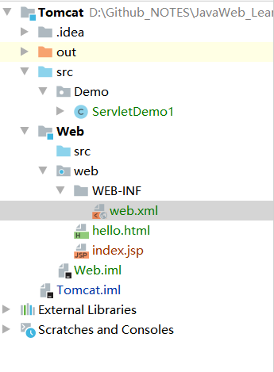
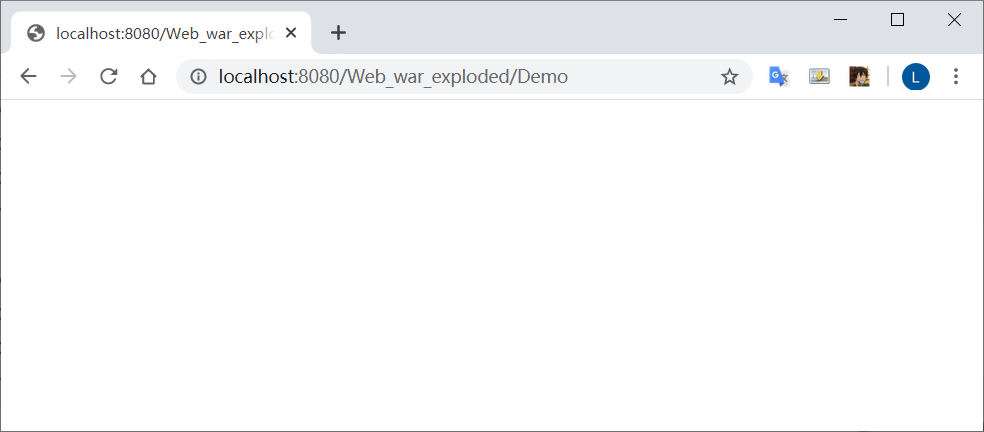
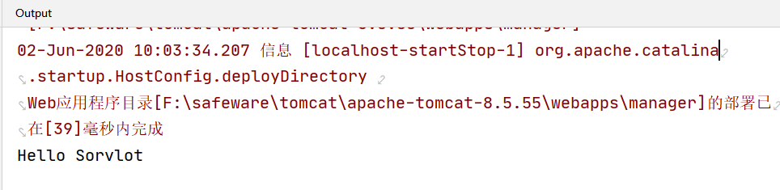
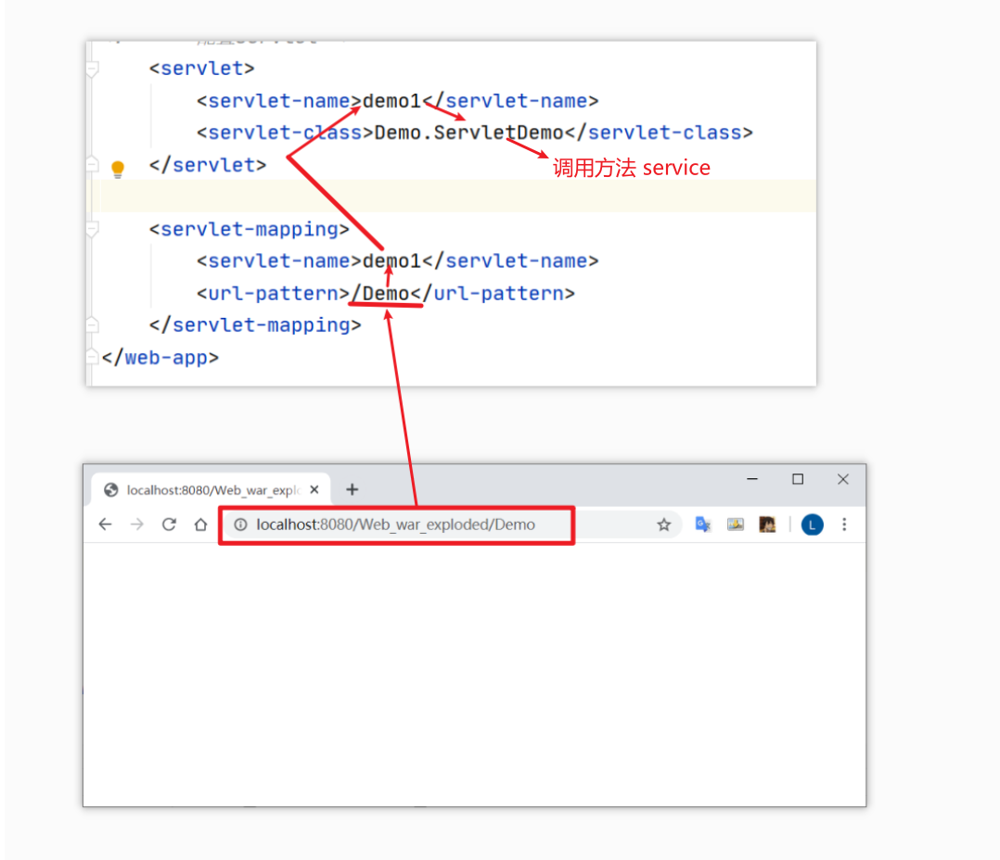
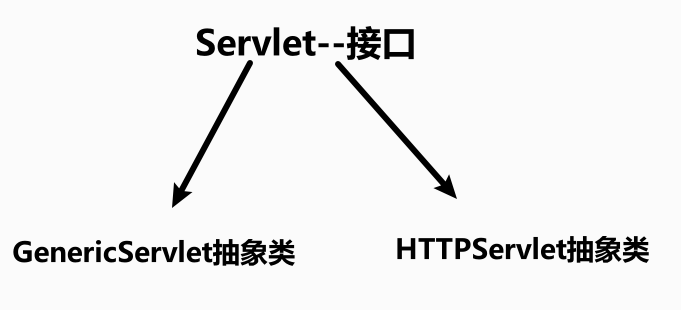

# Servlet

>   server applet
> 
>   运行在服务器端的小程序
> 
>   Servlet 是一个接口，定义了 Java类被浏览器访问到(tomcat识别)的规则
> 
>   我们自定义类，实现Servlet接口，复写方法

步骤：

* 创建 `JavaEE`项目
* 定义一个类，实现Servlet接口
* 实现接口中的抽象方法
* 配置Servlet

在web.xml中配置servlet



添加代码

```xml
<!--    配置servlet-->
    <servlet>
        <servlet-name>demo1</servlet-name>
        <servlet-class>Demo.ServletDemo</servlet-class>
    </servlet>

    <servlet-mapping>
        <servlet-name>demo1</servlet-name>
        <url-pattern>/Demo</url-pattern>  通过 /Demo进行访问
    </servlet-mapping>
```

启动服务，输入/Demo （区分大小写)

成功访问



输出台显示：



调用了`ServletDemo`中的方法

每次刷新都会再次执行

### 执行原理

* 当服务器接受到客户端浏览器得请求后，会解析请求URL路径，获取访问的Servlet的资源路径
* 查找web.xml文件，是否有对应的`<url-pattern>`标签体内容
* 如果有，则在找到对应的`<servlet-class>`全类名
* tomcat会将字节码文件加载进内存，并且创建其对象
* 调用其方法



```java
public class ServletDemo2 implements Servlet{

    // 初始化方法，创建时，执行
    @Override
    public void init(ServletConfig servletConfig) throws ServletException {
        System.out.println("初始化方法被执行");
    }

    // 获得 ServletConfig 对象
    // Servlet 的配置对象
    @Override
    public ServletConfig getServletConfig() {
        return null;
    }

    // 提供服务方法  每一次servlet 被访问时，执行多次
    @Override
    public void service(ServletRequest servletRequest, 
                        ServletResponse servletResponse) 
                        throws ServletException, IOException {
        System.out.println("服务方法被执行");
    }

    // 获取Servlet 的一些信息，版本等
    @Override
    public String getServletInfo() {
        return null;
    }

    // 销毁方法
    // 在服务器正常关闭时，执行
    @Override
    public void destroy() {
        System.out.println("关闭服务");
    }
}
```

## Servlet的生命周期

* 被创建：执行一次 `init`方法, 说明一个Servlet 在内存中只存在一个对象，是单例的
  
  多个用户同时访问时，可能存在线程安全问题
  
  尽量不要在servlet 中定义成员变量，如果定义了，不要修改值
  
  默认情况下，第一次被访问时，Servlet被创建
  
  指定servlet创建时机
  
  ​    值为负数，第一次被访问时创建
  
  ​    为非负数，在服务器启动时，创建
  
  ```xml
          <load-on-startup>5</load-on-startup>
  ```

* 提供服务：执行servlet方法，执行多次

* 被**正常销毁**：执行一次`destory`方法

## Servlet3.0

>   支持注解配置，可以不需要web.xml

步骤：

* 创建`JavaEE`项目，选择servlet版本在3以上，可以不创建 web.xml
* 定义一个类，实现Servlet接口
* 复写方法
* 在类上使用`@WebServlet`注解,进行配置

```@WebServlet(urlPatterns
@WebServlet(urlPatterns = "/Demo")
```

## IDEA与Tomcat的配置

* IDEA 会为每一个tomcat部署的项目单独建立一份配置文件
* 工作空间项目
* tomcat 真正访问的是`tomcat部署的web项目` 对应着Web项目
* WEB-INF目录下的不可被浏览器直接访问


启动服务后，自动弹出窗口


## Servlet体系结构



`GenericServlet`：将Servlet接口中其他的方法做了默认空实现，只将service()方法作为抽象
将来定义Servlet类时，可以继承`GenericServlet`，实现service()方法即可

 `HTTPServlet`：对http协议的一种封装，简化操作**（推荐方法）**

* 定义类继承`HttpServlet`
* 复写`doGet/doPost`方法

hello.html

```html
<!DOCTYPE html>
<html lang="en">
<head>
    <meta charset="UTF-8">
    <title>hello</title>
</head>
<body>
    <form action="/demo3" method="post">
        <input name="username">
        <input type="submit" value="提交">
    </form>
</body>
</html>
```


## Servlet相关配置

1. `urlpartten`: Servlet 访问路径

```java
@WebServlet("/demo3")
public class ServletDemo2 extends HttpServlet {}
```

`url` 可以是一个集合  任何一个都可以开启服务，访问该页面

```java
@WebServlet({"/d4", "/dd4", "/ddd4"})
public class ServletDemo3 extends HttpServlet {
    @Override
    protected void doGet(HttpServletRequest req, HttpServletResponse resp) throws ServletException, IOException {
        System.out.println("demo4....");
    }
}
```

2. 路径定义规则：
* /xxx

* /xxx/xxx    多层路径，目录结构

```java
@WebServlet({"/user/demo4"})
public class ServletDemo3 extends HttpServlet {
    @Override
    protected void doGet(HttpServletRequest req, HttpServletResponse resp) throws ServletException, IOException {
        System.out.println("demo4....");
    }
}
```

* *.do
  
  ```java
  // 使用任何u'r'l后缀都可以访问到
  @WebServlet({"/*"})
  public class ServletDemo3 extends HttpServlet {
      @Override
      protected void doGet(HttpServletRequest req, HttpServletResponse resp) throws ServletException, IOException {
          System.out.println("demo4....");
      }
  }
  ```
  
  ```java
  @WebServlet("*.do")
  public class ServletDemo3 extends HttpServlet {
      @Override
      protected void doGet(HttpServletRequest req, HttpServletResponse resp) throws ServletException, IOException {
          System.out.println("demo4....");
      }
  }
  ```
  
  