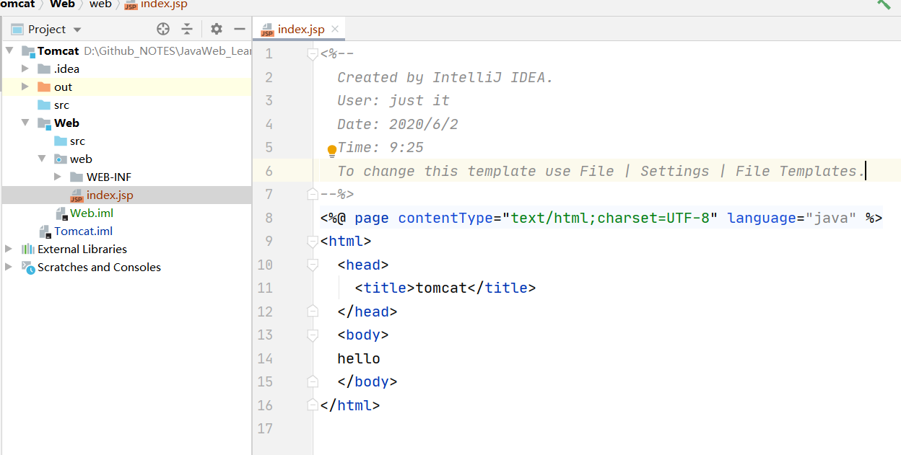

## Tomcat

web服务器软件

Tomcat目录结构


通过bin目录下的 startup.bat来开启服务

保持开启状态

浏览器输入 http://localhost:8080


http://别人的IP:8080

可能遇到的问题：

* 黑窗口一闪而过：
  
  原因：没有正确配置环境变量JAVA_HOME

* 启动报错：
  
  找到占用的端口号，杀死进程
  
  cmd运行
  
  ```cmd
  netstate -ano
  ```
  
  找到本地地址对应的端口号，关闭即可
  
  
  
    或者是修改自身的端口号
  
    在conf中的server.xml中修改端口号
  
  ```xml
    <Connector port="8888" protocol="HTTP/1.1"
                           connectionTimeout="20000"
                           redirectPort="8445" />
  ```
  
    一般会将tomcat的默认端口号修改为80。80端口号是http协议的默认端口号
    好处：在访问时，就不用输入端口号

* 关闭
  
  运行 shutdown.bat
  
  或者在startup.bat   运行 ctrl + c

* 配置
  
  部署项目的方法：
  
  * 将项目直接放到webapps文件夹中即可
    
    ```
    /hello：项目的访问路径-->虚拟目录
    浏览器访问
    http://localhost:8080/hello/hello.html
    ```
    
    也可以简化部署：将项目打成一个war包，再将war包放置到webapps目录下
    war包会自动解压缩
    
    
  
  

* 在配置文件中设置con/server.xml文件
  
      在<Host> 标签体中配置
      
      ```
      <Context docBase="D:\hello" path="/hehe" />
      path 为虚拟路径
      ```
      
      
      
      docBase:项目存放的路径
      访问 `http://localhost:8080/hehe/hello.html`
      
      
      
      缺点：不安全
  
  * 在conf.Catalina/localhost 创建任意名称的 xml 文件，在文件中编写
    
    ```
    <Context docBase="F:\safeware\tomcat\apache-tomcat-8.5.55\webapps\hehe" />
    ```
    
      
    
      虚拟目录：xml文件的名称

### 项目形式

* 静态项目

* 动态项目：
  
  目录结构：
  
  -- 项目的根目录
  
  ​    -- WEB-INF目录：
  
  ​        -- web.xml: web 项目核心配置文件
  
  ​        -- classes目录: 放置字节码文件的目录
  
  ​        -- lib目录：放置依赖的 jar包

### 将Tomcat集成到 IDEA中


部署完成后，进行index.js配置



启动后会自动弹出页面


部署新页面，hello.html


重启服务后，后缀加上/hello.html 即可访问


修改配置，当有新项目或是代码改动时，自动重启服务

