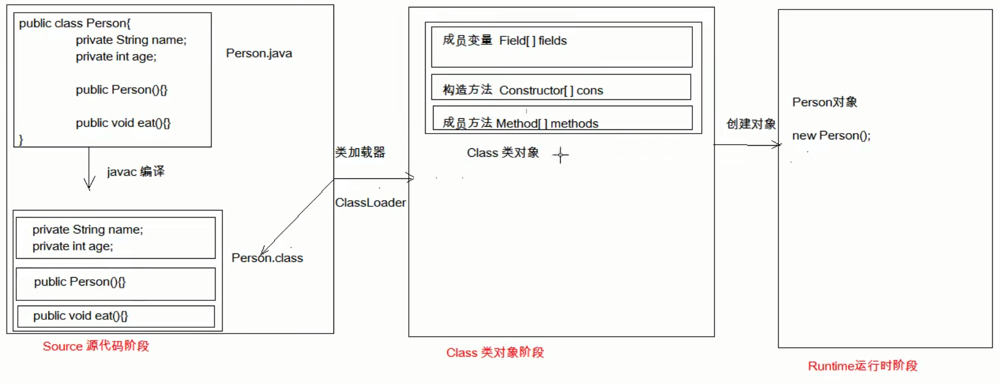
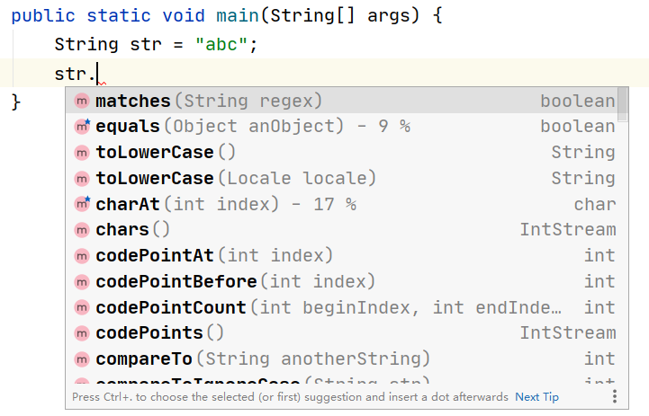

# 反射

>   框架设计的灵魂

框架：半成品软件，可以在框架的基础上进行软件开发，简化编码

反射：将类的各个组成部分封装为其他对象，这就是反射机制

## java内部编译机制

## 反射机制

Idea的反射机制

当定义一个字符串，需要调用系统函数时，自动出现提示

**好处：**

*   可以在程序运行过程中，操作这些对象
*   可以解耦，提高程序可扩展性

### class类

* 获取Class对象的方式：
	1. `Class.forName`("全类名")：将字节码文件加载进内存，返回Class对象
		* 多用于配置文件，将类名定义在配置文件中。读取文件，加载类
	2. 类名.class：通过类名的属性class获取
		* 多用于参数的传递
	3. 对象`.getClass()`：`getClass()`方法在Object类中定义着。
		* 多用于对象的获取字节码的方式

	* 结论：
		同一个字节码文件(*.class)在一次程序运行过程中，只会被加载一次，不论通过哪一种方式获取的Class对象都是同一个。

* Class对象功能：
	* 获取功能：
		1. 获取成员变量的方法
			* Field[] getFields() ：获取所有public修饰的成员变量
			* Field getField(String name)   获取指定名称的 public修饰的成员变量

			* Field[] getDeclaredFields()  获取所有的成员变量，不考虑修饰符
			* Field getDeclaredField(String name)  
		2. 获取构造方法的方法
			* Constructor<?>[] getConstructors()  
			* Constructor<T> getConstructor(类<?>... parameterTypes)  

			* Constructor<T> getDeclaredConstructor(类<?>... parameterTypes)  
			* Constructor<?>[] getDeclaredConstructors()  
		3. 获取成员方法的方法
			* Method[] getMethods()  
			* Method getMethod(String name, 类<?>... parameterTypes)  

			* Method[] getDeclaredMethods()  
			* Method getDeclaredMethod(String name, 类<?>... parameterTypes)  

		4. 获取全类名的方法
			* String getName()  