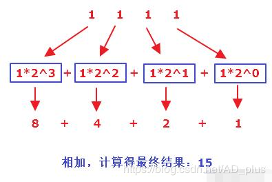

一、问题呈现
非常经典问题，其实不仅仅是 Java 语言，还是 JS 等语言的通病，即：

当我们在计算 0.1+0.2 时，惊讶的发现，结果竟然不是 0.3，而是：0.30000000000000004。

二、问题分析
问题很简单，是由于我们输入的十进制的 double 类型的数据在进行计算的时候，计算机会先将其转换为二进制数据，然后再进行相关的运算。

然而在十进制转二进制的过程中，有些十进制数是无法使用一个有限的二进制数来表达的，换言之就是转换的时候出现了精度的丢失问题，所以导致最后在运算的过程中，自然就出现了我们看到的一幕。

三、问题解决
Java 语言中最经典的便是使用 `BigDecimal` 来解决

整体思路是先将 double 类型的数据转换成 `BigDecimal` 来进行运算，最后再转换成 double 类型的数据

但是此处有一个坑，即在将 double 转 `BigDecimal` 的时候，是可以有三种方式去实现的，其中两种构造方式，还有一种静态方法方式：

```java
// 方式一
public BigDecimal(double val) {
	this(val,MathContext.UNLIMITED);
}
// 方式二
public BigDecimal(String val) {
	this(val.toCharArray(), 0, val.length());
}
// 方式三（其实底层就是方式二）
public static BigDecimal valueOf(double val) {
	return new BigDecimal(Double.toString(val));
}
```

从上面我们可以清晰地看出，其实 `BigDecimal` 是希望我们使用传入 string 类型的数据的构造方法

所以解决起来就顺水推舟了，看如下 demo：

```java
double d1 = 0.1, d2 = 0.2;
System.out.println(d1 + d2);
System.out.println(
    new BigDecimal(d1).add(new BigDecimal(d2)).doubleValue());
System.out.println(
BigDecimal.valueOf(d1).add(BigDecimal.valueOf(d2)).doubleValue());
System.out.println(new BigDecimal(Double.toString(d1)).add(new BigDecimal(Double.toString(d2))).doubleValue());

贴出运行的结果：
0.30000000000000004
0.30000000000000004
0.3
0.3
```

小 Tip：

很多人会说 `public BigDecimal(double val)` 这个构造方法是 Java 的一个 bug，其实我并不认同，我觉得是传递的 double 类型的参数的问题，这个数据本身就存在精度的问题，所以导致了最终的计算问题

换言之，其实使用计算机的二进制来表达十进制的小数，本身就是个伪命题。

四、double 转二进制
那么，为什么使用二进制无法精确表达一个 double 类型的数据呢？下面来手动画图婆剖析下换算的方法：

举个栗子：15.75 -> 1111.11

step1：拆分

将整数和小数部分拆分得：15 和 0.75

step2：计算整数部分

整数部分是 15，计算得 1111，见下图：


step3：计算小数部分

小数部分是 0.75，计算得 0.11，见下图：


step4：合并

将整数部分和小数部分拼接得到最终的结果：1111.11

再举个经典的栗子：0.1 -> 0.000110011001100110011001100…………

还是四步走：

step1：拆分

将整数部分和小数部分拆分得： 0 和 0.1

step2：计算整数部分

整数部分是 0 ，计算得： 0

step3：计算小数部分

小数部分是 0.1，计算得：0.0001100110011001100………….，计算过程见下图：


step4：合并

将整数部分和小数部分合并得到最终的结果：0.000110011001100110011001100…………

五、二进制转 double
同样举个栗子：1111.11 -> 15.75

还是分四步走：

step1：拆分

将整数和小数部分拆分得：1111 和 0.11

step2：计算整数部分

整数部分 1111 计算得 15，详细计算过程见下图：



step3：计算小数部分

小数部分 0.11 计算得 0.75，详细计算过程见下图


step4：合并

整数部分和小数部分合并得最终的结果：15.75