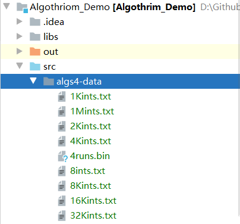

## for循环

>   先判断，后执行代码块

 执行顺序：

1.  初始化语句
2.  **判断语句**
3.  代码块
4.  变化语句


## 代称，别名

```java
// 定义一个字符串数组
String[] testArray = new String[32000];
// 作为参数传入方法
SelectSort.sort(testArray);

public class insertSort {
    public static void sort(Comparable[] b){
		// 方法中对 数组b的操作，也会同步改变数组testArray
        // 可以选择复制数组，来防止改变原数组
        System.arraycopy(b, 0, a, 0, b.length);
    }
}
```


## 计时器

```java
long startTime1 = System.nanoTime();
SelectSort.sort(testArray);
long endTime1 = System.nanoTime();
// 返回正在运行的Java虚拟机的高分辨率时间源的当前值，以纳秒为单位
```


## 相对路径

在项目中进行相对路径操作时，应注意

**根目录(起始目录)为 Algothrim_Demo(项目文件夹)，并非java文件本身**



```java
String filePath = "src\\algs4-data\\32kints.txt";
```

