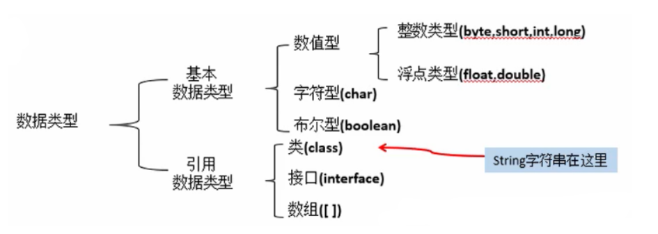

## 关键字、标识符、注释

### 关键字

关键字：被Java语言赋予了特殊含义的单词
特点：关键字中所有字母都为小写

|      关键字类型      |                            关键字                            |
| :------------------: | :----------------------------------------------------------: |
|       访问控制       |                   private protected public                   |
| 类，方法和变量修饰符 |   abstract class extends final implements interface native   |
|       程序控制       | break continue return do while if else for instance of switch case default |
|       错误处理       |                try catch throw throws finally                |
|        包相关        |                        import package                        |
|     基本数据类型     | boolean byte char double float int long short null true false |
|       变量引用       |                       super this void                        |
|        保留字        |                          goto const                          |

### 标识符

java程序中自定义的符号

规则：

-   由字母、数字、下划线、美元组成，但是不能包含特殊字符，不能以数字开头
-   不能使用关键字和保留字
-   严格区分大小写
-   尽量见名知意

### 注释

-   单行注释：// 注释文字
-   多行注释：/ *注释文字* /
-   文档注释：/* *注释文字* /

```
// 这是单行的注释

/*
 * 多行注释
 */

/**
 * 文档注释
 */
```

1.  单行注释、多行注释：这两种注释是一般注释，被注释的文字，不会被JVM解释执行
2.  文档注释：java特有的注释，备注是的内容会被JDK工具javadoc接信息，生成网页文档


## 变量与常量

### 常量

**常量表示不能改变的数值**

常量的分类:

-   整数常量。所有整数
-   小数常量。所有小数
-   布尔型常量。较为特有，只有两个数值。true false
-   字符常量。将一个数字字母或者符号用单引号( ‘ ‘ )标识
-   字符串常量。将一个或者多个字符用双引号标识
-   null常量。只有一个数值就是:null.

整数:java有三种表现形式

-   十进制:0-9 ，满10进1
-   八进制:0-7 ，满8进1. 用0开头表示
-   十六进制:0-9，A-F，满16进1. 用0x开头表示

### 变量

-   内存中的一个存储区域
-   该区域有自己的名称(变量名)和类型(数据类型)
-   该区域的数据可以在同一类型范围内不断变化

使用变量时注意两点：变量的作用域、变量初始化值

#### 变量的定义

数据类型 变量名 = 初始化值;

```
//在同一行进行多个变量的定义和初始化，不建议
int a=0; int b;int c;
//一行定义一个变量
int a; //声明
int b=0;	//声明并初始化
```

#### 变量初始化

java中变量必须用赋值语句对变量进行显式初始化

可以在声明变量时进行赋值，也可以之后赋值，但是必须在使用之前，如果一个变量没有被赋值，那这个变量不能被使用

## 数据类型

数据类型决定数据的存储方式和运算方式

java中的数据类型分为两大类

-   基本数据类型：
-   引用数据类型：



整数默认：int      小数默认：double

两种数据类型区别：

一、从概念方面来说

基本数据类型:变量名指向具体的数值引用数据类型:变量名指向存数据对象的内存地址,即变量名指向hash值

二、从内存构建方面来说

基本数据类型:变量在声明之后java就会立刻分配给他内存空间

引用数据类型:它以特殊的方式(类似C指针)指向对象实体（具体的值），这类变量声明时不会分配内存，只是存储了一个内存地址。

三、从使用方面来说

基本数据类型:使用时需要赋具体值,判断时使用“==”号

引用数据类型:使用时可以赋null,判断时使用equals方法


### 基本数据类型：4类8种

java中，所有的数据类型所占的字节数量与平台无关

| 类型   | 种类    | 字节 | 范围             |
| :----- | :------ | :--- | :--------------- |
| 整型   | byte    | 1    | -128~127         |
| short  |         | 2    | -2^15 ~ 2^15 - 1 |
| int    |         | 4    | -2^31 ~ 2^31 - 1 |
| long   |         | 8    | -2^63 ~ 2^63 - 1 |
| 浮点型 | float   | 4    | 有效位数6~7位    |
| double |         | 8    | 有效位数为15位   |
| 字符型 | char    | 2    | \u0000 到 \Uffff |
| 布尔型 | boolean | 1    |                  |

#### boolean 类型

boolean类型 适用于逻辑运算，一般用于程序流程控制

boolean类型 只有两种值：true / false

-   整型和布尔型之间不能相互转换，如：if(a=5) 是不允许的
-   不能用0或非0的整数代替  true / false

#### char字符型

char型数据表示通常意义上的‘字符’，字符常量是用单括号引起的单个字符：char=’A’;

java采用Unicode编码，一个字符占两个字节：char c1=’\u0061’;

java还允许使用转义字符’\’将后面的字符转变为其他含义，如:char c2=’\n’;

#### 整型

整型用于表示没有小数部分的数值

java整型常量三种表示形式：

-   十进制
-   八进制：以0开头，如012
-   十六进制：以0x或0X开头
-   二进制：以0b或0B开头（java7以上）

java7之后还可以为数字字面量加下划线，如用1_000_000，更易阅读，java编译器会去除这些下划线

java没有无符号形式的数据类型

注：长整型（long）后有后缀L或l；一般最好不用八进制，因为八进制有前缀0，容易混淆

#### 浮点型

double数值精度是float精度的两倍。部分情况下使用double
**float类型数值有后缀F或f，没有后缀的数值默认double**，或在数值后加后缀D或d表示double类型

##### 三种特殊数值

浮点型数值溢出或出错的三种特殊数值：

-   正无穷大:Double.POSITIVE_INTFINITY
-   负无穷大:Double.NEGATIVE_INTFINITY
-   NaN（不是一个数字）:Double.NaN

例如，一个数值/0 结果是正无穷大；0/0 结果NaM

java中检测特定值是否为NaN：
不能使用相等方法检测：if(a == Double.NaN) ，这是错误的，因为所有废树脂的值都会被认为是不同的
想要检测，可以使用Double的isNaN(变量)方法

```
//不能使用相等方法检测
if(a == Double.NaN)		//错误
//使用 Double.isNaN() 方法
if(Double.isNaN(a))
```


#### 浮点类型数值计算误差

浮点类型数计算有误差，不能用于不能接受舍入误差的金融计算当中，如：`System.out.println(2.0-1.1);` 将打印出0.899999999999，而不是想象中的0.9；这种误差，主要原因是浮点数值用二进制表示，而**二进制无法精准表示1/10**；想要精确计算，应该使用BigDecimal类


### 引用数据类型

单独写


## 运算符

|   运算符   |          符号          |
| :--------: | :--------------------: |
| 算术运算符 |  +、-、*、/、%、++、–  |
| 关系运算符 |  ==、!=、>、<、>=、<=  |
| 逻辑运算符 |    !、&、、^、&&、     |
|  位运算符  | &、、^、~、>>、<<、>>> |
| 三目运算符 |         ?    :         |

#### 运算符优先级

运算符的优先级如下：

| 运算符优先级 |        运算符         |        综合性        |
| :----------: | :-------------------: | :------------------: |
|      1       |         ()[].         |       从左到右       |
|      2       | ! +(正) -(负) ~ ++ –  |       从左到右       |
|      3       |         * / %         |       从左到右       |
|      4       |      +(加) -(减)      |       从左到右       |
|      5       |       << >> >>>       |       从左到右       |
|      6       | < <= > >= instance of |       从左到右       |
|      7       |         == !=         |       从左到右       |
|      8       |       &(按位与)       |       从左到右       |
|      9       |           ^           |       从左到右       |
|      10      |           \           |       从左到右       |
|      11      |          &&           |       从左到右       |
|      12      |           \           |       从左到右       |
|      13      |          ?:           |       从右到左       |
|      14      | = += -= *= /= %= &= \ | = ^= ~= <<= >>= >>>= |

#### 运算符分类

##### ++、–自增自减运算符：

-   i++：先进行表达式运算，再自增
-   ++i：先自增再进行表达式运算

```
int i = 1；
int j = 1;
int x = i++;
int y = ++j；
System.out.println("i = "+i+"   j="+j);	//i=2   j=2
System.out.println("x = "+x+"   y="+y);	//x=1   j=2
```

上面的例子可以看出，无论是i++还是++j，对i和j本身的值无关，都是+1后的结果；但是符号的位置对赋值运算的结果会有影响，例子中x和y的值完全不同

单独进行自增、自减运算：运算符位置对进行自增自减运算的无区别

参与表达式运算：

-   在操作数之前，先进行自增运算，再参与其他表达式运算
-   在操作数之后，先进行其他表达式运算，再自增运算

##### 比较运算符

==，!=，>，>=，<，<=

运算结果都为boolean


##### 逻辑运算符


##### 位运算符


##### 三目运算符

格式：表达式?表达式1:表达式2

表达式结果是boolean类型；表达式计算结果为true，执行表达式1返回结果；false执行表达式2返回结果；

```
int x = 3;
int y = 5;
int z = (x>y)?x:y;	
System.out.println("z="+z);	//z=5
```


### 数值类型转换

在计算时，参与计算的数据类型一般要一致，如果不一致，则要将数据进行类型的转换

boolean 不参与数据转换

数值类型的转换，分为**默认转换和强制转换**

#### 默认转换（自动类型提升）

默认转换，前提是数据类型**从小到大才会默认转换**

byte、short、char->int->long->float->double

byte、short、char这三种类型之间不进行转换，在参与运算时之间转换为int类型


#### 强制类型转换（显示类型转换）

将字节大的转换为字节小的数据类型，需要强制转换

转换格式：目标数据类型 目标变量 = (目标数据类型)被转换数据;

注意: 如果将一个数值从一种字节大的类型强制转换为另一种字节小的类型，并且超出了目标类型的表示范围，目标结果就会被截断成一个完全不同的值。例如:int是300的值强制转换为byte后的实际值为44：(byte)300=44

```java
int a = 1;
byte b = 2;
// byte c = a + b;这个语句在编译时会报错：损失精度，需要前置转换
byte c = (byte)a + b;
```

分析直接定义和强制转换：

```java
float f1 = (float)1.2345;  // 默认为double类型  转换为float
float f2 = 1.2345F;  // 后缀F 表示变量为float浮点型
```

以上两个语句都正确，但是有区别：f1是通过double类型的数据强制转换来的；而f2变量定义的就是一个float类型

分析运算

```java
byte b1 = 3;
byte b2 = 4;
/*
	byte类型做计算，会自动转换为int类型
	需要强转，因为byte 3+byte 4 结果自动转换为int类型
*/
byte b3 = (byte)(b1 + b2);	
/*
	3+4=7是一个常量
	在运算时将3+4计算出来，然后看这个结果值常量是否在byte范围内，在则不报错，不在会报错
*/
byte b4 = 3 + 4;
```


## 包装类

这8种基本类型都有一个对应的包装类，也就是java中的另一种数据类型：**引用数据类型**，有自己的属性和方法，默认值为null。

我们通常使用基本数据时，也是使用它们的包装类更多。因为这些基本数据类型仅仅只能声明和存放一个值，甚至都不能为null，也没有我们常用的一些**类型转换**或**equals**()方法。基本数据类型只能做做运算，而包装类就比较完善了，适合在业务中使用。

基本数据类型对应的包装类分别是：**Byte、Short、Integer、Long、Float、Double、Character、Boolean**。也就是除了char对应的是Character，int对应Integer，其他的都只是**首字母变成大写**而已。

>   注：这里注意一下**String，它既不是基本类型也不是谁的包装类**，不要误以为它是字符类型的基本类型之类的了，虽然它的重要性并不比基本类型低。
>
>   字符类的基本类型仅有char而已。


### 自动装箱和自动拆箱

**装箱**：将基本类型用它们对应的应用类型包装起来，包装成对应的包装类

**拆箱**：将包装类型（包装类）转换为基本数据类型

实际上我们一直在使用这个功能，例如在java se5之前，如果要初始化一个Integer对象，是需要这样的：

```java
Integer i = new Integer(10);
```

看起来又正常又别扭，因为每个新对象都是通过new初始化出来的，但好像我们使用的时候从来没有这么麻烦过，一般我们是：

```java
Integer i=10;  // 创建了一个Interger对象，值为10
```

这就是**自动装箱**，理论上来说，10是基本类型的数据，只能直接赋给int类型。现在我们将它赋给了int的包装类**Integer**，其实就是java自动对基本数据10进行了装箱，装到了包装类中。简单的说就是替你创建了一个Integer对象，值存为10

而**自动拆箱**则是相反，java自动将Integer变量拆箱为具体的整数值，这样就可以做到将包装类变量直接赋给int基本数据类型

自动拆箱：

```java
Integer i=10;	//自动装箱
int j=i;		//自动拆箱
```

在大部分包装类和基本类型混用的地方，都会自动进行拆装箱


### **自动拆装箱的实现原理**

通过编译再对class字节码文件的反编译，我们可以知晓答案

首先写一段这样的测试代码：

```java
public class Test {
    public static void main(String[] args) {
        Integer i=10;
        int j=i;
    }
}
123456
```

打开cmd输入javac Test.java进行编译，得到Test.class

然后通过**jd-gui工具**反编译Test.class，得到如下代码：

```java
public class Test
{
  public static void main(String[] paramArrayOfString)
  {
    Integer localInteger = Integer.valueOf(10);
    int i = localInteger.intValue();
  }
}
```

可以看到，自动拆装箱的核心是在**包装类变量**上使用了两个方法，**装箱时是Integer.valueOf()**，通过看源码可以得知本质上是调用了new Integer初始化。**拆箱时是intValue()**，也是直接返回了int的值。

看来所谓高大上的自动拆装箱，其实也只是偷偷的调用了包装类的两个方法，只是我们没发现而已。另外，其他基本类型的拆装箱也是一样的，例如char的两个方法也分别是valueOf()和charValue()，大家可以自己测试一下。

**总结**：装箱过程是通过调用包装器的**valueOf**方法实现的，而拆箱过程是通过调用包装器的 **xxxValue**方法实现的。


