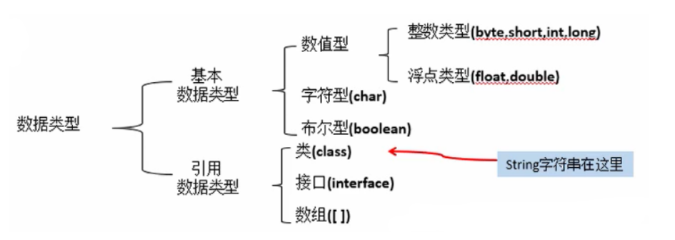
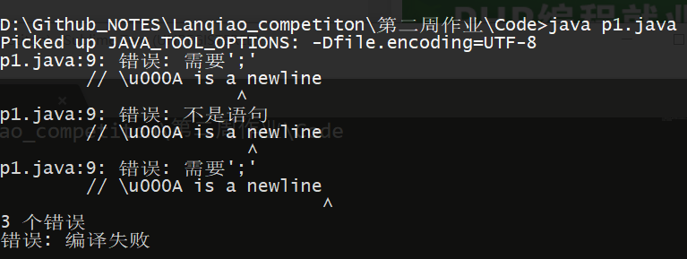
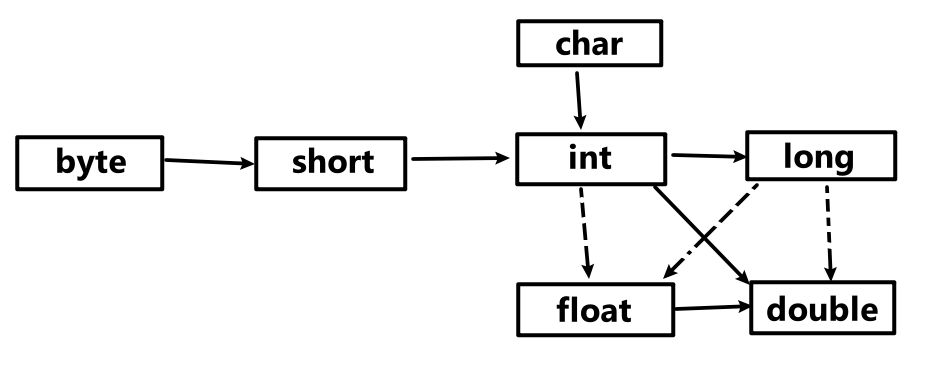
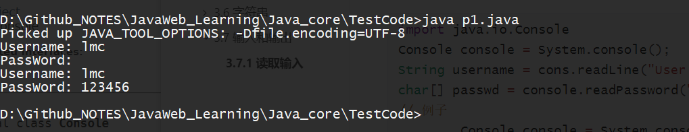

### 一个简单的Java程序

```java
public class printer{
	public static void main(String[] args){
		System.out.println("Hello world");
	}
}
```

*   Java区分大小写

*   public 为访问修饰符

*   class定义一个类

*   类名必须是字母开头，避开保留字

*   类名命名规范

    以大写字母开头的名词，如果由多个单词组成，第一个字母都应该大写（骆驼命名法）

*   main方法必须是public

*   方法调用   `object.method(parameters)`


### 注释

```java
// 单行注释

/*
 * 多行注释
 */

/**
 * 文档注释
 */
```

不能简单地把代码用 /* 和 */ 括起来作为注释，因为代码本身有可能包含一个 */ 界定符


### 数据类型

Java是一种强类型语言，必须为每一个变量声明一种类型

分为 基本数据类型，引用数据类型

Java共有8种基本类型，4种整型，2种浮点型，1种字符类型char，1种用于表示真值的`boolean`类型



java中，所有的数据类型所占的字节数量与平台无关

| 类型   | 种类    | 字节 | 范围             |
| :----- | :------ | :--- | :--------------- |
| 整型   | byte    | 1    | -128~127         |
| short  |         | 2    | -2^15 ~ 2^15 - 1 |
| int    |         | 4    | -2^31 ~ 2^31 - 1 |
| long   |         | 8    | -2^63 ~ 2^63 - 1 |
| 浮点型 | float   | 4    | 有效位数6~7位    |
| double |         | 8    | 有效位数为15位   |
| 字符型 | char    | 2    | \u0000 到 \Uffff |
| 布尔型 | boolean | 1    |                  |


#### 整型

没有小数，可以是负数

| 类型  | 存储要求 | 取值范围         |
| ----- | -------- | ---------------- |
| int   | 4字节    | -128~127         |
| short | 2字节    | -2^15 ~ 2^15 - 1 |
| long  | 8字节    | -2^31 ~ 2^31 - 1 |
| byte  | 1字节    | -2^63 ~ 2^63 - 1 |

*   byte short 通过用于特定的场合，如底层的文件处理或者存储空间宝贵时的大数组
*   长整数型数值有个后缀 L或是l （40000000L）
*   十六进制数值有一个前缀 0x 或是 0X (0xCAFE)
*   八进制有个前缀 0   010  对应十进制中的8
*   前缀 0b 或是 0B 表示二进制数  
*   在数字下加下划线  便于阅读   100_000_000  


#### 浮点类型

| 类型   | 存储要求 | 取值范围       |
| ------ | -------- | -------------- |
| float  | 4字节    | 有效位数6~7位  |
| double | 8字节    | 有效位数为15位 |

*   float 类型数值后面有一个后缀 F或 f 

*   没有后缀默认为double类型，也可以后面加 D或d

*   在进行浮点数计算时，表示移除和出错情况的三个特殊的浮点数值

    正无穷大，负无穷大，NaN(不是一个数字)

    用 `Double.POSITIVE_INFINITY`, `Double.NEGATIVE_INFINITY`, `Double.NaN` 表示

*   不能用于无法接受舍入误差的计算  浮点数使用二进制系统表示，而二进制无法精确地表示1/10


#### char类型

原本用于表示单个字符，现在与 Unicode相关联，用一个或是两个char值来表示Unicode字符

| 转义序列 | 名称   | Unicode值 |
| -------- | ------ | --------- |
| \b       | 退格   | \u0008    |
| \t       | 制表   | \u0009    |
| \n       | 换行   | \u000a    |
| \r       | 回车   | \u000d    |
| `\"`     | 双引号 | \u0022    |
| `\'`     | 单引号 | \u0027    |
| `\\`     | 反斜杠 | \u005c    |

>   Unicode 转义序列在解析代码之前得到处理，例如，"\u0022+\u0022" 并不是由引号保卫加号构成的字符串。 \u0022 会在解析之前转换为 ", 这会得到 ""+""   ，也就是一个空串
>
>   还有要当心注释中的 \u  注释
>
>   // \u000A is a newline
>
>   会产生语法错误，因为读程序时  \u000A 会替换为一个换行符 




#### Unicode和char类型

尽量避免使用 char类型，最好将字符串作为抽象数据类型处理


#### boolean类型

**False  True**

整型与布尔之间不可以相互转换，所以  0或是1 无法代替 false true 进行逻辑判断


### 变量与常量

#### 声明变量

先制定变量类型，在指定变量名

```java
double Salary;
int Number;
```

*   变量名必须是字母开头，由**字母**或**数字**构成的序列

*   大小写敏感，无空格

*   避开保留字

```java
int i, j;  // 在一行声明多个变量   不提倡
```


#### 变量初始化

变量需要经过初始化才能使用

对于局部变量，若从变量的初始值能判断出她的类型就不需要声明类型，用关键字var声明

```java
var number1 = 10;
var greetting = "Hello";
```


#### 常量

利用关键字  final 指示常量，初始化后不可以修改，命名原则全部大写

```JAVA
final double CM_PER_IMCH = 2.54;
```

**类常量**

一个常量可以在一个类中的多个方法中使用，需要类常量

通过 static final 定义

```java
public class p1{
    // 通常在 main方法外部定义
    static final double PI = 3.14;
    
    public static void main(String[] args){
        
        public void method1(){}
        public void method2(){}
    }
}
```


#### 枚举类型

枚举类型，变量的取值只在一个有限的集合内。l例如：人的年龄0·100 

```JAVA
enum Size{SMALL, MEDIUM, LARGE, EXTRA_LARGE};
Size s = Size.MEDIUM;
```


#### 运算符

用于连接值

##### 算术运算符

```
+ - * / % 
```

整数被0除会产生一个异常，浮点数被0除得到无穷大或是NaN


##### 数字函数与常量

Math类  里面包含黎大量的静态方法，供数学计算使用

```JAVA
Math.sqrt()   // 平方根
Math.pow(x, a)  // x的a次幂
Math.round(x)  // 得到与x最近的整数
floorMod(x, a)  // 取余  x%a   无论x正负，都会的得到0~a的结果
// 三角函数
Math.sin()
Math.cos()
Math.tan()
// 指数函数  反函数
Math.exp()
Math.log()
Math.atan2
// Π e 的近似值
Math.PI
Math.E
```

小技巧

```JAVA
import static java.lang.Math.*;

public class p1{
    public static void main(String[] args){
        System.out.println(sqrt(PI)); // 不需要Math.sqrt()
    }
}
```


##### 数值类型之间的连接

合法转换



*   实线表示无信息丢失的转换，虚线表示有可能存在信息丢失的转换

*   不同数据类型的值进行计算时，先将数据类型转换为其中精度更高的那个
*   boolean 不参与数据类型转换

##### 强制类型转换

将字节大的转换为字节小的数据类型，需要强制转换

转换格式：目标数据类型 目标变量 = (目标数据类型)被转换数据;

注意: 如果将一个数值从一种字节大的类型强制转换为另一种字节小的类型，并且超出了目标类型的表示范围，目标结果就会被截断成一个完全不同的值。例如:int是300的值强制转换为byte后的实际值为44

```java
double x = 9.997;
int nx = (int) x;
```

##### 结合赋值和运算符

```
+= -=
```

##### 自增与自减运算符

```
--  ++
```

##### 关系和boolean运算符

```java
== != < > == <= >=  && ||
? :  // 三元运算符
```

**位运算符**

可以通过使用掩码技术得到整数中的各个位

```java
& |  ^  ~      // 这些位运算符按位处理
```


### 3.6 字符串

Java类库中提供了一个预定义类，String类。每个用双引号括起来的字符串都是String类的一个实例

```java
String str1 = "";
String str2 = "Hello";
```


#### 3.6.1 子串

提取子串-- **String类的 substring方法**  可以从字符串中提取小子串

```java
String Str = "Hello";
String S = Str.substring(0, 3);    //  [0, 3)  左闭右开
// S = "Hel";  S.length = 3-0;    b-a
```


#### 3.6.2 拼接

用 + 连接两个字符串

*   若字符串与非字符串的值进行拼接，后者会转换成字符串（任何Java对象都可以转换成字符串）
*   空格也是一个字符

若需要将多个字符串放在一起，设置一个**界定符**分隔，需要静态 join方法

```java
String all = String.join(" / ", "s", "M", "L", "XL");  // 第一个字符串参数为分界符
System.out.println(all);
all = "s / M / L / XL";    // 分界符为 " / "
```

原地复制字符串——repeat方法

```java
String repeated = "Java".repeat(3);
// JavaJavaJava
```


#### 3.6.3 不可变字符串

字符串本身是不可变的，"Hello" 永远都是 "Hello"  ，但可变的是指向它的字符串变量

不可变的优点：编辑器可以让字符串共享


#### 3.6.4 检测字符串是否相等

equals 检测   并非是 "=="的比较   是在ASC码的角度进行比较

在父类Object中的定义

```java
public boolean equals(Object obj) {
    return (this == obj);
}
```

String.java 中的重写

```java
    public boolean equals(Object anObject) {
        if (this == anObject) {
            return true;
        }
        if (anObject instanceof String) {
            String anotherString = (String)anObject; // 将比较对象2转为字符串 
            int n = value.length; // 比较对象1的长度
            if (n == anotherString.value.length){
                // 将字符串转为字符数组
                char v1[] = value;
                char v2[] = anotherString.value;
                int i = 0;
                while (n-- != 0) {
                    if (v1[i] != v2[i])  // 从 ASC码的角度进行比较
                        return false;
                    i++;
                }
                return true;
            }
        }
        return false;
    }
```


#### 3.6.5 空串与null串

空串是长度的为0的字符串   表示为 ""

```java
str = "";
str.length == 0;    
str.equals("");
// is true
```

null串   表示目前没有任何变量与之关联

要检查一个字符串是否为null

```java
if(str == null)
```

检查一个字符串既不是空串也不是null串

```java
if(str != null && str.length != 0)
```


#### *3.6.6 码点与代码单元

Java字符串由char组成，char数据类型是一个采用UTF-16编码表示Unicode码点的代码单元。一般的Unicode码点用一个代码单元就可以表示，有的则需要两个代码单元来表示


#### 3.6.7 StringAPI

**一些常用方法**

**java.lang.String**

类头是这样定义的

```java
public final class String
    implements java.io.Serializable, Comparable<String>, CharSequence,
               Constable, ConstantDesc {……}
```

**一些常用的API**

```java
char charAt(int intdex)
// 返回给定位置的代码单元。研究底层代码单元时使用
int codePointAt(int index)
// 返回给定位置开始的码点

IntStream codePoints()
// 将这个字符串的码点作为一个流返回，调用 toArray 将他们放在一个数组里
        String greeting = "Hello";
        int[] GreArray = greeting.codePoints().toArray();
        for(int i = 0; i < GreArray.length; i ++)
            System.out.print(GreArray[i] + ",");
        // 72,101,108,108,111,
```

```java
int compareTo(String String2)
// 按字典顺序比较两个字符串, 区分大小写

        String str1 = "abc";
        String str2 = "bcd";
        System.out.println(str1.compareTo(str2)); // -1
        System.out.println(str2.compareTo(str1)); // 1
        System.out.println(str1.compareTo(str1)); // 0
```

```java
new String(int[] codePonts, int offset, int count)
// 将码点数组中的指定区间构造一个字符串

        int[] GreArray = {72, 101, 108, 108, 111};
        String greeting2 = new String(GreArray, 0, GreArray.length);
        System.out.println(greeting2);   // Hello
```

```java
boolean isEmpty()
// 是否为空字符串
        String Str = "";
        String Str1 = "LMC";
        System.out.println(Str.isEmpty()); // true
        System.out.println(Str1.isEmpty()); // false

**boolean empty()   boolean blank() 运行报错
```

```java
boolean equals(Object other)
// 如果字符串与other相等，返回true
// 源码
    public boolean equals(Object anObject) {
        if (this == anObject) {
            return true;
        }
        if (anObject instanceof String) {
            String aString = (String)anObject;
            if (!COMPACT_STRINGS || this.coder == aString.coder) {
                // 调用了另一个方法
                return StringLatin1.equals(value, aString.value);
            }
        }
        return false;
    }

	// StringLatin1.equals(value, aString.value);
    @HotSpotIntrinsicCandidate
    public static boolean equals(byte[] value, byte[] other) {
        if (value.length == other.length) {
            for (int i = 0; i < value.length; i++) {
                if (value[i] != other[i]) {
                    return false;
                }
            }
            return true;
        }
        return false;
    }
```

```java
boolean equalsIngoreCase(String other)
// 忽略英文字符大小写  进行比较
```

```java
boolean startswith(String prefix)
boolean endswith(String suffix)
// 如果字符串以 prefix 开头 或者 suffix 结尾 则返回 true
```

```java
int indexOf(String str)
int indexOf(String str, int fromIndex)
int indexOf(int cp)
int indexOf(int cp, int fromIndex)
// 返回与字符串str 或码点 cp 匹配的第一个子串的开始位置。从索引0或fromIndex开始匹配。如果在原始字符串中不存在str, 则返回-1  存在返回0   也就是包含关系
        String Str = "LM";
        String Str1 = "LMC";
        System.out.println(Str1.indexOf(Str)); // 0
        System.out.println(Str.indexOf(Str)); // 0
        System.out.println(Str.indexOf(Str1)); // -1
```

```JAVA
int lastIndexOf(String str)
int lastIndexOf(String str, int fromIndex)
int lastIndexOf(int cp)
int lastIndexOf(int cp, int fromIndex)
// 返回与字符串str或码点cp匹配的最后一个子串的开始位置。从原始字符串末尾或fromIndex开始匹配
// 不存在返回-1 存在返回0
```

```java
int length()
// 返回字符串代码单元的个数
int codePointCount(int startIndex, int endIndex)
// 返回 startIndex 和 endIndex-1 之间的码点个数   [startIndex, endIndex-1)
```

```java
String replace(CharSequence oldString, CharSequence newString)
// 返回一个新字符串。这个字符串用newString代替原始字符串中所有的oldString.可以用String或StringBuilder对象作为CharSequence参数
        String OldString = "I Fuck you";
        String NewString = OldString.replace("Fuck", "love");
        System.out.println(NewString); // I love you
```

```java
String substring(int beginindex)
String substring(int beginindex, int endindex)
// 返回一个新字符串。这个字符串包含原字符串的[beginindex, length-1] 或是 [beginindex, endindex-1] 的部分
        String OldString = "I Love you";
        String NewString1 = OldString.substring(2);
        String NewString2 = OldString.substring(2, 6);
        System.out.println(NewString1);
        System.out.println(NewString2);
        // Love you
        // Love
```

```java
String toLowerCase()
String toUpperCase()
// 返回一个新字符串。将其中的所有大写字母改成小写字母。或是反之
		String OldString = "I Love you";
		String NewString1 = OldString.toLowerCase();
		String NewString2 = OldString.toUpperCase();
		System.out.println(NewString1);
		System.out.println(NewString2);
		// i love you
		// I LOVE YOU
```

```java
String join(CharSequence delimiter, CharSequence elements)
// 返回一个新字符串，用给定的定界符连接给定的字符串
// CharSequence 允许 String类型传入
		String OldString1 = "I love you";
		String OldString2 = "I Fuck you";
		String NewString = String.join(" and ", OldString1, OldString2);
		System.out.println(NewString);
		// I love you and I Fuck you
```

```java
String repeat(int count)
// 返回一个字符串，将当前字符串重复count次
		String OldString = "love";
		String NewString = OldString.repeat(3);
		System.out.println(NewString);
		// lovelovelove
```


#### 3.6.8 阅读Java在线API文档

https://docs.oracle.com/javase/9/docs/api/overview-summary.html


#### 3.6.9 修改字符串

由于字符串本身的改变比较麻烦，需要另外新建一个字符串，然后再拼接或是删减

而字符串构建器**StringBuilder**就很好地解决了这个问题

```java
// 线构建一个空的构建器
StringBuilder builder = new StringBuilder();
// 需要添加内容时, 就使用 append方法
builder.append(love); // 添加单个字符
builder.append(String); // 添加一个字符串
// 在字符串构建完成后，用toString方法，将其转换成字符串
String NewString = builder.toString();
		StringBuilder builder = new StringBuilder();
		String OldString = "love you"; 
		builder.append("I");
		builder.append(" ");
		builder.append(OldString);
		String NewString = builder.toString();
		System.out.println(NewString);
		// I love you
```

**在项目中的应用**

可以直接 **System.out.println(String);**   而不用通过循环来打印输出

```java
    @Override
    public String toString(){
        StringBuilder res = new StringBuilder();
        res.append(String.format("Array size = %d, capacity = %d\n", size, data.length));
        res.append('[');
        for(int i = 0; i < size; i++){
            res.append(data[i]);
            if(i != size - 1)
                res.append(",");
        }
        res.append(']');
        return res.toString();
    }
```


### 3.7 输入和输出

#### 3.7.1 读取输入

与输出流**System.out** 相对应的是输入流**System.in**

```java
import java.util.Scanner; // 除了java.lang包以外，都需要导入
Scanner scanner = new Scanner(System.in); // 先构建一个输入流对象
// 使用输入流的方法进行读取
String Name = scanner.nextLine(); // 读取一行的输入（包括空格）
String FirstName = scanner.next(); // 读取一个单词 以空白符分割
int age = scanner.nextInt(); // 读取整数
double height = scanner.nextDouble(); // 读取浮点数
```

因为Scanner的输入流是可见的，所以不适合从控制台读取密码

通过**Console**类实现   属于**java.io.Console**包

```java
import java.io.Console
Console console = System.console();
String username = cons.readLine("User name: ");
char[] passwd = console.readPassword("PassWord: ");
// 例子
		Console console = System.console();
		String username = console.readLine("Username: ");
		char[] passwd = console.readPassword("PassWord: ");

		System.out.println("Username: " + username);
		System.out.println("PassWord: " + String.valueOf(passwd));
		// 结果如图
```




**java.util.Scanner 中的一些常用方法**

```java
Scanner(InputStream in)
// 用给定的输入流创建一个Scanner对象
String nextLine()
// 读取输入的下一行内容
String next()
// 读取输入的下一个单词(以空格作为分隔符)
int nextInt()
double nextDouble()
// 读取并转换下一个表示整数或浮点数的字符序列
boolean hasNext()
// 检测输入中是否还有其他单词
boolean hasNextDouble()
// 检测是否还有下一个表示整数或浮点数的字符序列
```

***java.lang.System**

```java
static Console console()
// 如果可以进行交互，就返回一个Console对象通过控制台窗口与用户交互，否则返回null
// 对于任何一个在控制台窗口启动的程序，都可以使用Console对象。否则，是否可用取决于所使用的系统
```

**java.io.Console**

```java
static char[] readPassword(String prompt, Object... args)
static String readLine(String prompt, Object... args)
// 显示字符串prompt并读取用户输入，知道输入行结束。args参数可用用来提供格式参数.
```


#### 3.7.2 格式化输出

使用语句**System.out.println(x)** 将字符输出到控制台

这条命令将以x的类型所允许的最大非0数位个数打印输出x

```java
double x = 1000.0 / 3.0;
System.out.println(x); // 333.3333333333333
```

规定打印的数字格式 **printf** 与C语言中的类似

```java
System.out.printf("%8.2f", x); // 规定字符长度为8 精度为小数点后2个字符
// 也就是说，这会打印一个前导的空格和7个字符
//  333.33
```

可以为printf 提供多个参数

f 表示浮点数  s 表示字符串  d 表示十进制整数

```java
printf(%s, %d, name, age);
```

还有一些转换符 见 `Java核心技术 卷1 P58`

也可以只对字符串进行格式化创建 而不进行输出

```java
String name = "lmc";
int age = 22;
String NewString = String.format("Hello, %s. Next year, you'll be %d", name, age);
```


#### 3.7.3 文件的输入与输出

在进行输入与输出时，文件相当于一个控制台

##### 读取

读取一个文件，需要构造一个Scanner对象

```JAVA
Scanner in = new Scanner(Path.of("myfile.txt"), StandardCharsets.UTF-8);
// 如果文件名中包含反斜杠符号(多半是多重文件地址)
// D:\\Github_NOTES\\JavaWeb_Learning\\Java_core\\TestCode
// 通过 in 对象可以利用前面介绍的Scanner方法对文件进行读取
```

另外，这里指定了字符编码为UTF-8。读取一个文件文件时，要知道她的字符编码

如果省略字符编码，则会使用运行这个Java程序的系统默认编码，导致解码的不可预知

##### 写入

写入文件，需要构建一个PrintWriter对象。在构造器中提供文件名和字符编码

```java
PrintWriter FileOut = new PrintWriter("myfile.txt", StandardCharsets.UTF-8);
```

如果文件不存在，就创建。可以项输出到**System.out**一样使用**print, println, printf**

##### 文件位置

当指定一个相对文件名时，例如，`"myfile.txt"` `"mydirectory/myfile.txt"` `"../myfile.txt"` 文件位置相对于Java虚拟机启动目录的位置。如果在命令行方式下执行以下命令启动程序：

```java
java MyProg
```

启动目录就是命令解释器的当前目录。然而，如果使用集成开发环境，那么启动目录将由IDE控制。可以使用下面的调用找到这个目录的位置：

```java
String dir = System.getProperty("user.dir");
```

如果觉得定位文件太麻烦，可以考虑使用绝对路径名

##### 异常处理

如果用一个不存在的文件构造一个Scanner, 或者用一个无法创建的文件名构造一个**PrintWriter**, 就会产生异常。需要在main方法中用throws子句标记

```java
public static void main(String[] args) throws IOException{
	Scanner in = new Scanner(Path.of("myfile.txt"), StandardCharsets.UTF-8);
    ...
}
```

